# 4. Alcance funcional · 5. Flujos de usuario

---

## 4. Alcance funcional

### 4.0. Mapa de capacidades

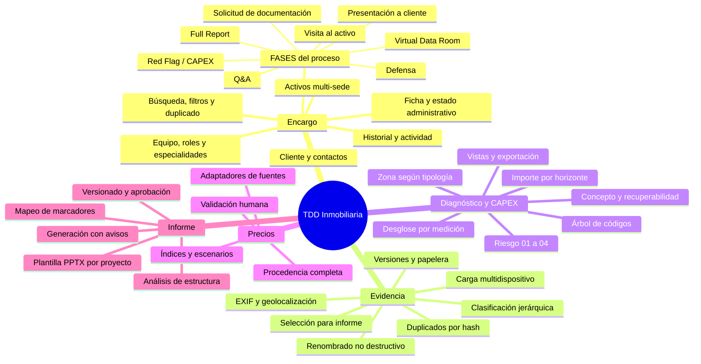

### 4.1. Bloque 1 — Creación y gestión del proyecto `[REQ]`

#### 4.1.1. Dos ejes independientes: estado y fases

La decisión de modelado más importante de este bloque. `[REC]`

| | **Estado del proyecto** (§3.1.1) | **Fases del proceso** (§3.1.5) |
|---|---|---|
| Qué describe | El ciclo administrativo del encargo | El trabajo técnico real |
| Valores | Borrador, en preparación, visita programada, visita realizada, en análisis, en revisión, informe emitido, cerrado, archivado | Solicitud de documentación, VDR, Visita, Q&A, Red Flag/CAPEX, Full Report, Presentación, Defensa |
| Cardinalidad | **Uno solo** en cada momento | **Varias activas a la vez** |
| Se elige | No: se transita según reglas | **Sí: se marcan al dar de alta el proyecto** |
| Quién lo cambia | Director de proyecto / revisor | Cada responsable de fase |

Meterlas en un solo campo produciría un sistema que no sabe representar la realidad: un encargo puede
estar simultáneamente con la documentación pendiente, la visita ya hecha y el Q&A en curso.

#### 4.1.2. Ficha del proyecto

Todos los campos de §3.1.1: nombre, código interno, estado, tipo de due diligence, alcance del
trabajo, fecha de creación, fecha prevista de visita, fecha límite del informe, moneda principal y
observaciones generales.

#### 4.1.3. Cliente y contactos

Razón social, persona de contacto, cargo, correo, teléfono, dirección y notas internas. `[REC]` El
cliente se modela como entidad reutilizable de la organización, no como campos embebidos: permite ver
la cartera de encargos por cliente sin duplicar datos.

#### 4.1.4. Activos

Unión de los campos de §3.1.3 y §3.3.1 (ver P-02 sobre la duplicidad detectada):

| Grupo | Campos |
|---|---|
| Identificación | Nombre o identificador, código, tipología, uso principal |
| Ubicación | Dirección completa, ciudad, provincia, país, código postal, coordenadas |
| Superficies | Parcela, total construida, alquilable, almacén, oficinas |
| Geometría | Altura de almacén, número de plantas (sobre y bajo rasante) |
| Cronología | Año de construcción, año de última reforma |
| Descriptivos | Descripción, observaciones, imagen principal |

`[REC]` Los campos se muestran **según tipología**: la altura de almacén solo aparece en industrial y
logística; la superficie de almacén, en industrial, logística y retail. Un formulario que pide altura
de almacén para un hotel enseña que nadie ha pensado en quien lo rellena.

Visualización en mapa mediante adaptador `MapProvider` configurable. `[REQ]`

#### 4.1.5. Equipo interno

Alta o selección de usuarios de la organización; asignación al proyecto con rol (administrador,
director de proyecto, consultor, técnico especialista, revisor, lector); asignación a uno o varios
activos; especialidades (arquitectura, estructura, instalaciones eléctricas, climatización, PCI,
fontanería, ascensores, sostenibilidad y otras). Registro de quién crea, modifica, revisa y aprueba.

#### 4.1.6. Fases del proceso `[REQ]` §3.1.5

Cada fase se marca como aplicable al dar de alta el proyecto y lleva estado, responsable y fechas.
Cinco de las ocho tienen contenido propio:

| Fase | Contenido específico |
|---|---|
| **Solicitud de documentación** | Lista de verificación de categorías: licencias urbanísticas, proyectos, contratos de mantenimiento, legalizaciones y certificados, garantías, y las que añada el cliente. Cada línea con estado (solicitada / recibida / parcial / no aplica / no disponible), fecha y documentos adjuntos |
| **Generación del VDR** | **Enlace al repositorio externo** `[REQ]`, más proveedor, credenciales de acceso *no* almacenadas, fecha de alta y notas. `[SUP]` S-12: no se replica el contenido |
| **Visita al activo** | Estado (pendiente de definir / agendado / visitado) y fecha `[REQ]`. `[SUP]` S-11: por activo, con agregado a nivel de proyecto |
| **Q&A** | Repositorio de ficheros XLSX **versionados**, con rondas, fecha y autor `[REQ]` |
| **Red Flag / CAPEX** | Enlaza con el bloque 3. Estado derivado del avance real de las líneas |
| **Full Report** | Enlaza con el bloque 4 |
| **Presentación a cliente** | Fecha, asistentes, documento presentado, notas |
| **Defensa frente a la otra parte** | Fecha, contraparte, incidencias planteadas y respuestas |

`[REC]` El estado de las fases «Red Flag/CAPEX» y «Full Report» **se calcula**, no se teclea: si hay
12 líneas sin precio validado, la fase no está completa aunque alguien haya marcado la casilla. Una
lista de verificación que miente es peor que no tenerla.

#### 4.1.7. Funcionalidades adicionales

Buscador; filtros por cliente, estado, responsable, activo, ubicación y fecha; panel de proyectos
recientes; duplicación selectiva (§4.6); archivado sin borrado; historial de cambios; registro de
actividad; **exportación en XLSX o CSV** `[REQ]` §3.1.6.

### 4.2. Bloque 2 — Fotografías y repositorio documental `[REQ]`

Repositorio aislado por proyecto y organizado por activo, con árbol `Zona → Planta → Espacio` y
clasificación transversal por sistema técnico. Carga desde ordenador, móvil o tableta; carga múltiple;
captura directa desde cámara. Original inmutable; versión de trabajo al renombrar o editar; renombrado
individual y en lote con **conservación garantizada de la extensión**; miniaturas y vista ampliada;
descarga individual y en lote; duplicados por hash; EXIF completo con extracción de fecha, hora y
geolocalización; eliminación de metadatos sensibles al exportar; autor y fechas registrados.

Asociación de cada foto a proyecto, activo, zona, planta, espacio, sistema técnico, equipo, **línea de
CAPEX**, incidencia y sección del informe. Clasificación sugerida por las 14 categorías de §3.2 como
catálogo semilla editable. Etiquetas, comentarios, descripción, marcado visual, selección y orden para
el informe, papelera con recuperación y control de versiones.

Detalle completo en [`10-fotografias.md`](./10-fotografias.md).

### 4.3. Bloque 3 — Diagnóstico y CAPEX `[REQ]`

El corazón funcional de la aplicación, y lo que más cambia respecto de una herramienta genérica.

#### 4.3.1. La línea de trabajo

Lo que el consultor rellena es **una fila** con estos campos, en este orden:

| Campo | Origen | Notas |
|---|---|---|
| Código | Árbol de 3 niveles (§3.3.4) | Categoría → Capítulo → Elemento |
| Zona afectada | Catálogo **dependiente de la tipología** (§3.3.2) | |
| Descripción | Texto libre | |
| Riesgo | 01 Bajo · 02 Moderado · 03 Alto · 04 Extremo · – | Con su definición visible `[REQ]` |
| Comentarios | Texto libre | |
| CAPEX estimado | Importe **por horizonte**: corto, medio, largo, mejoras, otro | Total calculado `[SUP]` S-09 |
| Concepto | 11 valores (§3.3.3) | |
| Recuperable a inquilino | SI · NO · N.A. · – | |

Y, opcionalmente `[SUP]` S-10, un **desglose por medición**: unidad, cantidad, precio unitario y
cascada de costes, que alimenta el importe del horizonte y le aporta trazabilidad.

`[REC]` Bajo la interfaz, cada fila persiste como `Finding` (el diagnóstico: zona, descripción,
riesgo, comentarios, concepto) más `CapexItem` (el dinero: código, importes, recuperabilidad), con
relación 1:1 por defecto. Motivos: conserva las entidades exigidas en §7, permite que un hallazgo
genere varias partidas, permite partidas sin hallazgo (mejoras) y no obliga a doble captura.

#### 4.3.2. Catálogos

Tipologías, zonas por tipología, árbol de códigos completo, grados de riesgo con su definición,
conceptos y horizontes están desarrollados en
[`05-catalogos-y-taxonomias.md`](./05-catalogos-y-taxonomias.md).

#### 4.3.3. Precios

Adaptadores de fuentes con orden de prioridad; procedencia completa por referencia; **validación
humana obligatoria**; índices, factores geográficos, inflación, gastos generales, beneficio
industrial, contingencias, escenarios bajo/probable/alto y redondeo configurable. Vistas de CAPEX por
proyecto, activo, sistema, prioridad, año, horizonte y nivel de riesgo. Exportación XLSX y CSV.

**Precio Centro** `[PDV]`: la especificación indica que esta parte queda pendiente de revisión porque
podría conectarse directamente a `online.preciocentro.com`. Se diseña el adaptador y se deja **sin
implementar**, por las razones de [`11-capex-precios.md`](./11-capex-precios.md) §16.3.

### 4.4. Bloque 4 — Informe desde plantilla PPTX `[REQ]`

Carga de plantilla por proyecto; original inmutable; análisis de estructura (diapositivas, diseños,
títulos, textos, tablas, imágenes, gráficos, marcadores y notas); previsualización de la estructura
detectada; mapeo guardado y reutilizable; marcadores `{{...}}` con reglas de repetición por activo,
sistema e incidencia; división automática de tablas largas; inserción de fotografías y pies;
conservación de tema, patrón, tipografías, colores, logos, posiciones, tamaños, proporciones,
encabezados y pies; previsualización con detección de campos vacíos, textos que desbordan, imágenes
ausentes y tablas que no caben; estados de informe y versionado completo.

Detalle y **limitaciones técnicas reales** en [`12-pptx.md`](./12-pptx.md).

### 4.5. Funcionalidades transversales `[REQ]`

| Capacidad | MVP | Posterior |
|---|:--:|:--:|
| Autenticación segura y recuperación de contraseña | ✅ | |
| MFA (TOTP) | ✅ opcional | obligatorio por política |
| SSO / OIDC | interfaz preparada | ✅ |
| Gestión de usuarios y roles · permisos por proyecto | ✅ | permisos por activo |
| Separación lógica por organización (RLS) | ✅ | |
| Historial de cambios · registro de auditoría | ✅ | cadena hash |
| Notificaciones in-app · comentarios y menciones | ✅ | correo, push |
| Flujo de revisión y aprobación | ✅ 1 nivel | multinivel |
| Búsqueda global | ✅ PostgreSQL FTS | OpenSearch |
| Diseño responsive · uso móvil en visita | ✅ | |
| Baja conectividad / guardado local | ✅ parcial | ✅ offline completo |
| Sincronización con resolución de conflictos | básica | fusión asistida |
| Español + i18n · unidades, monedas e impuestos configurables | ✅ | otros idiomas |
| Accesibilidad WCAG 2.2 AA | ✅ | |
| Copias de seguridad · política de conservación | ✅ | automatización completa |

### 4.6. Duplicación de proyectos

`[REC]` Duplicado **selectivo**: copiar un encargo entero arrastra fotos y precios de otro edificio.

| Elemento | Por defecto | Motivo |
|---|:--:|---|
| Ficha (sin fechas ni código) | ✅ | Base del nuevo encargo |
| Cliente y contactos | ✅ | Suele ser el mismo |
| **Selección de fases** | ✅ | Alto valor: el mismo tipo de encargo repite fases |
| Miembros del equipo y roles | ✅ | Ahorra lo más tedioso |
| Plantilla PPTX y su mapeo | ✅ | El mapeo es costoso de rehacer |
| Activos (ficha, sin fotos) | ☐ opcional | Puede ser el mismo edificio en otra fase |
| Estructura de zonas y espacios | ☐ opcional | Útil en carteras homogéneas |
| Líneas de CAPEX **sin importes** | ☐ opcional | Acelera sin transferir trazabilidad |
| Fotografías | ❌ nunca | Evidencia no transferible |
| Líneas de CAPEX **con importes** | ❌ nunca | La trazabilidad del precio no es transferible |

### 4.7. Fuera de alcance

No se incluye, sin ampliación de encargo: valoración financiera del activo (DCF, yield), gestión de
obra, modelado BIM/IFC, GMAO, certificación energética oficial ni firma electrónica cualificada.

---

## 5. Flujos de usuario

### 5.1. Máquina de estados del proyecto

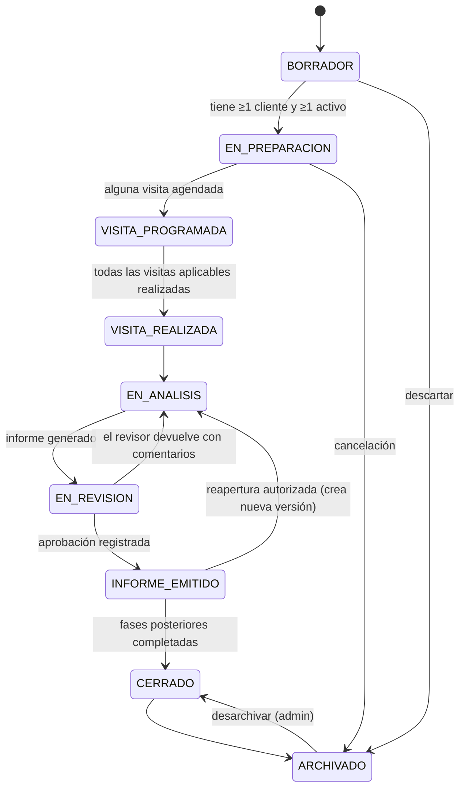

**Guardas** `[REQ]` §9:

| Transición | Guarda |
|---|---|
| `BORRADOR → EN_PREPARACION` | Al menos un cliente **y** un activo |
| `VISITA_PROGRAMADA → VISITA_REALIZADA` | Todas las visitas de activos aplicables en estado `VISITADO` |
| `EN_ANALISIS → EN_REVISION` | Al menos una versión de informe en estado `GENERADO` |
| `EN_REVISION → INFORME_EMITIDO` | Aprobación registrada de un revisor |
| `INFORME_EMITIDO → *` | El informe queda bloqueado; cualquier cambio crea versión nueva |
| `* → ARCHIVADO` | Nunca borra: marca `archived_at` |

### 5.2. Fases del proceso: el otro eje

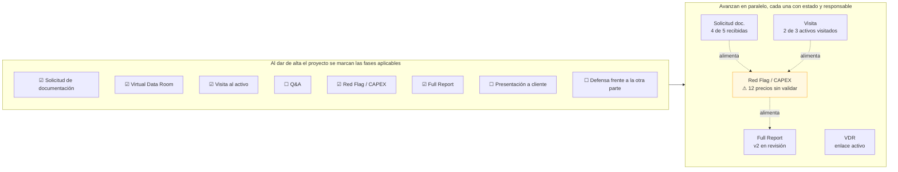

**Estados de fase** `[SUP]` S-07: `NO_APLICA` · `PENDIENTE` · `EN_CURSO` · `COMPLETADA` · `BLOQUEADA`.
Las fases *Red Flag/CAPEX* y *Full Report* tienen estado **calculado** a partir del trabajo real.

### 5.3. Flujo maestro: del encargo a la defensa

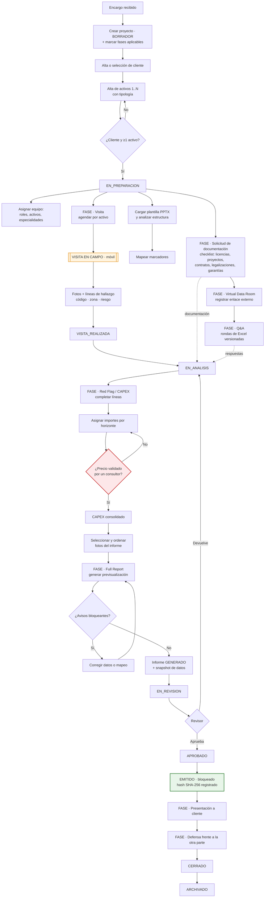

### 5.4. Flujo de campo (móvil): el que decide la adopción

`[REC]` Si en obra cuesta más que una libreta, la herramienta no se usa. Objetivo de diseño:
**registrar un hallazgo con foto en ≤ 4 toques**.

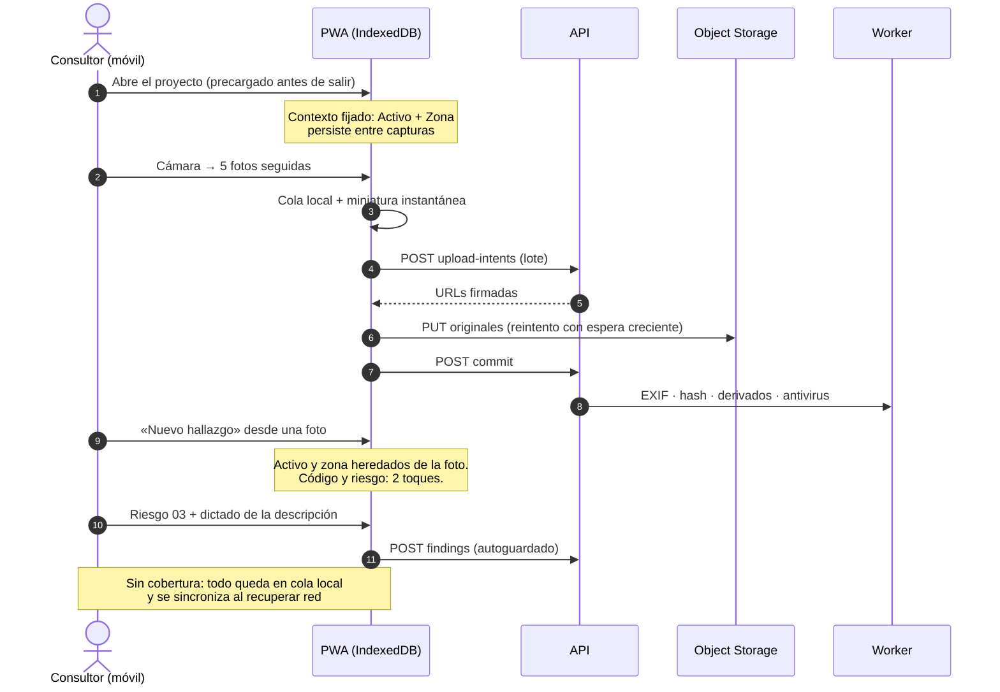

**Decisiones de UX derivadas** `[REC]`:

1. **Contexto persistente**: activo y zona se fijan una vez; no se piden en cada foto.
2. **El importe no se pide en campo.** En la visita se captura el diagnóstico (qué, dónde, qué riesgo);
   el dinero se pone en gabinete. Pedir un importe subido a una escalera es lo que hace que la gente
   vuelva a la libreta.
3. **Autoguardado con indicador**: `Guardado 12:04` / `3 pendientes de sincronizar`.
4. **Miniatura optimista** antes de subir; **dictado por voz** para descripciones.
5. Objetivos ≥ 44 px y contraste alto: se usa con guantes y a contraluz.

### 5.5. Flujo de la línea de CAPEX

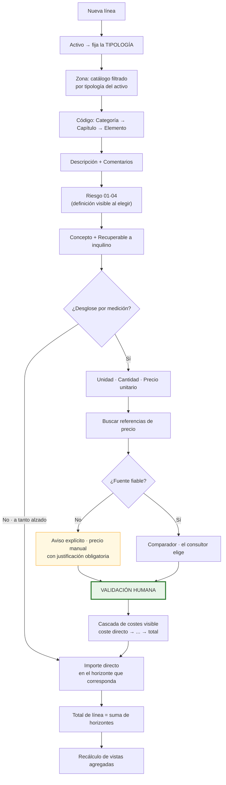

### 5.6. Flujo de precio: de la referencia a la partida validada

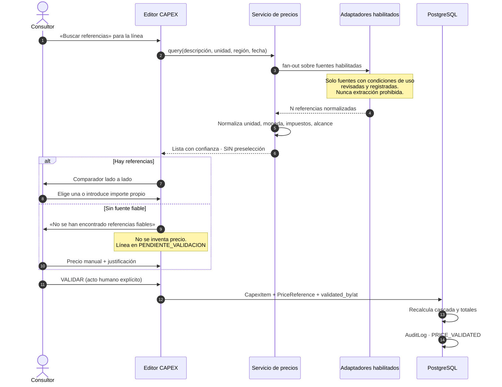

### 5.7. Flujo de la fase de solicitud de documentación

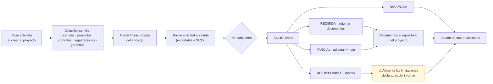

`[REC]` Lo que **no** se recibe importa tanto como lo que sí: las líneas en `NO_DISPONIBLE` alimentan
automáticamente el apartado de limitaciones y salvedades del informe. En una TDD, declarar qué no se
ha podido revisar es una obligación profesional, y hoy suele hacerse de memoria.

### 5.8. Flujo del informe

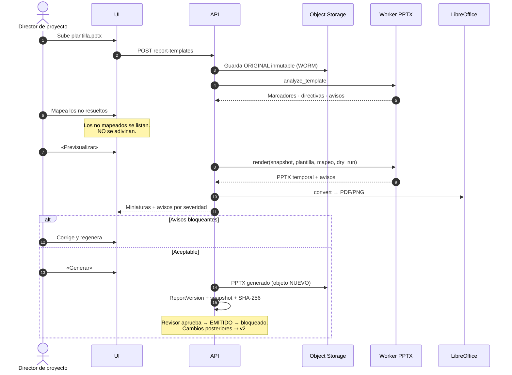

### 5.9. Flujo de renombrado no destructivo de fotografías

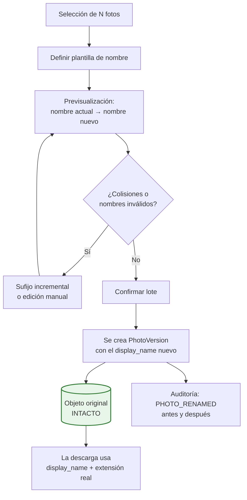

**Clave** `[REC]`: la clave de almacenamiento (`storage_key`, un UUID inmutable) y el nombre visible
(`display_name`) son campos distintos. Renombrar es una operación de metadatos: coste O(1), reversible,
y **la extensión no se puede perder porque el usuario nunca la escribe** (se deriva del tipo real).

### 5.10. Flujo de acceso a un archivo confidencial

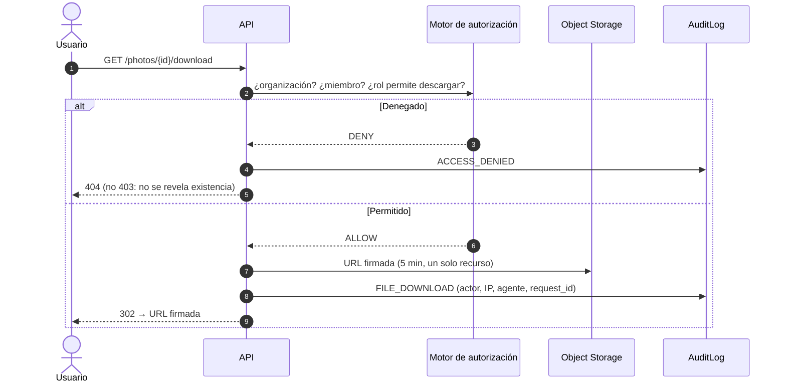
