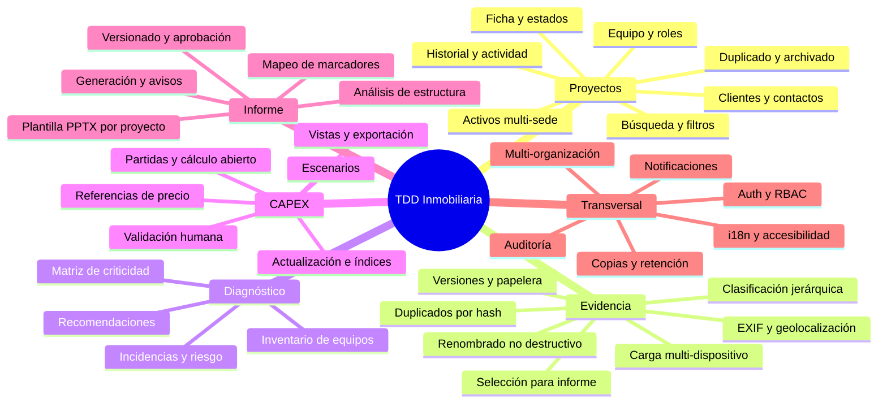
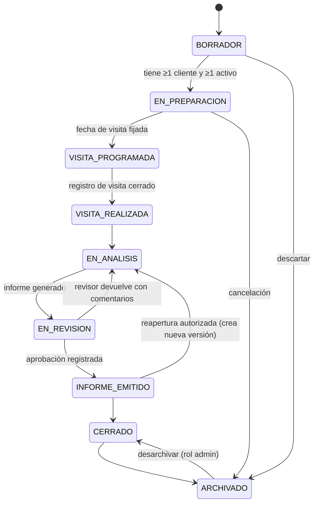
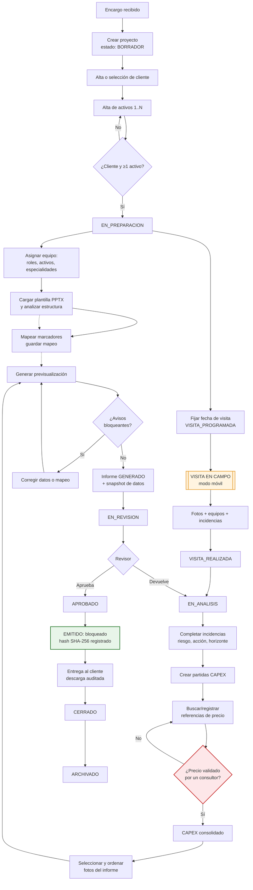
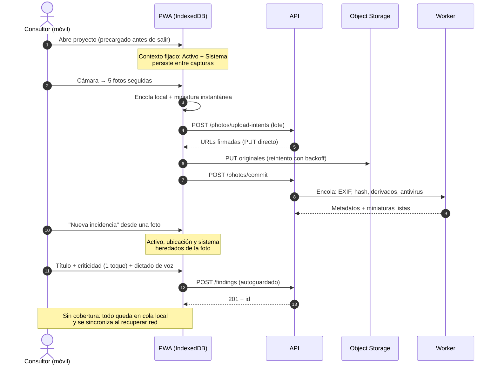
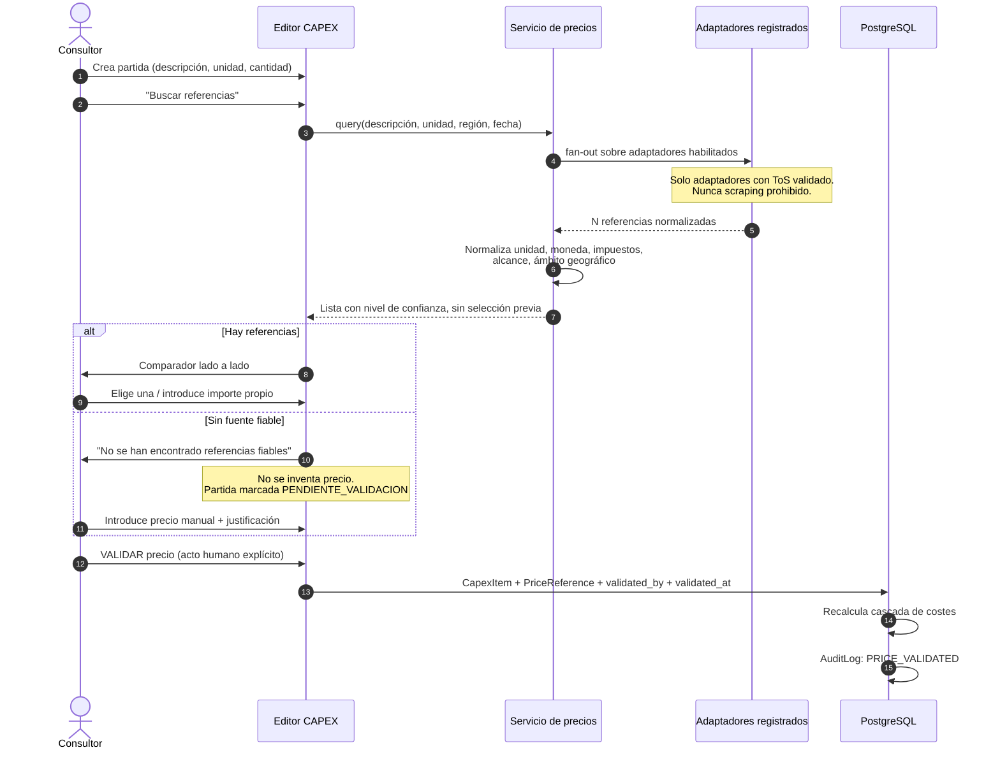
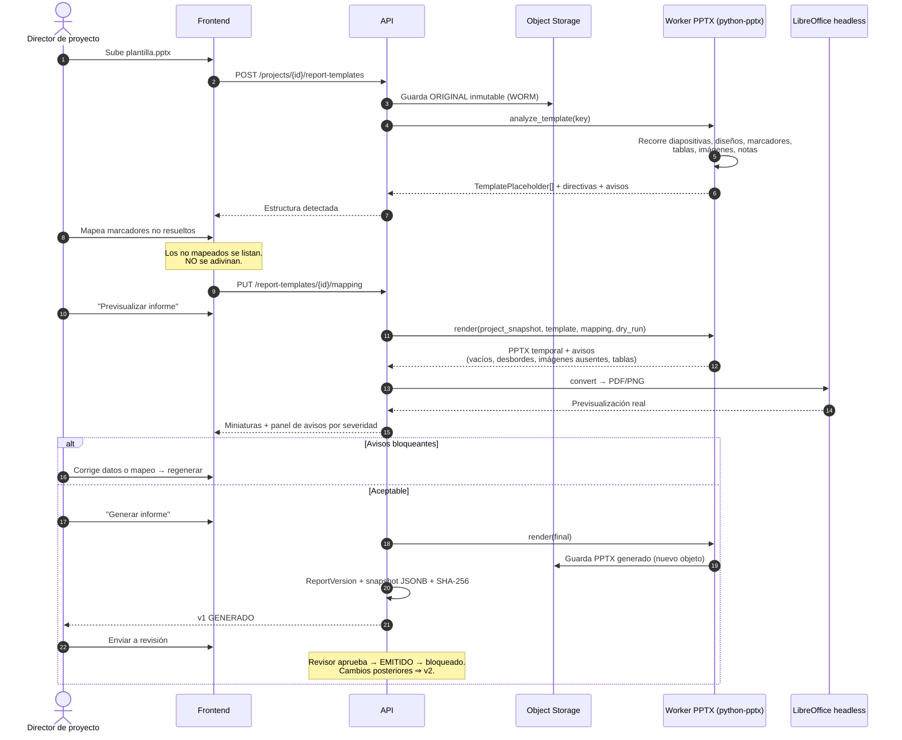
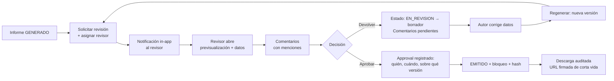
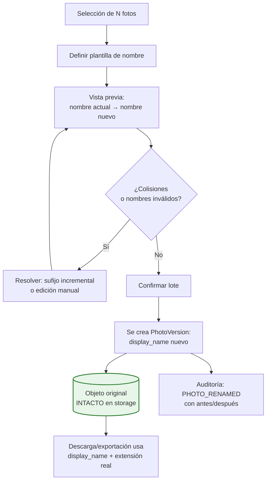
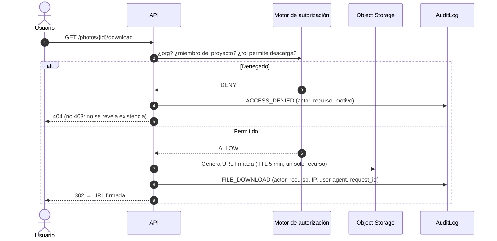

# 4. Alcance funcional · 5. Flujos de usuario

---

## 4. Alcance funcional

### 4.0. Mapa de capacidades

### 4.1. Bloque 1 — Creación y gestión del proyecto `[REQ]`

**Incluido en el alcance funcional completo:**

- **Ficha de proyecto** con los campos solicitados: nombre, código interno, estado, tipo de due
  diligence, alcance del trabajo, fecha de creación, fecha prevista de visita, fecha límite de
  informe, moneda principal, observaciones.
- **Máquina de estados** con las nueve situaciones solicitadas y transiciones controladas
  (§4.7).
- **Cliente y contactos**: razón social, persona de contacto, cargo, correo, teléfono, dirección,
  notas internas. `[REC]` El cliente se modela como entidad reutilizable a nivel de organización,
  no como campos embebidos en el proyecto: permite ver la cartera de proyectos por cliente sin
  duplicar datos.
- **Activos 1..N por proyecto**, con todos los campos solicitados incluidos superficie construida,
  superficie alquilable, años de construcción y reforma, plantas, uso principal, coordenadas e
  imagen principal.
- **Mapa configurable** mediante adaptador `MapProvider` (proveedor de teselas y de
  geocodificación intercambiables por configuración). `[REQ]`
- **Equipo interno**: alta o selección de usuarios de la organización, asignación al proyecto con
  rol, asignación opcional a uno o varios activos, y especialidades técnicas.
- **Registro de autoría**: creado por, modificado por, revisado por, aprobado por, en todas las
  entidades relevantes.
- **Buscador y filtros** por cliente, estado, responsable, activo, ubicación y rango de fechas.
- **Panel de proyectos recientes**, basado en actividad del usuario, no solo en fecha de creación.
  `[REC]`
- **Duplicación de proyectos** con selección granular de qué se copia (§4.8).
- **Archivado sin borrado**: `archived_at` independiente de `deleted_at`.
- **Historial de cambios** (diffs campo a campo) y **registro de actividad** (línea de tiempo
  legible por humanos). Son dos cosas distintas y se implementan por separado. `[REC]`
- **Exportación básica** de los datos del proyecto (JSON completo + XLSX de tablas).

### 4.2. Bloque 2 — Fotografías y repositorio documental `[REQ]`

- Repositorio **aislado por proyecto**, organizado por activo, con árbol
  `Activo → Zona → Planta → Espacio` y clasificación transversal por sistema técnico.
- Carga desde ordenador, móvil o tableta; **carga múltiple**; **captura directa** desde cámara
  mediante `<input capture>` cuando el dispositivo lo permite.
- **Original inmutable**; toda edición o renombrado genera una versión de trabajo.
- Renombrado **individual y en lote** con plantilla configurable, con **conservación garantizada de
  la extensión** (la extensión no forma parte del nombre editable; se deriva del tipo real
  detectado). `[REC]`
- Miniaturas, vista ampliada, descarga individual y en lote (ZIP asíncrono).
- **Detección de duplicados** por SHA-256 exacto; `[REC]` además hash perceptual para
  «casi duplicados» (misma escena, dos disparos), que en visitas es el caso frecuente.
- **EXIF**: lectura completa, extracción de fecha/hora/GPS a columnas indexadas, y **eliminación de
  metadatos sensibles en la exportación** (opción por defecto activada para entregas al cliente).
- Autor, fecha de carga y fecha de modificación registrados.
- **Asociación múltiple** de una foto a: proyecto, activo, zona, planta, espacio, sistema técnico,
  equipo, incidencia, partida CAPEX y sección del informe.
- **Clasificación sugerida** por las 14 categorías solicitadas, como catálogo semilla editable.
- Etiquetas personalizadas, comentarios, descripción, **selección para informe** y **orden de
  aparición**.
- **Papelera con recuperación** y **control de versiones**.
- Marcado visual sobre la imagen (flechas, círculos, cuadros): **MVP = anotación básica**
  (rectángulo, elipse, flecha, texto) almacenada como capa vectorial JSON sobre el original, lo que
  la hace editable y reversible. La anotación avanzada (pinceles, difuminado, medidas) es fase
  posterior. `[REC]`

Detalle completo en [`09-fotografias.md`](./09-fotografias.md).

### 4.3. Bloque 3 — Incidencias y CAPEX `[REQ]`

- **Inventario de equipos/elementos** con los 18 campos solicitados, incluidos vida útil estimada,
  nivel de obsolescencia y criticidad. `[REC]` La vida útil residual se calcula
  (`año_instalación + vida_útil − año_actual`) y no se teclea, para que el horizonte temporal de las
  actuaciones sea coherente con el inventario.
- **Incidencias** con título, descripción, ubicación, sistema, equipo, evidencia fotográfica,
  riesgo, criticidad (4 niveles), recomendación, acción (6 valores), horizonte temporal (5 tramos),
  estado (6 valores), responsable y comentarios del revisor.
- **Matriz de riesgo** probabilidad × consecuencia, con priorización visual.
- **Partidas CAPEX** con los 24 campos solicitados. **El cálculo es abierto y editable**: la
  cascada de costes se muestra desglosada línea a línea en la interfaz, con cada porcentaje visible
  y modificable, y cada importe intermedio persistido. No hay fórmula oculta. `[REQ]`
- **Referencias de precio** múltiples por partida, con procedencia completa, comparador lado a
  lado y **validación humana obligatoria**. `[REQ]`
- **Actualización por índices**, factores geográficos, inflación, gastos generales, beneficio
  industrial, contingencias, **escenarios bajo/probable/alto** y redondeo configurable.
- **Vistas de CAPEX** por proyecto, activo, sistema, prioridad, año, horizonte y nivel de riesgo.
- **Exportación** XLSX y CSV.
- **Consulta de precios en fuentes públicas**: se diseña la arquitectura de adaptadores completa,
  pero **ninguna fuente concreta se activa sin validación legal previa de sus condiciones de uso**.
  El MVP incluye únicamente el adaptador manual y el importador de catálogo propio. `[PDV]`

Detalle completo en [`10-capex-precios.md`](./10-capex-precios.md).

### 4.4. Bloque 4 — Generación de informe desde plantilla PPTX `[REQ]`

- Carga de plantilla PPTX **por proyecto**; almacenamiento seguro del original **sin modificarlo
  nunca**.
- Análisis de estructura: diapositivas, diseños, patrón, títulos, cuadros de texto, tablas,
  imágenes, gráficos, marcadores de posición y notas.
- **Previsualización de la estructura detectada** antes de mapear.
- **Mapeo** de campos de la aplicación a elementos de la plantilla, **guardado y reutilizable**
  (a nivel de plantilla y clonable entre proyectos).
- Sistema de marcadores `{{...}}` en el cuerpo y **directivas de repetición en las notas del
  orador** (§ [`11-pptx.md`](./11-pptx.md) §3), que resuelven: una diapositiva por activo, por
  sistema, por incidencia; división automática de tablas largas; inserción de fotos y pies de foto.
- Conservación de tema, patrón, tipografías, colores, logos, posiciones, tamaños, proporciones,
  encabezados y pies. `[LIM]` Con matices importantes documentados en `11-pptx.md` §6.
- **Cuando el destino de un contenido no puede determinarse, se pide mapeo explícito.** No se
  adivina ni se sobrescribe. `[REQ]`
- **Previsualización previa a la generación final** con detección de: campos vacíos, textos que
  desbordan, imágenes ausentes, tablas que no caben. Avisos clasificados por severidad y
  regeneración tras corregir.
- Estados de informe: borrador, generado, en revisión, aprobado, emitido.
- Versionado con registro de plantilla usada, usuario generador, fecha, versión de datos, versión
  de informe y aprobador.

### 4.5. Funcionalidades transversales `[REQ]`

| Capacidad | MVP | Fase posterior |
|---|:---:|:---:|
| Autenticación segura + recuperación de contraseña | ✅ | |
| MFA (TOTP) | ✅ opcional | obligatorio por política |
| SSO / OIDC | interfaz preparada | ✅ |
| Gestión de usuarios y roles | ✅ | |
| Permisos por proyecto | ✅ | permisos por activo |
| Separación lógica por organización | ✅ (RLS) | |
| Historial de cambios | ✅ | |
| Registro de auditoría | ✅ | cadena hash anti-manipulación |
| Notificaciones in-app | ✅ | email digest, push |
| Comentarios y menciones | ✅ | |
| Flujo de revisión y aprobación | ✅ 1 nivel | multi-nivel |
| Búsqueda global | ✅ (PostgreSQL FTS) | OpenSearch |
| Diseño responsive | ✅ | |
| Uso desde móvil en visita | ✅ (PWA) | |
| Baja conectividad / guardado local | ✅ parcial: cola de subida y borradores locales | ✅ offline completo |
| Sincronización con resolución de conflictos | básica (última escritura gana + aviso) | ✅ CRDT/merge asistido |
| Interfaz en español + i18n | ✅ | otros idiomas |
| Fechas, monedas, impuestos, unidades configurables | ✅ | |
| Sistema métrico por defecto | ✅ | |
| Accesibilidad WCAG 2.2 AA | ✅ | AAA selectivo |
| Copias de seguridad | ✅ | multi-región |
| Política de conservación y eliminación | ✅ | automatización completa |

### 4.6. Fuera de alcance (explícito)

Para evitar expectativas: **no** se incluye, en ninguna fase planificada, sin ampliación de
encargo: valoración financiera del activo (DCF, yield), gestión de obra o seguimiento de ejecución,
modelado BIM/IFC, gestión de mantenimiento (GMAO), certificación energética oficial, ni firma
electrónica cualificada.

### 4.7. Máquina de estados del proyecto

**Reglas de guarda** (`[REQ]`, §9 del encargo):

| Transición | Guarda |
|---|---|
| `BORRADOR → EN_PREPARACION` | Al menos un cliente **y** un activo asociados |
| `VISITA_PROGRAMADA → VISITA_REALIZADA` | Fecha real de visita registrada |
| `EN_ANALISIS → EN_REVISION` | Existe al menos una versión de informe en estado `GENERADO` |
| `EN_REVISION → INFORME_EMITIDO` | Existe `Approval` con resultado `APROBADO` de un usuario con rol revisor o superior |
| `INFORME_EMITIDO → *` | El informe emitido queda **bloqueado**; cualquier cambio posterior crea una versión nueva |
| `* → ARCHIVADO` | Nunca borra datos; solo marca `archived_at` |

`[REC]` La máquina de estados vive en el dominio (`ProjectStateMachine`), no repartida en
controladores. Cada transición emite un evento de dominio que alimenta auditoría y notificaciones.

### 4.8. Duplicación de proyectos — qué se copia

`[REC]` Copiar un proyecto entero suele ser un error: se arrastran fotos y precios de otro edificio.
Se propone duplicado selectivo:

| Elemento | Por defecto | Motivo |
|---|:---:|---|
| Ficha de proyecto (sin fechas ni código) | ✅ | Base del nuevo encargo |
| Cliente y contactos | ✅ | Normalmente es el mismo cliente |
| Activos (ficha, sin fotos) | ☐ opcional | Puede ser el mismo edificio en otra fase |
| Miembros del equipo y roles | ✅ | Ahorra la parte más tediosa |
| Plantilla PPTX y su mapeo | ✅ | Alto valor: el mapeo es costoso |
| Estructura de zonas/plantas/espacios | ☐ opcional | Útil en carteras homogéneas |
| Inventario de equipos | ☐ opcional | |
| Fotografías | ❌ **nunca** | Evidencia no transferible entre encargos |
| Incidencias | ❌ **nunca** | Hallazgos no transferibles |
| Partidas CAPEX con importes | ❌ nunca | Trazabilidad de precio no transferible |
| Plantillas de partidas (sin importes) | ☐ opcional | Acelera el CAPEX manteniendo la trazabilidad |

---

## 5. Flujos de usuario

### 5.1. Flujo maestro: del encargo al informe emitido

### 5.2. Flujo de campo (móvil) — el flujo que decide la adopción

`[REC]` Este es el flujo crítico del producto. Si en obra cuesta más que una libreta y el móvil,
la herramienta no se usa. Objetivo de diseño: **registrar una incidencia con foto en ≤ 4 toques**.

**Decisiones de UX derivadas** `[REC]`:

1. **Contexto persistente**: activo, planta y sistema se fijan una vez y se mantienen; no se piden
   en cada foto.
2. **Autoguardado con indicador de estado** (`guardado` / `pendiente de sincronizar` / `error`).
   Nunca un botón «Guardar» que se pueda olvidar.
3. **Miniatura optimista inmediata**: la foto aparece antes de subirse.
4. **Dictado por voz** para descripciones (API nativa del navegador; sin envío a terceros).
5. **Objetivos grandes** (≥ 44×44 px) y contraste alto: se usa con guantes y a contraluz.

### 5.3. Flujo de precio: de la referencia a la partida validada

### 5.4. Flujo de informe: plantilla, mapeo, generación, emisión

### 5.5. Flujo de revisión y aprobación

### 5.6. Flujo de renombrado no destructivo de fotografías

**Clave del diseño** `[REC]`: la clave de almacenamiento (`storage_key`, un UUID inmutable) y el
nombre visible (`display_name`) son **campos distintos**. Renombrar es una operación de metadatos:
coste O(1), cero riesgo de pérdida, cien por cien reversible, y la extensión —derivada del tipo MIME
real detectado— nunca se pierde porque nunca se edita.

### 5.7. Flujo de acceso a un archivo confidencial

`[REC]` Devolver `404` en lugar de `403` para recursos de otras organizaciones evita que un tercero
confirme la existencia de un proyecto o cliente por sondeo de identificadores.
