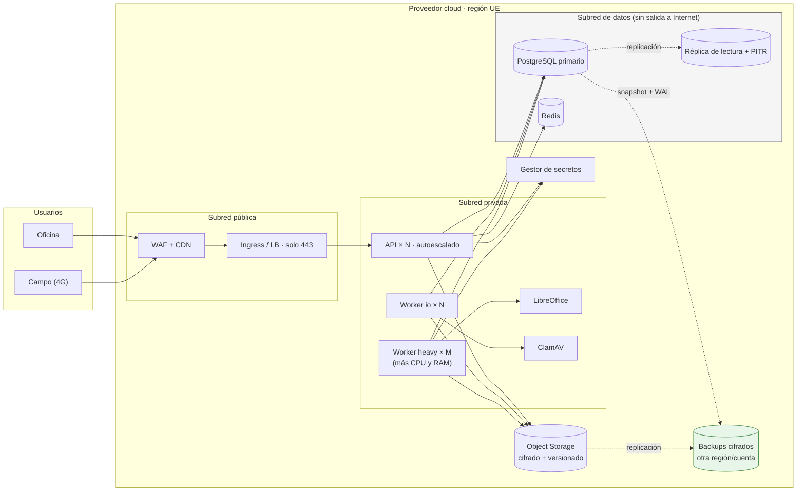
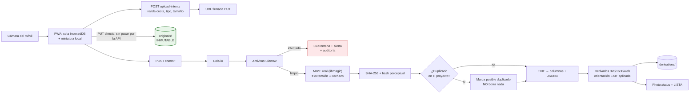

# 6. Arquitectura recomendada y alternativas · 7. Diagrama de arquitectura

---

## 6. Arquitectura

### 6.1. Principios rectores

| # | Principio | Consecuencia práctica |
|---|---|---|
| 1 | **Monolito modular antes que microservicios** | Un despliegue, un esquema, límites internos explícitos. Se extrae un servicio cuando duela, no antes |
| 2 | **Puertos y adaptadores en las fronteras volátiles** | Precios, mapas, almacenamiento, antivirus, correo e identidad se consumen por interfaz `[REQ]` |
| 3 | **Todo lo lento, fuera del ciclo petición-respuesta** | Cola de tareas para EXIF, derivados, antivirus, PPTX, ZIP y exportaciones `[REQ]` |
| 4 | **Los catálogos son datos** | Tipologías, zonas, códigos CAPEX, riesgos y conceptos viven en tablas versionadas. Ampliarlos no exige despliegue `[REC]` |
| 5 | **Autorización en el servidor, siempre** | La interfaz oculta; el backend decide; además RLS en base de datos como segunda barrera |
| 6 | **Portabilidad sobre comodidad** | Solo se aceptan servicios gestionados con equivalente autoalojado (§6.9) `[REQ]` |
| 7 | **Los binarios no viven en la base de datos** | PostgreSQL guarda metadatos; los objetos, en almacenamiento S3-compatible |
| 8 | **El dominio no sabe de HTTP ni de SQL** | Servicios de dominio puros y testables sin infraestructura |

### 6.2. Lenguaje y framework de backend

El factor determinante **no es la preferencia del equipo: es el bloque 4**. Manipular PPTX
conservando el tema y el formato corporativo es la funcionalidad de mayor riesgo y menor
sustituibilidad. La elección se hace desde ahí.

#### Bibliotecas PPTX: el criterio que decide

| Biblioteca | Runtime | Licencia | Fortalezas | Debilidades |
|---|---|---|---|---|
| **`python-pptx`** | Python | MIT | Madura, API clara, acceso al XML cuando hace falta | Sin duplicado oficial de diapositivas; sin renderizado; gráficos limitados `[LIM]` |
| Apache POI (XSLF) | Java | Apache 2.0 | Mejor clonado de diapositivas; muy completo | Verbosa; arrastra la JVM al stack |
| OpenXML SDK | .NET | MIT | Implementación de referencia de OOXML | Peor encaje con el resto (imagen, EXIF) |
| `docxtemplater` (PPTX) | Node | **Comercial** | Sintaxis de plantillas excelente | Módulos de pago; dependencia de proveedor |
| Aspose.Slides | Varios | **Comercial (caro)** | Fidelidad y renderizado propios | Coste por servidor; lock-in fuerte |

**Conclusión:** `python-pptx` es el mejor punto de partida por madurez, licencia permisiva y coste
cero. Apache POI y Aspose.Slides quedan identificados como **planes B concretos** si el corpus de
plantillas reales (P-07) revela que no basta.

#### Frameworks

| Opción | A favor | En contra | Veredicto |
|---|---|---|---|
| **FastAPI + SQLAlchemy 2 + Alembic + Pydantic v2** | `python-pptx`, `Pillow`, `pyexiv2`, `fontTools`, `openpyxl` nativos. OpenAPI automático. Async. Tipado fuerte | Sin tipos compartidos con el frontend (se resuelve generando el cliente TS desde OpenAPI) | ✅ **Recomendado** |
| Django + DRF | Admin gratis, ORM y auth maduros | El admin no sustituye la UI de negocio; DRF más rígido con esquemas complejos | Alternativa razonable |
| NestJS + Prisma | Un solo lenguaje front y back | **Obliga a un servicio Python aparte solo para PPTX**: dos runtimes permanentes por comodidad | ❌ Descartado |
| Spring Boot | Robusto, POI de primera | Coste de desarrollo alto para el equipo de S-06 | ❌ Descartado para MVP |
| .NET 8 + EF Core | OpenXML SDK excelente | Peor ecosistema de imagen y EXIF | ❌ Descartado |

> **Compromiso asumido, dicho claramente:** elegir Python cuesta la ausencia de tipos compartidos
> extremo a extremo. Se mitiga generando el cliente TypeScript desde OpenAPI en CI, con fallo de build
> si el generado difiere del comprometido. Es un coste menor que mantener dos runtimes de servidor.

### 6.3. Frontend

| Opción | A favor | En contra | Veredicto |
|---|---|---|---|
| **React 18 + TS + Vite + TanStack Query + Tailwind + Radix** | TanStack Query resuelve caché, reintentos y actualizaciones optimistas —justo lo que exige el trabajo de campo—; Radix aporta accesibilidad de primitivas; PWA madura | Requiere disciplina de arquitectura | ✅ **Recomendado** |
| Vue 3 + Nuxt | DX excelente, curva suave | Menos componentes accesibles de nivel empresarial | Alternativa válida |
| Next.js (SSR) | SEO, RSC | Aplicación privada tras login: el SSR aporta poco y añade una capa Node | ❌ Innecesario |
| Django templates + HTMX | Poco JavaScript | El editor de CAPEX, el visor con anotación y el mapeo de plantilla exigen estado cliente rico | ❌ Insuficiente |

Apoyo: **MapLibre GL** (mapas sin lock-in), **TanStack Table** (rejilla de CAPEX), **Konva**
(anotación), **react-hook-form + Zod** (validación espejo de la del servidor), **Dexie** (cola de
subida en IndexedDB).

### 6.4. Datos y multi-tenancy

**PostgreSQL 16.** `NUMERIC` exacto para importes, `JSONB` para snapshots y EXIF, búsqueda de texto
completo nativa, `ltree` para el árbol de códigos y de zonas, PostGIS disponible si crecen las
consultas geográficas, y **Row Level Security**, que es la pieza que hace robusto el aislamiento.

| Estrategia | A favor | En contra | Veredicto |
|---|---|---|---|
| **BD única + `organization_id` + RLS** | Un esquema, migraciones simples, aislamiento aplicado por el motor aunque el código falle | Exige que toda tabla tenga política | ✅ **Recomendado** |
| Esquema por organización | Aislamiento más visible | Migrar 200 esquemas duele; consultas cruzadas complejas | Solo si un cliente lo exige |
| Base de datos por organización | Aislamiento máximo | Coste operativo desproporcionado para S-02 | Solo grandes cuentas |

`[REC]` Cada petición abre transacción y ejecuta `SET LOCAL app.current_org_id = '<uuid>'`; las
políticas filtran por `current_setting(...)`. El usuario de aplicación **no tiene `BYPASSRLS`**: un
`WHERE` olvidado deja de ser una fuga entre clientes.

### 6.5. Almacenamiento de objetos

**API S3 como contrato**, no un proveedor: MinIO en local y CI, almacenamiento S3-compatible en
producción, un solo adaptador `ObjectStorage`.

```
{org}/{project}/originals/{photo_id}.{ext}            ← inmutable · versionado · WORM
{org}/{project}/derivatives/{photo_id}/thumb-320.webp
{org}/{project}/derivatives/{photo_id}/preview-1600.webp
{org}/{project}/annotated/{version_id}.jpg
{org}/{project}/documents/{document_id}.{ext}         ← doc. solicitada, Q&A, etc.
{org}/{project}/qa/{round}/{document_id}.xlsx
{org}/{project}/templates/{template_id}/original.pptx ← nunca se sobrescribe
{org}/{project}/reports/{report_version_id}.pptx
{org}/{project}/exports/{job_id}.zip                  ← ciclo de vida: 7 días
```

Medidas: versionado de bucket; **Object Lock/WORM** sobre `originals/` y `templates/` para que la
invariante «el original no se sobrescribe» esté garantizada por la infraestructura y no solo por el
código; cifrado en reposo; ciclo de vida para temporales; **subida directa del cliente por URL
firmada**, para que los archivos de 8 MB no atraviesen la API.

### 6.6. Cola de tareas

**Celery + Redis**, con dos colas: `io` (rápida: EXIF, hash, miniaturas) y `heavy` (lenta: PPTX,
previsualización, ZIP, exportaciones), para que generar un informe de 80 diapositivas no bloquee las
miniaturas de una visita en curso.

| Alternativa | Cuándo preferirla |
|---|---|
| RQ | Máxima simplicidad, sin cadenas ni reintentos sofisticados |
| arq | Worker nativamente async y ligero |
| Cola sobre PostgreSQL (`SKIP LOCKED`) | Si se quiere eliminar Redis del inventario. Menos piezas, menos rendimiento máximo |
| SQS / Cloud Tasks | Gestionado, pero introduce dependencia de proveedor |

Trabajos: `process_photo`, `scan_malware`, `build_derivatives`, `analyze_template`, `render_report`,
`render_preview`, `build_zip`, `export_xlsx`, `import_price_catalog`, `recalc_phase_status`,
`purge_expired_data`, `send_notifications`.

### 6.7. Identidad y autorización

- **MVP:** auth propia. **Argon2id**; JWT de 15 min en memoria + **refresh rotatorio en cookie
  `HttpOnly`**; TOTP opcional; recuperación con token de un solo uso.
- **Interfaz `IdentityProvider`** desde el día uno, para que añadir OIDC no obligue a reescribir la
  sesión. Si P-17 confirma SSO obligatorio, **Keycloak autoalojado** es la recomendación.
- **Autorización en tres capas**: RLS por organización · política de proyecto y rol en un módulo
  `authz` invocado como dependencia en cada endpoint · la interfaz solo oculta lo que el servidor ya
  deniega.

### 6.8. Servicios de dominio destacados

| Servicio | Responsabilidad | Frontera |
|---|---|---|
| `CatalogService` | Tipologías, zonas por tipología, árbol de códigos, riesgos, conceptos, horizontes | PostgreSQL |
| `CapexEngine` | Cascada de costes, horizontes, escenarios, índices, redondeo. **Puro y determinista, sin E/S** | ninguna |
| `PhaseEngine` | Estado de las fases; cálculo del estado derivado de Red Flag/CAPEX y Full Report | dominio puro |
| `PriceResolver` | Orquesta adaptadores, normaliza, **jamás autovalida** | `PriceSourceAdapter[]` |
| `PhotoService` | Ingesta, hash, dedupe, versiones, renombrado, anotación | `ObjectStorage`, `MalwareScanner` |
| `TemplateAnalyzer` | Lee el PPTX y extrae estructura | `python-pptx` (solo lectura) |
| `ReportRenderer` | Genera PPTX desde snapshot + mapeo | `python-pptx` (escritura sobre copia) |
| `PreviewRenderer` | PPTX → PDF/PNG | LibreOffice headless `[LIM]` |
| `AuditLogger` | Registro append-only | PostgreSQL |
| `ProjectStateMachine` | Transiciones y guardas | dominio puro |

`[REC]` `CapexEngine` y `PhaseEngine` sin dependencias de infraestructura es lo que permite tener
pruebas rapidísimas sobre la lógica que más importa. Es la pieza más valiosa que aísla este diseño.

### 6.9. Portabilidad: qué es sustituible

`[REQ]` «Evitar dependencia innecesaria de un único proveedor.»

| Componente | Recomendado | Equivalente autoalojado | Coste de migración |
|---|---|---|---|
| Base de datos | PostgreSQL gestionado | PostgreSQL en contenedor | **Bajo** (dump/restore) |
| Objetos | S3-compatible gestionado | MinIO / Ceph | **Bajo** (mismo API) |
| Cola y caché | Redis gestionado | Redis en contenedor | **Bajo** |
| Cómputo | Contenedores OCI | Docker Compose / Nomad | **Bajo** |
| Identidad | Auth propia | Keycloak | **Medio** |
| Correo | SMTP transaccional | SMTP propio | **Bajo** (interfaz `Mailer`) |
| Antivirus | ClamAV | ídem | **Nulo** |
| Mapas y geocodificación | Adaptador configurable | Teselas propias + Nominatim | **Bajo** (`MapProvider`) |
| Observabilidad | OpenTelemetry | Prometheus + Grafana + Loki | **Bajo** (estándar) |
| Conversión a PDF/PNG | LibreOffice propio | ídem | **Nulo** |

**No se recomienda ningún servicio propietario sin equivalente abierto.** Sin funciones serverless
propietarias, sin bases de datos propietarias, sin servicios de IA gestionados en el MVP.

### 6.10. Entornos y despliegue

- **Local:** Docker Compose (API, workers, PostgreSQL, Redis, MinIO, ClamAV, LibreOffice, MailHog).
  Un `make up` levanta todo.
- **CI:** GitHub Actions con `testcontainers` para PostgreSQL y MinIO reales. Puertas: lint, tipos,
  tests, cobertura, `bandit`, `pip-audit`, `npm audit`, y verificación de que el cliente TS generado
  coincide con el comprometido.
- **Entornos:** `dev` → `staging` (datos ficticios) → `prod`. Migraciones Alembic aplicadas en un paso
  explícito del pipeline, nunca al arrancar la API. `[REC]`
- **Secretos:** gestor del proveedor o Vault, inyectados como variables de entorno. En el repositorio
  solo `.env.example` **sin valores reales**. `[REQ]`

---

## 7. Diagrama de arquitectura

### 7.1. Vista de componentes

```mermaid
flowchart TB
    subgraph CL["Clientes"]
        B["Navegador escritorio<br/>React + TS (PWA)"]
        M["Móvil / tableta en visita<br/>PWA + IndexedDB"]
    end

    subgraph EDGE["Borde"]
        CDN["CDN / WAF<br/>TLS · límite de tasa"]
        LB["Reverse proxy"]
    end

    subgraph APP["Aplicación (contenedores)"]
        API["API FastAPI<br/>REST + OpenAPI"]
        subgraph MOD["Módulos de dominio (monolito modular)"]
            M1["identity · authz"]
            M2["projects · clients<br/>assets · team"]
            M9["phases<br/>doc · VDR · visita · Q&A"]
            M0["catalogs<br/>tipologías · zonas · códigos"]
            M3["evidence<br/>photos · documents"]
            M4["diagnosis<br/>findings · equipment"]
            M5["capex<br/>CapexEngine"]
            M8["prices<br/>PriceResolver"]
            M6["reporting<br/>templates · reports"]
            M7["audit · notifications"]
        end
        WI["Worker io<br/>Celery"]
        WH["Worker heavy<br/>Celery"]
        BEAT["Scheduler"]
    end

    subgraph DATA["Persistencia"]
        PG[("PostgreSQL 16<br/>RLS por organización")]
        RD[("Redis<br/>cola + caché")]
        OS[("Object Storage S3<br/>versionado + WORM")]
    end

    subgraph SVC["Servicios auxiliares"]
        AV["ClamAV"]
        LO["LibreOffice headless<br/>PPTX → PDF/PNG"]
        MAIL["SMTP transaccional"]
    end

    subgraph EXT["Adaptadores externos (desacoplados)"]
        PA1["PriceSource: Manual"]
        PA2["PriceSource: Catálogo propio<br/>(importación XLSX/CSV)"]
        PA3["PriceSource: Precio Centro<br/>⚠ ANDAMIO · pendiente de<br/>licencia y condiciones"]
        VDR["VDR externo<br/>solo se guarda el ENLACE"]
        MP["MapProvider"]
        IDP["IdentityProvider OIDC<br/>(fase posterior)"]
    end

    subgraph OBS["Observabilidad"]
        OT["OpenTelemetry Collector"]
        PROM["Prometheus / Grafana"]
        LOKI["Loki (logs)"]
        SEN["Sentry"]
    end

    B --> CDN --> LB --> API
    M --> CDN
    M -.->|"PUT directo<br/>URL firmada"| OS
    B -.->|"GET directo<br/>URL firmada"| OS

    API --> MOD
    API --> PG
    API --> RD
    API --> OS
    API -->|encola| RD
    RD --> WI
    RD --> WH
    BEAT --> RD

    WI --> PG
    WI --> OS
    WI --> AV
    WH --> PG
    WH --> OS
    WH --> LO
    WH --> MAIL

    M5 --> M0
    M4 --> M0
    M8 --> PA1
    M8 --> PA2
    M8 -.->|"deshabilitado<br/>por defecto"| PA3
    M9 -.->|enlace| VDR
    M2 --> MP
    M1 -.-> IDP

    API --> OT
    WI --> OT
    WH --> OT
    OT --> PROM
    OT --> LOKI
    API --> SEN

    style OS fill:#e8f5e9,stroke:#2e7d32,stroke-width:2px
    style PG fill:#e3f2fd,stroke:#1565c0,stroke-width:2px
    style PA3 fill:#fde7e9,stroke:#c62828,stroke-dasharray:4 4
    style M5 fill:#fff8e1,stroke:#f9a825
    style M0 fill:#fff8e1,stroke:#f9a825
```



### 7.2. Vista de despliegue



`[REC]` Los workers `heavy` (PPTX y LibreOffice) se ejecutan **sin salida a Internet**: son los
componentes que procesan ficheros de terceros y concentran la mayor superficie de ataque.

### 7.3. Flujo de datos de una fotografía


