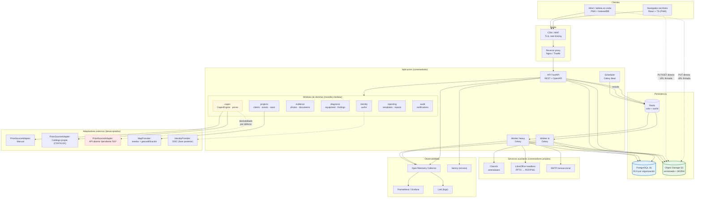
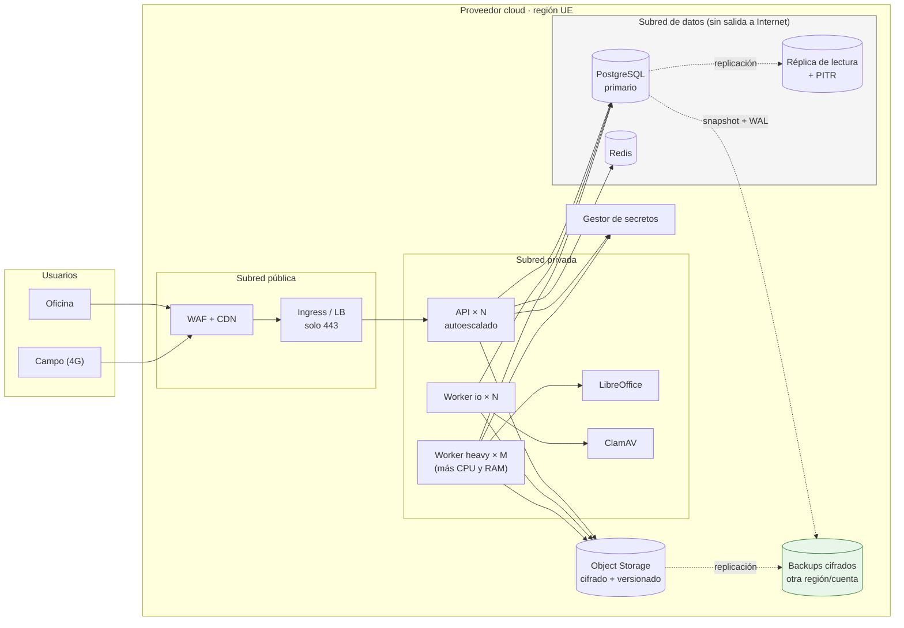
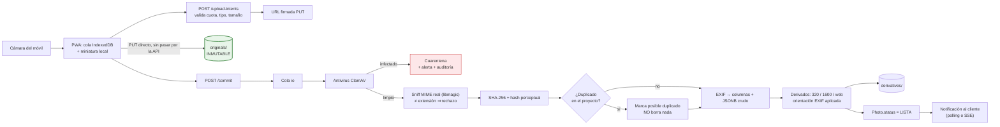

# 6. Arquitectura recomendada y alternativas · 7. Diagrama de arquitectura

---

## 6. Arquitectura

### 6.1. Principios rectores

| # | Principio | Consecuencia práctica |
|---|---|---|
| 1 | **Monolito modular antes que microservicios** | Un despliegue, un esquema, límites internos explícitos. Los microservicios se extraen cuando duelan, no antes |
| 2 | **Puertos y adaptadores en las fronteras volátiles** | Precios, mapas, almacenamiento, antivirus, notificaciones e identidad se consumen por interfaz `[REQ]` |
| 3 | **Todo lo lento, fuera del ciclo petición-respuesta** | Cola de tareas para EXIF, derivados, antivirus, PPTX, ZIP, exportaciones `[REQ]` |
| 4 | **Autorización en el servidor, siempre** | La interfaz oculta; el backend decide. Además, RLS en base de datos como segunda barrera |
| 5 | **Portabilidad sobre comodidad** | Solo se aceptan servicios gestionados con equivalente autoalojado (§6.9) `[REQ]` |
| 6 | **Los binarios no viven en la base de datos** | PostgreSQL guarda metadatos; los objetos, en almacenamiento S3-compatible |
| 7 | **El dominio no sabe de HTTP ni de SQL** | Servicios de dominio puros y testables sin infraestructura |

### 6.2. Decisión de lenguaje y framework de backend

El factor determinante no es la preferencia del equipo: es **el Bloque 4**. La manipulación de PPTX
conservando el tema, el patrón y el formato corporativo es la funcionalidad de mayor riesgo y menor
sustituibilidad del producto. La elección de backend se hace desde ahí.

#### Comparativa de bibliotecas PPTX (el criterio que decide)

| Biblioteca | Runtime | Licencia | Fortalezas | Debilidades |
|---|---|---|---|---|
| **`python-pptx`** | Python | MIT | Madura, API clara, lee/escribe formas, tablas, imágenes; acceso al XML crudo cuando hace falta | Sin duplicado oficial de diapositivas; sin renderizado; creación de gráficos limitada `[LIM]` |
| **Apache POI (XSLF)** | Java | Apache 2.0 | Mejor soporte de clonado de diapositivas; muy completo | Verbosa; arrastra la JVM al stack |
| **OpenXML SDK** | .NET | MIT | Implementación de referencia de OOXML, muy fiel | Ecosistema .NET; peor encaje con el resto de necesidades (Pillow, EXIF) |
| **`docxtemplater` (módulos PPTX)** | Node | **Comercial** | Sintaxis de plantillas excelente, bucles nativos | Módulos de pago; dependencia de proveedor |
| **Aspose.Slides** | Varios | **Comercial (caro)** | Fidelidad y renderizado propios, muy alta calidad | Coste por servidor; lock-in fuerte |
| Manipulación manual de OOXML | cualquiera | — | Control total | Coste de desarrollo y mantenimiento desproporcionado |

**Conclusión:** `python-pptx` es el mejor punto de partida por madurez, licencia permisiva y coste
cero. Apache POI y Aspose.Slides quedan identificados como **planes B** concretos si el corpus de
plantillas reales (P-01) revela que el clonado de diapositivas complejas no es viable.

#### Comparativa de frameworks de backend

| Opción | A favor | En contra | Veredicto |
|---|---|---|---|
| **FastAPI + SQLAlchemy 2 + Alembic + Pydantic v2** | `python-pptx`, `Pillow`, `pyexiv2`, `fontTools`, `pandas`/`openpyxl` nativos. OpenAPI automático. Async. Tipado con Pydantic. Rendimiento suficiente para carga I/O-bound | Sin tipos compartidos con el frontend (se resuelve generando cliente TS desde OpenAPI). Menos «baterías incluidas» que Django | ✅ **Recomendado** |
| Django + DRF | Admin gratis, ORM y auth maduros, migraciones sólidas | Admin no sustituye la UI de negocio; async parcial; DRF más rígido para esquemas complejos | Alternativa razonable si se valora mucho el admin |
| NestJS + Prisma (TypeScript) | Un solo lenguaje front y back, tipos compartidos | **Obliga a un servicio Python aparte solo para PPTX**: dos runtimes, dos pipelines, dos imágenes. Coste permanente por una decisión de comodidad | ❌ Descartado |
| Spring Boot (Java) | Robusto, POI de primera; excelente para empresa grande | Mayor coste de desarrollo y verbosidad para el tamaño de equipo supuesto (S-07) | ❌ Descartado para MVP |
| .NET 8 + EF Core | OpenXML SDK excelente, plataforma sólida | Peor ecosistema para imagen/EXIF; menor afinidad de equipo | ❌ Descartado |

> **Nota honesta sobre el compromiso:** elegir Python cuesta la ausencia de tipos compartidos
> extremo a extremo. Se mitiga generando el cliente TypeScript desde el esquema OpenAPI en CI, con
> fallo de build si el cliente generado difiere del comprometido. No es tan bueno como un monorepo
> TypeScript, pero es un coste menor que mantener dos runtimes de servidor.

### 6.3. Decisión de frontend

| Opción | A favor | En contra | Veredicto |
|---|---|---|---|
| **React 18 + TypeScript + Vite + TanStack Query + Tailwind + Radix UI** | Ecosistema de componentes accesibles; TanStack Query resuelve caché, reintentos y actualizaciones optimistas —justo lo que exige el trabajo de campo—; Radix aporta accesibilidad de primitivas; PWA madura | Requiere disciplina de arquitectura | ✅ **Recomendado** |
| Vue 3 + Nuxt | DX excelente, curva suave | Menor oferta de componentes accesibles de nivel empresarial | Alternativa válida |
| Next.js (SSR) | SEO, RSC | Es una aplicación privada tras login: el SSR aporta poco y añade una capa de servidor Node | ❌ Innecesario |
| Django templates + HTMX | Muy poco JavaScript, simplicidad | El editor de CAPEX, el visor de fotos con anotación y el mapeo de plantilla exigen estado cliente rico | ❌ Insuficiente |

Componentes de apoyo: **MapLibre GL JS** (mapas, sin lock-in de proveedor de teselas),
**TanStack Table** (rejilla del CAPEX), **Konva** o **Fabric.js** (capa de anotación),
**react-hook-form + Zod** (validación en cliente, espejo de la del servidor), **Dexie** (IndexedDB
para la cola de subida).

### 6.4. Datos y multi-tenancy

**PostgreSQL 16.** Justificación: `NUMERIC` exacto para importes, `JSONB` para snapshots y EXIF
crudo, búsqueda de texto completo nativa suficiente para el MVP, PostGIS disponible si las consultas
geográficas crecen, y **Row Level Security**, que es la pieza que hace robusta la separación
multi-organización.

| Estrategia de aislamiento | A favor | En contra | Veredicto |
|---|---|---|---|
| **BD única + `organization_id` + RLS** | Un esquema, migraciones simples, coste bajo, aislamiento aplicado por el motor incluso si el código falla | Requiere disciplina: la política de RLS debe cubrir todas las tablas | ✅ **Recomendado** |
| Esquema por organización | Aislamiento más visible | Migrar 200 esquemas es doloroso; consultas cruzadas complejas | Para clientes que lo exijan por contrato |
| Base de datos por organización | Aislamiento máximo, backup por cliente | Coste y operación desproporcionados para S-02 | Solo para grandes cuentas |

`[REC]` Patrón de aplicación: cada petición abre transacción y ejecuta
`SET LOCAL app.current_org_id = '<uuid>'`; las políticas RLS filtran por
`current_setting('app.current_org_id')::uuid`. El usuario de aplicación **no** tiene `BYPASSRLS`.
Un usuario distinto, solo para migraciones, sí lo tiene. Así, un `WHERE` olvidado no es una fuga de
datos entre clientes.

### 6.5. Almacenamiento de objetos

**API S3 como contrato**, no un proveedor concreto: MinIO en local y CI, y en producción el
almacenamiento S3-compatible del proveedor elegido. Un único adaptador `ObjectStorage` en el código.

Organización de claves (`[REC]`):

```
{org_id}/{project_id}/originals/{photo_id}.{ext}      ← inmutable, versionado activado
{org_id}/{project_id}/derivatives/{photo_id}/thumb-320.webp
{org_id}/{project_id}/derivatives/{photo_id}/preview-1600.webp
{org_id}/{project_id}/annotated/{version_id}.jpg
{org_id}/{project_id}/documents/{document_id}.{ext}
{org_id}/{project_id}/templates/{template_id}/original.pptx   ← nunca se sobrescribe
{org_id}/{project_id}/reports/{report_version_id}.pptx
{org_id}/{project_id}/exports/{job_id}.zip                    ← ciclo de vida: 7 días
```

Medidas: versionado de bucket activo; **Object Lock / WORM** sobre los prefijos `originals/` y
`templates/` para garantizar la invariante «el original no se sobrescribe» a nivel de
infraestructura y no solo de código; cifrado en reposo (SSE); reglas de ciclo de vida para
exportaciones temporales; **subida directa del cliente mediante URL firmada** para que los archivos
de 8 MB no atraviesen la API.

### 6.6. Cola de tareas y trabajos asíncronos

**Celery + Redis** como recomendación, con dos colas separadas: `io` (rápida: EXIF, hash,
miniaturas) y `heavy` (lenta: PPTX, previsualización LibreOffice, ZIP, exportaciones), para que
generar un informe de 80 diapositivas no bloquee las miniaturas de una visita en curso.

| Alternativa | Cuándo preferirla |
|---|---|
| **RQ** | Si se busca máxima simplicidad y no se necesitan cadenas ni reintentos sofisticados |
| **arq** | Si se quiere un worker nativamente async y ligero |
| **Cola sobre PostgreSQL** (`SKIP LOCKED`) | Si se quiere eliminar Redis del inventario de componentes. Menos piezas, menos rendimiento máximo |
| SQS / Cloud Tasks | Gestionado, pero introduce dependencia de proveedor. Sustituible por Redis+Celery |

Trabajos previstos: `process_photo`, `scan_malware`, `build_derivatives`, `analyze_template`,
`render_report`, `render_preview`, `build_zip`, `export_xlsx`, `refresh_price_index`,
`purge_expired_data`, `send_notifications`.

### 6.7. Identidad y autorización

- **MVP:** autenticación propia. Contraseñas con **Argon2id**; tokens de acceso JWT de vida corta
  (15 min) en memoria + **refresh token rotatorio en cookie `HttpOnly`, `Secure`, `SameSite=Lax`**;
  TOTP opcional; recuperación de contraseña con token de un solo uso y caducidad de 30 min.
- **Interfaz `IdentityProvider`** desde el día uno, para que añadir OIDC (Entra ID, Google,
  Okta, Keycloak) no requiera reescribir la sesión. `[REC]`
- **Autorización** en tres capas: (1) RLS por organización en base de datos; (2) política de
  proyecto y rol en un módulo `authz` centralizado, invocado por dependencia de FastAPI en cada
  endpoint; (3) la interfaz solo oculta lo que el servidor ya deniega.

> Se descarta Keycloak/Auth0 en el MVP por coste operativo y por lock-in respectivamente, pero la
> interfaz deja la puerta abierta. Si P-06 confirma SSO obligatorio, **Keycloak autoalojado** es la
> recomendación (open source, OIDC completo, sin dependencia de proveedor).

### 6.8. Servicios de dominio destacados

| Servicio | Responsabilidad | Frontera |
|---|---|---|
| `PhotoService` | Ingesta, hash, dedupe, versiones, renombrado, anotación | `ObjectStorage`, `MalwareScanner`, cola |
| `CapexEngine` | Cascada de costes, escenarios, índices, redondeo. **Puro y determinista, sin E/S** | ninguna: función de datos a datos |
| `PriceResolver` | Orquesta adaptadores, normaliza, jamás autovalida | `PriceSourceAdapter[]` |
| `TemplateAnalyzer` | Lee PPTX y extrae estructura y marcadores | `python-pptx` (solo lectura) |
| `ReportRenderer` | Genera PPTX a partir de snapshot + mapeo | `python-pptx` (escritura sobre copia) |
| `PreviewRenderer` | PPTX → PDF/PNG para previsualización | LibreOffice headless `[LIM]` |
| `AuditLogger` | Registro append-only de operaciones críticas | PostgreSQL |
| `ProjectStateMachine` | Transiciones y guardas | dominio puro |

`[REC]` `CapexEngine` sin dependencias de infraestructura es lo que permite tener pruebas doradas de
cálculo rapidísimas y una fórmula auditable. Es la pieza más valiosa que aísla este diseño.

### 6.9. Portabilidad: qué es sustituible y por qué

`[REQ]` «Evitar dependencia innecesaria de un único proveedor.»

| Componente | Recomendado | Equivalente autoalojado | Coste de migración |
|---|---|---|---|
| Base de datos | PostgreSQL gestionado | PostgreSQL en contenedor | **Bajo** (dump/restore) |
| Objetos | S3-compatible gestionado | MinIO / Ceph | **Bajo** (mismo API; `rclone`) |
| Cola/caché | Redis gestionado | Redis en contenedor | **Bajo** |
| Cómputo | Contenedores (ECS/Cloud Run/Kubernetes) | Docker Compose / Nomad | **Bajo** (imágenes OCI) |
| Identidad | Auth propia | Keycloak | **Medio** |
| Correo | Proveedor SMTP transaccional | SMTP propio | **Bajo** (interfaz `Mailer`) |
| Antivirus | ClamAV en contenedor | idem | **Nulo** |
| Mapas y geocodificación | Adaptador configurable | Servidor de teselas propio + Nominatim autoalojado | **Bajo** (interfaz `MapProvider`) |
| Observabilidad | OpenTelemetry | Prometheus + Grafana + Loki + Tempo | **Bajo** (OTel es el estándar) |
| Conversión a PDF/PNG | LibreOffice headless propio | idem | **Nulo** |

**No se recomienda ningún servicio propietario sin equivalente abierto.** No se usan funciones
serverless propietarias, ni bases de datos propietarias, ni servicios de IA gestionados en el MVP.

### 6.10. Entornos y despliegue

- **Local:** Docker Compose (API, worker, PostgreSQL, Redis, MinIO, ClamAV, MailHog). Un solo
  `make up` debe levantar todo. `[REC]`
- **CI:** GitHub Actions con `testcontainers` para PostgreSQL/MinIO reales en las pruebas de
  integración. Puertas de calidad: lint, tipos, tests, cobertura, `bandit`, `pip-audit`,
  `npm audit`, y verificación de que el cliente TS generado coincide con el comprometido.
- **Entornos:** `dev` → `staging` (datos ficticios) → `prod`. Migraciones Alembic aplicadas en un
  paso explícito del pipeline, nunca al arrancar el contenedor de la API. `[REC]`
- **Secretos:** gestor de secretos del proveedor o Vault, inyectados como variables de entorno. En
  el repositorio solo `.env.example` **sin valores reales**. `[REQ]`

---

## 7. Diagrama de arquitectura

### 7.1. Vista de componentes



### 7.2. Vista de despliegue



### 7.3. Flujo de datos de una fotografía (extremo a extremo)


