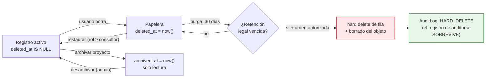
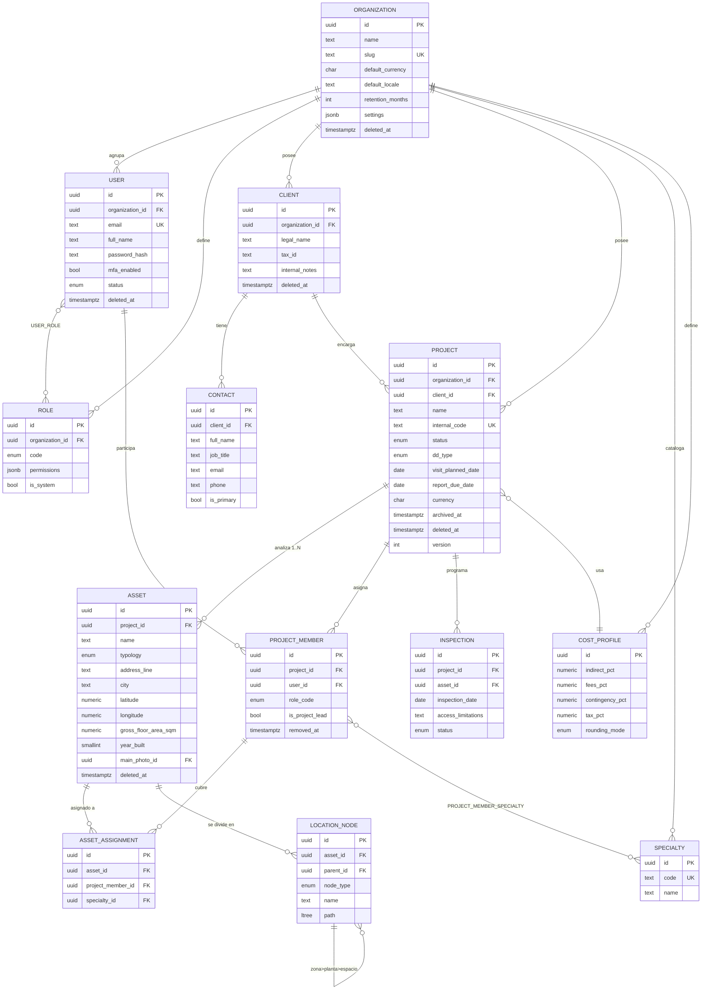
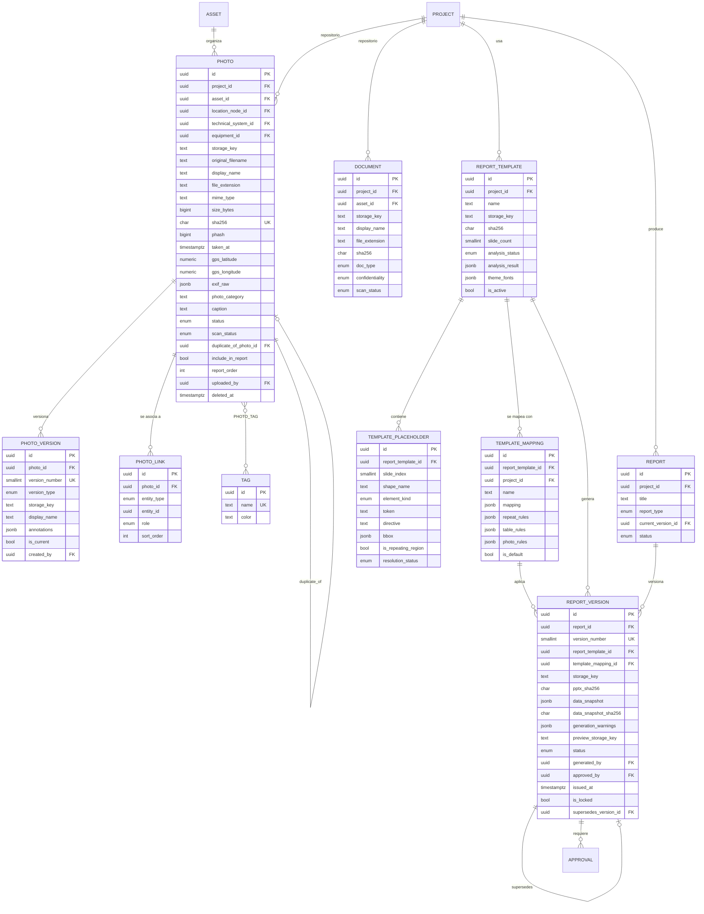
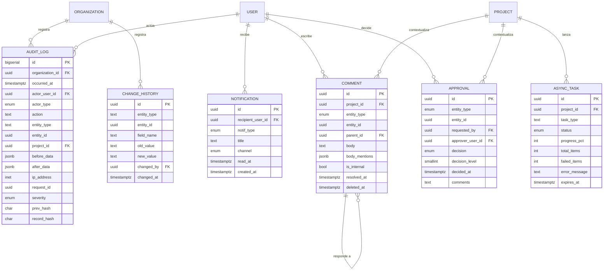

# 8. Modelo de datos · 9. Diagrama entidad-relación

---

## 8. Modelo de datos

### 8.0. Convenciones aplicadas a todas las tablas

| Aspecto | Decisión | Motivo |
|---|---|---|
| **Clave primaria** | `id UUID PK DEFAULT gen_random_uuid()` | No revela volumen ni orden; seguro en URLs; permite generar en cliente para el modo offline `[REC]` |
| **Tenant** | `organization_id UUID NOT NULL` en toda tabla de negocio + política RLS | Aislamiento aplicado por el motor, no por el código `[REQ]` |
| **Auditoría de fila** | `created_at`, `created_by`, `updated_at`, `updated_by` (`TIMESTAMPTZ`, `UUID→user.id`) | Trazabilidad mínima universal `[REQ]` |
| **Revisión/aprobación** | `reviewed_at`, `reviewed_by`, `approved_at`, `approved_by` en entidades revisables (Finding, CapexItem, ReportVersion) | `[REQ]` §3 Bloque 1 |
| **Borrado lógico** | `deleted_at TIMESTAMPTZ NULL`, `deleted_by UUID NULL`, `delete_reason TEXT NULL` | Nunca `DELETE` desde la aplicación `[REQ]` |
| **Archivado** | `archived_at TIMESTAMPTZ NULL` en `project`, distinto de `deleted_at` | Archivar ≠ borrar `[REQ]` |
| **Unicidad con soft-delete** | Índices únicos **parciales**: `... WHERE deleted_at IS NULL` | Permite reutilizar un código liberado tras borrado lógico |
| **Concurrencia** | `version INTEGER NOT NULL DEFAULT 1` (bloqueo optimista) | Necesario con autoguardado y sincronización posterior `[REC]` |
| **Importes** | `NUMERIC(18,4)`; nunca `FLOAT`/`DOUBLE` | Exactitud decimal obligatoria en cálculo de CAPEX `[REQ]` |
| **Moneda** | `CHAR(3)` ISO 4217 + `CHECK` sobre catálogo | |
| **Enumerados** | Tipos `ENUM` de PostgreSQL para conjuntos cerrados y estables; tabla de catálogo para los que el cliente debe poder ampliar (sistemas técnicos, especialidades, categorías de foto) | Los catálogos ampliables no deben requerir migración `[REC]` |
| **Timestamps** | Siempre `TIMESTAMPTZ` en UTC; la zona se aplica en presentación | |
| **Texto libre** | `TEXT` (no `VARCHAR(n)` arbitrario), con validación de longitud en la capa de aplicación | |

**Vista de acceso por defecto** `[REC]`: para cada tabla con borrado lógico se crea una vista
`v_<tabla>` que filtra `deleted_at IS NULL`. El código de negocio consulta la vista; solo los
procesos de administración y purga tocan la tabla base. Así, olvidar el filtro deja de ser un error
silencioso.

---

### 8.1. Identidad y organización

#### `organization`
| Campo | Tipo | Notas |
|---|---|---|
| `id` | UUID PK | |
| `name` | TEXT NOT NULL | |
| `slug` | TEXT NOT NULL | único global |
| `country_code` | CHAR(2) NOT NULL | ISO 3166-1 |
| `default_currency` | CHAR(3) NOT NULL DEFAULT `'EUR'` | |
| `default_locale` | TEXT NOT NULL DEFAULT `'es-ES'` | |
| `default_unit_system` | ENUM(`METRICO`,`IMPERIAL`) DEFAULT `METRICO` | `[REQ]` |
| `timezone` | TEXT NOT NULL DEFAULT `'Europe/Madrid'` | |
| `retention_months` | INTEGER NOT NULL DEFAULT 84 | política de conservación (S-18) |
| `settings` | JSONB NOT NULL DEFAULT `'{}'` | límites, feature flags, config de mapas |
| *auditoría + soft delete* | | |

**Índices:** `UNIQUE(slug) WHERE deleted_at IS NULL`.
**Restricción:** `CHECK (retention_months BETWEEN 1 AND 600)`.

#### `user`
| Campo | Tipo | Notas |
|---|---|---|
| `id` | UUID PK | |
| `organization_id` | UUID FK → organization | RLS |
| `email` | TEXT NOT NULL | normalizado a minúsculas |
| `full_name` | TEXT NOT NULL | |
| `password_hash` | TEXT NULL | NULL si el acceso es solo por OIDC |
| `mfa_secret_encrypted` | BYTEA NULL | cifrado a nivel de aplicación |
| `mfa_enabled` | BOOLEAN NOT NULL DEFAULT false | |
| `status` | ENUM(`INVITADO`,`ACTIVO`,`SUSPENDIDO`,`BAJA`) | |
| `job_title`, `phone` | TEXT NULL | |
| `locale`, `timezone` | TEXT NULL | anulan los de la organización |
| `last_login_at` | TIMESTAMPTZ NULL | |
| `failed_login_count` | INTEGER NOT NULL DEFAULT 0 | bloqueo progresivo |
| `password_changed_at` | TIMESTAMPTZ NULL | |
| *auditoría + soft delete* | | |

**Índices:** `UNIQUE(organization_id, lower(email)) WHERE deleted_at IS NULL`;
`INDEX(organization_id, status)`.
**Nota:** el hash de contraseña y el secreto MFA **nunca** se exponen en ningún esquema de
respuesta de la API (esquemas Pydantic separados de entrada/salida).

#### `role` y `user_role`
`role` es catálogo por organización, con roles del sistema no editables.

| `role` | Tipo | Notas |
|---|---|---|
| `id` | UUID PK | |
| `organization_id` | UUID FK NULL | NULL = rol global del sistema |
| `code` | ENUM(`ADMIN`,`DIRECTOR_PROYECTO`,`CONSULTOR`,`TECNICO_ESPECIALISTA`,`REVISOR`,`LECTOR`) | `[REQ]` |
| `name`, `description` | TEXT | |
| `permissions` | JSONB NOT NULL | lista de permisos declarativos (ver `06-roles-permisos.md`) |
| `is_system` | BOOLEAN NOT NULL DEFAULT true | |

`user_role(user_id, role_id)` — rol **a nivel de organización**. El rol **por proyecto** vive en
`project_member`. Un usuario puede ser `LECTOR` en la organización y `DIRECTOR_PROYECTO` en un
proyecto concreto: **el permiso efectivo es el máximo de ambos ámbitos**, calculado en el servidor.

#### `specialty` `[REC]` (catálogo ampliable)
`id`, `organization_id`, `code`, `name`, `is_system`.
Semilla: arquitectura, estructura, instalaciones eléctricas, climatización, PCI, fontanería,
ascensores, sostenibilidad, accesibilidad, envolvente. `[REQ]`

---

### 8.2. Cliente y proyecto

#### `client`
`id`, `organization_id`, `legal_name` NOT NULL, `trade_name`, `tax_id`, `address`, `city`,
`province`, `country_code`, `postal_code`, `website`, `internal_notes` (TEXT — visible solo a rol
≥ consultor), `status` ENUM(`ACTIVO`,`INACTIVO`), auditoría, soft delete.

**Índices:** `UNIQUE(organization_id, lower(legal_name)) WHERE deleted_at IS NULL`;
`INDEX(organization_id, status)`; GIN sobre `to_tsvector('spanish', legal_name || trade_name)`.

#### `contact`
`id`, `organization_id`, `client_id` FK, `full_name` NOT NULL, `job_title`, `email`, `phone`,
`is_primary` BOOLEAN, `notes`, auditoría, soft delete.
**Índices:** `INDEX(client_id)`; `UNIQUE(client_id) WHERE is_primary AND deleted_at IS NULL`
(un solo contacto principal por cliente).

#### `project`
| Campo | Tipo | Notas |
|---|---|---|
| `id` | UUID PK | |
| `organization_id` | UUID FK NOT NULL | |
| `client_id` | UUID FK → client **NULL** | NULL solo en `BORRADOR`; ver `CHECK` |
| `name` | TEXT NOT NULL | |
| `internal_code` | TEXT NOT NULL | único por organización |
| `status` | ENUM(`BORRADOR`,`EN_PREPARACION`,`VISITA_PROGRAMADA`,`VISITA_REALIZADA`,`EN_ANALISIS`,`EN_REVISION`,`INFORME_EMITIDO`,`CERRADO`,`ARCHIVADO`) | `[REQ]` |
| `dd_type` | ENUM(`TECNICA`,`TECNICA_AMBIENTAL`,`VENDOR_DD`,`ADQUISICION`,`MONITORING`,`OTRA`) | `[SUP]` valores propuestos |
| `scope_of_work` | TEXT | |
| `visit_planned_date` | DATE NULL | |
| `visit_actual_date` | DATE NULL | |
| `report_due_date` | DATE NULL | |
| `currency` | CHAR(3) NOT NULL | |
| `cost_profile_id` | UUID FK → cost_profile NULL | porcentajes por defecto del CAPEX |
| `notes` | TEXT | |
| `search_vector` | TSVECTOR GENERATED | búsqueda global |
| `archived_at`, `archived_by` | | `[REQ]` archivado sin borrado |
| `closed_at` | TIMESTAMPTZ NULL | |
| *auditoría + soft delete + `version`* | | |

**Restricciones:**
- `UNIQUE(organization_id, internal_code) WHERE deleted_at IS NULL`
- `CHECK (status = 'BORRADOR' OR client_id IS NOT NULL)` → materializa la regla de negocio «un
  proyecto necesita cliente para salir de borrador». `[REQ]` §9
- `CHECK (report_due_date IS NULL OR visit_planned_date IS NULL OR report_due_date >= visit_planned_date)`
- La exigencia de «≥ 1 activo» no es expresable en un `CHECK` de fila: se aplica en
  `ProjectStateMachine` **y** se verifica con un disparador `BEFORE UPDATE` sobre el cambio de
  estado. `[REC]`

**Índices:** `(organization_id, status)`, `(organization_id, client_id)`,
`(organization_id, report_due_date)`, GIN sobre `search_vector`,
`(organization_id, archived_at)`.

#### `project_member`
`id`, `organization_id`, `project_id` FK, `user_id` FK, `role_code` (mismo ENUM que `role.code`),
`is_project_lead` BOOLEAN, `assigned_at`, `assigned_by`, `removed_at` NULL, auditoría.
**Índices:** `UNIQUE(project_id, user_id) WHERE removed_at IS NULL`; `INDEX(user_id)` (para «mis
proyectos»); `UNIQUE(project_id) WHERE is_project_lead AND removed_at IS NULL`.

#### `project_member_specialty`
`project_member_id` FK, `specialty_id` FK — PK compuesta. `[REQ]`

---

### 8.3. Activos y ubicaciones

#### `asset`
| Campo | Tipo | Notas |
|---|---|---|
| `id` | UUID PK | |
| `organization_id`, `project_id` | UUID FK NOT NULL | |
| `name` | TEXT NOT NULL | |
| `asset_code` | TEXT NULL | identificador del cliente |
| `typology` | ENUM(`OFICINAS`,`LOGISTICA`,`RETAIL`,`HOTEL`,`RESIDENCIAL`,`INDUSTRIAL`,`OTRA`) | `[REQ]` |
| `address_line`, `city`, `province`, `country_code`, `postal_code` | TEXT / CHAR(2) | |
| `latitude` | NUMERIC(9,6) NULL | `CHECK BETWEEN -90 AND 90` |
| `longitude` | NUMERIC(9,6) NULL | `CHECK BETWEEN -180 AND 180` |
| `geocode_source`, `geocoded_at` | TEXT / TIMESTAMPTZ | procedencia de las coordenadas `[REC]` |
| `gross_floor_area_sqm` | NUMERIC(12,2) NULL | superficie construida |
| `lettable_area_sqm` | NUMERIC(12,2) NULL | superficie alquilable |
| `year_built` | SMALLINT NULL | `CHECK BETWEEN 1500 AND 2100` |
| `year_last_refurb` | SMALLINT NULL | `CHECK (year_last_refurb IS NULL OR year_last_refurb >= year_built)` |
| `floors_above`, `floors_below` | SMALLINT NULL | `[REC]` «número de plantas» desglosado: en TDD importa el sótano |
| `main_use` | TEXT | |
| `description`, `notes` | TEXT | |
| `main_photo_id` | UUID FK → photo NULL | imagen principal (FK diferible por ciclo) |
| `search_vector` | TSVECTOR GENERATED | |
| *auditoría + soft delete + `version`* | | |

**Índices:** `(project_id)`, `(organization_id, city)`, `(organization_id, typology)`,
GIN `search_vector`. `[REC]` Si las consultas geográficas crecen: PostGIS + índice GiST sobre
`geography(Point)`.

#### `asset_assignment`
`id`, `organization_id`, `asset_id` FK, `project_member_id` FK, `specialty_id` FK NULL,
`assigned_at`, `assigned_by`.
**Índices:** `UNIQUE(asset_id, project_member_id, specialty_id)`. Permite que una persona esté en
varios activos y que un activo tenga varios técnicos por especialidad. `[REQ]`

#### `location_node` `[REC]` (jerarquía Zona → Planta → Espacio)
El encargo pide asociar fotos a zona, planta y espacio. Tres tablas rígidas envejecen mal (hay
activos con «núcleo», «ala», «parcela»). Se propone un **árbol autorreferenciado** con tipo:

`id`, `organization_id`, `asset_id` FK, `parent_id` FK → location_node NULL,
`node_type` ENUM(`ZONA`,`PLANTA`,`ESPACIO`), `code`, `name` NOT NULL, `level_order` INTEGER,
`path` LTREE (materializa la ruta para consultas de subárbol), auditoría, soft delete.

**Índices:** `(asset_id, node_type)`, GiST sobre `path`,
`UNIQUE(asset_id, parent_id, lower(name)) WHERE deleted_at IS NULL`.
**Restricción:** disparador que valida la jerarquía `ZONA → PLANTA → ESPACIO` y prohíbe ciclos.

#### `technical_system` (catálogo ampliable) `[REQ]`
`id`, `organization_id` NULL (NULL = sistema del catálogo estándar), `parent_id` FK NULL
(subsistemas), `code` NOT NULL, `name` NOT NULL, `photo_category` TEXT NULL (enlaza con la
clasificación sugerida del Bloque 2), `display_order`, `is_system` BOOLEAN.

Semilla (`[REQ]`, alineada con la clasificación de fotos): fachada y envolvente, cubierta,
estructura, zonas interiores, climatización, electricidad, fontanería y saneamiento, protección
contra incendios, ascensores y transporte, seguridad, urbanización exterior, accesibilidad,
sostenibilidad, otros.
**Índices:** `UNIQUE(COALESCE(organization_id,'0'::uuid), code)`, `(parent_id)`.

---

### 8.4. Diagnóstico técnico

#### `equipment` (inventario de equipos o elementos)
| Campo | Tipo | Notas |
|---|---|---|
| `id` | UUID PK | |
| `organization_id`, `project_id`, `asset_id` | UUID FK NOT NULL | |
| `technical_system_id` | UUID FK NOT NULL | |
| `subsystem_id` | UUID FK → technical_system NULL | |
| `location_node_id` | UUID FK NULL | |
| `tag` | TEXT NULL | código de equipo en obra |
| `equipment_type` | TEXT NOT NULL | |
| `manufacturer`, `model`, `serial_number` | TEXT NULL | |
| `install_year` | SMALLINT NULL | |
| `expected_life_years` | SMALLINT NULL | vida útil estimada |
| `remaining_life_years` | SMALLINT GENERATED | `[REC]` calculado, no teclado |
| `condition` | ENUM(`BUENO`,`ACEPTABLE`,`DEFICIENTE`,`MUY_DEFICIENTE`,`FUERA_DE_SERVICIO`) | `[SUP]` |
| `obsolescence` | ENUM(`ACTUAL`,`MADURO`,`OBSOLETO`,`DESCATALOGADO`) | `[SUP]` |
| `criticality` | ENUM(`BAJA`,`MEDIA`,`ALTA`,`CRITICA`) | `[REQ]` |
| `quantity`, `unit` | NUMERIC(12,2) / TEXT | `[REC]` un inventario suele contar unidades |
| `has_documentation` | BOOLEAN | |
| `notes` | TEXT | |
| `search_vector` | TSVECTOR GENERATED | |
| *auditoría + soft delete + `version`* | | |

**Índices:** `(project_id, asset_id)`, `(asset_id, technical_system_id)`,
`(project_id, criticality)`, `UNIQUE(asset_id, tag) WHERE tag IS NOT NULL AND deleted_at IS NULL`,
GIN `search_vector`.

#### `inspection`
Registra la visita: `id`, `organization_id`, `project_id`, `asset_id` FK NULL, `inspection_date`
NOT NULL, `started_at`, `ended_at`, `weather_conditions`, `attendees` JSONB,
`access_limitations` TEXT (**relevante**: en TDD hay siempre zonas no accesibles y hay que
declararlo), `summary`, `status` ENUM(`PLANIFICADA`,`EN_CURSO`,`COMPLETADA`,`CANCELADA`),
`led_by` FK → user, auditoría, soft delete.
**Índices:** `(project_id, inspection_date)`, `(asset_id)`.

#### `finding` (incidencia)
| Campo | Tipo | Notas |
|---|---|---|
| `id` | UUID PK | |
| `organization_id`, `project_id`, `asset_id` | UUID FK NOT NULL | |
| `code` | TEXT NOT NULL | correlativo legible, p. ej. `INC-0042` |
| `inspection_id`, `location_node_id`, `equipment_id`, `subsystem_id` | UUID FK NULL | |
| `technical_system_id` | UUID FK NOT NULL | |
| `title` | TEXT NOT NULL | |
| `description` | TEXT | |
| `risk_description` | TEXT | naturaleza del riesgo |
| `risk_probability` | ENUM(`BAJA`,`MEDIA`,`ALTA`) | `[REC]` para la matriz de riesgos |
| `risk_consequence` | ENUM(`BAJA`,`MEDIA`,`ALTA`,`MUY_ALTA`) | `[REC]` |
| `criticality` | ENUM(`BAJA`,`MEDIA`,`ALTA`,`CRITICA`) | `[REQ]` |
| `risk_score` | SMALLINT GENERATED | probabilidad × consecuencia, para ordenar |
| `action` | ENUM(`INSPECCIONAR`,`MANTENER`,`REPARAR`,`SUSTITUIR`,`ADAPTAR`,`MEJORAR`) | `[REQ]` |
| `time_horizon` | ENUM(`INMEDIATO`,`ANIO_1`,`ANIOS_2_3`,`ANIOS_4_5`,`LARGO_PLAZO`) | `[REQ]` |
| `status` | ENUM(`IDENTIFICADA`,`PENDIENTE_VALIDACION`,`VALIDADA`,`PRESUPUESTADA`,`APROBADA`,`DESCARTADA`) | `[REQ]` |
| `regulatory_reference` | TEXT NULL | `[REC]` normativa incumplida: en TDD es oro |
| `owner_user_id` | UUID FK NULL | responsable |
| `reviewer_comments` | TEXT | |
| `search_vector` | TSVECTOR GENERATED | |
| *auditoría + revisión + soft delete + `version`* | | |

**Restricciones:** `UNIQUE(project_id, code) WHERE deleted_at IS NULL`;
`CHECK (status <> 'DESCARTADA' OR discard_reason IS NOT NULL)`.
**Índices:** `(project_id, status)`, `(asset_id, technical_system_id)`,
`(project_id, criticality, time_horizon)`, `(project_id, risk_score DESC)`, GIN `search_vector`.

#### `recommendation`
Separada de `finding` porque una incidencia puede admitir varias alternativas (reparar vs.
sustituir) con costes distintos, y el informe debe poder mostrar la elegida. `[REC]`

`id`, `organization_id`, `finding_id` FK NOT NULL, `sequence` SMALLINT, `text` NOT NULL,
`action` (mismo ENUM que finding), `time_horizon` (idem), `is_preferred` BOOLEAN,
`rationale` TEXT, auditoría, soft delete.
**Índices:** `(finding_id, sequence)`; `UNIQUE(finding_id) WHERE is_preferred AND deleted_at IS NULL`.

---

### 8.5. CAPEX y precios

#### `cost_profile` `[REC]`
Los porcentajes de indirectos, honorarios, contingencia e impuestos son política de proyecto, no de
partida. Repetirlos en cada línea garantiza incoherencias.

`id`, `organization_id`, `name`, `indirect_pct`, `fees_pct`, `contingency_pct`,
`overhead_pct`, `profit_pct`, `tax_pct`, `tax_label` (p. ej. `IVA 21 %`),
`rounding_mode` ENUM(`HALF_UP`,`HALF_EVEN`,`UP`,`DOWN`), `rounding_decimals` SMALLINT,
`is_default` BOOLEAN, auditoría, soft delete.
**Restricciones:** todos los `*_pct` con `CHECK (value >= 0 AND value <= 100)`.

#### `capex_item`
| Campo | Tipo | Notas |
|---|---|---|
| `id` | UUID PK | |
| `organization_id`, `project_id`, `asset_id` | UUID FK NOT NULL | |
| `code` | TEXT NOT NULL | p. ej. `CX-0117` |
| `technical_system_id` | UUID FK NOT NULL | |
| `finding_id` | UUID FK NULL | incidencia relacionada |
| `description` | TEXT NOT NULL | descripción de la actuación |
| `unit` | TEXT NOT NULL | ud, m², ml, m³, kg, pa, h… |
| `quantity` | NUMERIC(18,4) NOT NULL | `CHECK (quantity >= 0)` |
| `unit_price` | NUMERIC(18,4) NOT NULL | `CHECK (unit_price >= 0)` |
| `direct_cost` | NUMERIC(18,4) NOT NULL | **persistido** = cantidad × precio |
| `indirect_pct`, `fees_pct`, `contingency_pct`, `overhead_pct`, `profit_pct`, `tax_pct` | NUMERIC(7,4) NOT NULL | copiados del `cost_profile` al crear, **editables por línea** `[REQ]` |
| `indirect_amount`, `fees_amount`, `contingency_amount`, `overhead_amount`, `profit_amount`, `tax_amount` | NUMERIC(18,4) NOT NULL | cada peldaño de la cascada, persistido y visible `[REQ]` |
| `subtotal_before_tax` | NUMERIC(18,4) NOT NULL | base imponible |
| `total_cost` | NUMERIC(18,4) NOT NULL | |
| `currency` | CHAR(3) NOT NULL | |
| `scenario_low_factor`, `scenario_high_factor` | NUMERIC(7,4) | escenarios bajo/alto `[REQ]` |
| `planned_year` | SMALLINT NULL | año previsto de ejecución |
| `time_horizon` | ENUM (igual que finding) | |
| `priority` | ENUM(`BAJA`,`MEDIA`,`ALTA`,`URGENTE`) | |
| `confidence` | ENUM(`BAJA`,`MEDIA`,`ALTA`) | nivel de confianza de la estimación `[REQ]` |
| `price_status` | ENUM(`SIN_PRECIO`,`PENDIENTE_VALIDACION`,`VALIDADO`,`RECHAZADO`) | `[REQ]` |
| `selected_price_reference_id` | UUID FK → price_reference NULL | fuente del precio en uso |
| `price_validated_by`, `price_validated_at` | UUID FK / TIMESTAMPTZ | usuario que valida el precio `[REQ]` |
| `calc_version` | SMALLINT NOT NULL | versión del algoritmo de cálculo `[REC]` |
| `notes` | TEXT | |
| *auditoría + revisión + soft delete + `version`* | | |

**Restricciones clave** (`[REQ]` §9):
- `UNIQUE(project_id, code) WHERE deleted_at IS NULL`
- `CHECK (price_status <> 'VALIDADO' OR (price_validated_by IS NOT NULL AND price_validated_at IS NOT NULL))`
  → **imposible marcar un precio validado sin un humano identificado.**
- `CHECK (price_status = 'SIN_PRECIO' OR selected_price_reference_id IS NOT NULL)`
  → **toda partida con precio conserva la trazabilidad de su origen** (incluido el manual, que
  también genera un `price_reference`).
- `CHECK (planned_year IS NULL OR planned_year BETWEEN 2000 AND 2100)`

**Recálculo:** disparador `BEFORE INSERT OR UPDATE` que recalcula la cascada cuando cambian
cantidad, precio o cualquier porcentaje. `[REQ]` «Si cambia una cantidad o un precio, el total debe
recalcularse». Se implementa **además** en `CapexEngine` (Python), y una prueba verifica que ambas
implementaciones coinciden al céntimo. `[REC]`

**Índices:** `(project_id, asset_id)`, `(project_id, technical_system_id)`,
`(project_id, planned_year)`, `(project_id, priority)`, `(project_id, time_horizon)`,
`(project_id, price_status)`, `(finding_id)`.

#### `price_source`
`id`, `organization_id` NULL, `code` NOT NULL, `name`, `source_type`
ENUM(`MANUAL`,`CATALOGO_INTERNO`,`API_OFICIAL`,`BASE_PRECIOS_PUBLICA`,`CATALOGO_FABRICANTE`),
`base_url`, `is_enabled` BOOLEAN **DEFAULT false**, `tos_reviewed` BOOLEAN NOT NULL DEFAULT false,
`tos_reviewed_by`, `tos_reviewed_at`, `tos_url`, `tos_notes` TEXT, `robots_allows_use` BOOLEAN NULL,
`license_type`, `rate_limit_per_min` INTEGER, `default_country_code`, `default_currency`,
`adapter_key` TEXT NOT NULL (clave del adaptador registrado), `priority` SMALLINT, auditoría.

**Restricción decisiva** `[REQ]`:
`CHECK (is_enabled = false OR (tos_reviewed = true AND tos_reviewed_by IS NOT NULL))`
→ **una fuente no puede activarse sin revisión documentada de sus condiciones de uso.** La
prohibición legal queda grabada en el esquema, no en un comentario.

#### `price_reference`
| Campo | Tipo | Notas |
|---|---|---|
| `id` | UUID PK | |
| `organization_id` | UUID FK | |
| `capex_item_id` | UUID FK NULL | NULL = referencia de catálogo reutilizable |
| `price_source_id` | UUID FK NOT NULL | |
| `description` | TEXT NOT NULL | descripción tal como aparece en la fuente |
| `unit` | TEXT NOT NULL | |
| `unit_price` | NUMERIC(18,4) NOT NULL | |
| `currency` | CHAR(3) NOT NULL | |
| `source_url` | TEXT NULL | URL de origen `[REQ]` |
| `retrieved_at` | TIMESTAMPTZ NOT NULL | fecha y hora de consulta `[REQ]` |
| `price_date` | DATE NULL | fecha a la que se refiere el precio |
| `geo_scope` | TEXT | ámbito geográfico (país/región/ciudad) `[REQ]` |
| `country_code` | CHAR(2) | |
| `includes_tax` | BOOLEAN NOT NULL | impuestos incluidos o no `[REQ]` |
| `includes_installation` | BOOLEAN NOT NULL | instalación incluida o no `[REQ]` |
| `scope_included` | TEXT | alcance incluido `[REQ]` |
| `scope_excluded` | TEXT | alcance excluido `[REQ]` |
| `confidence` | ENUM(`BAJA`,`MEDIA`,`ALTA`) | `[REQ]` |
| `status` | ENUM(`RECUPERADA`,`PENDIENTE_VALIDACION`,`VALIDADA`,`DESCARTADA`) DEFAULT `RECUPERADA` | |
| `validated_by`, `validated_at` | | `[REQ]` |
| `normalized_unit`, `normalization_factor`, `normalization_notes` | TEXT / NUMERIC | conversión aplicada, explícita y auditable `[REC]` |
| `raw_payload` | JSONB | respuesta cruda de la fuente, para poder reconstruir la consulta |
| `is_manual_entry` | BOOLEAN NOT NULL DEFAULT false | |
| `manual_justification` | TEXT NULL | obligatorio si es manual |
| *auditoría + soft delete* | | |

**Restricciones:** `CHECK (is_manual_entry = false OR manual_justification IS NOT NULL)`;
`CHECK (status <> 'VALIDADA' OR validated_by IS NOT NULL)`.
**Índices:** `(capex_item_id)`, `(price_source_id, retrieved_at DESC)`,
`(organization_id, normalized_unit, country_code)`.

#### `price_index` `[REC]`
Para la actualización por fecha y los factores geográficos que exige el encargo:
`id`, `organization_id` NULL, `code` (p. ej. índice de costes de construcción), `name`,
`country_code`, `region`, `period` DATE, `value` NUMERIC(12,4), `source_url`, `retrieved_at`,
`notes`. **Índice:** `UNIQUE(code, country_code, region, period)`.

Actualización de un precio: `precio_actualizado = precio × (índice_destino / índice_origen) × factor_geográfico`.
Ambos índices usados quedan registrados en `price_reference.normalization_notes`. `[REQ]`

---

### 8.6. Evidencia: fotografías y documentos

#### `photo`
| Campo | Tipo | Notas |
|---|---|---|
| `id` | UUID PK | |
| `organization_id`, `project_id` | UUID FK NOT NULL | `[REQ]` una foto pertenece siempre a un proyecto |
| `asset_id` | UUID FK **NULL** | `[REQ]` «preferiblemente» a un activo: se avisa, no se impide |
| `location_node_id`, `technical_system_id`, `equipment_id` | UUID FK NULL | |
| `storage_key` | TEXT NOT NULL | **inmutable**: identifica el objeto original |
| `original_filename` | TEXT NOT NULL | nombre con el que llegó, se conserva siempre |
| `display_name` | TEXT NOT NULL | nombre visible, editable, **sin extensión** `[REC]` |
| `file_extension` | TEXT NOT NULL | derivada del MIME real detectado, no editable `[REQ]` |
| `mime_type` | TEXT NOT NULL | verificado con libmagic |
| `size_bytes` | BIGINT NOT NULL | |
| `sha256` | CHAR(64) NOT NULL | duplicado exacto `[REQ]` |
| `phash` | BIGINT NULL | duplicado perceptual `[REC]` |
| `width_px`, `height_px` | INTEGER | |
| `taken_at` | TIMESTAMPTZ NULL | de EXIF `[REQ]` |
| `gps_latitude`, `gps_longitude`, `gps_altitude` | NUMERIC NULL | de EXIF `[REQ]` |
| `exif_raw` | JSONB NULL | EXIF completo, consultable |
| `camera_make`, `camera_model`, `orientation` | TEXT / SMALLINT | |
| `photo_category` | TEXT NULL | clasificación sugerida del Bloque 2 |
| `caption` | TEXT | pie de foto para el informe |
| `description` | TEXT | |
| `status` | ENUM(`SUBIENDO`,`PROCESANDO`,`LISTA`,`CUARENTENA`,`ERROR`) | |
| `scan_status` | ENUM(`PENDIENTE`,`LIMPIO`,`INFECTADO`,`ERROR`) | |
| `duplicate_of_photo_id` | UUID FK NULL | sospecha, **nunca borra** `[REQ]` |
| `include_in_report` | BOOLEAN NOT NULL DEFAULT false | `[REQ]` |
| `report_order` | INTEGER NULL | `[REQ]` |
| `report_section` | TEXT NULL | sección del informe `[REQ]` |
| `current_version_id` | UUID FK → photo_version NULL | versión de trabajo activa |
| `uploaded_by`, `uploaded_at` | | `[REQ]` autor y fecha de carga |
| `search_vector` | TSVECTOR GENERATED | |
| *auditoría + soft delete (papelera) + `version`* | | |

**Invariante fundamental** `[REQ]`: `storage_key`, `original_filename`, `sha256` y `size_bytes` son
**inmutables**. Un disparador `BEFORE UPDATE` lanza excepción si se intenta modificarlos. El
original no se puede sobrescribir ni desde un error de programación.

**Índices:** `(project_id, asset_id)`, `(project_id, technical_system_id)`,
`UNIQUE(project_id, sha256) WHERE deleted_at IS NULL` (dedupe por proyecto),
`(project_id, taken_at)`, `(project_id, include_in_report, report_order)`, `(phash)`,
GIN `search_vector`, GIN `exif_raw`.

#### `photo_version`
`id`, `organization_id`, `photo_id` FK NOT NULL, `version_number` SMALLINT NOT NULL,
`version_type` ENUM(`ORIGINAL`,`RENOMBRADA`,`ANOTADA`,`EDITADA`,`EXPORTADA_SIN_METADATOS`),
`storage_key` NULL (NULL cuando la versión solo cambia metadatos, p. ej. renombrado: **no se
duplica el binario** `[REC]`), `display_name`, `annotations` JSONB (capa vectorial: tipo, geometría,
color, texto), `sha256` NULL, `size_bytes` NULL, `notes`, `is_current` BOOLEAN,
`created_at`, `created_by`.

**Índices:** `UNIQUE(photo_id, version_number)`; `UNIQUE(photo_id) WHERE is_current`.
La versión 1 es siempre `ORIGINAL` y **no se puede borrar ni modificar**.

#### `photo_link` `[REC]` — asociación múltiple
El encargo exige asociar una foto a diez tipos de entidad. Diez columnas anulables no escalan y no
permiten multiplicidad (una foto vale para dos incidencias). Se propone una tabla de enlace:

`id`, `organization_id`, `photo_id` FK, `entity_type`
ENUM(`ASSET`,`LOCATION_NODE`,`TECHNICAL_SYSTEM`,`EQUIPMENT`,`FINDING`,`CAPEX_ITEM`,`REPORT_SECTION`,`INSPECTION`),
`entity_id` UUID NOT NULL, `role` ENUM(`EVIDENCIA`,`GENERAL`,`DETALLE`,`ANTES`,`DESPUES`),
`sort_order` INTEGER, `created_at`, `created_by`.

**Índices:** `UNIQUE(photo_id, entity_type, entity_id)`, `(entity_type, entity_id, sort_order)`.
**Nota** `[LIM]`: al ser polimórfica no puede llevar FK real; la integridad se garantiza en la capa
de aplicación y con un trabajo nocturno de verificación de referencias huérfanas. Se acepta el
compromiso a cambio de la flexibilidad que el requisito exige.

#### `tag` y `photo_tag`
`tag`: `id`, `organization_id`, `name`, `color`, `usage_count`.
`photo_tag(photo_id, tag_id)` PK compuesta. `UNIQUE(organization_id, lower(name))`.

#### `document`
`id`, `organization_id`, `project_id`, `asset_id` NULL, `equipment_id` NULL, `storage_key`
inmutable, `original_filename`, `display_name`, `file_extension`, `mime_type`, `size_bytes`,
`sha256`, `doc_type` ENUM(`PLANO`,`CERTIFICADO`,`CONTRATO_MANTENIMIENTO`,`LICENCIA`,`INFORME_PREVIO`,`FICHA_TECNICA`,`OTRO`),
`confidentiality` ENUM(`INTERNO`,`CONFIDENCIAL`,`RESTRINGIDO`), `description`, `scan_status`,
`uploaded_by`, `uploaded_at`, auditoría, soft delete.
**Índices:** `(project_id, doc_type)`, `UNIQUE(project_id, sha256) WHERE deleted_at IS NULL`.

---

### 8.7. Informe

#### `report_template`
`id`, `organization_id`, `project_id` FK NULL (NULL = plantilla de organización reutilizable),
`name`, `storage_key` **inmutable** (original PPTX), `original_filename`, `sha256`, `size_bytes`,
`slide_count`, `layout_count`, `analysis_status` ENUM(`PENDIENTE`,`ANALIZANDO`,`ANALIZADA`,`ERROR`),
`analysis_result` JSONB (estructura detectada completa), `analysis_warnings` JSONB,
`analyzed_at`, `theme_fonts` JSONB, `theme_colors` JSONB, `slide_size` JSONB (16:9 vs 4:3),
`is_active` BOOLEAN, auditoría, soft delete.
**Restricción:** disparador que impide `UPDATE` de `storage_key` y `sha256`. `[REQ]` el original
nunca se altera.
**Índices:** `(project_id, is_active)`, `(organization_id)`.

#### `template_placeholder`
Cada marcador o elemento detectado en la plantilla:
`id`, `organization_id`, `report_template_id` FK, `slide_index` SMALLINT, `shape_id` TEXT,
`shape_name` TEXT, `element_kind`
ENUM(`TEXTO`,`TITULO`,`TABLA`,`IMAGEN`,`GRAFICO`,`PLACEHOLDER_LAYOUT`,`NOTAS`),
`token` TEXT NULL (p. ej. `{{project.name}}`), `directive` TEXT NULL (p. ej. `@repeat: asset`),
`detected_text` TEXT, `bbox` JSONB (posición y tamaño en EMU), `table_dims` JSONB,
`is_repeating_region` BOOLEAN, `resolution_status`
ENUM(`AUTO_RESUELTO`,`REQUIERE_MAPEO`,`MAPEADO`,`IGNORADO`), `created_at`.
**Índices:** `(report_template_id, slide_index)`, `(report_template_id, resolution_status)`.

`[REQ]` Los marcadores en `REQUIERE_MAPEO` **bloquean la generación** hasta que el usuario decida.
No se adivina el destino de un contenido.

#### `template_mapping`
`id`, `organization_id`, `report_template_id` FK, `project_id` FK NULL, `name`,
`mapping` JSONB (`{token → expresión de datos, opciones de formato, política de desbordamiento}`),
`repeat_rules` JSONB (por activo / por sistema / por incidencia, filtros, orden, límite),
`table_rules` JSONB (partición de tablas largas, filas por diapositiva),
`photo_rules` JSONB (cuántas por diapositiva, con o sin pie, ajuste),
`is_default` BOOLEAN, `version` SMALLINT, auditoría, soft delete.
**Índices:** `(report_template_id)`, `UNIQUE(report_template_id, project_id, name) WHERE deleted_at IS NULL`.
`[REQ]` El mapeo se guarda y se reutiliza; puede clonarse entre proyectos.

#### `report`
Contenedor lógico del informe de un proyecto: `id`, `organization_id`, `project_id` FK, `title`,
`report_type` ENUM(`PRELIMINAR`,`BORRADOR_CLIENTE`,`FINAL`), `current_version_id` FK NULL,
`status` ENUM(`BORRADOR`,`GENERADO`,`EN_REVISION`,`APROBADO`,`EMITIDO`), auditoría, soft delete.

#### `report_version`
| Campo | Tipo | Notas |
|---|---|---|
| `id` | UUID PK | |
| `organization_id`, `report_id` | UUID FK NOT NULL | |
| `version_number` | SMALLINT NOT NULL | |
| `report_template_id`, `template_mapping_id` | UUID FK NOT NULL | plantilla y mapeo usados `[REQ]` |
| `storage_key` | TEXT NOT NULL | PPTX generado, **objeto nuevo** |
| `pptx_sha256` | CHAR(64) NOT NULL | huella del entregable `[REQ]` |
| `size_bytes`, `slide_count` | | |
| `data_snapshot` | JSONB NOT NULL | **versión de los datos** usada `[REQ]` |
| `data_snapshot_sha256` | CHAR(64) NOT NULL | |
| `generation_warnings` | JSONB | vacíos, desbordes, imágenes ausentes, tablas |
| `preview_storage_key` | TEXT NULL | PDF/PNG de previsualización |
| `status` | ENUM(`BORRADOR`,`GENERADO`,`EN_REVISION`,`APROBADO`,`EMITIDO`) | `[REQ]` |
| `generated_by`, `generated_at` | | `[REQ]` |
| `approved_by`, `approved_at` | | `[REQ]` |
| `issued_by`, `issued_at` | | |
| `is_locked` | BOOLEAN NOT NULL DEFAULT false | |
| `supersedes_version_id` | UUID FK NULL | linaje entre versiones |
| *auditoría (sin soft delete: las versiones no se borran)* | | |

**Restricciones** (`[REQ]` §9):
- `UNIQUE(report_id, version_number)`
- `CHECK (status <> 'EMITIDO' OR (is_locked = true AND issued_at IS NOT NULL))`
- `CHECK (status NOT IN ('APROBADO','EMITIDO') OR approved_by IS NOT NULL)`
- Disparador `BEFORE UPDATE`: **si `is_locked` es verdadero, cualquier modificación se rechaza**
  salvo la propia transición a `EMITIDO`. Un informe emitido es inmutable a nivel de base de datos.
- Regla de dominio: `data_snapshot` es obligatorio y no nulo → «las partidas del informe
  corresponden a una versión concreta de los datos».

---

### 8.8. Colaboración, aprobación y auditoría

#### `comment`
`id`, `organization_id`, `project_id`, `entity_type` ENUM(…), `entity_id` UUID, `parent_id` FK NULL
(hilos), `body` TEXT NOT NULL, `body_mentions` JSONB (usuarios mencionados), `is_internal` BOOLEAN
(comentario interno no exportable), `resolved_at`, `resolved_by`, auditoría, soft delete.
**Índices:** `(entity_type, entity_id, created_at)`, `(project_id, resolved_at)`.

#### `notification`
`id`, `organization_id`, `recipient_user_id` FK, `notif_type`
ENUM(`MENCION`,`ASIGNACION`,`REVISION_SOLICITADA`,`APROBADO`,`RECHAZADO`,`INFORME_LISTO`,`PROCESO_FALLIDO`,`FECHA_LIMITE`),
`title`, `body`, `entity_type`, `entity_id`, `read_at` NULL, `channel`
ENUM(`IN_APP`,`EMAIL`), `sent_at`, `created_at`.
**Índices:** `(recipient_user_id, read_at, created_at DESC)`.

#### `approval`
`id`, `organization_id`, `project_id`, `entity_type` ENUM(`REPORT_VERSION`,`CAPEX_ITEM`,`FINDING`,`PROJECT`),
`entity_id` UUID NOT NULL, `requested_by`, `requested_at`, `approver_user_id` FK,
`decision` ENUM(`PENDIENTE`,`APROBADO`,`RECHAZADO`,`DELEGADO`), `decided_at`, `comments`,
`decision_level` SMALLINT DEFAULT 1 (preparado para multi-nivel), `created_at`.
**Índices:** `(entity_type, entity_id)`, `(approver_user_id, decision)`.

#### `audit_log` — append-only
| Campo | Tipo | Notas |
|---|---|---|
| `id` | BIGSERIAL PK | secuencial: el orden es información en auditoría |
| `organization_id` | UUID NOT NULL | |
| `occurred_at` | TIMESTAMPTZ NOT NULL DEFAULT now() | |
| `actor_user_id` | UUID NULL | NULL en procesos del sistema |
| `actor_type` | ENUM(`USUARIO`,`SISTEMA`,`API_KEY`) | |
| `action` | TEXT NOT NULL | `PROJECT_CREATED`, `PHOTO_RENAMED`, `PRICE_VALIDATED`, `REPORT_ISSUED`, `FILE_DOWNLOAD`, `ACCESS_DENIED`… |
| `entity_type`, `entity_id` | TEXT / UUID | |
| `project_id` | UUID NULL | facilita la consulta por proyecto |
| `before_data`, `after_data` | JSONB NULL | diff, **con datos sensibles redactados** |
| `ip_address` | INET NULL | |
| `user_agent` | TEXT NULL | |
| `request_id` | UUID NULL | correlación con logs y trazas |
| `severity` | ENUM(`INFO`,`AVISO`,`CRITICO`) | |
| `prev_hash`, `record_hash` | CHAR(64) NULL | `[REC]` cadena hash para evidencia anti-manipulación |

**Sin `UPDATE` ni `DELETE`:** se revocan ambos privilegios al usuario de aplicación; solo `INSERT`
y `SELECT`. `[REQ]`
**Particionado** por mes (`PARTITION BY RANGE (occurred_at)`): la tabla crece sin límite y esto
mantiene consultas y purga viables. `[REC]`
**Índices:** `(organization_id, occurred_at DESC)`, `(entity_type, entity_id)`,
`(actor_user_id, occurred_at DESC)`, `(project_id, occurred_at DESC)`, `(action)`.

#### `change_history` `[REC]`
`audit_log` responde «quién hizo qué»; el historial de cambios que pide el Bloque 1 responde «cómo
ha evolucionado este campo». Son consultas distintas y mezclarlas degrada ambas:
`id`, `organization_id`, `entity_type`, `entity_id`, `field_name`, `old_value` TEXT,
`new_value` TEXT, `changed_by`, `changed_at`.
**Índices:** `(entity_type, entity_id, changed_at DESC)`.

#### `upload_job`, `export_job`, `async_task` `[REC]`
Para dar visibilidad al usuario de los procesos en cola (imprescindible con carga en lote y ZIP):
`id`, `organization_id`, `project_id`, `task_type`, `status`
ENUM(`ENCOLADA`,`EN_CURSO`,`COMPLETADA`,`FALLIDA`,`CANCELADA`), `progress_pct`, `total_items`,
`processed_items`, `failed_items`, `result` JSONB, `error_message` TEXT (**sin datos sensibles**),
`storage_key` NULL (resultado descargable), `expires_at`, auditoría.

---

### 8.9. Estrategia de borrado lógico y purga

| Nivel | Quién | Efecto | Reversible |
|---|---|---|---|
| Papelera | Consultor+ | `deleted_at` | Sí, 30 días `[SUP]` |
| Archivado de proyecto | Director+ | `archived_at`, solo lectura | Sí, siempre |
| Purga programada | Sistema | Borrado físico tras retención | No |
| Borrado autorizado (RGPD / contrato) | Admin, doble confirmación | Borrado físico + objetos + tombstone | No |

`[REQ]` **El registro de auditoría nunca se borra con el dato**: se conserva un *tombstone* con
identificador, tipo, fecha y orden que autorizó el borrado, sin contenido personal. Es lo que
permite demostrar el cumplimiento de una solicitud de supresión.

---

## 9. Diagrama entidad-relación

### 9.1. Núcleo: organización, proyecto, activos, equipo

### 9.2. Diagnóstico y CAPEX

```mermaid
erDiagram
    ASSET ||--o{ EQUIPMENT : "inventaria"
    ASSET ||--o{ FINDING : "presenta"
    ASSET ||--o{ CAPEX_ITEM : "requiere"
    TECHNICAL_SYSTEM ||--o{ TECHNICAL_SYSTEM : "subsistemas"
    TECHNICAL_SYSTEM ||--o{ EQUIPMENT : "clasifica"
    TECHNICAL_SYSTEM ||--o{ FINDING : "clasifica"
    TECHNICAL_SYSTEM ||--o{ CAPEX_ITEM : "clasifica"
    EQUIPMENT ||--o{ FINDING : "origina"
    INSPECTION ||--o{ FINDING : "detecta"
    FINDING ||--o{ RECOMMENDATION : "propone"
    FINDING ||--o{ CAPEX_ITEM : "presupuesta"
    CAPEX_ITEM ||--o{ PRICE_REFERENCE : "respalda"
    PRICE_SOURCE ||--o{ PRICE_REFERENCE : "origina"
    PRICE_INDEX }o..o{ PRICE_REFERENCE : "actualiza"
    LOCATION_NODE ||--o{ EQUIPMENT : "ubica"
    LOCATION_NODE ||--o{ FINDING : "ubica"

    TECHNICAL_SYSTEM {
        uuid id PK
        uuid parent_id FK
        text code UK
        text name
        text photo_category
        bool is_system
    }
    EQUIPMENT {
        uuid id PK
        uuid project_id FK
        uuid asset_id FK
        uuid technical_system_id FK
        uuid location_node_id FK
        text equipment_type
        text manufacturer
        text model
        text serial_number
        smallint install_year
        smallint expected_life_years
        smallint remaining_life_years
        enum condition
        enum obsolescence
        enum criticality
        timestamptz deleted_at
    }
    FINDING {
        uuid id PK
        uuid project_id FK
        uuid asset_id FK
        uuid technical_system_id FK
        uuid equipment_id FK
        text code UK
        text title
        text risk_description
        enum risk_probability
        enum risk_consequence
        enum criticality
        smallint risk_score
        enum action
        enum time_horizon
        enum status
        text regulatory_reference
        uuid owner_user_id FK
        timestamptz reviewed_at
        timestamptz deleted_at
    }
    RECOMMENDATION {
        uuid id PK
        uuid finding_id FK
        smallint sequence
        text text
        enum action
        enum time_horizon
        bool is_preferred
    }
    CAPEX_ITEM {
        uuid id PK
        uuid project_id FK
        uuid asset_id FK
        uuid finding_id FK
        text code UK
        text description
        text unit
        numeric quantity
        numeric unit_price
        numeric direct_cost
        numeric indirect_pct
        numeric indirect_amount
        numeric fees_pct
        numeric fees_amount
        numeric contingency_pct
        numeric contingency_amount
        numeric tax_pct
        numeric tax_amount
        numeric subtotal_before_tax
        numeric total_cost
        char currency
        smallint planned_year
        enum priority
        enum confidence
        enum price_status
        uuid selected_price_reference_id FK
        uuid price_validated_by FK
        timestamptz price_validated_at
        smallint calc_version
    }
    PRICE_SOURCE {
        uuid id PK
        text code UK
        enum source_type
        text base_url
        bool is_enabled
        bool tos_reviewed
        uuid tos_reviewed_by FK
        text license_type
        text adapter_key
        smallint priority
    }
    PRICE_REFERENCE {
        uuid id PK
        uuid capex_item_id FK
        uuid price_source_id FK
        text description
        text unit
        numeric unit_price
        char currency
        text source_url
        timestamptz retrieved_at
        text geo_scope
        bool includes_tax
        bool includes_installation
        text scope_included
        text scope_excluded
        enum confidence
        enum status
        uuid validated_by FK
        bool is_manual_entry
        jsonb raw_payload
    }
    PRICE_INDEX {
        uuid id PK
        text code
        char country_code
        text region
        date period
        numeric value
        text source_url
    }
```

### 9.3. Evidencia e informe

### 9.4. Transversales

### 9.5. Entidades añadidas respecto al listado del encargo

El encargo lista 28 entidades como mínimo. Se añaden nueve, todas justificadas:

| Entidad añadida | Por qué |
|---|---|
| `LocationNode` | Zona/planta/espacio como árbol flexible en lugar de tres tablas rígidas |
| `Specialty` | Catálogo ampliable sin migración |
| `CostProfile` | Los porcentajes son política de proyecto, no de línea |
| `PriceIndex` | La actualización por índices y factores geográficos que exige el encargo necesita datos |
| `PhotoLink` | Una foto debe asociarse a 10 tipos de entidad y con multiplicidad |
| `Tag` / `PhotoTag` | Etiquetas personalizadas normalizadas |
| `ChangeHistory` | «Historial de cambios» y «registro de auditoría» son requisitos distintos |
| `AsyncTask` | Visibilidad de procesos en cola: carga en lote, ZIP, generación de informe |
| `UserRole`, `ProjectMemberSpecialty` | Tablas puente de las relaciones N:M |
