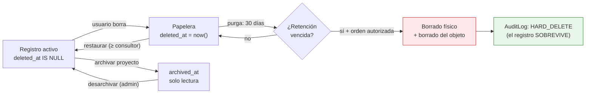
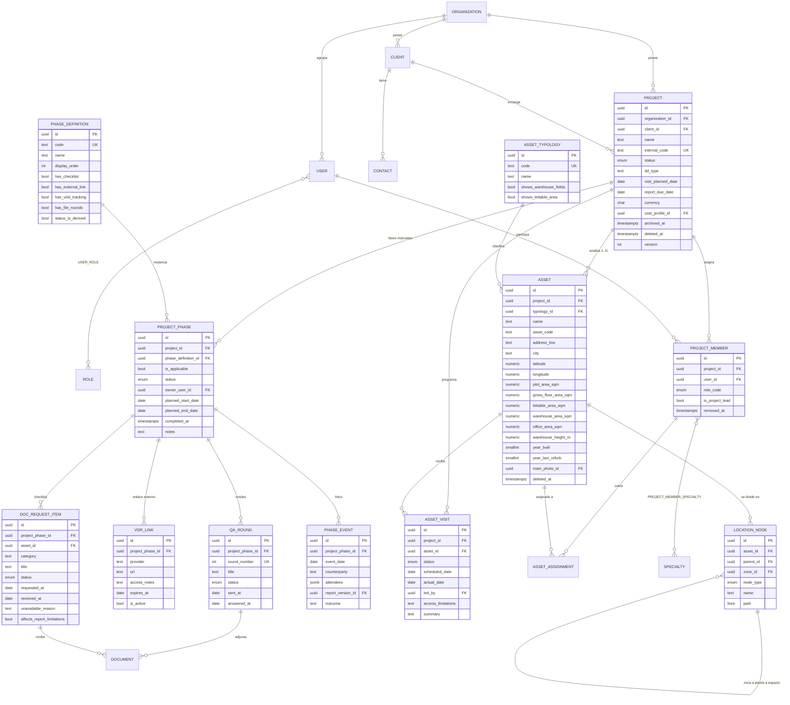
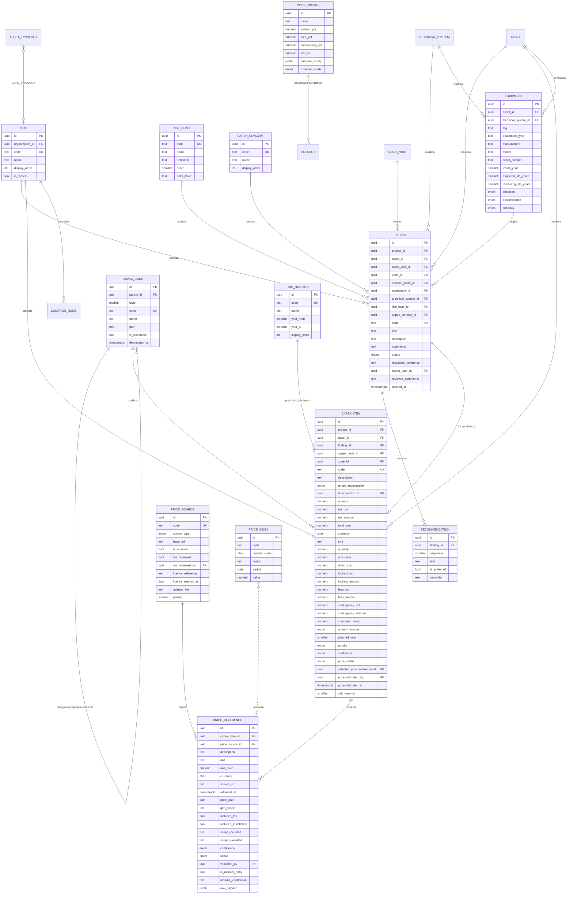
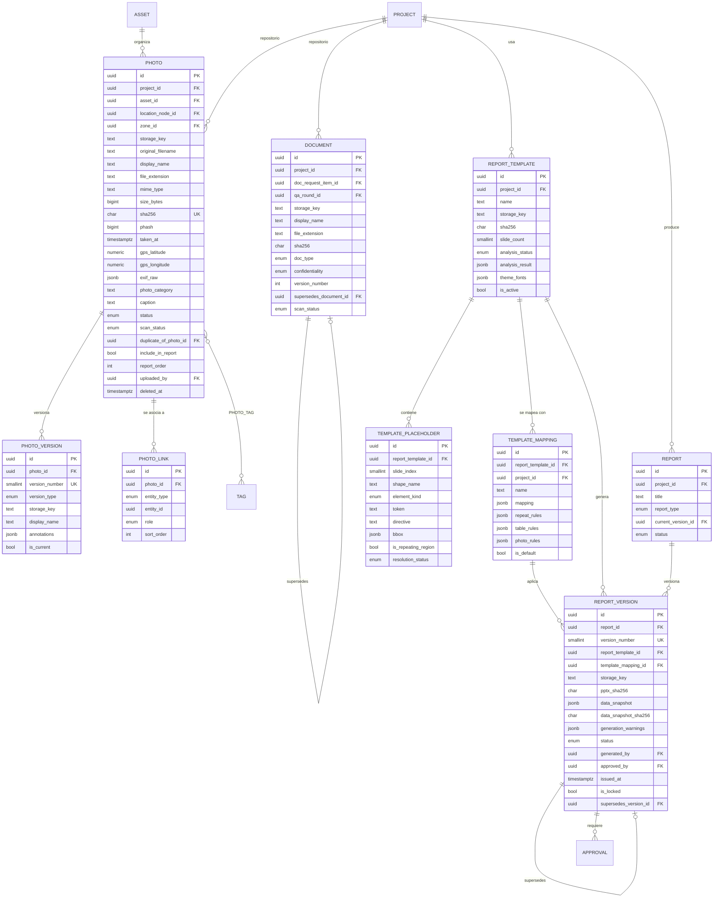
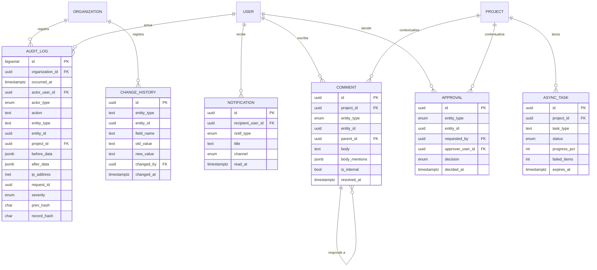

# 8. Modelo de datos · 9. Diagrama entidad-relación

Los catálogos (tipologías, zonas, árbol de códigos, riesgos, conceptos, horizontes) se detallan en
[`05-catalogos-y-taxonomias.md`](./05-catalogos-y-taxonomias.md).

---

## 8. Modelo de datos

### 8.0. Convenciones aplicadas a todas las tablas

| Aspecto | Decisión | Motivo |
|---|---|---|
| Clave primaria | `id UUID PK DEFAULT gen_random_uuid()` | No revela volumen; segura en URLs; permite generar en cliente para el modo de baja conectividad `[REC]` |
| Tenant | `organization_id UUID NOT NULL` + política RLS | Aislamiento aplicado por el motor, no por el código `[REQ]` |
| Auditoría de fila | `created_at`, `created_by`, `updated_at`, `updated_by` | Trazabilidad universal `[REQ]` |
| Revisión/aprobación | `reviewed_at/by`, `approved_at/by` en entidades revisables | `[REQ]` §3.1.4 |
| Borrado lógico | `deleted_at`, `deleted_by`, `delete_reason` | Nunca `DELETE` desde la aplicación `[REQ]` |
| Archivado | `archived_at` en `project`, distinto de `deleted_at` | Archivar ≠ borrar `[REQ]` |
| Unicidad con soft-delete | Índices únicos **parciales** `WHERE deleted_at IS NULL` | Permite reutilizar un código liberado |
| Concurrencia | `version INTEGER` (bloqueo optimista) | Necesario con autoguardado y sincronización `[REC]` |
| Importes | `NUMERIC(18,4)`; nunca `FLOAT` | Exactitud decimal obligatoria `[REQ]` |
| Moneda | `CHAR(3)` ISO 4217 | |
| Conjuntos de valores | **Tabla de catálogo** cuando el cliente debe poder ampliarlos; `ENUM` solo para conjuntos cerrados y estables (estados) | Ampliar el árbol de códigos no puede exigir una migración `[REC]` |
| Timestamps | `TIMESTAMPTZ` en UTC | |

`[REC]` Para cada tabla con borrado lógico se crea una vista `v_<tabla>` que filtra
`deleted_at IS NULL`. El código de negocio consulta la vista; solo administración y purga tocan la
tabla base. Olvidar el filtro deja de ser un error silencioso.

**Sobre el valor «–»** `[REC]`: la especificación incluye un valor `–` (guion) en casi todos los
catálogos (zonas, concepto, inquilino, riesgo, código). No se modela como una fila del catálogo sino
como **`NULL` con etiqueta de presentación «–»**. Motivo: si `–` fuera una fila, todas las
agregaciones tendrían que excluirla explícitamente y antes o después alguien olvidaría hacerlo. La
interfaz muestra «–»; la base de datos guarda ausencia de valor.

---

### 8.1. Identidad y organización

#### `organization`
`id` · `name` · `slug` (único global) · `country_code` · `default_currency` (`EUR`) ·
`default_locale` (`es-ES`) · `default_unit_system` (`METRICO`) · `timezone` · `retention_months`
(84) · `settings` JSONB (límites, configuración de mapas, feature flags) · auditoría · soft delete.

**Índices:** `UNIQUE(slug) WHERE deleted_at IS NULL`.

#### `user`
`id` · `organization_id` · `email` · `full_name` · `password_hash` (NULL si solo OIDC) ·
`mfa_secret_encrypted` BYTEA · `mfa_enabled` · `status` ENUM(`INVITADO`,`ACTIVO`,`SUSPENDIDO`,`BAJA`) ·
`job_title` · `phone` · `locale` · `timezone` · `last_login_at` · `failed_login_count` ·
`password_changed_at` · auditoría · soft delete.

**Índices:** `UNIQUE(organization_id, lower(email)) WHERE deleted_at IS NULL`;
`(organization_id, status)`.
El hash de contraseña y el secreto MFA **nunca** aparecen en un esquema de respuesta.

#### `role` · `user_role`
`role`: `id` · `organization_id` (NULL = rol del sistema) ·
`code` ENUM(`ADMIN`,`DIRECTOR_PROYECTO`,`CONSULTOR`,`TECNICO_ESPECIALISTA`,`REVISOR`,`LECTOR`) `[REQ]` ·
`name` · `description` · `permissions` JSONB · `is_system`.

`user_role(user_id, role_id)` es el rol **de organización**. El rol **por proyecto** vive en
`project_member`. El permiso efectivo es el **máximo** de ambos, calculado en el servidor.

#### `specialty` (catálogo ampliable) `[REQ]`
`id` · `organization_id` · `code` · `name` · `is_system`.
Semilla: arquitectura, estructura, instalaciones eléctricas, climatización, PCI, fontanería,
ascensores, sostenibilidad, accesibilidad, envolvente.

---

### 8.2. Cliente y proyecto

#### `client`
`id` · `organization_id` · `legal_name` · `trade_name` · `tax_id` · `address` · `city` · `province` ·
`country_code` · `postal_code` · `internal_notes` (visible solo a rol ≥ consultor) ·
`status` ENUM(`ACTIVO`,`INACTIVO`) · auditoría · soft delete.

**Índices:** `UNIQUE(organization_id, lower(legal_name)) WHERE deleted_at IS NULL`; GIN sobre
`to_tsvector('spanish', …)`.

#### `contact`
`id` · `organization_id` · `client_id` · `full_name` · `job_title` · `email` · `phone` ·
`is_primary` · `notes` · auditoría · soft delete.
**Índices:** `(client_id)`; `UNIQUE(client_id) WHERE is_primary AND deleted_at IS NULL`.

#### `project`
| Campo | Tipo | Notas |
|---|---|---|
| `id` | UUID PK | |
| `organization_id` | UUID FK | |
| `client_id` | UUID FK **NULL** | NULL solo en `BORRADOR` |
| `name` | TEXT NOT NULL | |
| `internal_code` | TEXT NOT NULL | único por organización |
| `status` | ENUM(`BORRADOR`,`EN_PREPARACION`,`VISITA_PROGRAMADA`,`VISITA_REALIZADA`,`EN_ANALISIS`,`EN_REVISION`,`INFORME_EMITIDO`,`CERRADO`,`ARCHIVADO`) | `[REQ]` |
| `dd_type` | TEXT (catálogo) | tipo de due diligence |
| `scope_of_work` | TEXT | |
| `visit_planned_date` | DATE NULL | fecha prevista a nivel de encargo |
| `report_due_date` | DATE NULL | |
| `currency` | CHAR(3) NOT NULL | |
| `cost_profile_id` | UUID FK NULL | porcentajes por defecto del CAPEX |
| `notes` | TEXT | |
| `search_vector` | TSVECTOR GENERATED | |
| `archived_at` / `archived_by` | | `[REQ]` |
| `closed_at` | TIMESTAMPTZ NULL | |
| *auditoría · soft delete · `version`* | | |

**Restricciones:**
- `UNIQUE(organization_id, internal_code) WHERE deleted_at IS NULL`
- `CHECK (status = 'BORRADOR' OR client_id IS NOT NULL)` → materializa la regla «un proyecto necesita
  cliente para salir de borrador» `[REQ]` §9
- `CHECK (report_due_date IS NULL OR visit_planned_date IS NULL OR report_due_date >= visit_planned_date)`
- La exigencia de «≥ 1 activo» no cabe en un `CHECK` de fila: se aplica en `ProjectStateMachine` **y**
  en un disparador `BEFORE UPDATE` sobre el cambio de estado. `[REC]`

**Índices:** `(organization_id, status)`, `(organization_id, client_id)`,
`(organization_id, report_due_date)`, GIN `search_vector`, `(organization_id, archived_at)`.

#### `project_member` · `project_member_specialty`
`project_member`: `id` · `organization_id` · `project_id` · `user_id` · `role_code` ·
`is_project_lead` · `assigned_at/by` · `removed_at` NULL · auditoría.
**Índices:** `UNIQUE(project_id, user_id) WHERE removed_at IS NULL`; `(user_id)`;
`UNIQUE(project_id) WHERE is_project_lead AND removed_at IS NULL`.

`project_member_specialty(project_member_id, specialty_id)` — PK compuesta. `[REQ]`

---

### 8.3. Fases del proceso `[REQ]` §3.1.5

El bloque nuevo respecto de la versión anterior de la especificación, y el que estructura la ficha de
proyecto.

#### `phase_definition` (catálogo del sistema)
`id` · `code` ENUM lógico · `name` · `display_order` · `has_checklist` · `has_external_link` ·
`has_visit_tracking` · `has_file_rounds` · `status_is_derived` · `description`.

Semilla `[REQ]`:

| Orden | `code` | Nombre | Contenido propio |
|:--:|---|---|---|
| 1 | `SOLICITUD_DOCUMENTACION` | Solicitud de documentación | Checklist |
| 2 | `VDR` | Generación del Virtual Data Room | Enlace externo |
| 3 | `VISITA` | Visita al activo | Estado y fecha por activo |
| 4 | `QA` | Q&A | Rondas de ficheros |
| 5 | `RED_FLAG_CAPEX` | Red Flag / CAPEX | **Estado derivado** |
| 6 | `FULL_REPORT` | Full Report | **Estado derivado** |
| 7 | `PRESENTACION_CLIENTE` | Presentación a cliente | Fecha, asistentes, documento |
| 8 | `DEFENSA` | Defensa frente a la otra parte | Fecha, contraparte, notas |

#### `project_phase`
La instancia de una fase en un proyecto. **Se crea solo si el usuario marca la fase al dar de alta.**

`id` · `organization_id` · `project_id` FK · `phase_definition_id` FK ·
`is_applicable` BOOLEAN NOT NULL DEFAULT true ·
`status` ENUM(`NO_APLICA`,`PENDIENTE`,`EN_CURSO`,`COMPLETADA`,`BLOQUEADA`) ·
`owner_user_id` FK NULL · `planned_start_date` · `planned_end_date` · `started_at` · `completed_at` ·
`notes` · `display_order` · auditoría · soft delete · `version`.

**Restricciones:**
- `UNIQUE(project_id, phase_definition_id)`
- `CHECK (status <> 'COMPLETADA' OR completed_at IS NOT NULL)`
- Disparador: si `phase_definition.status_is_derived`, el `status` **no es escribible** por la API;
  lo calcula `PhaseEngine`. `[REC]` Una lista de verificación que se puede marcar a mano cuando el
  trabajo no está hecho es peor que no tenerla.

**Índices:** `(project_id, display_order)`, `(organization_id, status)`, `(owner_user_id)`.

#### `doc_request_item` — fase «Solicitud de documentación»
`id` · `organization_id` · `project_phase_id` FK · `asset_id` FK NULL (puede ser por activo o global) ·
`category` TEXT (catálogo `doc_request_category`) · `title` · `description` ·
`status` ENUM(`SOLICITADA`,`RECIBIDA`,`PARCIAL`,`NO_DISPONIBLE`,`NO_APLICA`) ·
`requested_at` · `received_at` · `unavailable_reason` TEXT ·
`affects_report_limitations` BOOLEAN GENERATED (`status IN ('NO_DISPONIBLE','PARCIAL')`) ·
`display_order` · auditoría · soft delete.

Semilla de `doc_request_category` `[REQ]`: licencias urbanísticas · proyectos · contratos de
mantenimiento · legalizaciones y certificados · garantías. Ampliable por el cliente.

**Restricción:** `CHECK (status <> 'NO_DISPONIBLE' OR unavailable_reason IS NOT NULL)`.
**Índices:** `(project_phase_id, display_order)`, `(organization_id, status)`.

`[REC]` `affects_report_limitations` alimenta automáticamente el apartado de limitaciones y
salvedades del informe. Declarar qué no se ha podido revisar es una obligación profesional en una TDD,
y hoy suele hacerse de memoria.

#### `vdr_link` — fase «Virtual Data Room»
`id` · `organization_id` · `project_phase_id` FK · `provider` TEXT · `url` TEXT NOT NULL `[REQ]` ·
`access_notes` TEXT · `granted_at` · `expires_at` · `is_active` · auditoría · soft delete.

`[REC]` **No se almacenan credenciales de acceso al VDR.** Guardar contraseñas de un repositorio de
terceros dentro de la aplicación multiplicaría la superficie de riesgo sin aportar valor: el enlace y
la nota de a quién pedir acceso bastan. `[SUP]` S-12: no se replica el contenido del VDR.

**Índices:** `(project_phase_id)`; `UNIQUE(project_phase_id) WHERE is_active AND deleted_at IS NULL`.

#### `asset_visit` — fase «Visita al activo»
`id` · `organization_id` · `project_id` · `asset_id` FK ·
`status` ENUM(`PENDIENTE_DEFINIR`,`AGENDADO`,`VISITADO`) `[REQ]` ·
`scheduled_date` DATE NULL · `actual_date` DATE NULL · `started_at` · `ended_at` ·
`led_by` FK NULL · `attendees` JSONB · `weather_conditions` TEXT ·
`access_limitations` TEXT · `summary` TEXT · auditoría · soft delete.

**Restricciones:** `CHECK (status <> 'AGENDADO' OR scheduled_date IS NOT NULL)`;
`CHECK (status <> 'VISITADO' OR actual_date IS NOT NULL)`.
**Índices:** `(project_id, status)`, `(asset_id, actual_date)`.

`[SUP]` S-11 / P-10: la visita se registra **por activo** y puede haber varias por activo. El estado
de la fase `VISITA` del proyecto se deriva: `COMPLETADA` cuando todas las visitas aplicables están en
`VISITADO`.

`[REC]` `access_limitations` es un campo que en TDD vale oro: siempre hay zonas no accesibles y hay
que declararlo en el informe.

#### `qa_round` · `qa_document` — fase «Q&A»
`qa_round`: `id` · `organization_id` · `project_phase_id` · `round_number` · `title` · `sent_at` ·
`answered_at` · `status` ENUM(`ABIERTA`,`ENVIADA`,`RESPONDIDA`,`CERRADA`) · `notes` · auditoría.
`qa_document`: enlaza `qa_round` con `document` (el XLSX) y su versión. `[REQ]` §3.1.5

**Índices:** `UNIQUE(project_phase_id, round_number)`.
`[SUP]` S-13 / P-12: repositorio de ficheros versionados, no gestor estructurado de preguntas.

#### `phase_event` `[REC]`
Fases «Presentación a cliente» y «Defensa», y cualquier hito con fecha:
`id` · `organization_id` · `project_phase_id` · `event_date` · `counterparty` TEXT ·
`attendees` JSONB · `report_version_id` FK NULL · `outcome` TEXT · `notes` · auditoría.

---

### 8.4. Activos, ubicaciones y catálogos geométricos

#### `asset`
Unión de §3.1.3 y §3.3.1 (ver P-02).

| Campo | Tipo | Notas |
|---|---|---|
| `id` · `organization_id` · `project_id` | UUID | |
| `name` | TEXT NOT NULL | |
| `asset_code` | TEXT NULL | identificador del cliente |
| `typology_id` | UUID FK → `asset_typology` NOT NULL | **determina las zonas disponibles** `[REQ]` |
| `main_use` | TEXT | |
| `address_line` · `city` · `province` · `country_code` · `postal_code` | | |
| `latitude` · `longitude` | NUMERIC(9,6) NULL | `CHECK` de rango |
| `geocode_source` · `geocoded_at` | | procedencia de las coordenadas `[REC]` |
| `plot_area_sqm` | NUMERIC(12,2) NULL | superficie de parcela `[REQ]` §3.3.1 |
| `gross_floor_area_sqm` | NUMERIC(12,2) NULL | superficie total del edificio |
| `lettable_area_sqm` | NUMERIC(12,2) NULL | superficie alquilable |
| `warehouse_area_sqm` | NUMERIC(12,2) NULL | superficie de almacén `[REQ]` §3.3.1 |
| `office_area_sqm` | NUMERIC(12,2) NULL | superficie de oficinas `[REQ]` §3.3.1 |
| `warehouse_height_m` | NUMERIC(6,2) NULL | altura de almacén `[REQ]` §3.3.1 |
| `year_built` · `year_last_refurb` | SMALLINT NULL | `CHECK (refurb >= built)` |
| `floors_above` · `floors_below` | SMALLINT NULL | `[REC]` desglosado: en TDD importa el sótano |
| `description` · `notes` | TEXT | |
| `main_photo_id` | UUID FK NULL | imagen principal |
| `search_vector` | TSVECTOR GENERATED | |
| *auditoría · soft delete · `version`* | | |

**Restricciones:** `CHECK (warehouse_area_sqm IS NULL OR gross_floor_area_sqm IS NULL OR warehouse_area_sqm <= gross_floor_area_sqm)` `[REC]`.
**Índices:** `(project_id)`, `(organization_id, city)`, `(organization_id, typology_id)`,
GIN `search_vector`.

`[REC]` Los campos de superficie y altura de almacén **se muestran según tipología**. El modelo los
guarda siempre (son nulos si no aplican); la interfaz decide qué enseñar. Así, reclasificar un activo
no destruye datos ya introducidos.

#### `asset_assignment`
`id` · `organization_id` · `asset_id` · `project_member_id` · `specialty_id` NULL · `assigned_at/by`.
**Índices:** `UNIQUE(asset_id, project_member_id, specialty_id)`. Permite que una persona esté en
varios activos y que un activo tenga varios técnicos por especialidad. `[REQ]`

#### `location_node` `[REC]` — jerarquía física fina
Para asociar fotografías a zona, planta y espacio (§3.2) hace falta un árbol; tres tablas rígidas
envejecen mal.

`id` · `organization_id` · `asset_id` · `parent_id` NULL ·
`node_type` ENUM(`ZONA`,`PLANTA`,`ESPACIO`) · `zone_id` FK → `zone` NULL · `code` · `name` ·
`level_order` · `path` LTREE · auditoría · soft delete.

**Índices:** `(asset_id, node_type)`, GiST sobre `path`,
`UNIQUE(asset_id, parent_id, lower(name)) WHERE deleted_at IS NULL`.

> **Distinción importante** `[REC]`: `zone` (catálogo, §3.3.2) y `location_node` (árbol físico del
> edificio) son cosas distintas y ambas necesarias. `zone` es la **clasificación normalizada** que
> exige el CAPEX («Cubierta», «Cuadros técnicos»), común a todos los proyectos y dependiente de la
> tipología. `location_node` es la **ubicación concreta** de este edificio («Cubierta / Sala de
> máquinas 2»). Una línea de CAPEX usa `zone`; una fotografía puede usar ambas. Fundirlas obligaría a
> elegir entre poder agregar por zona en el informe o poder localizar una foto en el edificio.

---

### 8.5. Catálogos del CAPEX

Contenido completo en [`05-catalogos-y-taxonomias.md`](./05-catalogos-y-taxonomias.md). Estructura:

#### `asset_typology`
`id` · `organization_id` NULL (NULL = sistema) · `code` · `name` · `display_order` · `is_system` ·
`shows_warehouse_fields` BOOLEAN · `shows_lettable_area` BOOLEAN.
**Índices:** `UNIQUE(COALESCE(organization_id,'0'::uuid), code)`.

#### `zone` y `zone_typology`
`zone`: `id` · `organization_id` NULL · `code` · `name` · `display_order` · `is_system`.
`zone_typology(zone_id, typology_id)` — **tabla puente**: qué zonas están disponibles para qué
tipología. `[REQ]` §3.3.2

`[REC]` Se modela como N:M y no como una columna `typology_id` en `zone`, porque «Cubierta» aparece en
las seis tipologías: duplicar la fila seis veces produciría seis identificadores distintos para la
misma zona y rompería cualquier comparación entre activos de una cartera.

#### `capex_code` — árbol de 3 niveles `[REQ]` §3.3.4
`id` · `organization_id` NULL · `parent_id` FK NULL · `level` SMALLINT (1 categoría, 2 capítulo,
3 elemento) · `code` (`H01`, `H01.03`…) · `name` · `path` LTREE · `display_order` · `is_system` ·
`is_selectable` BOOLEAN (solo el nivel 3 y los «General» son seleccionables) · `deprecated_at` NULL.

**Restricciones:** `CHECK (level BETWEEN 1 AND 3)`;
`CHECK ((level = 1 AND parent_id IS NULL) OR (level > 1 AND parent_id IS NOT NULL))`;
`UNIQUE(COALESCE(organization_id,'0'::uuid), code) WHERE deleted_at IS NULL`.
**Índices:** GiST sobre `path`, `(parent_id, display_order)`, `(level, is_selectable)`.

`[REC]` `deprecated_at` en lugar de borrado: un código retirado debe seguir resolviéndose en informes
antiguos, pero no debe ofrecerse al crear líneas nuevas.

#### `risk_level` `[REQ]` §3.3.4
`id` · `code` (`01`…`04`) · `score` SMALLINT · `color_token` · `display_order` · `is_system`.
El **nombre y la definición viven en la tabla de traducción** (ver más abajo): las plantillas reales
demuestran que ambos se emiten en el informe y están traducidos al inglés.

`[REC]` La definición íntegra se guarda en base de datos, no en el código del frontend, para poder
mostrarla como ayuda al elegir el grado **y** volcarla al informe. Las cuatro definiciones de §3.3.4
son un criterio profesional, no una etiqueta: si no están a la vista al clasificar, cada consultor
usará el suyo.

#### `<catalogo>_i18n` — traducción de catálogos `[REC]` (hallazgo C-5)

Las plantillas reales incluyen versión española e inglesa, y traducen **todo** lo que procede de
catálogos: nombres de capítulo (`CIMENTACIÓN` → `FOUNDATION`), de zona, y **las definiciones íntegras
de los cuatro grados de riesgo**. Guardar `name` en una sola columna no sirve.

Una tabla de traducción por catálogo, todas con la misma forma:

`<catalogo>_i18n`: `id` · `<catalogo>_id` FK · `locale` (`es-ES`, `en-GB`) · `name` ·
`definition` TEXT NULL (solo `risk_level`) · `short_name` NULL (para marcos estrechos) · auditoría.

**Índices:** `UNIQUE(<catalogo>_id, locale)`.

Aplica a: `asset_typology`, `zone`, `capex_code`, `risk_level`, `capex_concept`, `time_horizon`,
`technical_system`, `specialty`, `phase_definition`, `doc_request_category`.

**Resolución del idioma** `[REC]`: idioma del informe → idioma por defecto de la organización →
`es-ES`. Si falta una traducción, se devuelve el texto del idioma de reserva **con un aviso**, nunca
una cadena vacía.

> **El idioma es del informe, no del usuario.** Un consultor español genera informes en inglés para un
> fondo internacional sin cambiar el idioma de su interfaz. Por eso `report_version` guarda
> `output_locale`, y por eso **`data_snapshot` congela los textos ya resueltos en ese idioma**: si
> mañana alguien corrige la traducción de un capítulo, el informe emitido no puede cambiar. `[REQ]` §9

#### `capex_concept` · `time_horizon` · `tenant_recoverable`
`capex_concept`: `id` · `organization_id` NULL · `code` · `name` · `display_order` · `is_system`.
Semilla `[REQ]` §3.3.3: mantenimiento, reparación, normativa, mejora, seguridad, vida útil, otro,
soft cost, medioambiental, ESG.

`time_horizon`: `id` · `code` · `name` · `year_from` · `year_to` NULL · `is_amount_bucket` BOOLEAN ·
`display_order`. Semilla `[REQ]` §3.3.4: corto (1-2), medio (3-5), largo (6-10), mejoras, otro.

`tenant_recoverable` se modela como ENUM(`SI`,`NO`,`NA`) con `NULL` para «–». `[REQ]` §3.3.3

---

### 8.6. Diagnóstico y CAPEX

#### `finding` — el diagnóstico
| Campo | Tipo | Notas |
|---|---|---|
| `id` · `organization_id` · `project_id` · `asset_id` | UUID | |
| `code` | TEXT | correlativo legible, `HAL-0042` |
| `asset_visit_id` | UUID FK NULL | visita en que se detectó |
| `zone_id` | UUID FK NULL | **validado contra la tipología del activo** `[REQ]` |
| `location_node_id` | UUID FK NULL | ubicación física concreta |
| `equipment_id` | UUID FK NULL | equipo relacionado (opcional) |
| `technical_system_id` | UUID FK NULL | sistema técnico |
| `title` | TEXT NOT NULL | |
| `description` | TEXT | `[REQ]` §3.3.4 |
| `comments` | TEXT | `[REQ]` §3.3.4 |
| `risk_level_id` | UUID FK NULL | 01-04 o «–» `[REQ]` |
| `capex_concept_id` | UUID FK NULL | `[REQ]` §3.3.3 |
| `status` | ENUM(`IDENTIFICADO`,`PENDIENTE_VALIDACION`,`VALIDADO`,`PRESUPUESTADO`,`APROBADO`,`DESCARTADO`) | |
| `regulatory_reference` | TEXT NULL | `[REC]` normativa incumplida |
| `owner_user_id` | UUID FK NULL | |
| `reviewer_comments` | TEXT | |
| `discard_reason` | TEXT NULL | |
| `search_vector` | TSVECTOR GENERATED | |
| *auditoría · revisión · soft delete · `version`* | | |

**Restricciones:**
- `UNIQUE(project_id, code) WHERE deleted_at IS NULL`
- `CHECK (status <> 'DESCARTADO' OR discard_reason IS NOT NULL)`
- **Disparador de coherencia** `[REC]`: `zone_id` debe pertenecer a una zona habilitada para la
  tipología del activo (`zone_typology`). Si se reclasifica el activo y alguna zona deja de ser
  válida, no se borra el dato: se marca la línea para revisión y se avisa. Borrar en silencio el
  trabajo de un consultor porque alguien cambió un desplegable es inaceptable.

**Índices:** `(project_id, status)`, `(asset_id, zone_id)`, `(project_id, risk_level_id)`,
GIN `search_vector`.

#### `recommendation` `[REQ]` §7
`id` · `organization_id` · `finding_id` · `sequence` · `text` · `is_preferred` · `rationale` ·
auditoría · soft delete.
**Índices:** `(finding_id, sequence)`; `UNIQUE(finding_id) WHERE is_preferred AND deleted_at IS NULL`.

`[REC]` Separada de `finding` porque un hallazgo admite alternativas (reparar frente a sustituir) con
costes distintos, y el informe debe poder mostrar la elegida.

#### `capex_item` — el dinero
| Campo | Tipo | Notas |
|---|---|---|
| `id` · `organization_id` · `project_id` · `asset_id` | UUID | |
| `code` | TEXT | correlativo `CX-0117` |
| `finding_id` | UUID FK NULL | 1:1 por defecto; NULL en mejoras sin hallazgo |
| `capex_code_id` | UUID FK NOT NULL | hoja del árbol `[REQ]` |
| `zone_id` | UUID FK NULL | heredada del hallazgo |
| `description` | TEXT NOT NULL | |
| `tenant_recoverable` | ENUM(`SI`,`NO`,`NA`) NULL | `[REQ]` §3.3.3 |
| **`time_horizon_id`** | UUID FK → `time_horizon` **NOT NULL** | **Un solo horizonte por línea** `[REQ]` P-05 |
| **`amount`** | NUMERIC(18,4) NOT NULL DEFAULT 0 | Importe estimado de la actuación, **base imponible** |
| `tax_pct` | NUMERIC(7,4) NOT NULL | copiado del perfil, editable por línea `[REQ]` |
| `tax_amount` | NUMERIC(18,4) GENERATED | `amount × tax_pct` |
| **`total_cost`** | NUMERIC(18,4) GENERATED | `amount + tax_amount` |
| `currency` | CHAR(3) NOT NULL | |
| *Desglose por medición (opcional)* | | `[SUP]` S-10 |
| `unit` · `quantity` · `unit_price` | TEXT · NUMERIC | |
| `direct_cost` | NUMERIC(18,4) NULL | cantidad × precio |
| `indirect_pct` · `overhead_pct` · `profit_pct` · `fees_pct` · `contingency_pct` | NUMERIC(7,4) NULL | copiados del perfil, **editables por línea** `[REQ]` |
| `indirect_amount` · `overhead_amount` · `profit_amount` · `fees_amount` · `contingency_amount` | NUMERIC(18,4) NULL | cada peldaño persistido y visible `[REQ]` |
| `computed_base` | NUMERIC(18,4) NULL | base imponible que resulta de la cascada |
| `amount_source` | ENUM(`MANUAL`,`MEDICION`) NOT NULL DEFAULT `MANUAL` | de dónde salió `amount` `[REC]` |
| *Precio y escenarios* | | |
| `scenario_low_factor` · `scenario_high_factor` | NUMERIC(7,4) | `[REQ]` |
| `planned_year` | SMALLINT NULL | |
| `priority` | ENUM(`BAJA`,`MEDIA`,`ALTA`,`URGENTE`) | |
| `confidence` | ENUM(`BAJA`,`MEDIA`,`ALTA`) | `[REQ]` |
| `price_status` | ENUM(`SIN_PRECIO`,`PENDIENTE_VALIDACION`,`VALIDADO`,`RECHAZADO`) | `[REQ]` |
| `selected_price_reference_id` | UUID FK NULL | |
| `price_validated_by` · `price_validated_at` | | `[REQ]` |
| `calc_version` | SMALLINT | versión del algoritmo `[REC]` |
| `notes` | TEXT | |
| *auditoría · revisión · soft delete · `version`* | | |

**Restricciones clave** (`[REQ]` §9):
- `UNIQUE(project_id, code) WHERE deleted_at IS NULL`
- `CHECK (price_status <> 'VALIDADO' OR (price_validated_by IS NOT NULL AND price_validated_at IS NOT NULL))`
  → **imposible marcar un precio como validado sin un humano identificado**
- `CHECK (price_status = 'SIN_PRECIO' OR selected_price_reference_id IS NOT NULL)`
  → **toda línea con precio conserva la trazabilidad de su origen**, incluida la entrada manual
- `CHECK (amount >= 0)`
- `CHECK (quantity IS NULL OR quantity >= 0)`, `CHECK (unit_price IS NULL OR unit_price >= 0)`
- `CHECK (capex_code_id` referencia un código con `is_selectable = true` y `deprecated_at IS NULL)` —
  vía disparador

**Recálculo** `[REQ]` §9: disparador `BEFORE INSERT OR UPDATE` que recalcula la cascada y
`computed_base` cuando cambian cantidad, precio o porcentajes; `tax_amount` y `total_cost` son
columnas generadas. Se implementa **además** en `CapexEngine` (Python), y una prueba verifica que
ambas coinciden al céntimo. `[REC]`

**Índices:** `(project_id, asset_id)`, `(project_id, capex_code_id)`, `(project_id, zone_id)`,
**`(project_id, time_horizon_id)`**, `(project_id, price_status)`, `(project_id, planned_year)`,
`(finding_id)`.

> **Sobre el horizonte único** — **P-05 · DECIDIDO**: cada línea pertenece a **un solo horizonte**
> (`time_horizon_id` obligatorio) y lleva **un solo importe** (`amount`). Una actuación se aplica a
> corto, medio o largo plazo, o es una mejora potencial que decide el cliente, o es otro tipo de
> petición: son alternativas mutuamente excluyentes, no columnas independientes.
>
> La tabla de CAPEX puede seguir mostrándose con cinco columnas —es como se lee mejor—, pero eso es
> **presentación**: la rejilla pivota el horizonte de cada línea a su columna y el resto muestra «—».
> Con un solo campo es **imposible que una línea quede repartida por error entre dos plazos**, y la
> suma por horizonte es un `GROUP BY`, no cinco sumas independientes que podrían descuadrar.

> **Sobre qué representa `amount`** — **P-05b · DECIDIDO**: es la **base imponible final** de la
> línea. El importe que teclea el consultor **ya incluye** todo lo que él estime: indirectos,
> honorarios, gastos generales, beneficio industrial y contingencia. Los impuestos van **encima**,
> calculados desde el perfil, de forma uniforme haya o no desglose por medición. Es lo que hace que
> «impuestos configurables y separados del coste base» `[REQ]` se cumpla igual en toda la tabla.
>
> **Consecuencia sobre los porcentajes del perfil de costes** `[REC]`: de los seis, **solo `tax_pct`
> se aplica a todas las líneas**. Los otros cinco (`indirect_pct`, `overhead_pct`, `profit_pct`,
> `fees_pct`, `contingency_pct`) se usan **exclusivamente dentro del desglose por medición**, y por eso
> son anulables: una línea sin medición no los tiene. El perfil de costes es, en la práctica, un
> impuesto aplicable a todo más una **preconfiguración de la calculadora**.
>
> Cuando existe desglose, la cascada calcula `computed_base` y el usuario lo **traslada** a `amount`
> con un botón explícito, quedando `amount_source = MEDICION`. **La cascada nunca se aplica
> automáticamente sobre un importe tecleado a mano**: hacerlo duplicaría porcentajes que el consultor
> ya había incluido.

#### `equipment` — inventario opcional `[REQ]` §7 / P-15
`id` · `organization_id` · `project_id` · `asset_id` · `technical_system_id` · `zone_id` NULL ·
`location_node_id` NULL · `tag` · `equipment_type` · `manufacturer` · `model` · `serial_number` ·
`install_year` · `expected_life_years` · `remaining_life_years` GENERATED ·
`condition` ENUM · `obsolescence` ENUM · `criticality` ENUM · `quantity` · `unit` ·
`has_documentation` · `notes` · `search_vector` · auditoría · soft delete.

**Índices:** `(project_id, asset_id)`, `UNIQUE(asset_id, tag) WHERE tag IS NOT NULL AND deleted_at IS NULL`.

`[REC]` La especificación revisada ya no detalla los campos del inventario, pero §7 mantiene la
entidad. Se conserva como **ficha opcional** enlazable desde el hallazgo: quien la quiera, la usa;
quien no, no la ve. La vida residual se calcula, no se teclea (P-15).

---

### 8.7. Precios

#### `cost_profile` `[REC]`
`id` · `organization_id` · `name` · `tax_pct` · `tax_label` · `indirect_pct` · `overhead_pct` ·
`profit_pct` · `fees_pct` · `contingency_pct` · `cascade_config` JSONB · `rounding_mode` ENUM ·
`rounding_decimals` · `is_default` · auditoría · soft delete.
Todos los `*_pct` con `CHECK (0 <= v <= 100)`.

**Dos grupos de campos con alcance distinto** `[REC]` (P-05b):

| Campo | Se aplica a | Alcance |
|---|---|---|
| `tax_pct`, `tax_label` | **Todas** las líneas del proyecto | Impuesto sobre `amount` |
| `indirect_pct` · `overhead_pct` · `profit_pct` · `fees_pct` · `contingency_pct` | **Solo** al desglose por medición | Valores por defecto de la calculadora, editables por línea |

Separarlos evita el malentendido más caro posible en este bloque: creer que cambiar el porcentaje de
contingencia del perfil recalcula los 63 importes del proyecto. No lo hace, y no debe hacerlo: esos
importes ya llevan dentro la contingencia que decidió el consultor.

#### `price_source`
`id` · `organization_id` NULL · `code` · `name` ·
`source_type` ENUM(`MANUAL`,`CATALOGO_INTERNO`,`API_OFICIAL`,`BASE_PRECIOS_LICENCIADA`,`CATALOGO_FABRICANTE`) ·
`base_url` · `is_enabled` BOOLEAN **DEFAULT false** ·
`tos_reviewed` BOOLEAN NOT NULL DEFAULT false · `tos_reviewed_by` · `tos_reviewed_at` · `tos_url` ·
`tos_notes` · `license_reference` TEXT · `license_expires_at` DATE NULL ·
`robots_allows_use` BOOLEAN NULL · `rate_limit_per_min` · `adapter_key` · `priority` · auditoría.

**Restricción decisiva** `[REQ]`:
`CHECK (is_enabled = false OR (tos_reviewed = true AND tos_reviewed_by IS NOT NULL))`
→ **una fuente no puede activarse sin revisión documentada de sus condiciones de uso.** La
obligación legal queda grabada en el esquema, no en un comentario.

`[REC]` `license_reference` y `license_expires_at` se añaden pensando en Precio Centro (P-06): es una
base **licenciada**, y una licencia caducada debe deshabilitar la fuente automáticamente.

#### `price_reference`
`id` · `organization_id` · `capex_item_id` NULL · `price_source_id` · `description` · `unit` ·
`unit_price` · `currency` · `source_url` `[REQ]` · `retrieved_at` `[REQ]` · `price_date` ·
`geo_scope` `[REQ]` · `country_code` · `includes_tax` BOOLEAN NULL `[REQ]` ·
`includes_installation` BOOLEAN NULL `[REQ]` · `scope_included` `[REQ]` · `scope_excluded` `[REQ]` ·
`confidence` ENUM `[REQ]` · `status` ENUM(`RECUPERADA`,`PENDIENTE_VALIDACION`,`VALIDADA`,`DESCARTADA`) ·
`validated_by` · `validated_at` · `normalized_unit` · `normalization_factor` ·
`normalization_notes` TEXT · `raw_payload` JSONB · `is_manual_entry` · `manual_justification` ·
auditoría · soft delete.

**Restricciones:** `CHECK (is_manual_entry = false OR manual_justification IS NOT NULL)`;
`CHECK (status <> 'VALIDADA' OR validated_by IS NOT NULL)`.

`[REC]` `includes_tax` e `includes_installation` son **anulables a propósito**: `NULL` significa «la
fuente no lo declara», que es distinto de «no los incluye». Asumir `false` introduciría un error del
21 % en el informe de un cliente.

#### `price_index` `[REQ]`
`id` · `organization_id` NULL · `code` · `name` · `country_code` · `region` · `period` DATE ·
`value` NUMERIC(12,4) · `source_url` · `retrieved_at` · `notes`.
**Índices:** `UNIQUE(code, country_code, region, period)`.

---

### 8.8. Evidencia

#### `photo`
`id` · `organization_id` · `project_id` NOT NULL `[REQ]` · `asset_id` **NULL** (preferible, no
obligatorio `[REQ]`) · `location_node_id` · `zone_id` · `technical_system_id` · `equipment_id` ·
`storage_key` **inmutable** · `original_filename` **inmutable** · `display_name` (editable,
**sin extensión**) · `file_extension` (derivada del MIME real, no editable) `[REQ]` · `mime_type` ·
`size_bytes` · `sha256` **inmutable** `[REQ]` · `phash` · `width_px` · `height_px` ·
`taken_at` · `gps_latitude` · `gps_longitude` · `gps_altitude` · `exif_raw` JSONB `[REQ]` ·
`camera_make` · `camera_model` · `orientation` · `photo_category` · `caption` · `description` ·
`status` ENUM(`SUBIENDO`,`PROCESANDO`,`LISTA`,`CUARENTENA`,`ERROR`) ·
`scan_status` ENUM · `duplicate_of_photo_id` NULL · `include_in_report` · `report_order` ·
`report_section` · `current_version_id` · `uploaded_by` · `uploaded_at` · `search_vector` ·
auditoría · soft delete (papelera) · `version`.

**Invariante** `[REQ]`: `storage_key`, `original_filename`, `sha256` y `size_bytes` son inmutables.
Un disparador `BEFORE UPDATE` lanza excepción si se intenta modificarlos.

**Índices:** `(project_id, asset_id)`, `UNIQUE(project_id, sha256) WHERE deleted_at IS NULL`,
`(project_id, include_in_report, report_order)`, `(phash)`, GIN `search_vector`, GIN `exif_raw`.

#### `photo_version`
`id` · `organization_id` · `photo_id` · `version_number` ·
`version_type` ENUM(`ORIGINAL`,`RENOMBRADA`,`ANOTADA`,`EDITADA`,`EXPORTADA_SIN_METADATOS`) ·
`storage_key` **NULL** cuando la versión solo cambia metadatos (renombrado: **no se duplica el
binario** `[REC]`) · `display_name` · `annotations` JSONB (capa vectorial) · `sha256` · `notes` ·
`is_current` · `created_at/by`.
**Índices:** `UNIQUE(photo_id, version_number)`; `UNIQUE(photo_id) WHERE is_current`.
La versión 1 es siempre `ORIGINAL` y no se puede borrar ni modificar.

#### `photo_link` `[REC]`
La especificación exige asociar una foto a diez tipos de entidad, y con multiplicidad. Diez columnas
anulables no sirven.
`id` · `organization_id` · `photo_id` ·
`entity_type` ENUM(`ASSET`,`LOCATION_NODE`,`ZONE`,`TECHNICAL_SYSTEM`,`EQUIPMENT`,`FINDING`,`CAPEX_ITEM`,`REPORT_SECTION`,`ASSET_VISIT`,`DOC_REQUEST_ITEM`) ·
`entity_id` · `role` ENUM(`EVIDENCIA`,`GENERAL`,`DETALLE`,`ANTES`,`DESPUES`) · `sort_order` ·
`created_at/by`.
**Índices:** `UNIQUE(photo_id, entity_type, entity_id)`, `(entity_type, entity_id, sort_order)`.
`[LIM]` Al ser polimórfica no lleva FK real; la integridad se verifica en la aplicación y con un
trabajo nocturno de detección de huérfanos. Compromiso aceptado a cambio de la flexibilidad exigida.

#### `tag` · `photo_tag` · `document`
`document`: `id` · `organization_id` · `project_id` · `asset_id` NULL · `doc_request_item_id` NULL ·
`qa_round_id` NULL · `storage_key` inmutable · `original_filename` · `display_name` ·
`file_extension` · `mime_type` · `size_bytes` · `sha256` ·
`doc_type` ENUM(`LICENCIA_URBANISTICA`,`PROYECTO`,`CONTRATO_MANTENIMIENTO`,`LEGALIZACION`,`CERTIFICADO`,`GARANTIA`,`PLANO`,`QA`,`INFORME_PREVIO`,`FICHA_TECNICA`,`OTRO`) ·
`confidentiality` ENUM(`INTERNO`,`CONFIDENCIAL`,`RESTRINGIDO`) · `version_number` ·
`supersedes_document_id` NULL · `scan_status` · `uploaded_by/at` · auditoría · soft delete.
**Índices:** `(project_id, doc_type)`, `(doc_request_item_id)`, `(qa_round_id, version_number)`,
`UNIQUE(project_id, sha256) WHERE deleted_at IS NULL`.

`[REC]` `doc_type` se alinea deliberadamente con las categorías de la fase de solicitud de
documentación: así, adjuntar un documento a una línea del checklist lo clasifica solo.

---

### 8.9. Informe

#### `report_template`
`id` · `organization_id` · `project_id` NULL (NULL = plantilla de organización) · `name` ·
`storage_key` **inmutable** · `original_filename` · `sha256` · `size_bytes` · `slide_count` ·
`layout_count` · `analysis_status` ENUM · `analysis_result` JSONB · `analysis_warnings` JSONB ·
`analyzed_at` · `theme_fonts` JSONB · `theme_colors` JSONB · `slide_size` JSONB · `is_active` ·
auditoría · soft delete.
**Restricción:** disparador que impide modificar `storage_key` y `sha256`. `[REQ]`

#### `template_placeholder`
`id` · `organization_id` · `report_template_id` · `slide_index` · `shape_id` · `shape_name` ·
`element_kind` ENUM(`TEXTO`,`TITULO`,`TABLA`,`IMAGEN`,`GRAFICO`,`PLACEHOLDER_LAYOUT`,`NOTAS`) ·
`token` · `directive` · `detected_text` · `bbox` JSONB · `table_dims` JSONB ·
`is_repeating_region` · `resolution_status` ENUM(`AUTO_RESUELTO`,`REQUIERE_MAPEO`,`MAPEADO`,`IGNORADO`).

`[REQ]` Los marcadores en `REQUIERE_MAPEO` **bloquean la generación**. No se adivina.

#### `template_mapping`
`id` · `organization_id` · `report_template_id` · `project_id` NULL · `name` · `mapping` JSONB ·
`repeat_rules` JSONB · `table_rules` JSONB · `photo_rules` JSONB · `is_default` · `version` ·
auditoría · soft delete.

#### `report` · `report_version`
`report`: `id` · `organization_id` · `project_id` · `title` ·
`report_type` ENUM(`RED_FLAG`,`PRELIMINAR`,`BORRADOR_CLIENTE`,`FULL_REPORT`) ·
`current_version_id` · `status` ENUM · auditoría · soft delete.

`[REC]` `report_type` incluye `RED_FLAG` y `FULL_REPORT` porque las fases de §3.1.5 los distinguen:
son dos entregables distintos del mismo encargo, y el Red Flag suele emitirse antes.

`report_version`: `id` · `organization_id` · `report_id` · `version_number` · `report_template_id` ·
`template_mapping_id` · **`output_locale`** (idioma del informe, C-5) · `storage_key` ·
`pptx_sha256` `[REQ]` · `size_bytes` · `slide_count` ·
`data_snapshot` JSONB NOT NULL `[REQ]` · `data_snapshot_sha256` · `generation_warnings` JSONB ·
`preview_storage_key` · `status` ENUM(`BORRADOR`,`GENERADO`,`EN_REVISION`,`APROBADO`,`EMITIDO`) ·
`generated_by/at` · `approved_by/at` · `issued_by/at` · `is_locked` · `supersedes_version_id`.

**Restricciones** `[REQ]` §9:
- `UNIQUE(report_id, version_number)`
- `CHECK (status <> 'EMITIDO' OR (is_locked = true AND issued_at IS NOT NULL))`
- `CHECK (status NOT IN ('APROBADO','EMITIDO') OR approved_by IS NOT NULL)`
- Disparador `BEFORE UPDATE`: **si `is_locked`, toda modificación se rechaza.** Un informe emitido es
  inmutable a nivel de base de datos, no solo de aplicación.

---

### 8.10. Colaboración y auditoría

#### `comment` · `notification` · `approval`
`comment`: `id` · `organization_id` · `project_id` · `entity_type` · `entity_id` · `parent_id` ·
`body` · `body_mentions` JSONB · `is_internal` · `resolved_at/by` · auditoría · soft delete.

`notification`: `id` · `organization_id` · `recipient_user_id` · `notif_type` ENUM · `title` ·
`body` · `entity_type` · `entity_id` · `read_at` · `channel` · `sent_at` · `created_at`.

`approval`: `id` · `organization_id` · `project_id` ·
`entity_type` ENUM(`REPORT_VERSION`,`CAPEX_ITEM`,`FINDING`,`PROJECT_PHASE`,`PROJECT`) · `entity_id` ·
`requested_by/at` · `approver_user_id` · `decision` ENUM · `decided_at` · `comments` ·
`decision_level`.

#### `audit_log` — append-only `[REQ]`
`id` BIGSERIAL · `organization_id` · `occurred_at` · `actor_user_id` NULL ·
`actor_type` ENUM(`USUARIO`,`SISTEMA`,`API_KEY`) · `action` TEXT · `entity_type` · `entity_id` ·
`project_id` NULL · `before_data` JSONB · `after_data` JSONB (**con datos sensibles redactados**) ·
`ip_address` INET · `user_agent` · `request_id` · `severity` ENUM(`INFO`,`AVISO`,`CRITICO`) ·
`prev_hash` · `record_hash` `[REC]`.

**Sin `UPDATE` ni `DELETE`:** se revocan ambos privilegios al usuario de aplicación.
**Particionado** por mes. **Índices:** `(organization_id, occurred_at DESC)`,
`(entity_type, entity_id)`, `(actor_user_id, occurred_at DESC)`, `(project_id, occurred_at DESC)`,
`(action)`.

#### `change_history` `[REC]`
`audit_log` responde «quién hizo qué»; el historial de cambios de §3.1.6 responde «cómo ha
evolucionado este campo». Son consultas distintas y mezclarlas degrada ambas.
`id` · `organization_id` · `entity_type` · `entity_id` · `field_name` · `old_value` · `new_value` ·
`changed_by` · `changed_at`. **Índices:** `(entity_type, entity_id, changed_at DESC)`.

#### `async_task` `[REC]`
`id` · `organization_id` · `project_id` · `task_type` · `status` ENUM · `progress_pct` ·
`total_items` · `processed_items` · `failed_items` · `result` JSONB · `error_message` (**sin datos
sensibles**) · `storage_key` NULL · `expires_at` · auditoría.

#### `suggestion` · `suggestion_comment` `[REQ]` — módulo de Sugerencias

`suggestion`: `id` · `organization_id` · `type` ENUM(`CATALOGO`,`PRECIO`,`PLANTILLA`,`APLICACION`) ·
`status` ENUM(`NUEVA`,`EN_REVISION`,`ACEPTADA`,`RECHAZADA`,`DUPLICADA`,`APLICADA`) · `title` ·
`body` · `payload` JSONB · `created_by` · `created_at` · **`context_project_id` NULL** ·
`context_entity_type` · `context_entity_id` · `context_screen` · `duplicate_of_id` NULL ·
`resolved_by/at` · `resolution_note` · `applied_entity_type/id`.

`suggestion_comment`: `id` · `suggestion_id` · `author_id` · `body` · `created_at`.

**Dos rasgos que la separan de `comment`**, y por los que no se reutiliza aquella tabla:

1. **La visibilidad es al revés.** Un `comment` lo ve el equipo del proyecto; una `suggestion` la ven
   **solo su autor y los administradores**, y eso se impone con una política RLS propia `[REQ]`.
2. **El contexto se guarda por referencia, nunca copiado.** `context_project_id` apunta al proyecto;
   no se duplica dentro ni el nombre del cliente ni ningún importe. Es lo que impide que el buzón se
   convierta en una vía lateral para sacar datos confidenciales de un proyecto `[REC]`.

**Índices:** `(organization_id, status, created_at DESC)`, `(created_by, created_at DESC)`,
`(duplicate_of_id)`, `(context_project_id)`.

Modelo completo, restricciones, política RLS y ciclo de vida en
[`19-sugerencias.md`](./19-sugerencias.md).

---

### 8.11. Estrategia de borrado lógico y purga

| Nivel | Quién | Efecto | Reversible |
|---|---|---|---|
| Papelera | Consultor+ | `deleted_at` | Sí, 30 días `[SUP]` |
| Archivado | Director+ | `archived_at`, solo lectura | Sí |
| Purga programada | Sistema | Físico tras retención | No |
| Borrado autorizado (RGPD) | Admin, doble confirmación | Físico + objetos + tombstone | No |

`[REQ]` El registro de auditoría **nunca se borra con el dato**: se conserva un tombstone con
identificador, tipo, fecha y orden que lo autorizó, sin contenido personal.

---

## 9. Diagrama entidad-relación

### 9.1. Encargo, fases, activos y equipo

### 9.2. Catálogos, diagnóstico y CAPEX

### 9.3. Evidencia e informe

### 9.4. Transversales

### 9.5. Entidades añadidas respecto al listado de §7

El encargo pide 28 entidades como mínimo. Se añaden 17, todas justificadas por la especificación
revisada:

| Añadida | Por qué |
|---|---|
| `PhaseDefinition` · `ProjectPhase` | §3.1.5: las fases se marcan por proyecto y tienen estado propio |
| `DocRequestItem` | Checklist de la fase de solicitud de documentación |
| `VdrLink` | Enlace al repositorio externo |
| `AssetVisit` | Estado y fecha de visita **por activo** |
| `QaRound` | Rondas de Q&A versionadas |
| `PhaseEvent` | Presentación a cliente y defensa |
| `AssetTypology` · `Zone` · `ZoneTypology` | §3.3.1 y §3.3.2: las zonas dependen de la tipología |
| `CapexCode` | §3.3.4: árbol de tres niveles |
| `RiskLevel` | §3.3.4: cuatro grados **con definición** |
| `CapexConcept` · `TimeHorizon` | §3.3.3 y §3.3.4 |
| `LocationNode` | Ubicación física fina, distinta de la zona normalizada |
| `CostProfile` | Los porcentajes son política de proyecto, no de línea |
| `PriceIndex` | La actualización por índices necesita datos |
| `PhotoLink` · `Tag` | Asociación múltiple y etiquetas |
| `ChangeHistory` · `AsyncTask` | Historial por campo y visibilidad de procesos en cola |
