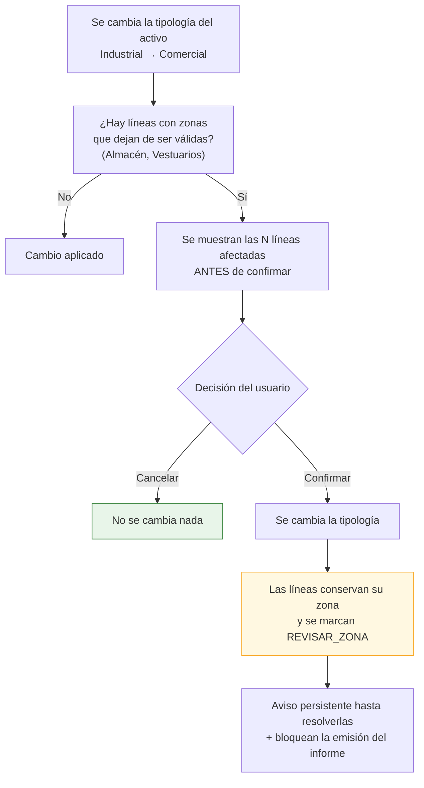
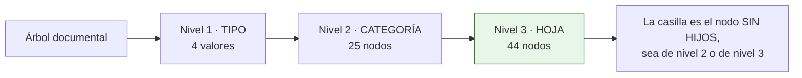

# Catálogos y taxonomías (complemento del entregable 8)

Este documento recoge los catálogos que la especificación revisada define en §3.3, y las decisiones
de modelado que exige cada uno. **Todos son datos, no código**: ampliarlos o corregirlos no requiere
despliegue.

---

## 5.0. Por qué los catálogos merecen documento propio

En la especificación revisada, buena parte del valor está en las **taxonomías**: una zona mal
clasificada rompe la agregación del informe, y un código CAPEX inventado impide comparar dos activos
de la misma cartera. Tres consecuencias de diseño:

| Decisión | Motivo |
|---|---|
| **Catálogo en tabla, no enumerado compilado** | El árbol tiene 103 hojas y tres categorías pendientes de desglose (P-03). Cada corrección no puede ser una migración |
| **Cada catálogo tiene tabla de traducción** `[REC]` | Las plantillas reales existen en español e inglés y traducen nombres de capítulo, de zona y **las definiciones de riesgo**. Ver [`18`](./18-analisis-plantillas-reales.md) C-5 |
| **Semilla del sistema + extensión por organización** | `organization_id IS NULL` marca las filas del sistema, comunes y no editables; cada organización puede añadir las suyas sin tocar las demás |
| **Retirada por `deprecated_at`, nunca borrado** | Un código retirado debe seguir resolviéndose en informes antiguos, pero no ofrecerse al crear líneas nuevas |

---

## 5.1. Tipologías de activo

> **P-01 · DECIDIDO.** La especificación daba dos listas distintas. El cliente ha resuelto:
> **los valores de §3.1.3 se sustituyen por los de §3.3.1**, que es la lista correcta.

### Catálogo único `[REQ]`

Seis tipologías. Son las de §3.3.1, y su juego de zonas es el que define §3.3.2 para cada una:

| `code` | Nombre | Zonas aplicables (§3.3.2) | Campos específicos que muestra |
|---|---|:--:|---|
| `INDUSTRIAL` | Industrial | 11 | **Almacén: superficie y altura** |
| `OFICINAS` | Oficinas | 10 | Superficie alquilable |
| `HOTEL` | Hotel | 16 | — |
| `COMERCIAL` | Comercial | 13 | Superficie alquilable |
| `SANITARIO` | Sanitario | 16 | — |
| `OTROS` | Otros | 20 `[SUP]` | — |

`asset_typology` queda con **6 filas**, todas del sistema (`organization_id IS NULL`,
`is_system = true`). El campo `typology_id` de `asset` referencia esta tabla y **determina qué zonas
ofrece el selector** en hallazgos y líneas de CAPEX.

### Consecuencias de la decisión

Tres, que conviene tener presentes porque no son evidentes a primera vista:

| # | Consecuencia | Valoración |
|---|---|---|
| 1 | **Los activos logísticos se clasifican como `INDUSTRIAL`** | Encaja bien: es la única tipología que ofrece *Almacén* y *Vestuarios*, que es exactamente lo que una nave logística necesita. No se pierde capacidad de clasificación |
| 2 | **Los activos residenciales caen en `OTROS`** | §3.3.2 no define un juego de zonas para residencial. `[PDV]` Si aparecen activos residenciales con frecuencia, conviene definir su juego de zonas y añadir la tipología: es una fila de catálogo y una columna en la matriz, sin migración de código |
| 3 | **Los campos de almacén solo se muestran en `INDUSTRIAL`** | Antes se preveían también para logística. Al fundirse, la regla queda más simple: superficie y altura de almacén aparecen **solo** en Industrial |

`[SUP]` **Zonas de «Otros»:** §3.3.2 asigna a esta tipología únicamente el valor «–», es decir, ninguna
zona. Se mantiene la propuesta ya aceptada de ofrecerle **el catálogo completo de 20 zonas**: un activo
atípico sigue teniendo cubierta, cuadros técnicos y aseos, y dejarlo sin zonas obligaría a clasificar
todo como «sin zona». Es un supuesto revisable con una sola línea de la matriz.

---

## 5.2. Zonas por tipología `[REQ]` §3.3.2

### Catálogo normalizado de zonas

Unión de las seis listas, deduplicada. 20 zonas:

| `code` | Nombre | Aparece en |
|---|---|---|
| `CUARTOS_TECNICOS` | Cuartos técnicos | Todas |
| `APARCAMIENTO` | Aparcamiento | Todas |
| `OFICINAS` | Oficinas | Todas |
| `ASEOS` | Aseos | Todas |
| `CUBIERTA` | Cubierta | Todas |
| `ZONAS_EXTERIORES` | Zonas exteriores | Todas |
| `VESTIBULO_PRINCIPAL` | Vestíbulo principal | Todas |
| `NUCLEO_ESCALERAS` | Núcleo escaleras | Todas |
| `GENERAL` | General | Todas |
| `VESTIBULO_PLANTA` | Vestíbulo de planta | Oficinas, Hotel, Comercial, Sanitario |
| `SALAS_PERSONAL` | Salas de personal | Hotel, Comercial, Sanitario |
| `ALMACEN` | Almacén | Industrial |
| `VESTUARIOS` | Vestuarios | Industrial |
| `HABITACIONES` | Habitaciones | Hotel, Sanitario |
| `COCINA` | Cocina | Hotel |
| `RESTAURANTE` | Restaurante | Hotel, Comercial, Sanitario |
| `GIMNASIO` | Gimnasio | Hotel, Sanitario |
| `PISCINA` | Piscina | Hotel, Sanitario |
| `ZONA_COMERCIAL` | Zona comercial | Comercial |
| `SALAS_USO_SANITARIO` | Salas uso sanitario | Sanitario |

> `[REC]` **Detalle menor con consecuencias:** la especificación escribe «Restaurante» en Hotel y
> Sanitario, y «Restaurantes» en Comercial. Se unifica en una sola zona `RESTAURANTE`. Dos filas
> distintas significarían dos identificadores para el mismo concepto, y cualquier comparación de
> cartera entre un hotel y un centro comercial daría dos líneas donde debería dar una.

### Matriz de disponibilidad

Tabla puente `zone_typology`. `●` = disponible.

| Zona | Industrial | Oficinas | Hotel | Comercial | Sanitario | Otros `[SUP]` |
|---|:--:|:--:|:--:|:--:|:--:|:--:|
| Cuartos técnicos | ● | ● | ● | ● | ● | ● |
| Aparcamiento | ● | ● | ● | ● | ● | ● |
| Oficinas | ● | ● | ● | ● | ● | ● |
| Aseos | ● | ● | ● | ● | ● | ● |
| Cubierta | ● | ● | ● | ● | ● | ● |
| Zonas exteriores | ● | ● | ● | ● | ● | ● |
| Vestíbulo principal | ● | ● | ● | ● | ● | ● |
| Núcleo escaleras | ● | ● | ● | ● | ● | ● |
| General | ● | ● | ● | ● | ● | ● |
| Vestíbulo de planta | | ● | ● | ● | ● | ● |
| Salas de personal | | | ● | ● | ● | ● |
| Almacén | ● | | | | | ● |
| Vestuarios | ● | | | | | ● |
| Habitaciones | | | ● | | ● | ● |
| Cocina | | | ● | | | ● |
| Restaurante | | | ● | ● | ● | ● |
| Gimnasio | | | ● | | ● | ● |
| Piscina | | | ● | | ● | ● |
| Zona comercial | | | | ● | | ● |
| Salas uso sanitario | | | | | ● | ● |
| **Total por tipología** | **11** | **10** | **16** | **13** | **16** | **20** |

**86 relaciones** en total: 66 definidas literalmente en §3.3.2 (11 + 10 + 16 + 13 + 16) más 20 del
supuesto sobre «Otros».

`[REC]` **El valor «–» no es una fila.** Se representa como `zone_id IS NULL` con etiqueta de
presentación «–». Si fuera una fila del catálogo, toda agregación tendría que excluirla
explícitamente y antes o después alguien lo olvidaría, produciendo un informe con una categoría
llamada «–» y un importe detrás.

### Comportamiento al reclasificar un activo



`[REC]` **Nunca se borra la zona de una línea existente.** Borrar en silencio el trabajo de un
consultor porque alguien tocó un desplegable es inaceptable: se conserva, se marca y se avisa.

---

## 5.3. Árbol de códigos CAPEX `[REQ]` §3.3.4

### Estructura


### Nivel 1 · Categorías

| `code` | Nombre | Estado |
|---|---|---|
| `HC` | Hard Cost | ✅ 15 categorías |
| `SC` | Soft Cost | ✅ 4 categorías |
| `OP` | Operativo | ✅ 3 categorías |
| `MA` | Medioambiente | ✅ 2 categorías |
| `ESG` | ESG y Energía | ✅ 2 categorías |
| `IMP` | Imprevistos | ✅ 2 categorías |

> **P-45 · El árbol lo mantiene el cliente, y con sus códigos.** Tras la revisión del primer
> prototipo, el cliente entregó su estructura completa en una hoja de cálculo y pidió que el
> catálogo use **su codificación**. Es la fuente de esta sección: la traduce
> `tools/importar_arbol_capex.py` y de aquí sale la semilla, como con todos los catálogos.
>
> `[REQ]` **Hubo migración, y por eso no hay huérfanos.** Seis categorías cambian de código
> —`MA.General` → `MA.MA1`, `ESG.General` → `ESG.ES1`, `OP.C01` → `OP.OP1`, `OP.C02` → `OP.OP2`,
> `IMP.General` → `IMP.IM1`, y `SC.General` pasa a ser el `SC.S04 Otros`—. La migración `0020`
> **renombra la fila** en vez de crear otra: conserva su `id`, así que todo lo que apuntaba a ella
> —hallazgos, fotografías, categorías de memoria— sigue apuntando a lo mismo sin tocar esas tablas.
>
> `[LIM]` Esto **revoca la promesa anterior** de que `MA.General.01` conservaría su código para
> siempre. Se revoca porque el cliente decidió otra cosa, y queda escrito aquí para que quien lea
> la versión vieja del documento sepa que ya no vale. La prueba que lo fijaba se ha sustituido por
> otra que comprueba lo que sigue importando: que nada se quede sin código.
>
> `[SUP]` Los siete objetos `General` de las categorías que en la hoja del cliente **no tienen
> objetos** —soft costs, operativos, imprevistos— se **deprecan**: dejan de ofrecerse y lo que
> apuntaba a ellos sube a su categoría, que es un nivel válido para codificar. No se borran, porque
> un informe ya emitido tiene que seguir resolviendo su código.

### Nivel 2 y 3 · Hard Costs, completo

| Capítulo | Elementos |
|---|---|
| **H01. Estructura** | Cimentación · Solera · Forjados · Estructura · General · Otros |
| **H02. Cubierta** | Cubierta · General · Otros |
| **H03. Fachadas** | Fachadas · General · Otros |
| **H04. Interiores** | Particiones interiores y revestimientos interiores · Carpintería y cerrajería · Suelos y techos · General · Otros |
| **H05. Zonas exteriores** | Exteriores · General · Otros |
| **H06. Protección Pasiva Incendios** | Sectorización · Zonas de riesgo especial · Espacios ocultos y pasos de instalaciones · Resistencia al fuego de la estructura · Reacción al fuego de los elementos constructivos · Propagación exterior horizontal · Propagación exterior vertical · Propagación exterior por cubierta · Evacuación de ocupantes · General · Otros |
| **H07. Accesibilidad** | Accesibilidad desde el exterior · Accesibilidad entre las plantas · Accesibilidad en las plantas · Dotación de plazas de aparcamiento accesibles · Dotación de servicios higiénicos accesibles · Mobiliario fijo · Evacuación de personas con discapacidad · Señalética SIA · Instalaciones · General · Otros |
| **H08. HVAC** | Producción de climatización · Producción de calor · Distribución · Grupos de presión · Elementos terminales · Humectación · Ventilación aire primario · Extracción · Ventilación natural de humos · General · Otros |
| **H09. Electricidad** | Acometida-Centro de transformación · CGBT · BTV · Centralización de contadores · Cuadros secundarios de distribución · Batería de condensadores · Grupo electrógeno · Cableado · UPS · Alumbrado · Alumbrado de emergencia · Pararrayos · Red de tierras · Placas fotovoltaicas · General · Otros |
| **H10. Protección Activa Incendios** | Grupo de presión · Hidrantes · Aljibe · Columna seca · BIEs · Extintores portátiles · Extinción automática por gas · Detección de CO · Extracción de CO y ventilación del parking · Rociadores · Detección y alarma de incendios · Inspección RIPCI · Exutorios · General · Otros |
| **H11. Fontanería y saneamiento** | Acometida · Grupo de presión · Aljibes · Aseos · Producción de ACS · Saneamiento · Contribución mínima de renovables · General · Otros |
| **H12. Transporte vertical y puertas mecánicas** | Ascensor · Acceso al parking · Góndola · Escaleras mecánicas · Puerta de acceso principal · General · Otros |
| **H13. Seguridad CCTV y BMS** | Control de accesos · Instalación CCTV · Central de seguridad · Sistemas de megafonía · BMS · General · Otros |
| **H14. Telecomunicaciones, voz y datos** | WIFI · PPV · Voz y datos · Interfono · General · Otros |
| **H15. Otros** | General · Otros |

### Nivel 2 y 3 · el resto de tipos de coste

De la hoja de estructura del cliente, igual que la tabla anterior.

| Capítulo | Elementos |
|---|---|
| **SC. S01 · Proyectos, Diseño y DO** |  |
| **SC. S02 · Trabajos Complementarios** |  |
| **SC. S03 · Licencias y Tasas** |  |
| **SC. S04 · Otros** |  |
| **OP. OP1 · Consumos obra** |  |
| **OP. OP2 · Limpieza** |  |
| **OP. OP3 · Otros** |  |
| **MA. MA1 · Medioambiente** | Situación legal · Gestión de residuos urbanos · Gestión de residuos peligrosos · Emisiones de gases · Consumo de agua · Sistemas de drenaje · Ruido · Contaminación del suelo · Almacenamiento de sustancias peligrosas · Sustancias reductoras de la capa de ozono (ODS) · Presencia potencial de PCBs · Certificado de sostenibilidad · General · Otros |
| **MA. MA2 · Otros** |  |
| **ESG. ES1 · ESG** | Análisis CRREM · Análisis de Riesgos Climáticos · Certificación BREEAM · Certificación LEED · Certificación WELL · Certificación WIREDSCORE · Certificado de Eficiencia Energética · Auditoría Net Zero · Auditoría Energética · Cumplimiento Nuevo Reglamento EPBD · General · Otros |
| **ESG. ES2 · Otros** |  |
| **IMP. IM1 · General** |  |
| **IMP. IM2 · Otros** |  |

`[REC]` **Los capítulos de soft costs no llevan desglose de elementos, y es fiel a la plantilla.**
En la hoja `CapEx` las filas de soft costs escriben su concepto —«Redacción de Proyectos y Dirección
Facultativa (DF)», «Honorarios ECLU»— **en la columna de descripción**, no en un desplegable de
elementos: la validación en cascada solo cubre la columna de categoría. Inventar aquí una lista de
elementos habría producido códigos que la plantilla no sabe colocar.

`[REQ]` **«Otros» y el `-` de la plantilla son la misma casilla.** El cliente pidió mantener los `-`
de sus listas «porque sirve como *otros*», y en la aplicación ese nodo se llama «Otros», que es lo
que hay que leer en un desplegable. Al exportar se escribe otra vez `-`: es lo que admite la
validación de la hoja, y escribir la palabra dejaría el valor **fuera de lista**, con la hoja
abriéndose igual y los gráficos sin contarlo. El puente lo tiende
`apps/api/src/tdd/exports/vocabulario_capex.py`.

`[REQ]` **`SC.S04 «Otros»` tiene tramo propio en la plantilla.** No lo tenía: el total de soft costs
era `=J220+J232+J244`, la suma exacta de las otras tres categorías, y meterla en el tramo de una
vecina la habría sumado a un subtotal que no es el suyo **sin que la hoja descuadre**, que es la
clase de error que no se ve. El cliente confirmó que su plantilla puede cambiar, así que
`tools/anadir_bloques_plantillas.py` le da las filas **256-266**, justo detrás de `S03`, y el total
pasa a `=J220+J232+J244+J256`. Operativos e Imprevistos bajan doce filas para dejarle sitio: la
cuarta categoría de soft costs tenía que quedar **pegada a las suyas**, o se leería como una sección
aparte al final de la hoja.

Las categorías «Otros» de Medioambiente, ESG, Operativos e Imprevistos **comparten tramo** con la
categoría con contenido de su tipo, porque esos tipos tienen un solo tramo con un subtotal que suma
el tipo entero: compartirlo no atribuye nada mal. Lo que sí hacía falta es **escribir la categoría
en cada fila**: el tramo viene con la de la primera puesta —«Medioamb» en las diez filas de
Medioambiente—, así que una actuación de `MA.MA2` habría salido clasificada como `MA1`. Se escribe
encima con la etiqueta que la propia plantilla da a ese cajón, que es `-` en los dos idiomas.

`[REC]` **De paso se arregló algo que venía roto.** El origen de la tabla dinámica que alimenta
«Resumen CapEx» y sus gráficos llegaba hasta la fila **256**, así que Operativos e Imprevistos
—añadidos en su día detrás de esa fila— cuadraban en los totales y **no aparecían en ningún
gráfico**. Ahora llega a la 293 y los tres tramos entran. `[PDV]` Verificado sobre el XML; **queda
abrirlo en Excel**, que es donde se ve una tabla dinámica.

`[LIM]` **Los tres tramos añadidos no tienen desplegable en la columna «Categoría».** Las
validaciones de la plantilla enumeran rangos concretos —`D221:D230`, `D234:D242`— y ampliarlas es
tocar una referencia relativa que no se puede comprobar sin abrir Excel. No afecta a lo que exporta
la aplicación, que escribe la etiqueta directamente; afecta a quien rellene esas filas a mano.
`[PDV]` Conviene saber además que **la plantilla del cliente ya traía ese hueco** en `D245:D254`,
las diez filas de `S03`.

`[REC]` **`General` va ahora el penúltimo, antes de «Otros».** Es el orden de la hoja del cliente y
el que tiene sentido leyendo un desplegable: primero lo concreto, y al final las dos salidas. La
versión anterior lo ponía el primero para no renumerar el capítulo; al renombrar los códigos por
migración eso dejó de hacer falta, y `MA.General.01` es hoy `MA.MA1.13`, con el mismo significado y
la misma fila.

`[REC]` **En inglés el tipo de coste medioambiental se llama `Environmental_Cost`.** Los
desplegables de la plantilla van en cascada: la columna «Categoría» se valida con `INDIRECT()` sobre
el tipo de coste y la de «Objeto» con `INDIRECT()` sobre la categoría, de modo que cada texto tiene
que existir como nombre definido. En español los dos niveles se llaman distinto —`Mediambiente` el
tipo y `Medioamb` la categoría—, pero en inglés **los dos se llamaban `Environmental`**, y un nombre
definido no puede apuntar a dos listas: la de categorías se quedaba sin resolver. Se renombró el
**tipo**, que es el nivel que menos se ve, y no la categoría, que es la que sale en cada fila del
CAPEX y por la que agrupan las tablas dinámicas. `tools/reparar_nombres_plantilla_en.py` lo aplica y
hay pruebas que comprueban los dos niveles en las dos plantillas.

`[REQ]` **`Placas fotovoltaicas` y `BIEs` llegaron mal escritos, y se han corregido.** La hoja del
cliente traía `Placas fotovoltáicas` —el diptongo `ai` es átono y no lleva tilde— y `Bies`, que es el
acrónimo BIE (Boca de Incendio Equipada) escrito como si fuera una palabra. Estuvieron copiados
literales una versión, con el criterio de abajo; el cliente ha pedido corregirlos y se corrigen **en
los dos sitios a la vez**: en el catálogo, con la migración `0021`, y en la plantilla española, con
`tools/corregir_erratas_plantillas.py`. La inglesa dice `Photovoltaic panels` y `Fire hose reels`,
que están bien. `tools/importar_arbol_capex.py` los corrige también al leer la hoja, porque la hoja
del cliente los seguirá trayendo.

`[REQ]` **`Certificación WIRESCORED` era una transposición de letras, y también está corregida.**
El producto se llama *WiredScore*. La plantilla inglesa ya lo escribía bien —«WIREDSCORE
Certification»— y la española tenía las dos últimas letras cambiadas. Se corrige con la migración
`0022` y con `tools/corregir_erratas_plantillas.py`, igual que las dos anteriores.

Se escribe **`WIREDSCORE` en mayúsculas** y no `WiredScore`: es como lo escribe la plantilla inglesa
y como están sus cuatro vecinas de lista —BREEAM, LEED, WELL—. Corregir una errata es una cosa y
cambiar el estilo de toda la lista es otra; lo segundo no se ha pedido. `[PDV]` Si el cliente
prefiere la grafía de marca, es cambiar los dos lados otra vez.

**El criterio, que es el mismo en los tres casos:** el catálogo y el desplegable tienen que decir lo
mismo, así que una errata **se corrige en los dos lados o en ninguno**. Cambiar solo uno produce una
celda con un valor que no está en su propia lista: la hoja se abre bien y las tablas dinámicas la
dejan fuera, que es la peor forma de que falle.

`[REC]` **Operativos e Imprevistos se siembran, y para eso hubo que darles sitio en la plantilla.**
Los dos tipos de coste estaban declarados en «00 Datos Categorías» pero la hoja `CapEx` no tenía
ninguna fila donde escribirlos: solo había 20 bloques. `tools/anadir_bloques_plantillas.py` añade los
dos **al final** de la hoja —filas 256 y 269, que estaban vacías— clonando el bloque medioambiental
para heredar sus estilos. Al añadir en vez de insertar, ninguna fila existente se desplaza y por
tanto ninguna fórmula, celda combinada, regla de formato condicional ni origen de tabla dinámica
cambia de sitio.

`Imprevistos` se monta **como los soft costs**, con su importe calculado a partir del porcentaje de
«00 Datos Activo»!C45, porque es como lo tenía pensado la plantilla: un tanto por ciento de los hard
costs, no una lista de actuaciones. `Operativos` es un bloque itemizado normal, y su categoría la
elige el desplegable entre las dos que declara el catálogo.

**Totales de la semilla:** **6 tipos de coste · 28 categorías** (15 de Hard Cost + 4 de Soft Cost +
3 de Operativo + 2 de Medioambiente + 2 de ESG y Energía + 2 de Imprevistos) · **141 objetos**
(115 de Hard Cost + 14 de Medioambiente + 12 de ESG y Energía). **175 nodos** en total.

`[REC]` **Soft costs, operativos e imprevistos no traen objetos, y es fiel a la hoja.** Sus
categorías son la hoja del árbol y ahí se codifica el hallazgo: el concepto concreto —«Honorarios
ECLU»— se escribe en la descripción, como en la plantilla CAPEX. Conviene saberlo porque en el
informe esas líneas salen con la celda de objeto vacía.

`[REC]` La cifra de «121» que arrastraba una versión anterior de este documento era **capítulos más
elementos**, no elementos. Hay una prueba que fija los cuatro recuentos para que no vuelva a
desajustarse.

### Codificación

`[REC]` Código jerárquico legible, estable y ordenable:

```
HC                    Categoría
HC.H09                Capítulo
HC.H09.10             Elemento (Alumbrado)
```

Se usa `ltree` en la columna `path` para consultar subárboles con una sola condición: «todo el CAPEX
de electricidad» es `path <@ 'HC.H09'`.

### Observaciones sobre el árbol

| # | Observación | Tratamiento |
|---|---|---|
| 1 | Todos los capítulos tienen un elemento **«General»** | Se conserva: es la vía de escape cuando el consultor no quiere afinar más. Es `is_selectable = true` |
| 2 | Aparece también un elemento **«–»** en cada capítulo | `[REQ]` **Sí se modela, y se llama «Otros»**. Al recibir la hoja se preguntó, y el cliente confirmó que no es relleno: es la salida que necesita un consultor cuando lo que ve no está en la lista. Antes se descartaba, y quien no encontraba su objeto acababa usando «General», que significa otra cosa. Hay una prueba que exige que **toda categoría con objetos ofrezca «Otros»** |
| 3 | **«Grupo de presión»** aparece en H10 y en H11 | Son códigos distintos con el mismo nombre (`HC.H10.01` y `HC.H11.02`). Correcto: uno es de incendios y otro de fontanería. La interfaz muestra siempre el capítulo junto al elemento para evitar confusión `[REC]` |
| 4 | **«Aljibe»** (H10) y **«Aljibes»** (H11) | Mismo caso que el anterior; se conservan ambos, con su capítulo visible |
| 5 | **«Acometida»** aparece en H09 (Acometida-CT) y H11 (Acometida) | Ídem |
| 6 | H07 (Accesibilidad) tiene un elemento **«Instalaciones»** | Muy genérico; se conserva literal por fidelidad a la especificación, pero conviene confirmar su alcance |

---

## 5.4. Grados de riesgo `[REQ]` §3.3.4

Las cuatro definiciones se guardan **íntegras en base de datos**, no en el frontend, porque cumplen
dos funciones: ayudar al consultor a clasificar de forma homogénea, y volcarse al informe como
leyenda de la metodología.

| `code` | Nombre | `score` | Definición (literal de la especificación) |
|:--:|---|:--:|---|
| `01` | Bajo | 1 | Aspectos que harían al edificio mejorar la eficiencia y/o prestaciones del mismo, si bien no serían exigibles ni por incumplimiento de normativa, ni por reparación necesaria ni por renovación debida a la finalización de la vida útil. |
| `02` | Moderado | 2 | Anomalías debidas a la antigüedad (partes del inmueble que han rebasado su periodo de vida útil) que, si bien en la actualidad pueden no estar incidiendo negativa y sustancialmente en la actividad, creemos harán necesario articular su renovación en la operación. |
| `03` | Alto | 3 | Anomalías que pueden interpretarse como disconformes pero que admiten interpretación y podrían negociarse sin llegar a tener relevancia en la operación. |
| `04` | Extremo | 4 | Anomalías irrefutables que se prevén sean reclamados por el comprador exigiendo un compromiso de solución con plazo pactado. En este grupo se encuentran las anomalías que por su naturaleza inciden en el deterioro del edificio, pueden suponer un incumplimiento claro de la normativa en vigor y/o pueden tener incidencia en la actividad. |
| — | – | — | `NULL`: sin clasificar |

`[REC]` **Las definiciones están traducidas al inglés en las plantillas reales**, palabra por palabra
(«Irrefutable anomalies that are foreseen to be claimed by the buyer…»). Viven, por tanto, en
`risk_level_i18n`, no en una columna única.

`[REC]` **La definición se muestra al elegir el grado**, no en un manual aparte. Estas cuatro
definiciones son un criterio profesional, no una etiqueta de color: si no están a la vista en el
momento de clasificar, cada consultor aplicará el suyo y la matriz de riesgos del informe dejará de
significar nada.

### Uso en la interfaz

```
Riesgo  ┌──────────────────────────────────────────────────────────┐
        │ ○ –                                                       │
        │ ○ 01 Bajo                                                 │
        │ ○ 02 Moderado                                             │
        │ ◉ 03 Alto                                                 │
        │   ┌────────────────────────────────────────────────────┐  │
        │   │ Anomalías que pueden interpretarse como            │  │
        │   │ disconformes pero que admiten interpretación y     │  │
        │   │ podrían negociarse sin llegar a tener relevancia   │  │
        │   │ en la operación.                                   │  │
        │   └────────────────────────────────────────────────────┘  │
        │ ○ 04 Extremo                                              │
        └──────────────────────────────────────────────────────────┘
```

Accesibilidad `[REQ]`: el grado nunca se representa **solo** por color. Siempre código + nombre, y el
color como refuerzo.

---

## 5.5. Conceptos `[REQ]` §3.3.3

| `code` | Nombre |
|---|---|
| `MANTENIMIENTO` | Mantenimiento |
| `REPARACION` | Reparación |
| `NORMATIVA` | Normativa |
| `MEJORA` | Mejora |
| `SEGURIDAD` | Seguridad |
| `VIDA_UTIL` | Vida útil |
| `SOFT_COST` | Soft Cost |
| `MEDIOAMBIENTAL` | Medioambiental |
| `ESG` | ESG |
| `OTRO` | Otro |
| — | – (`NULL`) |

> `[PDV]` **Solapamiento detectado.** Tres valores —`Soft Cost`, `Medioambiental` y `ESG`— aparecen a
> la vez como **concepto** (§3.3.3) y como **categoría del árbol de códigos** (§3.3.4). Una línea
> podría quedar codificada como `SC.S04` con concepto `Soft Cost`, lo que es redundante, o como
> `HC.H09.10` con concepto `ESG`, lo que es contradictorio.
>
> **Propuesta** `[REC]`: mantener ambos campos, porque miden cosas distintas —el código dice *qué
> elemento del edificio*, el concepto dice *por qué se actúa*—, y añadir una **regla de coherencia
> blanda**: si la categoría del código es `SC`, `MA` o `ESG`, la interfaz propone el concepto
> equivalente y avisa si se elige otro. Aviso, no bloqueo: puede haber casos legítimos. Pendiente de
> confirmar con el cliente (P-14).

---

## 5.6. Horizontes temporales `[REQ]` §3.3.4

> **P-05 · DECIDIDO.** El importe **se rellena en una sola columna**: cada línea pertenece a **un
> único horizonte**. Una actuación se aplica en corto, medio o largo plazo, o se considera mejora
> potencial —que decide el cliente—, o es otro tipo de petición. Son valores **mutuamente
> excluyentes**.

| `code` | Nombre | Años | Naturaleza |
|---|---|---|---|
| `CORTO` | Corto plazo | **1-2** | Plazo de ejecución |
| `MEDIO` | Medio plazo | 3-5 | Plazo de ejecución |
| `LARGO` | Largo plazo | 6-10 | Plazo de ejecución |
| `MEJORAS` | Mejoras | — | **Mejora potencial**: la decide el cliente, no es una necesidad técnica |
| `OTRO` | Otro | — | Otro tipo de petición |

En `capex_item` esto es **un campo, no cinco**: `time_horizon_id` (FK obligatoria) más `amount`. Ver
[`04-modelo-de-datos.md`](./04-modelo-de-datos.md) §8.6.

`[REC]` **«Total» no es un horizonte**, aunque aparezca en la lista de §3.3.4: es el agregado de las
líneas. No se modela como fila del catálogo, igual que «–» no se modela como zona. Un total tecleado a
mano que no cuadra con sus sumandos es el defecto más común de las hojas de cálculo que esta
aplicación viene a sustituir.

### Modelo frente a presentación `[REC]`

Que el modelo tenga un solo campo **no impide** que la tabla siga viéndose con cinco columnas, que es
como los equipos la usan hoy:

```
Código   Descripción              Corto    Medio    Largo   Mejoras   Otro     TOTAL
CX-0117  Sustitución enfriadora   48.500        —        —        —      —    48.500
CX-0118  Limpieza de conductos         —   22.855        —        —      —    22.855
CX-0125  Renovación de aseos           —        —        —   35.000      —    35.000
                                 ───────  ───────  ───────  ───────  ─────   ───────
                                  48.500   22.855        0   35.000      0   106.355
```

La rejilla **pivota** el horizonte de cada línea a su columna: exactamente una casilla tiene valor por
fila, y las demás muestran «—». Es la vista de siempre, pero el dato subyacente es un único importe
con su clasificación, de modo que **es imposible que una línea quede repartida por error entre dos
plazos**.

**Sobre «Mejoras»** `[REQ]`: la especificación la define como «mejoras a realizar por la propiedad
para incrementar el valor del activo». Con el modelo de horizonte único queda claro lo que es: una
línea **no es a la vez** una necesidad a corto plazo y una mejora potencial. En las vistas por año, las
líneas de `MEJORAS` y `OTRO` no se reparten en el tiempo salvo que se les asigne `planned_year`.

**Rango del corto plazo** — **P-04 · DECIDIDO**: el literal de §3.3.4 decía «0-2 años» y la glosa
«1 a 2 años». Se adopta **1-2 años**, configurable en el catálogo (`year_from`, `year_to`). Importa
porque el plan de inversión del informe se presenta por años y un desfase descuadra la tabla.

---

## 5.7. Recuperable a inquilino `[REQ]` §3.3.3

| Valor | Significado |
|---|---|
| `SI` | El coste es repercutible al inquilino según contrato |
| `NO` | Lo asume la propiedad |
| `NA` | No aplica |
| `NULL` | – (sin determinar) |

`[REC]` Merece una vista propia en el CAPEX: «cuánto de estos 2,2 M€ recae realmente sobre la
propiedad» es una de las primeras preguntas de un inversor, y hoy suele calcularse a mano.

---

## 5.8. Sistemas técnicos y categorías de fotografía

`[REQ]` §3.2 propone una clasificación de fotografías de 14 categorías. Coincide en buena parte con
los capítulos de Hard Costs, pero no del todo.

| Categoría de foto (§3.2) | Código | Capítulo equivalente |
|---|---|---|
| Fachada y envolvente | `FACH` | H03 |
| Cubierta | `CUB` | H02 |
| Estructura | `EST` | H01 |
| Zonas interiores | `INT` | H04 |
| Climatización | `CLIMA` | H08 |
| Electricidad | `ELEC` | H09 |
| Fontanería y saneamiento | `FONT` | H11 |
| Protección contra incendios | `PCI` | H06 + H10 |
| Ascensores | `ASC` | H12 |
| Seguridad | `SEG` | H13 |
| Urbanización exterior | `URB` | H05 |
| Accesibilidad | `ACC` | H07 |
| Sostenibilidad | `SOST` | ESG |
| Otros | `OTROS` | H15 |

`[REC]` **Los códigos son cortos y sin guion bajo a propósito.** Van al nombre del fichero por el
token `[Sistema]` (§15.4), y el guion bajo es el separador de la plantilla: un
`PROTECCION_CONTRA_INCENDIOS` produciría `2026-014_NaveA_PROTECCION_CONTRA_INCENDIOS_Cubierta_001`,
donde ya no se distingue dónde acaba un campo y empieza el siguiente. Son las abreviaturas de uso
corriente en construcción —`PCI` es la universal—, no siglas inventadas para el proyecto.

`[REC]` Se mantiene la clasificación de fotos como catálogo propio (`technical_system`) **mapeado** a
los capítulos, en lugar de fundirlos. Motivos: «Protección contra incendios» es una sola categoría
fotográfica pero dos capítulos de coste (pasiva y activa); y clasificar una foto en campo debe ser más
rápido y grueso que codificar una partida en gabinete. El mapeo permite, aun así, que al crear un
hallazgo desde una foto el capítulo venga propuesto.

---

## 5.9. Secciones de memoria técnica → capítulos CAPEX `[REQ]`

Una memoria técnica **no trae la lista de las 15 categorías del CAPEX**. Se
comprobó leyendo una de verdad: lo que trae es una memoria constructiva
redactada según el Código Técnico, organizada por sus propias secciones, con
los elementos enumerados en prosa dentro de cada una.

Las categorías **se deducen** de esas secciones, y la correspondencia **no es
uno a uno en ninguna de las dos direcciones**:

* `MC.2 Cimentación` y `MC.3 Sistema estructural` caen las dos en `H01`.
* `MC.6 Instalaciones` reparte sus elementos entre **seis** capítulos.

Por eso vive aquí, como dato de catálogo, y no como un `dict` en el código: la
segunda memoria que llegue traerá otra numeración o secciones que ésta no
tiene, y corregirlo tiene que ser editar una fila, no desplegar.

| Sección | Nombre | Capítulos CAPEX |
|---|---|---|
| `MC.0` | Trabajos previos | — |
| `MC.1` | Explanación | `H05` |
| `MC.2` | Cimentación y contención | `H01` |
| `MC.3` | Sistema estructural | `H01` |
| `MC.4` | Envolvente | `H02` · `H03` |
| `MC.5` | Compartimentación y acabados | `H04` · `H06` |
| `MC.6` | Instalaciones | `H08` · `H09` · `H10` · `H11` · `H12` · `H13` · `H14` |
| `MC.7` | Urbanización interior | `H05` |
| `MD.2` | Descripción del proyecto | `H15` |
| `MD.3` | Prestaciones del edificio | `H06` · `H07` |

`[SUP]` `MC.0 Trabajos previos` no mapea a ningún capítulo a propósito: vallado,
implantación y replanteo son coste de obra, no del activo que se compra. Sale
en la tabla con la casilla vacía para que se vea que **se ha decidido**, no que
se ha olvidado.

`[PDV]` `MD.2` → `H15 Otros` es la asignación menos segura de la tabla: esa
sección describe el programa funcional, y lo que de ahí es CAPEX depende del
edificio. Está sin validar con el cliente.

`[LIM]` La tabla sale de **una** memoria. Que las secciones se llamen `MC.n` es
la convención del CTE y debería repetirse; que los contenidos caigan siempre en
los mismos capítulos, no está demostrado.

---

## 5.10. Árbol de documentación del activo `[REQ]` §3.2 b

### De dónde sale

Lo entregó el cliente en su hoja de estructura, **v2**, igual que el árbol del CAPEX y con el
mismo trato: se transcribe aquí literal y de aquí se genera la semilla —no al revés—. Sus códigos
son los suyos (P-45), y sus nombres también, con sus paréntesis y sus enumeraciones largas: son
la frase con la que el gestor reconoce qué tiene que pedir.

### Estructura

Tres niveles, como el CAPEX, y por el mismo motivo: **la hoja del árbol es lo que tiene estado**.
Una casilla es cualquier nodo sin hijos, esté en el nivel que esté.



`[SUP]` **El nivel y el padre salen del propio código.** `S3.1.1` es de nivel 3 y cuelga de
`S3.1`; no hace falta columna de padre, y así no puede haber un padre que no case con el código.
Es la diferencia con el árbol del CAPEX, donde los códigos de la hoja del cliente no anidaban.

`[SUP]` **La hoja del cliente llama «Sección» al nivel 3 de `S1` y «Objeto» al de `S3`.** Es el
mismo nivel con dos nombres; aquí se unifica como nivel 3. Y `S2` y `S4` **no tienen nivel 3**: su
categoría es la hoja, exactamente igual que los soft costs en el CAPEX.

### El catálogo completo

| Código | Nombre |
|---|---|
| `S1` | Documentación urbanística |
| `S1.1` | Licencias urbanísticas |
| `S1.1.1` | Licencia de Obras de nueva planta y modificaciones |
| `S1.1.2` | Licencia de Primera Ocupación |
| `S1.1.3` | Licencia de Actividad |
| `S1.1.4` | Licencia de Funcionamiento |
| `S1.2` | Proyectos con licencias otorgadas |
| `S1.2.1` | Proyecto Básico |
| `S1.2.2` | Proyecto de Ejecución |
| `S1.2.3` | Proyecto de Actividad |
| `S1.2.4` | Proyectos y DR de ampliaciones y/o montaje de mobilhomes |
| `S1.3` | Notificaciones del ayuntamiento |
| `S1.3.1` | Requerimientos |
| `S1.3.2` | Denegaciones |
| `S1.3.3` | Expedientes abiertos por Infracción Urbanística |
| `S2` | Documentación técnica |
| `S2.1` | Memoria técnica |
| `S2.2` | Certificado final de obra |
| `S2.3` | Contratos de mantenimiento a nombre de la propiedad (PCI, electricidad, CT, etc) |
| `S2.4` | Informes de mantenimiento de las instalaciones a nombre de la propiedad (PCI, electricidad, CT, etc) |
| `S2.5` | Inspección Técnicas Obligatorias de Instalaciones (PCI, Electricidad, Climatización, Gas, etc…) |
| `S2.6` | Legalización en Industria de instalaciones eléctricas de Baja Tensión / Boletines eléctricos y Alta Tensión |
| `S2.7` | Legalización de instalaciones térmicas (AA, calefacción y ACS) |
| `S2.8` | Legalización en Industria de instalaciones térmicas (solar térmica) |
| `S2.9` | Legalización en Industria de instalación de PCI |
| `S2.10` | Legalización de la instalación de gas propano |
| `S2.11` | Planos en CAD |
| `S2.12` | Certificado energético |
| `S2.13` | Informes técnicos previos: due diligences, específicos (fachadas, estructura, instalaciones, …) |
| `S2.14` | Facturas de consumos eléctricos y agua (sanitaria y de PCI) |
| `S2.15` | Información del sistema de bombeo del saneamiento y autorización para vertido al alcantarillado público |
| `S3` | Documentación medioambiental |
| `S3.1` | Emplazamiento |
| `S3.1.1` | Dirección |
| `S3.1.2` | Nota simple del Registro de la propiedad |
| `S3.1.3` | Planos del emplazamiento |
| `S3.1.4` | Consumos anuales |
| `S3.2` | Licencias e inspecciones |
| `S3.2.1` | Permiso/licencia ambiental de la que se disponga |
| `S3.2.2` | Proyecto presentado para la obtención de la licencia ambiental |
| `S3.2.3` | Estudio de Impacto Ambiental |
| `S3.2.4` | Informes de las inspecciones realizadas por la Administración ambiental o ECA |
| `S3.2.5` | Correspondencia/comunicaciones que se hayan tenido con la Administración Ambiental relativa a temas ambientales |
| `S3.3` | Suelos |
| `S3.3.1` | Informe geotécnico e informe de investigaciones de la calidad/contaminación de suelo que se hayan realizado |
| `S3.3.2` | Informe Preliminar de la calidad del suelo (IPS) y respuesta de la Administración |
| `S3.4` | Almacenamiento de sustancias peligrosas |
| `S3.4.1` | Descripción de los tanques existentes (aéreos y enterrados) – tipo, volumen, contenido, edad, pruebas de estanqueidad, etc.  (incluir tanques de combustible para generadores, bombas contra incendios, etc., e incluir los tanques antiguos que estén fuera de uso o se hayan desmantelado). Adjuntar si se dispone de un plano con su localización |
| `S3.4.2` | Relación de productos químicos almacenados por tipo de peligrosidad. Cantidades almacenadas (y consumidas anualmente) |
| `S3.4.3` | Último informe Seveso (si aplica) y respuesta de la Administración |
| `S3.4.4` | Si importa sustancias químicas desde el exterior del espacio aduanero europeo (>1t), incluir la documentación sobre el Pre-registro de sustancias. Si es usuario intermedio incluir la comunicación con proveedores sobre los pre-registros. Si es importador de artículos, incluir la documentación sobre el control de sustancias SVHC en los mismos |
| `S3.5` | Emisiones atmosféricas |
| `S3.5.1` | Inventario de los focos de emisión (incluidas las calderas), clasificación e informes de medición de contaminantes a la atmósfera |
| `S3.5.2` | Estudios de ruido exterior realizado |
| `S3.5.3` | Estudio de olores realizado |
| `S3.5.4` | Si existen equipos de frío, gas que utilizan dichos equipos |
| `S3.5.5` | Agentes extintores utilizados |
| `S3.5.6` | Cantidades anuales de disolventes utilizados. Balance de emisiones difusas y Plan de gestión de disolventes |
| `S3.5.7` | En caso de torres de refrigeración, adjuntar las analíticas y controles realizados relativos al control de legionela |
| `S3.6` | Abastecimiento de agua y vertidos |
| `S3.6.1` | En caso de existencia de pozo en el emplazamiento, autorización de extracción de agua y analítica de la misma |
| `S3.6.2` | Descripción del pretratamiento realizado al agua de abastecimiento (si alguno) |
| `S3.6.3` | Permiso de vertido de aguas residuales y pluviales (indicar donde vierte, si a cauce o a alcantarillado municipal) |
| `S3.6.4` | Descripción del tratamiento realizado al agua residual previo al vertido |
| `S3.6.5` | Analíticas realizadas al agua residual |
| `S3.7` | Residuos y otros |
| `S3.7.1` | Documentación relativa a la gestión de los residuos (peligrosos y no peligrosos), número de productor de residuos |
| `S3.7.2` | Inventario de materiales que contienen asbestos en el emplazamiento |
| `S3.7.3` | Si existen transformadores eléctricos de aceite o equipos hidráulicos, año de los mismos y analítica del contenido de PCB en el aceite de estos equipos |
| `S3.7.4` | Plan de inversiones en temas ambientales para los próximos 5 años |
| `S3.7.5` | Certificados ambientales (ISO 14001, EMAS, etc). Incluir también si se disponen otros certificados (ISO 9001, 18001, etc.) |
| `S3.7.6` | Accidentes ambientales ocurridos a lo largo de la historia de la planta |
| `S4` | Q&A |

### Lo que el cliente pidió de esta sección, literal

> «Ninguna celda de documentación debe ser bloqueante. Si no hay documentación se tiene que poder
> continuar. Que aparezca en verde si hay documentación o en gris si no hay documentación. Debe
> permitir la subida de varios archivos en un mismo objeto.» — nota de `S1`

> «De todas las licencias sería necesario tanto la licencia descriptiva como la concesión. En caso
> de estar en tramitación se necesitaría las comunicaciones, instancias y solicitudes
> presentadas.» — nota de `S1.1`

> «Subir aquí el fichero excel con el Q&A recibido con respuestas de la contraparte/cliente.»
> — nota de `S4`

`[SUP]` La nota de `S1.1` **no abre un cuarto nivel**. «Descriptiva», «concesión» y «en
tramitación» son los papeles que puede haber dentro de una misma licencia, y la casilla admite
varios ficheros con su nombre —que es justo lo que pide la nota de `S1`—. Un nivel más
multiplicaría por tres las cuatro licencias para que la mayoría quedara siempre en gris.

### Verde y gris son el color; el estado son cuatro

`[REQ]` El cliente pidió dos colores y se le dan dos colores. Por debajo, la casilla guarda un
estado de cuatro valores, y esto **no es adorno**: el capítulo de limitaciones y salvedades del
informe necesita distinguir «no nos lo han dado» de «este edificio no tiene instalación de gas
propano», y en gris las dos se ven igual.

| Estado | Color | Qué significa | ¿Limita el informe? |
|---|---|---|---|
| `PENDIENTE` | gris | Se ha pedido y no ha llegado | Sí |
| `RECIBIDA` | verde | Hay al menos un fichero o una nota | No |
| `NO_DISPONIBLE` | gris | La propiedad dice que no existe o no lo encuentra | Sí, y con su motivo |
| `NO_APLICA` | gris | Este activo no tiene esa instalación | **No** |

`[REQ]` **Ninguno bloquea nada**, que es lo primero que pidió el cliente. `NO_DISPONIBLE` y
`PENDIENTE` alimentan las limitaciones del informe igual que hoy lo hace `doc_request_item`;
`NO_APLICA` no, porque no tener instalación de gas no es una laguna de la revisión.

### Una casilla admite ficheros **y** una nota

`[REC]` Cuatro nodos del árbol **no son documentos**: `S3.1.1 Dirección`, `S3.1.4 Consumos
anuales`, y en parte `S3.4.1` y `S3.4.2`, que piden *descripciones* y *relaciones* de lo que hay.
Exigir un PDF para la dirección de un edificio garantiza que nadie suba nada y que la casilla se
quede gris para siempre.

Así que toda casilla admite las dos cosas: ficheros y un texto. Verde si hay **cualquiera** de las
dos. Y la dirección se propone desde la ficha del activo, que ya la tiene, en vez de pedir que se
teclee dos veces.

### Lo que este árbol sustituye

`[REQ]` **Sustituye al checklist de la fase «Solicitud de documentación»**, decidido por el
cliente. Las cinco categorías sembradas hasta ahora —licencias urbanísticas · proyectos ·
contratos de mantenimiento · legalizaciones y certificados · garantías— son un subconjunto pobre
de estos 73 nodos, y tener las dos cosas produciría dos verdades sobre qué documentación falta.

`[LIM]` **Queda una casilla sin sitio: el plan de autoprotección.** La aplicación ya sabe leerlo
—de él salen los medios que van al inventario de equipo y las limitaciones del informe— y el árbol
v2 no tiene ningún nodo donde colgarlo. Encaja en `S2` como una categoría más; **está `[PDV]` a la
espera de que el cliente lo confirme**, y hasta entonces no se inventa un código que después haya
que migrar.

---

## 5.11. Resumen de la semilla

Lo que se carga en la migración `seed_catalogs`:

| Catálogo | Filas | Origen |
|---|:--:|---|
| `asset_typology` | **6** | §3.3.1 (decisión P-01) |
| `zone` | 20 | §3.3.2 deduplicado |
| `zone_typology` | **86** | Matriz de §5.2: 66 de §3.3.2 + 20 de «Otros» `[SUP]` |
| `capex_code` nivel 1 | 4 | §3.3.4 |
| `capex_code` nivel 2 | 18 | 15 de Hard Costs + 3 «General» (decisión P-03) |
| `capex_code` nivel 3 | 103 | §3.3.4 |
| `risk_level` | 4 | §3.3.4, con definición íntegra |
| `capex_concept` | 10 | §3.3.3 |
| `time_horizon` | **5** | §3.3.4 · mutuamente excluyentes (decisión P-05) |
| `technical_system` | 14 | §3.2 |
| `*_i18n` (10 catálogos × 2 idiomas) | ~380 | Traducciones ES/EN, extraídas de las plantillas reales |
| `doc_request_category` | 6 | §3.1.5 · la primera es la memoria técnica |
| `memoria_seccion` | 10 | §5.9 · secciones de memoria → capítulos CAPEX |
| `phase_definition` | 8 | §3.1.5 |
| `specialty` | 10 | §3.1.4 |

Todas las filas de la semilla llevan `organization_id IS NULL` e `is_system = true`: son comunes,
versionadas con el código y no editables por el cliente. Lo que el cliente añada lleva su
`organization_id` y convive con ellas.
