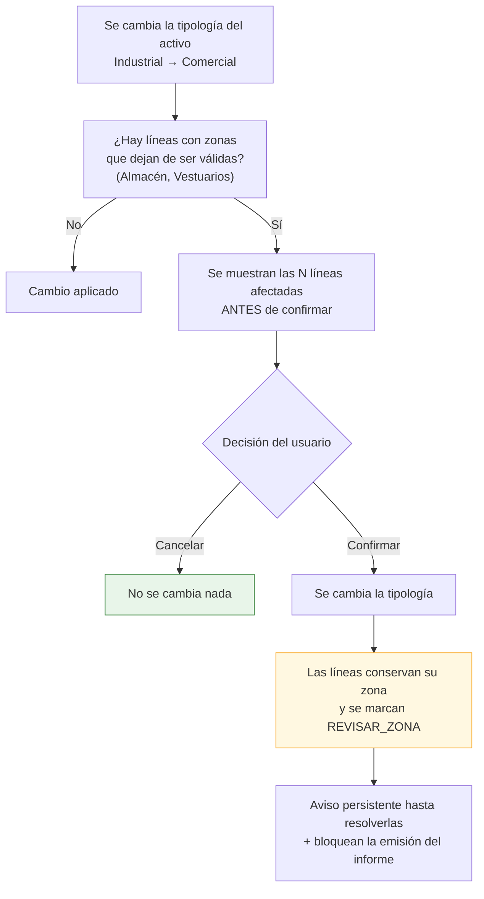

# Catálogos y taxonomías (complemento del entregable 8)

Este documento recoge los catálogos que la especificación revisada define en §3.3, y las decisiones
de modelado que exige cada uno. **Todos son datos, no código**: ampliarlos o corregirlos no requiere
despliegue.

---

## 5.0. Por qué los catálogos merecen documento propio

En la especificación revisada, buena parte del valor está en las **taxonomías**: una zona mal
clasificada rompe la agregación del informe, y un código CAPEX inventado impide comparar dos activos
de la misma cartera. Tres consecuencias de diseño:

| Decisión | Motivo |
|---|---|
| **Catálogo en tabla, no enumerado compilado** | El árbol tiene 103 hojas y tres categorías pendientes de desglose (P-03). Cada corrección no puede ser una migración |
| **Cada catálogo tiene tabla de traducción** `[REC]` | Las plantillas reales existen en español e inglés y traducen nombres de capítulo, de zona y **las definiciones de riesgo**. Ver [`18`](./18-analisis-plantillas-reales.md) C-5 |
| **Semilla del sistema + extensión por organización** | `organization_id IS NULL` marca las filas del sistema, comunes y no editables; cada organización puede añadir las suyas sin tocar las demás |
| **Retirada por `deprecated_at`, nunca borrado** | Un código retirado debe seguir resolviéndose en informes antiguos, pero no ofrecerse al crear líneas nuevas |

---

## 5.1. Tipologías de activo

> **P-01 · DECIDIDO.** La especificación daba dos listas distintas. El cliente ha resuelto:
> **los valores de §3.1.3 se sustituyen por los de §3.3.1**, que es la lista correcta.

### Catálogo único `[REQ]`

Seis tipologías. Son las de §3.3.1, y su juego de zonas es el que define §3.3.2 para cada una:

| `code` | Nombre | Zonas aplicables (§3.3.2) | Campos específicos que muestra |
|---|---|:--:|---|
| `INDUSTRIAL` | Industrial | 11 | **Almacén: superficie y altura** |
| `OFICINAS` | Oficinas | 10 | Superficie alquilable |
| `HOTEL` | Hotel | 16 | — |
| `COMERCIAL` | Comercial | 13 | Superficie alquilable |
| `SANITARIO` | Sanitario | 16 | — |
| `OTROS` | Otros | 20 `[SUP]` | — |

`asset_typology` queda con **6 filas**, todas del sistema (`organization_id IS NULL`,
`is_system = true`). El campo `typology_id` de `asset` referencia esta tabla y **determina qué zonas
ofrece el selector** en hallazgos y líneas de CAPEX.

### Consecuencias de la decisión

Tres, que conviene tener presentes porque no son evidentes a primera vista:

| # | Consecuencia | Valoración |
|---|---|---|
| 1 | **Los activos logísticos se clasifican como `INDUSTRIAL`** | Encaja bien: es la única tipología que ofrece *Almacén* y *Vestuarios*, que es exactamente lo que una nave logística necesita. No se pierde capacidad de clasificación |
| 2 | **Los activos residenciales caen en `OTROS`** | §3.3.2 no define un juego de zonas para residencial. `[PDV]` Si aparecen activos residenciales con frecuencia, conviene definir su juego de zonas y añadir la tipología: es una fila de catálogo y una columna en la matriz, sin migración de código |
| 3 | **Los campos de almacén solo se muestran en `INDUSTRIAL`** | Antes se preveían también para logística. Al fundirse, la regla queda más simple: superficie y altura de almacén aparecen **solo** en Industrial |

`[SUP]` **Zonas de «Otros»:** §3.3.2 asigna a esta tipología únicamente el valor «–», es decir, ninguna
zona. Se mantiene la propuesta ya aceptada de ofrecerle **el catálogo completo de 20 zonas**: un activo
atípico sigue teniendo cubierta, cuadros técnicos y aseos, y dejarlo sin zonas obligaría a clasificar
todo como «sin zona». Es un supuesto revisable con una sola línea de la matriz.

---

## 5.2. Zonas por tipología `[REQ]` §3.3.2

### Catálogo normalizado de zonas

Unión de las seis listas, deduplicada. 20 zonas:

| `code` | Nombre | Aparece en |
|---|---|---|
| `CUARTOS_TECNICOS` | Cuartos técnicos | Todas |
| `APARCAMIENTO` | Aparcamiento | Todas |
| `OFICINAS` | Oficinas | Todas |
| `ASEOS` | Aseos | Todas |
| `CUBIERTA` | Cubierta | Todas |
| `ZONAS_EXTERIORES` | Zonas exteriores | Todas |
| `VESTIBULO_PRINCIPAL` | Vestíbulo principal | Todas |
| `NUCLEO_ESCALERAS` | Núcleo escaleras | Todas |
| `GENERAL` | General | Todas |
| `VESTIBULO_PLANTA` | Vestíbulo de planta | Oficinas, Hotel, Comercial, Sanitario |
| `SALAS_PERSONAL` | Salas de personal | Hotel, Comercial, Sanitario |
| `ALMACEN` | Almacén | Industrial |
| `VESTUARIOS` | Vestuarios | Industrial |
| `HABITACIONES` | Habitaciones | Hotel, Sanitario |
| `COCINA` | Cocina | Hotel |
| `RESTAURANTE` | Restaurante | Hotel, Comercial, Sanitario |
| `GIMNASIO` | Gimnasio | Hotel, Sanitario |
| `PISCINA` | Piscina | Hotel, Sanitario |
| `ZONA_COMERCIAL` | Zona comercial | Comercial |
| `SALAS_USO_SANITARIO` | Salas uso sanitario | Sanitario |

> `[REC]` **Detalle menor con consecuencias:** la especificación escribe «Restaurante» en Hotel y
> Sanitario, y «Restaurantes» en Comercial. Se unifica en una sola zona `RESTAURANTE`. Dos filas
> distintas significarían dos identificadores para el mismo concepto, y cualquier comparación de
> cartera entre un hotel y un centro comercial daría dos líneas donde debería dar una.

### Matriz de disponibilidad

Tabla puente `zone_typology`. `●` = disponible.

| Zona | Industrial | Oficinas | Hotel | Comercial | Sanitario | Otros `[SUP]` |
|---|:--:|:--:|:--:|:--:|:--:|:--:|
| Cuartos técnicos | ● | ● | ● | ● | ● | ● |
| Aparcamiento | ● | ● | ● | ● | ● | ● |
| Oficinas | ● | ● | ● | ● | ● | ● |
| Aseos | ● | ● | ● | ● | ● | ● |
| Cubierta | ● | ● | ● | ● | ● | ● |
| Zonas exteriores | ● | ● | ● | ● | ● | ● |
| Vestíbulo principal | ● | ● | ● | ● | ● | ● |
| Núcleo escaleras | ● | ● | ● | ● | ● | ● |
| General | ● | ● | ● | ● | ● | ● |
| Vestíbulo de planta | | ● | ● | ● | ● | ● |
| Salas de personal | | | ● | ● | ● | ● |
| Almacén | ● | | | | | ● |
| Vestuarios | ● | | | | | ● |
| Habitaciones | | | ● | | ● | ● |
| Cocina | | | ● | | | ● |
| Restaurante | | | ● | ● | ● | ● |
| Gimnasio | | | ● | | ● | ● |
| Piscina | | | ● | | ● | ● |
| Zona comercial | | | | ● | | ● |
| Salas uso sanitario | | | | | ● | ● |
| **Total por tipología** | **11** | **10** | **16** | **13** | **16** | **20** |

**86 relaciones** en total: 66 definidas literalmente en §3.3.2 (11 + 10 + 16 + 13 + 16) más 20 del
supuesto sobre «Otros».

`[REC]` **El valor «–» no es una fila.** Se representa como `zone_id IS NULL` con etiqueta de
presentación «–». Si fuera una fila del catálogo, toda agregación tendría que excluirla
explícitamente y antes o después alguien lo olvidaría, produciendo un informe con una categoría
llamada «–» y un importe detrás.

### Comportamiento al reclasificar un activo



`[REC]` **Nunca se borra la zona de una línea existente.** Borrar en silencio el trabajo de un
consultor porque alguien tocó un desplegable es inaceptable: se conserva, se marca y se avisa.

---

## 5.3. Árbol de códigos CAPEX `[REQ]` §3.3.4

### Estructura


### Nivel 1 · Categorías

| `code` | Nombre | Estado |
|---|---|---|
| `HC` | Hard Costs | ✅ Desarrollada (15 capítulos) |
| `MA` | Medioambiental | ✅ Desarrollada (13 elementos) |
| `ESG` | ESG & Energía | ✅ Desarrollada (11 elementos) |
| `SC` | Soft Costs | ✅ Desarrollada (3 capítulos) |
| `OP` | Operativos | ✅ Desarrollada (2 capítulos) |
| `IMP` | Imprevistos | ✅ Desarrollada (1 capítulo) |

> **P-03 · CERRADO.** Se recibió la plantilla CAPEX DDT vigente, que **sí trae el desglose** de las
> tres categorías que faltaban. Se incorpora tal cual viene, y esta sección deja de ser provisional.
>
> `[REQ]` **Sin migración de datos, como se prometió.** `MA.General` y `ESG.General` siguen siendo
> capítulos válidos y conservan su elemento `General`: lo que se hace es **añadir** elementos a su
> lado. Ninguna línea de CAPEX ya codificada cambia de código ni se queda huérfana. `SC.General`
> también se conserva por la misma razón, junto a los tres capítulos nuevos `S01`, `S02` y `S03`.

### Nivel 2 y 3 · Hard Costs, completo

| Capítulo | Elementos |
|---|---|
| **H01. Estructura** | Cimentación · Solera · Forjados · Estructura · General |
| **H02. Cubierta** | Cubierta · General |
| **H03. Fachadas** | Fachadas · General |
| **H04. Interiores** | Particiones interiores y revestimientos interiores · Carpintería y cerrajería · Suelos y techos · General |
| **H05. Zonas exteriores** | Exteriores · General |
| **H06. Protección pasiva contra incendios** | Sectorización · Zonas de riesgo especial · Espacios ocultos y pasos de instalaciones · Resistencia al fuego de la estructura · Reacción al fuego de los elementos constructivos · Propagación exterior horizontal · Propagación exterior vertical · Propagación exterior por cubierta · Evacuación de ocupantes · General |
| **H07. Accesibilidad** | Accesibilidad desde el exterior · Accesibilidad entre las plantas · Accesibilidad en las plantas · Dotación de plazas de aparcamiento accesibles · Dotación de servicios higiénicos accesibles · Mobiliario fijo · Evacuación de personas con discapacidad · Señalética SIA · Instalaciones · General |
| **H08. HVAC** | Producción de climatización · Producción de calor · Distribución · Grupos de presión · Elementos terminales · Humectación · Ventilación aire primario · Extracción · Ventilación natural de humos · General |
| **H09. Electricidad** | Acometida-Centro de transformación · CGBT · BTV · Centralización de contadores · Cuadros secundarios de distribución · Batería de condensadores · Grupo electrógeno · Cableado · UPS · Alumbrado · Alumbrado de emergencia · Pararrayos · Red de tierras · Placas fotovoltaicas · General |
| **H10. Protección activa contra incendios** | Grupo de presión · Hidrantes · Aljibe · Columna seca · BIEs · Extintores portátiles · Extinción automática por gas · Detección de CO · Extracción de CO y ventilación del parking · Rociadores · Detección y alarma de incendios · Inspección RIPCI · Exutorios · General |
| **H11. Fontanería y saneamiento** | Acometida · Grupo de presión · Aljibes · Aseos · Producción de ACS · Saneamiento · Contribución mínima de renovables · General |
| **H12. Transporte vertical y puertas mecánicas** | Ascensor · Acceso al parking · Góndola · Escaleras mecánicas · Puerta de acceso principal · General |
| **H13. Seguridad, CCTV y BMS** | Control de accesos · Instalación CCTV · Central de seguridad · Sistemas de megafonía · BMS · General |
| **H14. Telecomunicaciones, voz y datos** | WIFI · PPV · Voz y datos · Interfono · General |
| **H15. Otros** | General |

### Nivel 2 y 3 · Medioambiental, ESG y Soft Costs

De la plantilla CAPEX DDT vigente. Cierra P-03.

| Capítulo | Elementos |
|---|---|
| **MA. General** | General · Situación legal · Gestión de residuos urbanos · Gestión de residuos peligrosos · Emisiones de gases · Consumo de agua · Sistemas de drenaje · Ruido · Contaminación del suelo · Almacenamiento de sustancias peligrosas · Sustancias reductoras de la capa de ozono (ODS) · Presencia potencial de PCBs · Certificado de sostenibilidad |
| **ESG. General** | General · Análisis CRREM · Análisis de Riesgos Climáticos · Certificación BREEAM · Certificación LEED · Certificación WELL · Certificación WIRESCORED · Certificado de Eficiencia Energética · Auditoría Net Zero · Auditoría Energética · Cumplimiento Nuevo Reglamento EPBD |
| **SC. General** | General |
| **SC. S01 · Proyectos, Diseño y DO** | General |
| **SC. S02 · Trabajos Complementarios** | General |
| **SC. S03 · Licencias y Tasas** | General |
| **OP. C01 · Consumos Obra** | General |
| **OP. C02 · Limpieza** | General |
| **IMP. General** | General |

`[REC]` **Los capítulos de soft costs no llevan desglose de elementos, y es fiel a la plantilla.**
En la hoja `CapEx` las filas de soft costs escriben su concepto —«Redacción de Proyectos y Dirección
Facultativa (DF)», «Honorarios ECLU»— **en la columna de descripción**, no en un desplegable de
elementos: la validación en cascada solo cubre la columna de categoría. Inventar aquí una lista de
elementos habría producido códigos que la plantilla no sabe colocar.

`[REC]` **`General` va el primero en MA y ESG, y no por orden alfabético.** Es el elemento que ya
existía y el que tienen asignado las líneas sembradas antes de recibir el desglose: dejarlo en su
posición mantiene estable su código `MA.General.01`, y ninguna línea de CAPEX existente cambia de
código. Poner `Situación legal` delante habría renumerado todo el capítulo.

`[REC]` **En inglés el tipo de coste medioambiental se llama `Environmental_Cost`.** Los
desplegables de la plantilla van en cascada: la columna «Categoría» se valida con `INDIRECT()` sobre
el tipo de coste y la de «Objeto» con `INDIRECT()` sobre la categoría, de modo que cada texto tiene
que existir como nombre definido. En español los dos niveles se llaman distinto —`Mediambiente` el
tipo y `Medioamb` la categoría—, pero en inglés **los dos se llamaban `Environmental`**, y un nombre
definido no puede apuntar a dos listas: la de categorías se quedaba sin resolver. Se renombró el
**tipo**, que es el nivel que menos se ve, y no la categoría, que es la que sale en cada fila del
CAPEX y por la que agrupan las tablas dinámicas. `tools/reparar_nombres_plantilla_en.py` lo aplica y
hay pruebas que comprueban los dos niveles en las dos plantillas.

`[REC]` **`Certificación WIRESCORED` está mal escrito, y se copia igual.** El producto es
*WiredScore*, y la plantilla inglesa lo escribe bien («WIREDSCORE Certification»); la española tiene
la errata. Se siembra el literal español tal cual porque es el que ofrece su desplegable: escribir el
nombre correcto produciría una celda con un valor que no está en su propia lista, y las tablas
dinámicas lo dejarían fuera. Corregirlo exige corregir antes la plantilla del cliente.

`[REC]` **Operativos e Imprevistos se siembran, y para eso hubo que darles sitio en la plantilla.**
Los dos tipos de coste estaban declarados en «00 Datos Categorías» pero la hoja `CapEx` no tenía
ninguna fila donde escribirlos: solo había 20 bloques. `tools/anadir_bloques_plantillas.py` añade los
dos **al final** de la hoja —filas 256 y 269, que estaban vacías— clonando el bloque medioambiental
para heredar sus estilos. Al añadir en vez de insertar, ninguna fila existente se desplaza y por
tanto ninguna fórmula, celda combinada, regla de formato condicional ni origen de tabla dinámica
cambia de sitio.

`Imprevistos` se monta **como los soft costs**, con su importe calculado a partir del porcentaje de
«00 Datos Activo»!C45, porque es como lo tenía pensado la plantilla: un tanto por ciento de los hard
costs, no una lista de actuaciones. `Operativos` es un bloque itemizado normal, y su categoría la
elige el desplegable entre las dos que declara el catálogo.

**Totales de la semilla:** **6 categorías · 24 capítulos** (15 de Hard Costs + `MA.General` +
`ESG.General` + `SC.General` + 3 de Soft Costs + 2 de Operativos + `IMP.General`) · **131 elementos**
(100 de Hard Costs + 13 de Medioambiental + 11 de ESG + 1 de `SC.General` + 3 de Soft Costs + 2 de
Operativos + 1 de Imprevistos). **161 nodos** en total.

`[REC]` La cifra de «121» que arrastraba una versión anterior de este documento era **capítulos más
elementos**, no elementos. Hay una prueba que fija los cuatro recuentos para que no vuelva a
desajustarse.

### Codificación

`[REC]` Código jerárquico legible, estable y ordenable:

```
HC                    Categoría
HC.H09                Capítulo
HC.H09.10             Elemento (Alumbrado)
```

Se usa `ltree` en la columna `path` para consultar subárboles con una sola condición: «todo el CAPEX
de electricidad» es `path <@ 'HC.H09'`.

### Observaciones sobre el árbol

| # | Observación | Tratamiento |
|---|---|---|
| 1 | Todos los capítulos tienen un elemento **«General»** | Se conserva: es la vía de escape cuando el consultor no quiere afinar más. Es `is_selectable = true` |
| 2 | Aparece también un elemento **«–»** en cada capítulo | No se modela como fila: es `NULL`, como en las zonas |
| 3 | **«Grupo de presión»** aparece en H10 y en H11 | Son códigos distintos con el mismo nombre (`HC.H10.01` y `HC.H11.02`). Correcto: uno es de incendios y otro de fontanería. La interfaz muestra siempre el capítulo junto al elemento para evitar confusión `[REC]` |
| 4 | **«Aljibe»** (H10) y **«Aljibes»** (H11) | Mismo caso que el anterior; se conservan ambos, con su capítulo visible |
| 5 | **«Acometida»** aparece en H09 (Acometida-CT) y H11 (Acometida) | Ídem |
| 6 | H07 (Accesibilidad) tiene un elemento **«Instalaciones»** | Muy genérico; se conserva literal por fidelidad a la especificación, pero conviene confirmar su alcance |

---

## 5.4. Grados de riesgo `[REQ]` §3.3.4

Las cuatro definiciones se guardan **íntegras en base de datos**, no en el frontend, porque cumplen
dos funciones: ayudar al consultor a clasificar de forma homogénea, y volcarse al informe como
leyenda de la metodología.

| `code` | Nombre | `score` | Definición (literal de la especificación) |
|:--:|---|:--:|---|
| `01` | Bajo | 1 | Aspectos que harían al edificio mejorar la eficiencia y/o prestaciones del mismo, si bien no serían exigibles ni por incumplimiento de normativa, ni por reparación necesaria ni por renovación debida a la finalización de la vida útil. |
| `02` | Moderado | 2 | Anomalías debidas a la antigüedad (partes del inmueble que han rebasado su periodo de vida útil) que, si bien en la actualidad pueden no estar incidiendo negativa y sustancialmente en la actividad, creemos harán necesario articular su renovación en la operación. |
| `03` | Alto | 3 | Anomalías que pueden interpretarse como disconformes pero que admiten interpretación y podrían negociarse sin llegar a tener relevancia en la operación. |
| `04` | Extremo | 4 | Anomalías irrefutables que se prevén sean reclamados por el comprador exigiendo un compromiso de solución con plazo pactado. En este grupo se encuentran las anomalías que por su naturaleza inciden en el deterioro del edificio, pueden suponer un incumplimiento claro de la normativa en vigor y/o pueden tener incidencia en la actividad. |
| — | – | — | `NULL`: sin clasificar |

`[REC]` **Las definiciones están traducidas al inglés en las plantillas reales**, palabra por palabra
(«Irrefutable anomalies that are foreseen to be claimed by the buyer…»). Viven, por tanto, en
`risk_level_i18n`, no en una columna única.

`[REC]` **La definición se muestra al elegir el grado**, no en un manual aparte. Estas cuatro
definiciones son un criterio profesional, no una etiqueta de color: si no están a la vista en el
momento de clasificar, cada consultor aplicará el suyo y la matriz de riesgos del informe dejará de
significar nada.

### Uso en la interfaz

```
Riesgo  ┌──────────────────────────────────────────────────────────┐
        │ ○ –                                                       │
        │ ○ 01 Bajo                                                 │
        │ ○ 02 Moderado                                             │
        │ ◉ 03 Alto                                                 │
        │   ┌────────────────────────────────────────────────────┐  │
        │   │ Anomalías que pueden interpretarse como            │  │
        │   │ disconformes pero que admiten interpretación y     │  │
        │   │ podrían negociarse sin llegar a tener relevancia   │  │
        │   │ en la operación.                                   │  │
        │   └────────────────────────────────────────────────────┘  │
        │ ○ 04 Extremo                                              │
        └──────────────────────────────────────────────────────────┘
```

Accesibilidad `[REQ]`: el grado nunca se representa **solo** por color. Siempre código + nombre, y el
color como refuerzo.

---

## 5.5. Conceptos `[REQ]` §3.3.3

| `code` | Nombre |
|---|---|
| `MANTENIMIENTO` | Mantenimiento |
| `REPARACION` | Reparación |
| `NORMATIVA` | Normativa |
| `MEJORA` | Mejora |
| `SEGURIDAD` | Seguridad |
| `VIDA_UTIL` | Vida útil |
| `SOFT_COST` | Soft Cost |
| `MEDIOAMBIENTAL` | Medioambiental |
| `ESG` | ESG |
| `OTRO` | Otro |
| — | – (`NULL`) |

> `[PDV]` **Solapamiento detectado.** Tres valores —`Soft Cost`, `Medioambiental` y `ESG`— aparecen a
> la vez como **concepto** (§3.3.3) y como **categoría del árbol de códigos** (§3.3.4). Una línea
> podría quedar codificada como `SC.General` con concepto `Soft Cost`, lo que es redundante, o como
> `HC.H09.10` con concepto `ESG`, lo que es contradictorio.
>
> **Propuesta** `[REC]`: mantener ambos campos, porque miden cosas distintas —el código dice *qué
> elemento del edificio*, el concepto dice *por qué se actúa*—, y añadir una **regla de coherencia
> blanda**: si la categoría del código es `SC`, `MA` o `ESG`, la interfaz propone el concepto
> equivalente y avisa si se elige otro. Aviso, no bloqueo: puede haber casos legítimos. Pendiente de
> confirmar con el cliente (P-14).

---

## 5.6. Horizontes temporales `[REQ]` §3.3.4

> **P-05 · DECIDIDO.** El importe **se rellena en una sola columna**: cada línea pertenece a **un
> único horizonte**. Una actuación se aplica en corto, medio o largo plazo, o se considera mejora
> potencial —que decide el cliente—, o es otro tipo de petición. Son valores **mutuamente
> excluyentes**.

| `code` | Nombre | Años | Naturaleza |
|---|---|---|---|
| `CORTO` | Corto plazo | **1-2** | Plazo de ejecución |
| `MEDIO` | Medio plazo | 3-5 | Plazo de ejecución |
| `LARGO` | Largo plazo | 6-10 | Plazo de ejecución |
| `MEJORAS` | Mejoras | — | **Mejora potencial**: la decide el cliente, no es una necesidad técnica |
| `OTRO` | Otro | — | Otro tipo de petición |

En `capex_item` esto es **un campo, no cinco**: `time_horizon_id` (FK obligatoria) más `amount`. Ver
[`04-modelo-de-datos.md`](./04-modelo-de-datos.md) §8.6.

`[REC]` **«Total» no es un horizonte**, aunque aparezca en la lista de §3.3.4: es el agregado de las
líneas. No se modela como fila del catálogo, igual que «–» no se modela como zona. Un total tecleado a
mano que no cuadra con sus sumandos es el defecto más común de las hojas de cálculo que esta
aplicación viene a sustituir.

### Modelo frente a presentación `[REC]`

Que el modelo tenga un solo campo **no impide** que la tabla siga viéndose con cinco columnas, que es
como los equipos la usan hoy:

```
Código   Descripción              Corto    Medio    Largo   Mejoras   Otro     TOTAL
CX-0117  Sustitución enfriadora   48.500        —        —        —      —    48.500
CX-0118  Limpieza de conductos         —   22.855        —        —      —    22.855
CX-0125  Renovación de aseos           —        —        —   35.000      —    35.000
                                 ───────  ───────  ───────  ───────  ─────   ───────
                                  48.500   22.855        0   35.000      0   106.355
```

La rejilla **pivota** el horizonte de cada línea a su columna: exactamente una casilla tiene valor por
fila, y las demás muestran «—». Es la vista de siempre, pero el dato subyacente es un único importe
con su clasificación, de modo que **es imposible que una línea quede repartida por error entre dos
plazos**.

**Sobre «Mejoras»** `[REQ]`: la especificación la define como «mejoras a realizar por la propiedad
para incrementar el valor del activo». Con el modelo de horizonte único queda claro lo que es: una
línea **no es a la vez** una necesidad a corto plazo y una mejora potencial. En las vistas por año, las
líneas de `MEJORAS` y `OTRO` no se reparten en el tiempo salvo que se les asigne `planned_year`.

**Rango del corto plazo** — **P-04 · DECIDIDO**: el literal de §3.3.4 decía «0-2 años» y la glosa
«1 a 2 años». Se adopta **1-2 años**, configurable en el catálogo (`year_from`, `year_to`). Importa
porque el plan de inversión del informe se presenta por años y un desfase descuadra la tabla.

---

## 5.7. Recuperable a inquilino `[REQ]` §3.3.3

| Valor | Significado |
|---|---|
| `SI` | El coste es repercutible al inquilino según contrato |
| `NO` | Lo asume la propiedad |
| `NA` | No aplica |
| `NULL` | – (sin determinar) |

`[REC]` Merece una vista propia en el CAPEX: «cuánto de estos 2,2 M€ recae realmente sobre la
propiedad» es una de las primeras preguntas de un inversor, y hoy suele calcularse a mano.

---

## 5.8. Sistemas técnicos y categorías de fotografía

`[REQ]` §3.2 propone una clasificación de fotografías de 14 categorías. Coincide en buena parte con
los capítulos de Hard Costs, pero no del todo.

| Categoría de foto (§3.2) | Código | Capítulo equivalente |
|---|---|---|
| Fachada y envolvente | `FACH` | H03 |
| Cubierta | `CUB` | H02 |
| Estructura | `EST` | H01 |
| Zonas interiores | `INT` | H04 |
| Climatización | `CLIMA` | H08 |
| Electricidad | `ELEC` | H09 |
| Fontanería y saneamiento | `FONT` | H11 |
| Protección contra incendios | `PCI` | H06 + H10 |
| Ascensores | `ASC` | H12 |
| Seguridad | `SEG` | H13 |
| Urbanización exterior | `URB` | H05 |
| Accesibilidad | `ACC` | H07 |
| Sostenibilidad | `SOST` | ESG |
| Otros | `OTROS` | H15 |

`[REC]` **Los códigos son cortos y sin guion bajo a propósito.** Van al nombre del fichero por el
token `[Sistema]` (§15.4), y el guion bajo es el separador de la plantilla: un
`PROTECCION_CONTRA_INCENDIOS` produciría `2026-014_NaveA_PROTECCION_CONTRA_INCENDIOS_Cubierta_001`,
donde ya no se distingue dónde acaba un campo y empieza el siguiente. Son las abreviaturas de uso
corriente en construcción —`PCI` es la universal—, no siglas inventadas para el proyecto.

`[REC]` Se mantiene la clasificación de fotos como catálogo propio (`technical_system`) **mapeado** a
los capítulos, en lugar de fundirlos. Motivos: «Protección contra incendios» es una sola categoría
fotográfica pero dos capítulos de coste (pasiva y activa); y clasificar una foto en campo debe ser más
rápido y grueso que codificar una partida en gabinete. El mapeo permite, aun así, que al crear un
hallazgo desde una foto el capítulo venga propuesto.

---

## 5.9. Secciones de memoria técnica → capítulos CAPEX `[REQ]`

Una memoria técnica **no trae la lista de las 15 categorías del CAPEX**. Se
comprobó leyendo una de verdad: lo que trae es una memoria constructiva
redactada según el Código Técnico, organizada por sus propias secciones, con
los elementos enumerados en prosa dentro de cada una.

Las categorías **se deducen** de esas secciones, y la correspondencia **no es
uno a uno en ninguna de las dos direcciones**:

* `MC.2 Cimentación` y `MC.3 Sistema estructural` caen las dos en `H01`.
* `MC.6 Instalaciones` reparte sus elementos entre **seis** capítulos.

Por eso vive aquí, como dato de catálogo, y no como un `dict` en el código: la
segunda memoria que llegue traerá otra numeración o secciones que ésta no
tiene, y corregirlo tiene que ser editar una fila, no desplegar.

| Sección | Nombre | Capítulos CAPEX |
|---|---|---|
| `MC.0` | Trabajos previos | — |
| `MC.1` | Explanación | `H05` |
| `MC.2` | Cimentación y contención | `H01` |
| `MC.3` | Sistema estructural | `H01` |
| `MC.4` | Envolvente | `H02` · `H03` |
| `MC.5` | Compartimentación y acabados | `H04` · `H06` |
| `MC.6` | Instalaciones | `H08` · `H09` · `H10` · `H11` · `H12` · `H13` · `H14` |
| `MC.7` | Urbanización interior | `H05` |
| `MD.2` | Descripción del proyecto | `H15` |
| `MD.3` | Prestaciones del edificio | `H06` · `H07` |

`[SUP]` `MC.0 Trabajos previos` no mapea a ningún capítulo a propósito: vallado,
implantación y replanteo son coste de obra, no del activo que se compra. Sale
en la tabla con la casilla vacía para que se vea que **se ha decidido**, no que
se ha olvidado.

`[PDV]` `MD.2` → `H15 Otros` es la asignación menos segura de la tabla: esa
sección describe el programa funcional, y lo que de ahí es CAPEX depende del
edificio. Está sin validar con el cliente.

`[LIM]` La tabla sale de **una** memoria. Que las secciones se llamen `MC.n` es
la convención del CTE y debería repetirse; que los contenidos caigan siempre en
los mismos capítulos, no está demostrado.

---

## 5.10. Resumen de la semilla

Lo que se carga en la migración `seed_catalogs`:

| Catálogo | Filas | Origen |
|---|:--:|---|
| `asset_typology` | **6** | §3.3.1 (decisión P-01) |
| `zone` | 20 | §3.3.2 deduplicado |
| `zone_typology` | **86** | Matriz de §5.2: 66 de §3.3.2 + 20 de «Otros» `[SUP]` |
| `capex_code` nivel 1 | 4 | §3.3.4 |
| `capex_code` nivel 2 | 18 | 15 de Hard Costs + 3 «General» (decisión P-03) |
| `capex_code` nivel 3 | 103 | §3.3.4 |
| `risk_level` | 4 | §3.3.4, con definición íntegra |
| `capex_concept` | 10 | §3.3.3 |
| `time_horizon` | **5** | §3.3.4 · mutuamente excluyentes (decisión P-05) |
| `technical_system` | 14 | §3.2 |
| `*_i18n` (10 catálogos × 2 idiomas) | ~380 | Traducciones ES/EN, extraídas de las plantillas reales |
| `doc_request_category` | 6 | §3.1.5 · la primera es la memoria técnica |
| `memoria_seccion` | 10 | §5.9 · secciones de memoria → capítulos CAPEX |
| `phase_definition` | 8 | §3.1.5 |
| `specialty` | 10 | §3.1.4 |

Todas las filas de la semilla llevan `organization_id IS NULL` e `is_system = true`: son comunes,
versionadas con el código y no editables por el cliente. Lo que el cliente añada lleva su
`organization_id` y convive con ellas.
