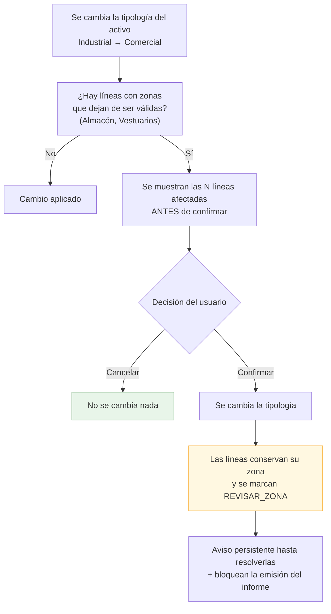

# Catálogos y taxonomías (complemento del entregable 8)

Este documento recoge los catálogos que la especificación revisada define en §3.3, y las decisiones
de modelado que exige cada uno. **Todos son datos, no código**: ampliarlos o corregirlos no requiere
despliegue.

---

## 5.0. Por qué los catálogos merecen documento propio

En la especificación revisada, buena parte del valor está en las **taxonomías**: una zona mal
clasificada rompe la agregación del informe, y un código CAPEX inventado impide comparar dos activos
de la misma cartera. Tres consecuencias de diseño:

| Decisión | Motivo |
|---|---|
| **Catálogo en tabla, no enumerado compilado** | El árbol de códigos tiene ~120 hojas y está incompleto (P-03). Cada corrección no puede ser una migración |
| **Semilla del sistema + extensión por organización** | `organization_id IS NULL` marca las filas del sistema, comunes y no editables; cada organización puede añadir las suyas sin tocar las demás |
| **Retirada por `deprecated_at`, nunca borrado** | Un código retirado debe seguir resolviéndose en informes antiguos, pero no ofrecerse al crear líneas nuevas |

---

## 5.1. Tipologías de activo

`[PDV]` **P-01: la especificación da dos listas distintas.**

| §3.1.3 (ficha de activo) | §3.3.1 (datos para el CAPEX) |
|---|---|
| oficinas · logística · retail · hotel · residencial · industrial · otra | Industrial · Oficinas · Hotel · Comercial · Sanitario · Otros |

Diferencias: *logística* y *residencial* solo están en la primera; *sanitario* solo en la segunda;
*retail* y *Comercial* parecen el mismo concepto con dos nombres.

### Propuesta de reconciliación `[REC]`

Un catálogo **único** de 8 tipologías. Las que la especificación no cubre en §3.3.2 heredan el juego
de zonas de la tipología más próxima, marcado como supuesto revisable:

| `code` | Nombre | Zonas que aplica | Campos específicos que muestra |
|---|---|---|---|
| `OFICINAS` | Oficinas | Juego «Oficinas» de §3.3.2 | Superficie alquilable |
| `INDUSTRIAL` | Industrial | Juego «Industrial» de §3.3.2 | Almacén: superficie y altura |
| `LOGISTICA` | Logística | Juego «Industrial» `[SUP]` | Almacén: superficie y altura |
| `COMERCIAL` | Comercial / Retail | Juego «Comercial» de §3.3.2 | Superficie alquilable |
| `HOTEL` | Hotel | Juego «Hotel» de §3.3.2 | — |
| `SANITARIO` | Sanitario | Juego «Sanitario» de §3.3.2 | — |
| `RESIDENCIAL` | Residencial | Juego «Oficinas» + «Habitaciones» `[SUP]` | Superficie alquilable |
| `OTROS` | Otros | **Todas las zonas**, sin filtrar `[SUP]` | — |

`[SUP]` Tres decisiones que conviene confirmar:
- **Logística = Industrial** a efectos de zonas. Es lo razonable: comparten almacén, muelles y
  vestuarios.
- **Residencial** no está en §3.3.2. Se le asigna el juego de oficinas más «Habitaciones», que es lo
  mínimo utilizable.
- **Otros** ofrece el catálogo completo en lugar de solo «–», porque un activo atípico sigue
  necesitando clasificar una cubierta o un cuadro técnico.

---

## 5.2. Zonas por tipología `[REQ]` §3.3.2

### Catálogo normalizado de zonas

Unión de las seis listas, deduplicada. 20 zonas:

| `code` | Nombre | Aparece en |
|---|---|---|
| `CUADROS_TECNICOS` | Cuadros técnicos | Todas |
| `APARCAMIENTO` | Aparcamiento | Todas |
| `OFICINAS` | Oficinas | Todas |
| `ASEOS` | Aseos | Todas |
| `CUBIERTA` | Cubierta | Todas |
| `ZONAS_EXTERIORES` | Zonas exteriores | Todas |
| `VESTIBULO_PRINCIPAL` | Vestíbulo principal | Todas |
| `NUCLEO_ESCALERAS` | Núcleo escaleras | Todas |
| `GENERAL` | General | Todas |
| `VESTIBULO_PLANTA` | Vestíbulo de planta | Oficinas, Hotel, Comercial, Sanitario |
| `SALAS_PERSONAL` | Salas de personal | Hotel, Comercial, Sanitario |
| `ALMACEN` | Almacén | Industrial |
| `VESTUARIOS` | Vestuarios | Industrial |
| `HABITACIONES` | Habitaciones | Hotel, Sanitario |
| `COCINA` | Cocina | Hotel |
| `RESTAURANTE` | Restaurante | Hotel, Comercial, Sanitario |
| `GIMNASIO` | Gimnasio | Hotel, Sanitario |
| `PISCINA` | Piscina | Hotel, Sanitario |
| `ZONA_COMERCIAL` | Zona comercial | Comercial |
| `SALAS_USO_SANITARIO` | Salas de uso sanitario | Sanitario |

> `[REC]` **Detalle menor con consecuencias:** la especificación escribe «Restaurante» en Hotel y
> Sanitario, y «Restaurantes» en Comercial. Se unifica en una sola zona `RESTAURANTE`. Dos filas
> distintas significarían dos identificadores para el mismo concepto, y cualquier comparación de
> cartera entre un hotel y un centro comercial daría dos líneas donde debería dar una.

### Matriz de disponibilidad

Tabla puente `zone_typology`. `●` = disponible.

| Zona | Oficinas | Industrial | Logística | Comercial | Hotel | Sanitario | Residencial | Otros |
|---|:--:|:--:|:--:|:--:|:--:|:--:|:--:|:--:|
| Cuadros técnicos | ● | ● | ● | ● | ● | ● | ● | ● |
| Aparcamiento | ● | ● | ● | ● | ● | ● | ● | ● |
| Oficinas | ● | ● | ● | ● | ● | ● | ● | ● |
| Aseos | ● | ● | ● | ● | ● | ● | ● | ● |
| Cubierta | ● | ● | ● | ● | ● | ● | ● | ● |
| Zonas exteriores | ● | ● | ● | ● | ● | ● | ● | ● |
| Vestíbulo principal | ● | ● | ● | ● | ● | ● | ● | ● |
| Núcleo escaleras | ● | ● | ● | ● | ● | ● | ● | ● |
| General | ● | ● | ● | ● | ● | ● | ● | ● |
| Vestíbulo de planta | ● | | | ● | ● | ● | ● | ● |
| Salas de personal | | | | ● | ● | ● | | ● |
| Almacén | | ● | ● | | | | | ● |
| Vestuarios | | ● | ● | | | | | ● |
| Habitaciones | | | | | ● | ● | ● | ● |
| Cocina | | | | | ● | | | ● |
| Restaurante | | | | ● | ● | ● | | ● |
| Gimnasio | | | | | ● | ● | | ● |
| Piscina | | | | | ● | ● | | ● |
| Zona comercial | | | | ● | | | | ● |
| Salas de uso sanitario | | | | | | ● | | ● |

`[REC]` **El valor «–» no es una fila.** Se representa como `zone_id IS NULL` con etiqueta de
presentación «–». Si fuera una fila del catálogo, toda agregación tendría que excluirla
explícitamente y antes o después alguien lo olvidaría, produciendo un informe con una categoría
llamada «–» y un importe detrás.

### Comportamiento al reclasificar un activo



`[REC]` **Nunca se borra la zona de una línea existente.** Borrar en silencio el trabajo de un
consultor porque alguien tocó un desplegable es inaceptable: se conserva, se marca y se avisa.

---

## 5.3. Árbol de códigos CAPEX `[REQ]` §3.3.4

### Estructura


### Nivel 1 · Categorías

| `code` | Nombre | Estado |
|---|---|---|
| `HC` | Hard Costs | ✅ Desarrollada (15 capítulos) |
| `MA` | Medioambiental | ⚠️ **Sin desglose** `[PDV]` P-03 |
| `ESG` | ESG & Energía | ⚠️ **Sin desglose** `[PDV]` P-03 |
| `SC` | Soft Costs | ⚠️ **Sin desglose** `[PDV]` P-03 |

`[REC]` Las tres sin desglose se siembran con un único capítulo `General` y un elemento `General`,
para que sean utilizables desde el primer día. En cuanto se reciba el desglose, se añade sin migración
de datos: las líneas ya codificadas como `MA.General` siguen siendo válidas.

### Nivel 2 y 3 · Hard Costs, completo

| Capítulo | Elementos |
|---|---|
| **H01. Estructura** | Cimentación · Solera · Forjados · Estructura · General |
| **H02. Cubierta** | Cubierta · General |
| **H03. Fachadas** | Fachadas · General |
| **H04. Interiores** | Particiones interiores y revestimientos interiores · Carpintería y cerrajería · Suelos y techos · General |
| **H05. Zonas exteriores** | Exteriores · General |
| **H06. Protección pasiva contra incendios** | Sectorización · Zonas de riesgo especial · Espacios ocultos y pasos de instalaciones · Resistencia al fuego de la estructura · Reacción al fuego de los elementos constructivos · Propagación exterior horizontal · Propagación exterior vertical · Propagación exterior por cubierta · Evacuación de ocupantes · General |
| **H07. Accesibilidad** | Accesibilidad desde el exterior · Accesibilidad entre plantas · Accesibilidad en las plantas · Dotación de plazas de aparcamiento accesibles · Dotación de servicios higiénicos accesibles · Mobiliario fijo · Evacuación de personas con discapacidad · Señalética SIA · Instalaciones · General |
| **H08. HVAC** | Producción de climatización · Producción de calor · Distribución · Grupos de presión · Elementos terminales · Humectación · Ventilación de aire primario · Extracción · Ventilación natural de humos · General |
| **H09. Electricidad** | Acometida-Centro de transformación · CGBT · BTV · Centralización de contadores · Cuadros secundarios de distribución · Batería de condensadores · Grupo electrógeno · Cableado · UPS · Alumbrado · Alumbrado de emergencia · Pararrayos · Red de tierras · Placas fotovoltaicas · General |
| **H10. Protección activa contra incendios** | Grupo de presión · Hidrantes · Aljibe · Columna seca · BIEs · Extintores portátiles · Extinción automática por gas · Detección de CO2 · Extracción de CO2 y ventilación del parking · Rociadores · Detección y alarma de incendios · Inspección RIPCI · Exutorios · General |
| **H11. Fontanería y saneamiento** | Acometida · Grupo de presión · Aljibes · Aseos · Producción de ACS · Saneamiento · Contribución mínima de renovables · General |
| **H12. Transporte vertical y puertas mecánicas** | Ascensor · Acceso al parking · Góndola · Escaleras mecánicas · Puerta de acceso principal · General |
| **H13. Seguridad, CCTV y BMS** | Control de accesos · Instalación CCTV · Central de seguridad · Sistemas de megafonía · BMS · General |
| **H14. Telecomunicaciones, voz y datos** | WIFI · PPV · Voz y datos · Interfono · General |
| **H15. Otros** | General |

**Totales de la semilla:** 4 categorías · 18 capítulos (15 de Hard Costs + 3 provisionales) ·
**121 elementos**.

### Codificación

`[REC]` Código jerárquico legible, estable y ordenable:

```
HC                    Categoría
HC.H09                Capítulo
HC.H09.10             Elemento (Alumbrado)
```

Se usa `ltree` en la columna `path` para consultar subárboles con una sola condición: «todo el CAPEX
de electricidad» es `path <@ 'HC.H09'`.

### Observaciones sobre el árbol

| # | Observación | Tratamiento |
|---|---|---|
| 1 | Todos los capítulos tienen un elemento **«General»** | Se conserva: es la vía de escape cuando el consultor no quiere afinar más. Es `is_selectable = true` |
| 2 | Aparece también un elemento **«–»** en cada capítulo | No se modela como fila: es `NULL`, como en las zonas |
| 3 | **«Grupo de presión»** aparece en H10 y en H11 | Son códigos distintos con el mismo nombre (`HC.H10.01` y `HC.H11.02`). Correcto: uno es de incendios y otro de fontanería. La interfaz muestra siempre el capítulo junto al elemento para evitar confusión `[REC]` |
| 4 | **«Aljibe»** (H10) y **«Aljibes»** (H11) | Mismo caso que el anterior; se conservan ambos, con su capítulo visible |
| 5 | **«Acometida»** aparece en H09 (Acometida-CT) y H11 (Acometida) | Ídem |
| 6 | H07 (Accesibilidad) tiene un elemento **«Instalaciones»** | Muy genérico; se conserva literal por fidelidad a la especificación, pero conviene confirmar su alcance |

---

## 5.4. Grados de riesgo `[REQ]` §3.3.4

Las cuatro definiciones se guardan **íntegras en base de datos**, no en el frontend, porque cumplen
dos funciones: ayudar al consultor a clasificar de forma homogénea, y volcarse al informe como
leyenda de la metodología.

| `code` | Nombre | `score` | Definición (literal de la especificación) |
|:--:|---|:--:|---|
| `01` | Bajo | 1 | Aspectos que harían al edificio mejorar la eficiencia y/o prestaciones del mismo, si bien no serían exigibles ni por incumplimiento de normativa, ni por reparación necesaria ni por renovación debida a la finalización de la vida útil. |
| `02` | Moderado | 2 | Anomalías debidas a la antigüedad (partes del inmueble que han rebasado su periodo de vida útil) que, si bien en la actualidad pueden no estar incidiendo negativa y sustancialmente en la actividad, creemos harán necesario articular su renovación en la operación. |
| `03` | Alto | 3 | Anomalías que pueden interpretarse como disconformes pero que admiten interpretación y podrían negociarse sin llegar a tener relevancia en la operación. |
| `04` | Extremo | 4 | Anomalías irrefutables que se prevén sean reclamados por el comprador exigiendo un compromiso de solución con plazo pactado. En este grupo se encuentran las anomalías que por su naturaleza inciden en el deterioro del edificio, pueden suponer un incumplimiento claro de la normativa en vigor y/o pueden tener incidencia en la actividad. |
| — | – | — | `NULL`: sin clasificar |

`[REC]` **La definición se muestra al elegir el grado**, no en un manual aparte. Estas cuatro
definiciones son un criterio profesional, no una etiqueta de color: si no están a la vista en el
momento de clasificar, cada consultor aplicará el suyo y la matriz de riesgos del informe dejará de
significar nada.

### Uso en la interfaz

```
Riesgo  ┌──────────────────────────────────────────────────────────┐
        │ ○ –                                                       │
        │ ○ 01 Bajo                                                 │
        │ ○ 02 Moderado                                             │
        │ ◉ 03 Alto                                                 │
        │   ┌────────────────────────────────────────────────────┐  │
        │   │ Anomalías que pueden interpretarse como            │  │
        │   │ disconformes pero que admiten interpretación y     │  │
        │   │ podrían negociarse sin llegar a tener relevancia   │  │
        │   │ en la operación.                                   │  │
        │   └────────────────────────────────────────────────────┘  │
        │ ○ 04 Extremo                                              │
        └──────────────────────────────────────────────────────────┘
```

Accesibilidad `[REQ]`: el grado nunca se representa **solo** por color. Siempre código + nombre, y el
color como refuerzo.

---

## 5.5. Conceptos `[REQ]` §3.3.3

| `code` | Nombre |
|---|---|
| `MANTENIMIENTO` | Mantenimiento |
| `REPARACION` | Reparación |
| `NORMATIVA` | Normativa |
| `MEJORA` | Mejora |
| `SEGURIDAD` | Seguridad |
| `VIDA_UTIL` | Vida útil |
| `SOFT_COST` | Soft Cost |
| `MEDIOAMBIENTAL` | Medioambiental |
| `ESG` | ESG |
| `OTRO` | Otro |
| — | – (`NULL`) |

> `[PDV]` **Solapamiento detectado.** Tres valores —`Soft Cost`, `Medioambiental` y `ESG`— aparecen a
> la vez como **concepto** (§3.3.3) y como **categoría del árbol de códigos** (§3.3.4). Una línea
> podría quedar codificada como `SC.General` con concepto `Soft Cost`, lo que es redundante, o como
> `HC.H09.10` con concepto `ESG`, lo que es contradictorio.
>
> **Propuesta** `[REC]`: mantener ambos campos, porque miden cosas distintas —el código dice *qué
> elemento del edificio*, el concepto dice *por qué se actúa*—, y añadir una **regla de coherencia
> blanda**: si la categoría del código es `SC`, `MA` o `ESG`, la interfaz propone el concepto
> equivalente y avisa si se elige otro. Aviso, no bloqueo: puede haber casos legítimos. Pendiente de
> confirmar con el cliente (P-14).

---

## 5.6. Horizontes temporales `[REQ]` §3.3.4

| `code` | Nombre | Años | Columna en `capex_item` |
|---|---|---|---|
| `CORTO` | Corto plazo | **1-2** `[SUP]` | `amount_short` |
| `MEDIO` | Medio plazo | 3-5 | `amount_mid` |
| `LARGO` | Largo plazo | 6-10 | `amount_long` |
| `MEJORAS` | Mejoras | — | `amount_improvements` |
| `OTRO` | Otro | — | `amount_other` |
| `TOTAL` | Total | — | `total_cost` (**calculado**) |

`[PDV]` **P-04: incoherencia en el rango del corto plazo.** El literal dice «Corto plazo (0-2 años)»
y la glosa dice «1 a 2 años». Se adopta **1-2 años**, configurable en el catálogo. Importa porque el
plan de inversión del informe suele presentarse por años y un desfase de un año descuadra la tabla.

**Sobre «Mejoras»** `[REQ]`: la especificación lo define como «mejoras a realizar por la propiedad
para incrementar el valor del activo». No es un horizonte temporal, sino una **naturaleza de gasto**
que convive con los tres plazos. Se modela como columna propia igual que los demás porque así aparece
en la tabla, pero conviene tenerlo presente: en las vistas por año, la columna «Mejoras» no se reparte
en el tiempo salvo que se le asigne `planned_year`. `[REC]`

**Sobre «Total»** `[REC]`: nunca es un campo escribible. Es
`amount_short + amount_mid + amount_long + amount_improvements + amount_other`, calculado en base de
datos. Un total tecleado a mano que no cuadra con sus sumandos es el defecto más común de las hojas de
cálculo que esta aplicación viene a sustituir.

---

## 5.7. Recuperable a inquilino `[REQ]` §3.3.3

| Valor | Significado |
|---|---|
| `SI` | El coste es repercutible al inquilino según contrato |
| `NO` | Lo asume la propiedad |
| `NA` | No aplica |
| `NULL` | – (sin determinar) |

`[REC]` Merece una vista propia en el CAPEX: «cuánto de estos 2,2 M€ recae realmente sobre la
propiedad» es una de las primeras preguntas de un inversor, y hoy suele calcularse a mano.

---

## 5.8. Sistemas técnicos y categorías de fotografía

`[REQ]` §3.2 propone una clasificación de fotografías de 14 categorías. Coincide en buena parte con
los capítulos de Hard Costs, pero no del todo.

| Categoría de foto (§3.2) | Capítulo equivalente |
|---|---|
| Fachada y envolvente | H03 |
| Cubierta | H02 |
| Estructura | H01 |
| Zonas interiores | H04 |
| Climatización | H08 |
| Electricidad | H09 |
| Fontanería y saneamiento | H11 |
| Protección contra incendios | H06 + H10 |
| Ascensores | H12 |
| Seguridad | H13 |
| Urbanización exterior | H05 |
| Accesibilidad | H07 |
| Sostenibilidad | ESG |
| Otros | H15 |

`[REC]` Se mantiene la clasificación de fotos como catálogo propio (`technical_system`) **mapeado** a
los capítulos, en lugar de fundirlos. Motivos: «Protección contra incendios» es una sola categoría
fotográfica pero dos capítulos de coste (pasiva y activa); y clasificar una foto en campo debe ser más
rápido y grueso que codificar una partida en gabinete. El mapeo permite, aun así, que al crear un
hallazgo desde una foto el capítulo venga propuesto.

---

## 5.9. Resumen de la semilla

Lo que se carga en la migración `seed_catalogs`:

| Catálogo | Filas | Origen |
|---|:--:|---|
| `asset_typology` | 8 | §3.1.3 + §3.3.1 reconciliados (P-01) |
| `zone` | 20 | §3.3.2 deduplicado |
| `zone_typology` | 106 | Matriz de §5.2 |
| `capex_code` nivel 1 | 4 | §3.3.4 |
| `capex_code` nivel 2 | 18 | 15 de Hard Costs + 3 provisionales (P-03) |
| `capex_code` nivel 3 | 121 | §3.3.4 |
| `risk_level` | 4 | §3.3.4, con definición íntegra |
| `capex_concept` | 10 | §3.3.3 |
| `time_horizon` | 5 + total | §3.3.4 |
| `technical_system` | 14 | §3.2 |
| `doc_request_category` | 5 | §3.1.5 |
| `phase_definition` | 8 | §3.1.5 |
| `specialty` | 10 | §3.1.4 |

Todas las filas de la semilla llevan `organization_id IS NULL` e `is_system = true`: son comunes,
versionadas con el código y no editables por el cliente. Lo que el cliente añada lleva su
`organization_id` y convive con ellas.
