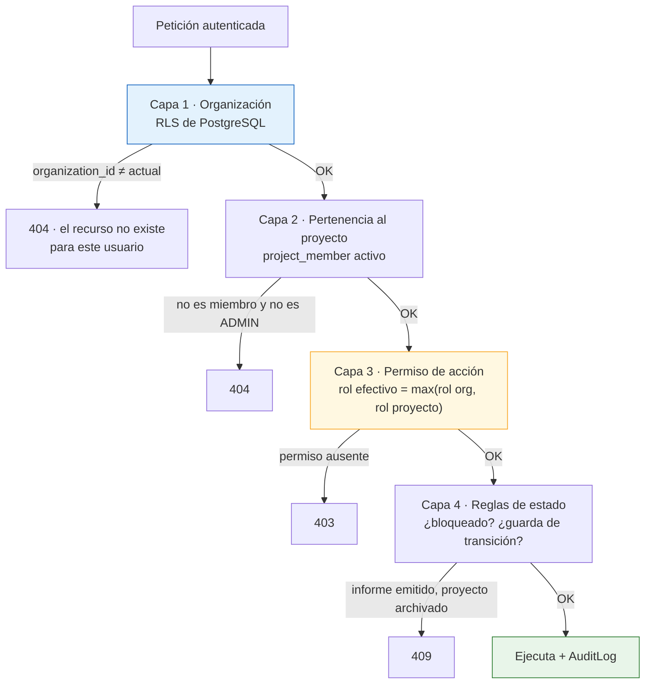

# 11. Matriz de roles y permisos

---

## 11.1. Modelo de autorización

Tres ámbitos, evaluados **siempre en el servidor**:



**Principios aplicados** `[REQ]`:

1. **Mínimo privilegio**: el rol por defecto de un nuevo miembro de proyecto es `LECTOR`.
2. **La interfaz oculta; el backend deniega.** Cada endpoint declara su permiso como dependencia
   de FastAPI. No hay endpoint sin declaración: una prueba de la suite recorre el router y **falla
   si algún endpoint carece de política de autorización**. `[REC]`
3. **404 en lugar de 403** cuando el recurso pertenece a otra organización, para no confirmar su
   existencia por sondeo de identificadores.
4. El rol efectivo es el **máximo** entre el rol de organización y el rol en el proyecto. Un
   `LECTOR` de la organización puede ser `CONSULTOR` en un proyecto concreto.
5. `ADMIN` **no** es omnipotente sobre el contenido: puede administrar, pero **no puede aprobar su
   propio informe** ni validar su propio precio si la organización activa la separación de
   funciones. `[REC]`

## 11.2. Roles

| Rol | Código | Perfil | Ámbito habitual |
|---|---|---|---|
| Administrador | `ADMIN` | Administra la organización, usuarios, catálogos y fuentes de precios | Organización |
| Director de proyecto | `DIRECTOR_PROYECTO` | Responsable del encargo: equipo, alcance, emisión | Proyecto |
| Consultor | `CONSULTOR` | Trabajo técnico completo: fotos, equipos, incidencias, CAPEX | Proyecto |
| Técnico especialista | `TECNICO_ESPECIALISTA` | Igual que consultor, **limitado a sus especialidades y activos asignados** | Activo + especialidad |
| Revisor | `REVISOR` | Revisa y aprueba; **no** modifica datos técnicos | Proyecto |
| Lector | `LECTOR` | Solo consulta; sin descarga de originales | Proyecto |

## 11.3. Matriz de permisos

Leyenda: **✅** permitido · **⚠️** permitido con restricción (nota al pie) · **❌** denegado

### Organización y usuarios

| Acción | ADMIN | DIR. PROY. | CONSULTOR | TÉC. ESP. | REVISOR | LECTOR |
|---|:--:|:--:|:--:|:--:|:--:|:--:|
| Ver ajustes de organización | ✅ | ⚠️¹ | ❌ | ❌ | ❌ | ❌ |
| Modificar ajustes de organización | ✅ | ❌ | ❌ | ❌ | ❌ | ❌ |
| Invitar / dar de baja usuarios | ✅ | ❌ | ❌ | ❌ | ❌ | ❌ |
| Asignar roles de organización | ✅ | ❌ | ❌ | ❌ | ❌ | ❌ |
| Ver directorio de usuarios | ✅ | ✅ | ✅ | ✅ | ✅ | ⚠️² |
| Gestionar catálogos (sistemas, especialidades) | ✅ | ⚠️³ | ❌ | ❌ | ❌ | ❌ |
| Gestionar perfiles de coste | ✅ | ✅ | ❌ | ❌ | ❌ | ❌ |
| **Gestionar fuentes de precios** | ✅ | ❌ | ❌ | ❌ | ❌ | ❌ |
| **Registrar revisión de condiciones de uso de una fuente** | ✅ | ❌ | ❌ | ❌ | ❌ | ❌ |
| Ejecutar política de borrado definitivo | ⚠️⁴ | ❌ | ❌ | ❌ | ❌ | ❌ |

### Clientes y proyectos

| Acción | ADMIN | DIR. PROY. | CONSULTOR | TÉC. ESP. | REVISOR | LECTOR |
|---|:--:|:--:|:--:|:--:|:--:|:--:|
| Crear cliente / contacto | ✅ | ✅ | ✅ | ❌ | ❌ | ❌ |
| Ver notas internas del cliente | ✅ | ✅ | ✅ | ❌ | ⚠️⁵ | ❌ |
| Crear proyecto | ✅ | ✅ | ✅ | ❌ | ❌ | ❌ |
| Ver proyecto | ⚠️⁶ | ✅ | ✅ | ✅ | ✅ | ✅ |
| Editar ficha del proyecto | ✅ | ✅ | ⚠️⁷ | ❌ | ❌ | ❌ |
| Cambiar estado del proyecto | ✅ | ✅ | ⚠️⁸ | ❌ | ⚠️⁹ | ❌ |
| Duplicar proyecto | ✅ | ✅ | ❌ | ❌ | ❌ | ❌ |
| Archivar / desarchivar | ✅ | ✅ | ❌ | ❌ | ❌ | ❌ |
| Borrar proyecto (lógico) | ✅ | ✅ | ❌ | ❌ | ❌ | ❌ |
| Gestionar miembros del equipo | ✅ | ✅ | ❌ | ❌ | ❌ | ❌ |
| Exportar datos del proyecto | ✅ | ✅ | ✅ | ⚠️¹⁰ | ✅ | ❌ |

### Activos

| Acción | ADMIN | DIR. PROY. | CONSULTOR | TÉC. ESP. | REVISOR | LECTOR |
|---|:--:|:--:|:--:|:--:|:--:|:--:|
| Crear / editar activo | ✅ | ✅ | ✅ | ❌ | ❌ | ❌ |
| Borrar activo | ✅ | ✅ | ⚠️¹¹ | ❌ | ❌ | ❌ |
| Gestionar zonas / plantas / espacios | ✅ | ✅ | ✅ | ⚠️¹⁰ | ❌ | ❌ |
| Geocodificar | ✅ | ✅ | ✅ | ⚠️¹⁰ | ❌ | ❌ |

### Fotografías y documentos

| Acción | ADMIN | DIR. PROY. | CONSULTOR | TÉC. ESP. | REVISOR | LECTOR |
|---|:--:|:--:|:--:|:--:|:--:|:--:|
| Subir fotografías | ✅ | ✅ | ✅ | ⚠️¹⁰ | ❌ | ❌ |
| Ver miniaturas y previsualización | ✅ | ✅ | ✅ | ✅ | ✅ | ✅ |
| **Descargar original** | ✅ | ✅ | ✅ | ⚠️¹⁰ | ✅ | ❌ |
| Descargar lote (ZIP) | ✅ | ✅ | ✅ | ⚠️¹⁰ | ✅ | ❌ |
| Renombrar (individual y lote) | ✅ | ✅ | ✅ | ⚠️¹⁰ | ❌ | ❌ |
| Clasificar / etiquetar / describir | ✅ | ✅ | ✅ | ⚠️¹⁰ | ⚠️¹² | ❌ |
| Crear versión anotada | ✅ | ✅ | ✅ | ⚠️¹⁰ | ❌ | ❌ |
| **Sobrescribir el original** | ❌ | ❌ | ❌ | ❌ | ❌ | ❌ |
| Enviar a papelera | ✅ | ✅ | ✅ | ⚠️¹⁰ | ❌ | ❌ |
| Recuperar de papelera | ✅ | ✅ | ✅ | ❌ | ❌ | ❌ |
| Vaciar papelera definitivamente | ⚠️⁴ | ❌ | ❌ | ❌ | ❌ | ❌ |
| Seleccionar y ordenar fotos del informe | ✅ | ✅ | ✅ | ⚠️¹⁰ | ⚠️¹² | ❌ |
| Subir documentos | ✅ | ✅ | ✅ | ⚠️¹⁰ | ❌ | ❌ |
| Ver documentos `RESTRINGIDO` | ✅ | ✅ | ⚠️¹³ | ❌ | ⚠️¹³ | ❌ |

> **La fila «Sobrescribir el original» es ❌ para todos los roles, incluido `ADMIN`.** No es una
> cuestión de permisos: no existe ninguna operación en el sistema que lo permita. `[REQ]`

### Inventario e incidencias

| Acción | ADMIN | DIR. PROY. | CONSULTOR | TÉC. ESP. | REVISOR | LECTOR |
|---|:--:|:--:|:--:|:--:|:--:|:--:|
| Crear / editar equipo | ✅ | ✅ | ✅ | ⚠️¹⁰ | ❌ | ❌ |
| Importar inventario | ✅ | ✅ | ✅ | ❌ | ❌ | ❌ |
| Crear / editar incidencia | ✅ | ✅ | ✅ | ⚠️¹⁰ | ❌ | ❌ |
| Cambiar criticidad y riesgo | ✅ | ✅ | ✅ | ⚠️¹⁰ | ⚠️¹⁴ | ❌ |
| **Validar incidencia** (→ `VALIDADA`) | ✅ | ✅ | ❌ | ❌ | ✅ | ❌ |
| **Descartar incidencia** | ✅ | ✅ | ❌ | ❌ | ✅ | ❌ |
| Comentarios de revisor | ✅ | ✅ | ❌ | ❌ | ✅ | ❌ |
| Borrar incidencia (lógico) | ✅ | ✅ | ⚠️¹¹ | ❌ | ❌ | ❌ |

### CAPEX y precios

| Acción | ADMIN | DIR. PROY. | CONSULTOR | TÉC. ESP. | REVISOR | LECTOR |
|---|:--:|:--:|:--:|:--:|:--:|:--:|
| Crear / editar partida | ✅ | ✅ | ✅ | ⚠️¹⁰ | ❌ | ❌ |
| Editar cantidad y precio unitario | ✅ | ✅ | ✅ | ⚠️¹⁰ | ❌ | ❌ |
| Editar porcentajes por línea | ✅ | ✅ | ✅ | ❌ | ❌ | ❌ |
| Cambiar el perfil de costes del proyecto | ✅ | ✅ | ❌ | ❌ | ❌ | ❌ |
| Buscar referencias de precio | ✅ | ✅ | ✅ | ✅ | ✅ | ❌ |
| Registrar precio manual (con justificación) | ✅ | ✅ | ✅ | ⚠️¹⁰ | ❌ | ❌ |
| **Validar un precio** | ✅ | ✅ | ✅ | ❌ | ✅ | ❌ |
| Aplicar índices y factores geográficos | ✅ | ✅ | ✅ | ❌ | ❌ | ❌ |
| Definir escenarios bajo/probable/alto | ✅ | ✅ | ✅ | ❌ | ❌ | ❌ |
| Ver todas las vistas de CAPEX | ✅ | ✅ | ✅ | ⚠️¹⁰ | ✅ | ✅ |
| Exportar CAPEX (XLSX/CSV) | ✅ | ✅ | ✅ | ⚠️¹⁰ | ✅ | ❌ |
| **Aprobar el CAPEX del proyecto** | ❌ | ✅ | ❌ | ❌ | ✅ | ❌ |

> **Ningún rol puede establecer un precio como validado de forma automática.** La validación es
> siempre un acto de un usuario identificado, y ese usuario queda registrado en la partida y en la
> auditoría. `[REQ]`

### Informes

| Acción | ADMIN | DIR. PROY. | CONSULTOR | TÉC. ESP. | REVISOR | LECTOR |
|---|:--:|:--:|:--:|:--:|:--:|:--:|
| Subir plantilla PPTX | ✅ | ✅ | ✅ | ❌ | ❌ | ❌ |
| Ver estructura detectada | ✅ | ✅ | ✅ | ✅ | ✅ | ❌ |
| Mapear marcadores | ✅ | ✅ | ✅ | ❌ | ❌ | ❌ |
| Guardar / clonar mapeo | ✅ | ✅ | ✅ | ❌ | ❌ | ❌ |
| Generar previsualización | ✅ | ✅ | ✅ | ❌ | ✅ | ❌ |
| Generar versión de informe | ✅ | ✅ | ✅ | ❌ | ❌ | ❌ |
| Generar con avisos bloqueantes (`force`) | ⚠️¹⁵ | ⚠️¹⁵ | ❌ | ❌ | ❌ | ❌ |
| Enviar a revisión | ✅ | ✅ | ✅ | ❌ | ❌ | ❌ |
| **Aprobar / rechazar versión** | ⚠️¹⁶ | ✅ | ❌ | ❌ | ✅ | ❌ |
| **Emitir informe** | ✅ | ✅ | ❌ | ❌ | ❌ | ❌ |
| Descargar informe emitido | ✅ | ✅ | ✅ | ⚠️¹⁰ | ✅ | ⚠️¹⁷ |
| Modificar informe emitido | ❌ | ❌ | ❌ | ❌ | ❌ | ❌ |
| Ver historial de versiones y diferencias | ✅ | ✅ | ✅ | ✅ | ✅ | ✅ |

### Colaboración y auditoría

| Acción | ADMIN | DIR. PROY. | CONSULTOR | TÉC. ESP. | REVISOR | LECTOR |
|---|:--:|:--:|:--:|:--:|:--:|:--:|
| Comentar y mencionar | ✅ | ✅ | ✅ | ✅ | ✅ | ⚠️¹⁸ |
| Ver comentarios internos | ✅ | ✅ | ✅ | ✅ | ✅ | ❌ |
| Resolver comentarios | ✅ | ✅ | ✅ | ⚠️¹⁹ | ✅ | ❌ |
| Ver historial de cambios del proyecto | ✅ | ✅ | ✅ | ✅ | ✅ | ⚠️²⁰ |
| **Ver registro de auditoría** | ✅ | ⚠️²¹ | ❌ | ❌ | ❌ | ❌ |
| Exportar registro de auditoría | ✅ | ❌ | ❌ | ❌ | ❌ | ❌ |
| **Modificar o borrar auditoría** | ❌ | ❌ | ❌ | ❌ | ❌ | ❌ |

### Notas de restricción

1. Solo lectura de moneda, unidades e idioma; no de facturación ni límites.
2. Solo los miembros de los proyectos en los que participa.
3. Puede proponer altas de catálogo; quedan pendientes de aprobación de `ADMIN`.
4. Requiere doble confirmación, motivo obligatorio y queda auditado con severidad `CRITICO`.
5. Solo si el `DIRECTOR_PROYECTO` lo habilita explícitamente para ese proyecto.
6. `ADMIN` **no ve por defecto** el contenido de proyectos en los que no es miembro. Puede
   autoconcederse acceso, pero la acción queda auditada como `ADMIN_ACCESS_GRANT` con severidad
   `CRITICO`. `[REC]` Esto evita que el rol técnico se convierta en una puerta trasera silenciosa a
   información confidencial de clientes.
7. Todo excepto código interno, cliente, moneda y fechas límite.
8. Solo transiciones hasta `EN_ANALISIS`; no puede emitir ni cerrar.
9. Solo `EN_REVISION → EN_ANALISIS` (devolver con comentarios).
10. Limitado a los activos asignados y a sus especialidades (`asset_assignment`).
11. Solo si es quien lo creó y no está referenciado por incidencias, partidas o informes emitidos.
12. Solo puede desmarcar una foto del informe, no editar su clasificación técnica.
13. Requiere permiso explícito por documento, otorgado por el director del proyecto.
14. Puede proponer un cambio de criticidad como comentario; no lo aplica directamente.
15. Requiere motivo escrito. Se audita como `REPORT_FORCED_GENERATION` con severidad `AVISO`.
16. Solo si `ADMIN` no es también el autor de la versión (separación de funciones, configurable).
17. Solo si el director del proyecto marca la versión como visible para lectores.
18. Solo comentarios no internos.
19. Solo los que ha abierto él.
20. Solo cambios de las entidades que puede ver.
21. Solo los eventos de sus propios proyectos.

## 11.4. Permisos como datos

`role.permissions` es JSONB con permisos declarativos en formato `recurso:accion[:ámbito]`, lo que
permite crear roles personalizados sin desplegar código. `[REC]`

```json
{
  "role": "CONSULTOR",
  "permissions": [
    "project:read", "project:update:limited",
    "asset:create", "asset:update", "asset:delete:own",
    "photo:upload", "photo:read", "photo:download", "photo:rename",
    "photo:annotate", "photo:trash", "photo:restore",
    "equipment:*", "finding:create", "finding:update",
    "capex:create", "capex:update", "capex:price:validate",
    "report:template:upload", "report:mapping:edit",
    "report:preview", "report:generate", "report:submit_review",
    "comment:*", "export:project", "export:capex"
  ],
  "denied": [
    "photo:overwrite_original",
    "report:approve", "report:issue",
    "audit:read", "audit:export",
    "data:hard_delete"
  ]
}
```

`denied` **prevalece siempre** sobre `permissions`, incluso ante comodines. Así,
`photo:overwrite_original` y `data:hard_delete` pueden declararse denegados de forma explícita en
todos los roles. `[REC]`

## 11.5. Pruebas de la matriz

`[REQ]` §13 exige pruebas de permisos. La matriz de este documento se traduce en un **fichero de
datos** (`tests/fixtures/permission_matrix.yaml`) que la suite recorre de forma paramétrica: para
cada combinación rol × endpoint, se comprueba que la respuesta es la esperada (2xx, 403 o 404). Si
alguien añade un endpoint sin actualizar la matriz, la prueba falla.

Casos que se prueban explícitamente:

| Caso | Resultado esperado |
|---|---|
| Usuario de organización A solicita proyecto de organización B | `404`, y `ACCESS_DENIED` en auditoría |
| `LECTOR` intenta descargar el original de una foto | `403` |
| `TECNICO_ESPECIALISTA` intenta editar un activo no asignado | `403` |
| `CONSULTOR` intenta aprobar una versión de informe | `403` |
| Cualquier rol intenta `PATCH` sobre `storage_key` de una foto | `422` |
| Cualquier rol intenta modificar un `report_version` con `is_locked` | `409 REPORT_LOCKED` |
| Cualquier rol intenta `DELETE /audit-logs/{id}` | `405` (el endpoint no existe) |
| Token con `organization_id` manipulado | `401` (firma inválida) |
| `ADMIN` accede a proyecto ajeno | Permitido, pero auditado con severidad `CRITICO` |
| Escritura sobre proyecto `ARCHIVADO` | `409` |
