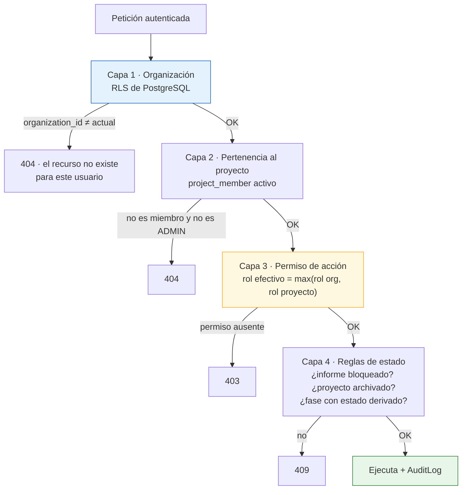

# 11. Matriz de roles y permisos

---

## 11.1. Modelo de autorización



**Principios** `[REQ]`:

1. **Mínimo privilegio**: el rol por defecto de un nuevo miembro es `LECTOR`.
2. **La interfaz oculta; el backend deniega.** Cada endpoint declara su permiso como dependencia. Una
   prueba recorre el router y **falla si algún endpoint carece de política**. `[REC]`
3. **`404` en lugar de `403`** entre organizaciones, para no confirmar existencia por sondeo.
4. El rol efectivo es el **máximo** entre organización y proyecto.
5. `ADMIN` **no es omnipotente sobre el contenido**: puede administrar, pero su acceso a un proyecto
   del que no es miembro queda auditado como evento crítico. `[REC]` Evita que el rol técnico sea una
   puerta trasera silenciosa a información confidencial de clientes.

## 11.2. Roles `[REQ]`

| Rol | Código | Perfil | Ámbito |
|---|---|---|---|
| Administrador | `ADMIN` | Organización, usuarios, catálogos, fuentes de precios | Organización |
| Director de proyecto | `DIRECTOR_PROYECTO` | Responsable del encargo: equipo, fases, emisión | Proyecto |
| Consultor | `CONSULTOR` | Trabajo técnico completo | Proyecto |
| Técnico especialista | `TECNICO_ESPECIALISTA` | Como consultor, **limitado a sus activos y especialidades** | Activo + especialidad |
| Revisor | `REVISOR` | Revisa y aprueba; no modifica datos técnicos | Proyecto |
| Lector | `LECTOR` | Solo consulta; sin descarga de originales | Proyecto |

## 11.3. Matriz de permisos

**✅** permitido · **⚠️** con restricción (nota al pie) · **❌** denegado

### Organización, usuarios y catálogos

| Acción | ADMIN | DIR. | CONS. | TÉC. | REV. | LECT. |
|---|:--:|:--:|:--:|:--:|:--:|:--:|
| Ver / modificar ajustes de organización | ✅ | ⚠️¹/❌ | ❌ | ❌ | ❌ | ❌ |
| Invitar y dar de baja usuarios · asignar roles de organización | ✅ | ❌ | ❌ | ❌ | ❌ | ❌ |
| Ver directorio de usuarios | ✅ | ✅ | ✅ | ✅ | ✅ | ⚠️² |
| **Ver catálogos** (zonas, códigos, riesgos, conceptos) | ✅ | ✅ | ✅ | ✅ | ✅ | ✅ |
| **Modificar catálogos de organización** | ✅ | ⚠️³ | ❌ | ❌ | ❌ | ❌ |
| **Modificar catálogos del sistema** | ❌ | ❌ | ❌ | ❌ | ❌ | ❌ |
| Retirar (`deprecate`) un código CAPEX | ✅ | ❌ | ❌ | ❌ | ❌ | ❌ |
| Gestionar perfiles de coste | ✅ | ✅ | ❌ | ❌ | ❌ | ❌ |
| **Gestionar fuentes de precios** | ✅ | ❌ | ❌ | ❌ | ❌ | ❌ |
| **Registrar revisión de condiciones de uso de una fuente** | ✅ | ❌ | ❌ | ❌ | ❌ | ❌ |
| Ejecutar política de borrado definitivo | ⚠️⁴ | ❌ | ❌ | ❌ | ❌ | ❌ |

> Los catálogos del sistema (los 121 códigos, las 20 zonas, los 4 grados de riesgo) **no son editables
> por nadie desde la aplicación**: se versionan con el código y se cambian por migración. Una
> organización puede *añadir* los suyos, no alterar los comunes. `[REC]` Es lo que garantiza que dos
> proyectos de dos consultoras sigan siendo comparables.

### Clientes y proyectos

| Acción | ADMIN | DIR. | CONS. | TÉC. | REV. | LECT. |
|---|:--:|:--:|:--:|:--:|:--:|:--:|
| Crear cliente y contactos | ✅ | ✅ | ✅ | ❌ | ❌ | ❌ |
| Ver notas internas del cliente | ✅ | ✅ | ✅ | ❌ | ⚠️⁵ | ❌ |
| Crear proyecto | ✅ | ✅ | ✅ | ❌ | ❌ | ❌ |
| Ver proyecto | ⚠️⁶ | ✅ | ✅ | ✅ | ✅ | ✅ |
| Editar ficha del proyecto | ✅ | ✅ | ⚠️⁷ | ❌ | ❌ | ❌ |
| Cambiar estado del proyecto | ✅ | ✅ | ⚠️⁸ | ❌ | ⚠️⁹ | ❌ |
| Duplicar · archivar · borrar (lógico) | ✅ | ✅ | ❌ | ❌ | ❌ | ❌ |
| Gestionar miembros del equipo | ✅ | ✅ | ❌ | ❌ | ❌ | ❌ |
| Exportar datos del proyecto | ✅ | ✅ | ✅ | ⚠️¹⁰ | ✅ | ❌ |

### Fases del proceso

| Acción | ADMIN | DIR. | CONS. | TÉC. | REV. | LECT. |
|---|:--:|:--:|:--:|:--:|:--:|:--:|
| **Marcar qué fases aplican al proyecto** | ✅ | ✅ | ⚠️¹¹ | ❌ | ❌ | ❌ |
| Asignar responsable de fase y fechas | ✅ | ✅ | ❌ | ❌ | ❌ | ❌ |
| Cambiar estado de una fase | ✅ | ✅ | ⚠️¹² | ⚠️¹² | ❌ | ❌ |
| **Cambiar estado de una fase derivada** (Red Flag/CAPEX, Full Report) | ❌ | ❌ | ❌ | ❌ | ❌ | ❌ |
| Gestionar checklist de solicitud de documentación | ✅ | ✅ | ✅ | ⚠️¹⁰ | ❌ | ❌ |
| Adjuntar documentos recibidos | ✅ | ✅ | ✅ | ⚠️¹⁰ | ❌ | ❌ |
| **Registrar o modificar el enlace del VDR** | ✅ | ✅ | ⚠️¹³ | ❌ | ❌ | ❌ |
| Ver el enlace del VDR | ✅ | ✅ | ✅ | ✅ | ✅ | ⚠️¹⁴ |
| Agendar y completar visitas | ✅ | ✅ | ✅ | ⚠️¹⁰ | ❌ | ❌ |
| Gestionar rondas de Q&A y subir el Excel | ✅ | ✅ | ✅ | ❌ | ⚠️¹⁵ | ❌ |
| Registrar presentación y defensa | ✅ | ✅ | ⚠️¹⁶ | ❌ | ❌ | ❌ |

> El estado de las fases derivadas es **❌ para todos los roles, incluido `ADMIN`**. No es una cuestión
> de permisos: no existe la operación. Lo calcula `PhaseEngine` a partir del trabajo real. `[REC]`

### Activos

| Acción | ADMIN | DIR. | CONS. | TÉC. | REV. | LECT. |
|---|:--:|:--:|:--:|:--:|:--:|:--:|
| Crear y editar activo | ✅ | ✅ | ✅ | ❌ | ❌ | ❌ |
| **Cambiar la tipología de un activo** | ✅ | ✅ | ⚠️¹⁷ | ❌ | ❌ | ❌ |
| Borrar activo | ✅ | ✅ | ⚠️¹⁸ | ❌ | ❌ | ❌ |
| Gestionar zonas, plantas y espacios · geocodificar | ✅ | ✅ | ✅ | ⚠️¹⁰ | ❌ | ❌ |

### Fotografías y documentos

| Acción | ADMIN | DIR. | CONS. | TÉC. | REV. | LECT. |
|---|:--:|:--:|:--:|:--:|:--:|:--:|
| Subir fotografías | ✅ | ✅ | ✅ | ⚠️¹⁰ | ❌ | ❌ |
| Ver miniaturas y previsualización | ✅ | ✅ | ✅ | ✅ | ✅ | ✅ |
| **Descargar original** | ✅ | ✅ | ✅ | ⚠️¹⁰ | ✅ | ❌ |
| Descargar lote (ZIP) | ✅ | ✅ | ✅ | ⚠️¹⁰ | ✅ | ❌ |
| Renombrar (individual y lote) | ✅ | ✅ | ✅ | ⚠️¹⁰ | ❌ | ❌ |
| Clasificar, etiquetar, describir | ✅ | ✅ | ✅ | ⚠️¹⁰ | ⚠️¹⁹ | ❌ |
| Crear versión anotada | ✅ | ✅ | ✅ | ⚠️¹⁰ | ❌ | ❌ |
| **Sobrescribir el original** | ❌ | ❌ | ❌ | ❌ | ❌ | ❌ |
| Papelera · recuperar | ✅ | ✅ | ✅ | ⚠️¹⁰/❌ | ❌ | ❌ |
| Vaciar papelera definitivamente | ⚠️⁴ | ❌ | ❌ | ❌ | ❌ | ❌ |
| Seleccionar y ordenar fotos del informe | ✅ | ✅ | ✅ | ⚠️¹⁰ | ⚠️¹⁹ | ❌ |
| Ver documentos `RESTRINGIDO` | ✅ | ✅ | ⚠️²⁰ | ❌ | ⚠️²⁰ | ❌ |

> **«Sobrescribir el original» es ❌ para todos los roles, incluido `ADMIN`.** No existe ninguna
> operación en el sistema que lo permita. `[REQ]` §9

### Hallazgos y CAPEX

| Acción | ADMIN | DIR. | CONS. | TÉC. | REV. | LECT. |
|---|:--:|:--:|:--:|:--:|:--:|:--:|
| Crear y editar línea (hallazgo + partida) | ✅ | ✅ | ✅ | ⚠️¹⁰ | ❌ | ❌ |
| Asignar código, zona, riesgo y concepto | ✅ | ✅ | ✅ | ⚠️¹⁰ | ⚠️²¹ | ❌ |
| Introducir importes por horizonte | ✅ | ✅ | ✅ | ⚠️¹⁰ | ❌ | ❌ |
| Editar porcentajes de la cascada por línea | ✅ | ✅ | ✅ | ❌ | ❌ | ❌ |
| Cambiar el perfil de costes del proyecto | ✅ | ✅ | ❌ | ❌ | ❌ | ❌ |
| Marcar recuperable a inquilino | ✅ | ✅ | ✅ | ⚠️¹⁰ | ❌ | ❌ |
| Buscar referencias de precio | ✅ | ✅ | ✅ | ✅ | ✅ | ❌ |
| Registrar precio manual (con justificación) | ✅ | ✅ | ✅ | ⚠️¹⁰ | ❌ | ❌ |
| **Validar un precio** | ✅ | ✅ | ✅ | ❌ | ✅ | ❌ |
| Aplicar índices y factores geográficos | ✅ | ✅ | ✅ | ❌ | ❌ | ❌ |
| **Validar un hallazgo** (→ `VALIDADO`) | ✅ | ✅ | ❌ | ❌ | ✅ | ❌ |
| **Descartar un hallazgo** | ✅ | ✅ | ❌ | ❌ | ✅ | ❌ |
| Ver todas las vistas de CAPEX | ✅ | ✅ | ✅ | ⚠️¹⁰ | ✅ | ✅ |
| Exportar CAPEX (XLSX/CSV) | ✅ | ✅ | ✅ | ⚠️¹⁰ | ✅ | ❌ |
| **Aprobar el CAPEX del proyecto** | ❌ | ✅ | ❌ | ❌ | ✅ | ❌ |

> **Ningún rol puede establecer un precio como validado de forma automática.** La validación es
> siempre un acto de un usuario identificado, registrado en la línea y en la auditoría. `[REQ]` §9

### Informes

| Acción | ADMIN | DIR. | CONS. | TÉC. | REV. | LECT. |
|---|:--:|:--:|:--:|:--:|:--:|:--:|
| Subir plantilla PPTX · mapear marcadores | ✅ | ✅ | ✅ | ❌ | ❌ | ❌ |
| Ver estructura detectada | ✅ | ✅ | ✅ | ✅ | ✅ | ❌ |
| Generar previsualización | ✅ | ✅ | ✅ | ❌ | ✅ | ❌ |
| Generar versión de informe | ✅ | ✅ | ✅ | ❌ | ❌ | ❌ |
| Generar con avisos bloqueantes (`force`) | ⚠️²² | ⚠️²² | ❌ | ❌ | ❌ | ❌ |
| Enviar a revisión | ✅ | ✅ | ✅ | ❌ | ❌ | ❌ |
| **Aprobar o rechazar versión** | ⚠️²³ | ✅ | ❌ | ❌ | ✅ | ❌ |
| **Emitir informe** | ✅ | ✅ | ❌ | ❌ | ❌ | ❌ |
| Descargar informe emitido | ✅ | ✅ | ✅ | ⚠️¹⁰ | ✅ | ⚠️²⁴ |
| **Modificar informe emitido** | ❌ | ❌ | ❌ | ❌ | ❌ | ❌ |
| Ver historial de versiones y diferencias | ✅ | ✅ | ✅ | ✅ | ✅ | ✅ |

### Colaboración y auditoría

| Acción | ADMIN | DIR. | CONS. | TÉC. | REV. | LECT. |
|---|:--:|:--:|:--:|:--:|:--:|:--:|
| Comentar y mencionar | ✅ | ✅ | ✅ | ✅ | ✅ | ⚠️²⁵ |
| Ver comentarios internos | ✅ | ✅ | ✅ | ✅ | ✅ | ❌ |
| Ver historial de cambios del proyecto | ✅ | ✅ | ✅ | ✅ | ✅ | ⚠️²⁶ |
| **Ver registro de auditoría** | ✅ | ⚠️²⁷ | ❌ | ❌ | ❌ | ❌ |
| Exportar registro de auditoría | ✅ | ❌ | ❌ | ❌ | ❌ | ❌ |
| **Modificar o borrar auditoría** | ❌ | ❌ | ❌ | ❌ | ❌ | ❌ |

### Notas de restricción

1. Solo lectura de moneda, unidades e idioma; no de facturación ni límites.
2. Solo los miembros de proyectos en los que participa.
3. Puede proponer altas de catálogo; quedan pendientes de aprobación de `ADMIN`.
4. Doble confirmación, motivo obligatorio, auditado con severidad `CRITICO`.
5. Solo si el director del proyecto lo habilita para ese proyecto.
6. `ADMIN` no ve por defecto el contenido de proyectos donde no es miembro. Puede autoconcederse
   acceso, y la acción se audita como `ADMIN_ACCESS_GRANT` con severidad `CRITICO`.
7. Todo excepto código interno, cliente, moneda y fechas límite.
8. Solo transiciones hasta `EN_ANALISIS`; no puede emitir ni cerrar.
9. Solo `EN_REVISION → EN_ANALISIS` (devolver con comentarios).
10. Limitado a los activos asignados y a sus especialidades (`asset_assignment`).
11. Solo mientras el proyecto está en `BORRADOR`.
12. Solo de las fases de las que es responsable, y solo entre `PENDIENTE`, `EN_CURSO` y `BLOQUEADA`.
    Marcar `COMPLETADA` requiere director.
13. Puede registrarlo la primera vez; modificarlo o desactivarlo requiere director. `[REC]` El enlace
    al VDR es la puerta a la documentación confidencial del cliente: cambiarlo no debe ser trivial.
14. Solo si el director lo marca visible para lectores.
15. Solo lectura de las rondas.
16. Solo puede registrar; editar tras el evento requiere director.
17. Requiere confirmación explícita si hay líneas cuya zona dejaría de ser válida (§5.2).
18. Solo si lo creó y no está referenciado por hallazgos, líneas o informes emitidos.
19. Solo puede desmarcar una foto del informe, no editar su clasificación técnica.
20. Requiere permiso explícito por documento, otorgado por el director.
21. Puede proponer un cambio de riesgo como comentario; no lo aplica directamente.
22. Requiere motivo escrito. Se audita como `REPORT_FORCED_GENERATION`.
23. Solo si `ADMIN` no es también el autor de la versión (separación de funciones, configurable).
24. Solo si el director marca la versión visible para lectores.
25. Solo comentarios no internos.
26. Solo cambios de las entidades que puede ver.
27. Solo los eventos de sus propios proyectos.

## 11.4. Permisos como datos

`role.permissions` es JSONB con permisos declarativos `recurso:accion[:ámbito]`, lo que permite crear
roles personalizados sin desplegar código. `[REC]`

```json
{
  "role": "CONSULTOR",
  "permissions": [
    "project:read", "project:update:limited",
    "phase:update:owned", "doc_request:*", "visit:*", "qa:*",
    "vdr:create",
    "asset:create", "asset:update", "asset:delete:own",
    "photo:upload", "photo:read", "photo:download", "photo:rename",
    "photo:annotate", "photo:trash", "photo:restore",
    "finding:create", "finding:update",
    "capex:create", "capex:update", "capex:price:validate",
    "report:template:upload", "report:mapping:edit",
    "report:preview", "report:generate", "report:submit_review",
    "comment:*", "export:project", "export:capex"
  ],
  "denied": [
    "photo:overwrite_original",
    "phase:update:derived",
    "catalog:system:update",
    "finding:validate", "finding:discard",
    "report:approve", "report:issue",
    "audit:read", "audit:export",
    "data:hard_delete"
  ]
}
```

`denied` **prevalece siempre** sobre `permissions`, incluso ante comodines. Así,
`photo:overwrite_original`, `phase:update:derived`, `catalog:system:update` y `data:hard_delete`
pueden declararse denegados de forma explícita en **todos** los roles. `[REC]`

## 11.5. Pruebas de la matriz

`[REQ]` §13. La matriz se traduce en un fichero de datos
(`tests/fixtures/permission_matrix.yaml`) que la suite recorre de forma paramétrica: para cada
combinación rol × endpoint se comprueba la respuesta esperada. Si alguien añade un endpoint sin
actualizar la matriz, **la prueba falla**.

Casos probados explícitamente:

| Caso | Resultado esperado |
|---|---|
| Organización A solicita un proyecto de B | `404` + `ACCESS_DENIED` en auditoría |
| `LECTOR` descarga el original de una foto | `403` |
| `TECNICO_ESPECIALISTA` edita un activo no asignado | `403` |
| Cualquier rol cambia el estado de una fase derivada | `422 PHASE_STATUS_IS_DERIVED` |
| Cualquier rol modifica un catálogo del sistema | `403` |
| Crear una línea con una zona no válida para la tipología | `422 ZONE_NOT_ALLOWED_FOR_TYPOLOGY` |
| Crear una línea con un código de nivel 1 o 2 | `422 CAPEX_CODE_NOT_SELECTABLE` |
| Crear una línea con un código retirado | `422 CAPEX_CODE_DEPRECATED` |
| `PATCH` sobre `storage_key` de una foto | `422` |
| Modificar un `report_version` bloqueado | `409 REPORT_LOCKED` |
| `DELETE /audit-logs/{id}` | `405` (el endpoint no existe) |
| Token con `organization_id` manipulado | `401` |
| `ADMIN` accede a proyecto ajeno | Permitido, auditado con severidad `CRITICO` |
| Escritura sobre proyecto `ARCHIVADO` | `409` |
