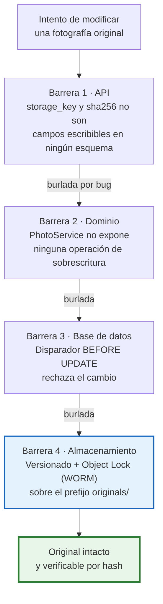
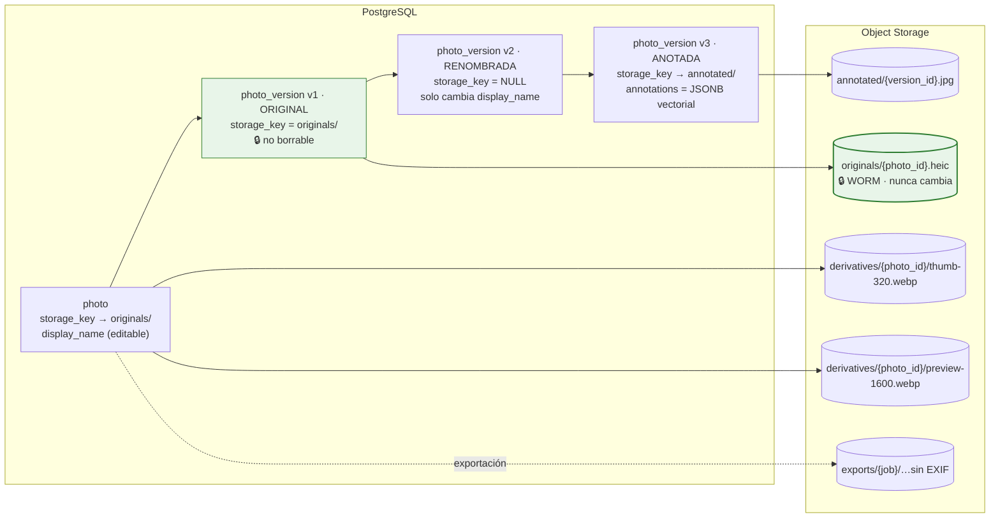
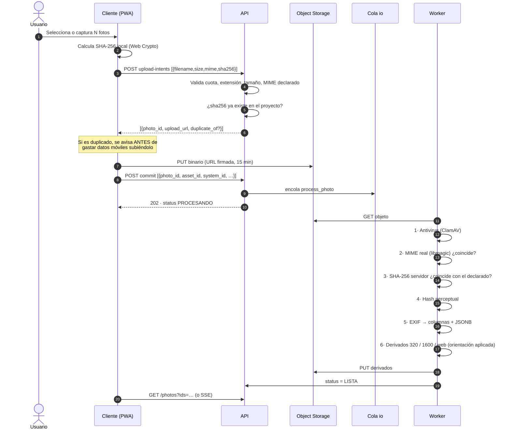
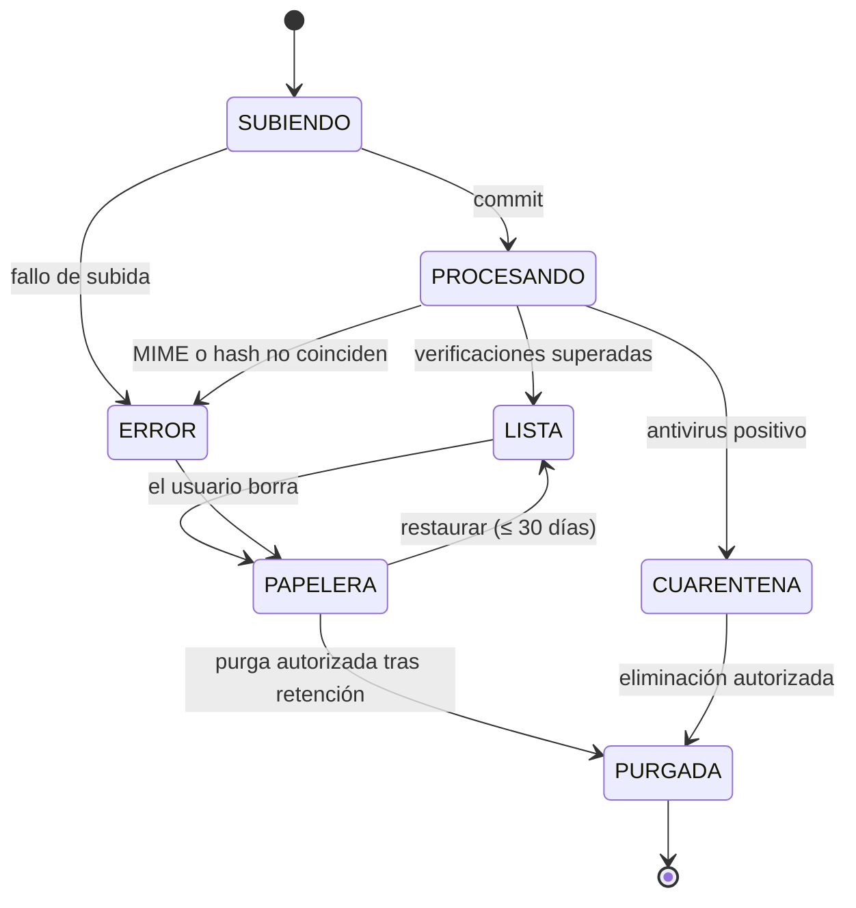

# 15. Estrategia de fotografías

---

## 15.1. La invariante que gobierna todo el bloque

> `[REQ]` **«Mantener siempre el archivo original.» «No sobrescribas los originales cuando se
> aplique el renombrado.»**

Esta exigencia se cumple con **cuatro barreras independientes**, no con una convención de código.
Si una falla, las otras tres siguen en pie:



**La separación clave** es que el nombre visible y el objeto almacenado son cosas distintas:

| Concepto | Campo | Mutable | Se usa para |
|---|---|:--:|---|
| Clave del objeto | `storage_key` (UUID) | **No** | Localizar el binario. Nunca se muestra al usuario |
| Nombre de llegada | `original_filename` | **No** | Trazabilidad. «Esto llegó como `IMG_4821.HEIC`» |
| Nombre visible | `display_name` | Sí | Lo que el usuario ve, edita y descarga |
| Extensión | `file_extension` | **No** | Derivada del MIME real. El usuario nunca la controla |
| Huella | `sha256` | **No** | Verificar integridad, detectar duplicados |

**Consecuencia:** renombrar es un `UPDATE` sobre un campo de texto. Coste O(1), sin transferencia de
bytes, sin riesgo, reversible, y **es imposible perder la extensión porque nadie la escribe**. La
extensión de descarga se compone en el momento de servir: `display_name + "." + file_extension`.

---

## 15.2. Modelo de versiones



**Decisiones de diseño** `[REC]`:

1. **Una versión que solo renombra no duplica el binario** (`storage_key = NULL`). Con 1.500 fotos
   por proyecto y renombrados en lote, duplicar bytes por un cambio de nombre multiplicaría el coste
   de almacenamiento sin aportar nada.
2. **Las anotaciones se guardan como capa vectorial JSON**, no como píxeles quemados. Ventajas:
   editables, reversibles, ocupan bytes en lugar de megabytes, y el original sigue limpio. Se
   rasteriza a JPEG solo cuando hace falta (informe, exportación), y ese JPEG es un derivado
   desechable y regenerable.
3. **La versión 1 es siempre `ORIGINAL` y no se puede borrar ni modificar.** Restaurar una versión
   anterior crea una versión nueva; no reescribe la historia.

**Estructura de una anotación:**

```json
{
  "canvas": { "width": 4032, "height": 3024 },
  "shapes": [
    { "type": "rect", "x": 1200, "y": 800, "w": 600, "h": 400,
      "stroke": "#E53935", "strokeWidth": 8 },
    { "type": "arrow", "x1": 900, "y1": 600, "x2": 1200, "y2": 800,
      "stroke": "#E53935", "strokeWidth": 8 },
    { "type": "text", "x": 700, "y": 560, "text": "Corrosión activa",
      "fontSize": 72, "fill": "#E53935" }
  ]
}
```

Coordenadas en píxeles del original, de modo que la anotación es independiente de la resolución en
que se visualice.

---

## 15.3. Canal de ingesta



**Verificaciones y su motivo** `[REQ]` §5:

| Paso | Comprobación | Si falla |
|---|---|---|
| 1 | Antivirus sobre el binario | `status = CUARENTENA`, no descargable, alerta al admin, **el objeto no se borra** (para análisis) |
| 2 | Tipo real vs. extensión (`libmagic`) | `415`, se registra intento con severidad `AVISO` |
| 3 | Hash de servidor vs. hash declarado | `422` por corrupción en tránsito; se pide reintento |
| 4 | Hash perceptual | Solo informativo: marca posible casi-duplicado |
| 5 | EXIF | Si no hay, campos vacíos. **Nunca se infiere fecha ni ubicación** `[REQ]` |
| 6 | Derivados | Si falla la conversión, `status = ERROR` con motivo legible; el original queda intacto y descargable |

**Formatos** `[SUP]` S-10: JPEG, PNG, WebP y HEIC/HEIF. `[LIM]` HEIC requiere `libheif`/`pillow-heif`
en la imagen del worker; los derivados se generan en WebP y JPEG para compatibilidad universal de
navegador. RAW y TIFF quedan fuera del MVP porque multiplican por 5–10 el coste de proceso y
almacenamiento sin necesidad demostrada.

---

## 15.4. Sistema de nombres configurable

`[REQ]` Plantilla de ejemplo del encargo: `[Proyecto]_[Activo]_[Sistema]_[Zona]_[Número].[extensión]`

### Tokens disponibles

| Token | Origen | Ejemplo | Si falta |
|---|---|---|---|
| `[Proyecto]` | `project.internal_code` | `2026-014` | — (siempre existe) |
| `[ProyectoNombre]` | `project.name` (saneado) | `CarteraLogisticaNorte` | — |
| `[Activo]` | `asset.asset_code` o `asset.name` | `NaveA` | `SinActivo` |
| `[Sistema]` | `technical_system.code` | `CLIMA` | `SinSistema` |
| `[Subsistema]` | subsistema | `COLECT` | se omite con su separador |
| `[Zona]` / `[Planta]` / `[Espacio]` | `location_node` | `Cubierta` | se omite con su separador |
| `[Categoria]` | `photo_category` | `Climatizacion` | `Otros` |
| `[Fecha]` | `taken_at` o `uploaded_at`, formato configurable | `20260715` | fecha de carga |
| `[Hora]` | `taken_at` | `1142` | se omite |
| `[Numero]` | correlativo | `007` | — |
| `[Autor]` | iniciales del que sube | `AL` | — |
| `[Etiqueta]` | primera etiqueta | `corrosion` | se omite |

### Reglas de saneado `[REC]`

Convención propia, documentada y aplicada en el servidor:

1. Transliteración a ASCII: `Cubierta Nº1` → `CubiertaN1`; `Añadido` → `Anadido`.
2. Caracteres prohibidos en sistemas de archivos (`/ \ : * ? " < > |`) y control → `-`.
3. Espacios → según configuración (`-`, `_` o eliminados). Por defecto eliminados en tokens,
   conservando el `_` como separador de campos.
4. Colapso de separadores repetidos: `NaveA__CLIMA` → `NaveA_CLIMA`.
5. Tokens vacíos se omiten **junto con su separador**, no dejan huecos.
6. Longitud máxima del nombre visible: 200 caracteres. Al recortar, se preserva **siempre** el
   sufijo numérico, que es lo que garantiza la unicidad.
7. Nombres reservados de Windows (`CON`, `PRN`, `AUX`, `NUL`, `COM1`…) reciben el prefijo `_`.
8. **La extensión no forma parte de la plantilla ni del nombre editable.** Se añade al servir.

### Numeración

- Ámbito configurable: por proyecto, por activo, por activo+sistema (recomendado por defecto), o por
  lote.
- Dígitos configurables (por defecto 3).
- Es un correlativo **estable**: una vez asignado a una foto, no cambia porque se inserten otras.
  Renumerar es una acción explícita y separada. `[REC]`

### Colisiones

Determinista y explicada al usuario antes de aplicar:

```
2026-014_NaveA_CLIMA_Cubierta_004        ← primera
2026-014_NaveA_CLIMA_Cubierta_004_b      ← segunda
2026-014_NaveA_CLIMA_Cubierta_004_c      ← tercera
```

Se prefiere el sufijo alfabético al numérico para no confundirlo con el correlativo. `[REC]`

### Renombrado en lote

`[REQ]` La previsualización es **obligatoria**: `POST /photos/bulk-rename` con `dry_run: true`
devuelve la tabla completa antes/después y las colisiones, **sin escribir nada**. Solo tras la
confirmación del usuario se aplica.

Fallo parcial: el lote **no se deshace en bloque**. Se renombran las permitidas, se informa de las
fallidas con su motivo, y cada renombrado individual es atómico. Es el comportamiento que un
consultor espera: 38 de 40 renombradas es mejor que 0 de 40.

---

## 15.5. Duplicados

| Tipo | Método | Qué detecta | Acción |
|---|---|---|---|
| **Exacto** | SHA-256 | El mismo archivo subido dos veces | Se avisa antes de subir; el usuario decide |
| **Casi duplicado** `[REC]` | Hash perceptual (dHash 64 bits) + distancia de Hamming ≤ 8 | Dos disparos de la misma escena | Se agrupan visualmente; **nunca** se borra nada |

Índice único parcial `UNIQUE(project_id, sha256) WHERE deleted_at IS NULL`: el mismo archivo puede
existir en dos proyectos distintos (es legítimo: dos encargos sobre el mismo edificio), pero no dos
veces en el mismo.

`[REQ]` **En ningún caso se borra automáticamente un duplicado.** La detección es informativa. Una
foto aparentemente redundante puede ser la única que documenta un detalle.

---

## 15.6. EXIF y privacidad

### Extracción

Los campos operativamente útiles se promocionan a columnas indexadas: `taken_at`, `gps_latitude`,
`gps_longitude`, `gps_altitude`, `camera_make`, `camera_model`, `orientation`, `width_px`,
`height_px`. El EXIF completo se conserva en `exif_raw` (JSONB, con índice GIN) para consulta.

`[REQ]` Si no hay EXIF, o no hay GPS, o no hay fecha: **los campos quedan vacíos y marcados como no
disponibles**. No se infiere la fecha del sistema de archivos ni la ubicación del activo. Un dato
inventado en una evidencia técnica es peor que un dato ausente.

### Uso operativo del GPS `[REC]`

- Mapa de fotografías por activo: detecta al instante fotos asignadas al activo equivocado.
- Aviso `PHOTO_GPS_FAR_FROM_ASSET` cuando una foto dista más de un radio configurable (por defecto
  500 m) de las coordenadas del activo. Es un aviso, nunca un bloqueo: hay sótanos sin GPS y hay
  fotos de instalaciones exteriores legítimamente alejadas.

### Eliminación de metadatos al exportar `[REQ]`

| Destino | Comportamiento por defecto |
|---|---|
| Descarga interna del original | EXIF **completo** (es la evidencia) |
| Exportación para el cliente | EXIF **saneado**: se elimina GPS, número de serie del dispositivo, información del propietario y miniatura incrustada. Se conservan fecha de captura y dimensiones |
| Inserción en el informe PPTX | Solo píxeles: los derivados no arrastran EXIF |

El interruptor «Eliminar metadatos sensibles al exportar» está **activado por defecto** en los
ajustes de la organización. Cada exportación registra en auditoría si se saneó o no.

---

## 15.7. Rendimiento con grandes volúmenes

`[SUP]` S-03: 300–1.500 fotos por proyecto; un caso extremo de cartera podría llegar a 10.000.

| Problema | Solución |
|---|---|
| Rejilla con miles de miniaturas | Virtualización de la lista (solo se monta lo visible) + paginación por cursor + `loading="lazy"` |
| Tamaño de la miniatura | WebP a 320 px ≈ 15–25 KB. Una pantalla de 60 miniaturas ≈ 1,2 MB |
| Latencia de miniaturas | Servidas desde CDN con URL firmada de larga duración (24 h) y cabecera de caché inmutable; los originales, con URL de 5 min |
| Contador total exacto | Se evita `COUNT(*)` en cada página: recuento aproximado + exacto solo cuando el usuario lo pide `[REC]` |
| Subida de 200 fotos | Subida directa a almacenamiento (la API no toca los bytes) + 4 subidas en paralelo + reintento con espera creciente |
| Descarga en lote | ZIP generado en el worker, con caducidad de 7 días, y enlace notificado. Nunca en la petición HTTP |
| Coste de almacenamiento | Reglas de ciclo de vida: originales a clase de acceso infrecuente a los 180 días del cierre del proyecto; derivados regenerables |

---

## 15.8. Trabajo de campo y baja conectividad

`[SUP]` S-11 / `[PDV]` P-04. Alcance del MVP frente a la fase posterior:

| Capacidad | MVP | Fase offline |
|---|:--:|:--:|
| Cola de subida persistente en IndexedDB | ✅ | ✅ |
| Reintento automático con espera creciente | ✅ | ✅ |
| Miniatura optimista antes de subir | ✅ | ✅ |
| Idempotencia de subida (sin duplicados al reintentar) | ✅ | ✅ |
| UUID generado en el cliente | ✅ | ✅ |
| Borradores locales de incidencias | ✅ | ✅ |
| Paquete de precarga del proyecto antes de salir | ✅ | ✅ |
| Navegación completa sin red | ❌ | ✅ |
| Fusión asistida de conflictos | ❌ `[LIM]` | ✅ |

`[LIM]` En el MVP, la resolución de conflictos es **última escritura gana a nivel de campo**, con el
valor descartado registrado en `change_history` y aviso visible al usuario. Se documenta como
limitación conocida: es aceptable porque el trabajo de campo está repartido por activo y
especialidad, así que dos personas editando el mismo campo del mismo equipo es infrecuente. No es
aceptable como solución definitiva.

**Límite honesto:** el navegador puede desalojar IndexedDB si el dispositivo se queda sin espacio. Se
mitiga solicitando almacenamiento persistente (`navigator.storage.persist()`), avisando cuando la
cola supera un umbral y mostrando siempre el recuento de pendientes. `[LIM]` No hay garantía absoluta
en tecnología web; si el offline resulta crítico (P-04), habría que valorar una aplicación nativa,
lo que cambiaría el alcance del proyecto.

---

## 15.9. Papelera y recuperación



- El borrado siempre es lógico (`deleted_at`). `[REQ]`
- La papelera es por proyecto, con el original recuperable íntegro.
- Purga tras 30 días `[SUP]`, y solo si la retención del proyecto lo permite.
- La purga física **conserva el registro de auditoría** con identificador, hash, quién la subió,
  quién la borró y con qué autorización, sin el contenido. `[REQ]`
- Una foto referenciada por un **informe emitido** no se purga: se bloquea con
  `409 REFERENCED_BY_ISSUED_REPORT`. Un informe emitido debe seguir siendo reproducible. `[REC]`

---

## 15.10. Selección y orden para el informe

| Campo | Uso |
|---|---|
| `include_in_report` | Marca de selección `[REQ]` |
| `report_order` | Orden de aparición `[REQ]` |
| `report_section` | Sección del informe a la que pertenece `[REQ]` |
| `caption` | Pie de foto que se inserta en el PPTX |
| `photo_link.role` | `EVIDENCIA` / `GENERAL` / `DETALLE` / `ANTES` / `DESPUES` |

La interfaz ofrece reordenación por arrastre en una bandeja de seleccionadas, con vista previa de
cómo quedarán agrupadas por diapositiva según las reglas del mapeo (§ [`11-pptx.md`](./11-pptx.md)).

Avisos previos a la generación:
- Activo sin fotos seleccionadas → severidad media.
- Foto seleccionada sin pie de foto → severidad baja.
- Foto seleccionada en estado `CUARENTENA` o `ERROR` → **severidad bloqueante**.
- Foto seleccionada sin activo asignado → severidad alta (no se sabría en qué diapositiva colocarla).

---

## 15.11. Documentos

Comparten el modelo de las fotografías (original inmutable, MIME real verificado, antivirus, hash,
borrado lógico, descarga auditada) con tres diferencias:

1. **Sin derivados de imagen.** `[REC]` La previsualización de PDF se hace en el cliente con
   `pdf.js`; no se generan miniaturas en servidor en el MVP.
2. **Nivel de confidencialidad** (`INTERNO`, `CONFIDENCIAL`, `RESTRINGIDO`) que condiciona quién
   puede descargar (ver [`06-roles-permisos.md`](./06-roles-permisos.md) nota 13).
3. **Tipos permitidos** ampliados: PDF, DOCX, XLSX, DWG, imágenes. **Se rechazan** ejecutables,
   archivos con macros y contenedores comprimidos anidados (riesgo de bomba de descompresión).
