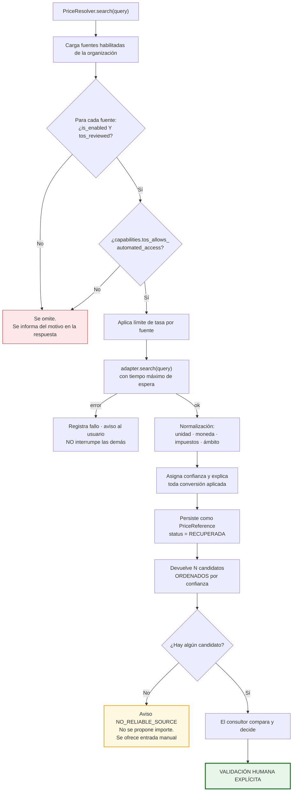
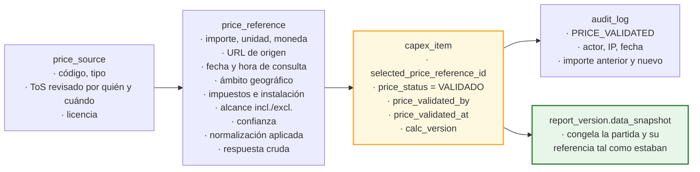

# 16. Motor de CAPEX y normalización de precios

---

## 16.1. Principios del motor

| # | Principio | Consecuencia |
|---|---|---|
| 1 | **El cálculo es una función pura** | `CapexEngine` no accede a base de datos, red ni reloj. Entra un objeto de entradas, sale un desglose. Testeable al céntimo, en milisegundos `[REC]` |
| 2 | **Ninguna fórmula oculta** | Cada peldaño de la cascada se persiste y se muestra con sus operandos `[REQ]` |
| 3 | **Decimal exacto, nunca coma flotante** | `Decimal` en Python, `NUMERIC` en PostgreSQL. El redondeo es una decisión explícita, no un efecto colateral |
| 4 | **Un precio sin procedencia no existe** | Toda partida con precio tiene una `price_reference`, incluida la entrada manual `[REQ]` |
| 5 | **La validación es humana, siempre** | No hay ruta de código que ponga `price_status = VALIDADO` sin un usuario identificado `[REQ]` |
| 6 | **Las fuentes son adaptadores** | El núcleo no conoce ninguna fuente concreta `[REQ]` |
| 7 | **La versión del algoritmo se guarda** | `calc_version` permite reproducir un informe antiguo aunque la fórmula haya evolucionado `[REC]` |

---

## 16.2. La cascada de costes

`[PDV]` **P-10 es la pregunta abierta más importante de este bloque**: el orden de aplicación de los
porcentajes cambia el resultado, y debe coincidir con lo que la consultora ya usa en sus Excel. Lo
que sigue es la cascada propuesta, con la aclaración de que **es configurable**.

### Cascada por defecto propuesta `[SUP]`

```
(1) coste_directo        = cantidad × precio_unitario
(2) indirectos           = coste_directo × %indirectos
(3) gastos_generales     = coste_directo × %gastos_generales
(4) beneficio_industrial = coste_directo × %beneficio_industrial
(5) subtotal_ejecucion   = (1) + (2) + (3) + (4)
(6) honorarios_tecnicos  = subtotal_ejecucion × %honorarios
(7) subtotal_con_hon.    = (5) + (6)
(8) contingencia         = subtotal_con_honorarios × %contingencia
(9) base_imponible       = (7) + (8)
(10) impuestos           = base_imponible × %impuesto
(11) coste_total         = (9) + (10)
```

### Por qué este orden `[REC]`

| Decisión | Razón |
|---|---|
| Indirectos, gastos generales y beneficio se calculan **sobre el coste directo** | Es la práctica habitual de presupuestación de obra: son porcentajes sobre la ejecución material |
| Los honorarios técnicos se calculan **sobre la ejecución completa** | Los honorarios de proyecto y dirección de obra se pactan típicamente sobre el presupuesto de ejecución, no sobre el coste desnudo del equipo |
| La contingencia se aplica **después de los honorarios** | La incertidumbre afecta a todo el coste del proyecto, incluidos sus honorarios |
| Los impuestos se aplican **al final, sobre la base imponible** | `[REQ]` «Impuestos, configurables y separados del coste base». La base imponible y los impuestos son columnas independientes en todas las vistas |

### Configurabilidad `[REC]`

`cost_profile.cascade_config` (JSONB) declara el orden y la base de cada componente, de modo que
adaptarse a la práctica del cliente sea configuración y no desarrollo:

```json
{
  "cascade_version": 1,
  "steps": [
    { "key": "indirect",    "base": ["direct"],                       "pct_field": "indirect_pct" },
    { "key": "overhead",    "base": ["direct"],                       "pct_field": "overhead_pct" },
    { "key": "profit",      "base": ["direct"],                       "pct_field": "profit_pct" },
    { "key": "fees",        "base": ["direct","indirect","overhead","profit"], "pct_field": "fees_pct" },
    { "key": "contingency", "base": ["direct","indirect","overhead","profit","fees"], "pct_field": "contingency_pct" },
    { "key": "tax",         "base": ["__subtotal_before_tax__"],      "pct_field": "tax_pct" }
  ],
  "rounding": { "mode": "HALF_UP", "decimals": 2, "apply_at": ["step", "total"] }
}
```

### Ejemplo trabajado (el mismo de la pantalla de CAPEX)

Perfil: indirectos 8 %, honorarios 6 %, contingencia 10 %, IVA 21 %. Gastos generales y beneficio a 0.

| Paso | Operación | Importe |
|---|---|---:|
| Coste directo | 1 × 48.500,0000 | 48.500,00 € |
| Indirectos (8 %) | 48.500,00 × 0,08 | 3.880,00 € |
| Honorarios (6 %) | (48.500,00 + 3.880,00) × 0,06 | 3.142,80 € |
| Contingencia (10 %) | (52.380,00 + 3.142,80) × 0,10 | 5.552,28 € |
| **Base imponible** | suma de lo anterior | **61.075,08 €** |
| IVA (21 %) | 61.075,08 × 0,21 | 12.825,77 € |
| **Coste total** | | **73.900,85 €** |

### Redondeo `[REQ]`

| Aspecto | Decisión |
|---|---|
| Precisión interna | `NUMERIC(18,4)`; los cálculos intermedios conservan 4 decimales |
| Modo | Configurable: `HALF_UP` (por defecto, convención comercial), `HALF_EVEN`, `UP`, `DOWN` |
| Dónde se aplica | Configurable: en cada peldaño y/o solo en el total |
| Presentación | Los totales agregados se redondean **solo al mostrar**, nunca antes de sumar |
| Garantía verificable | La suma de los totales de partida coincide **exactamente** con el total del proyecto en el escenario probable. Es una prueba automatizada, no una promesa `[REC]` |

### Escenarios `[REQ]`

Dos modos, elegibles por proyecto:

1. **Por factor de partida** (recomendado por defecto): cada partida tiene
   `scenario_low_factor` y `scenario_high_factor`, con valores por defecto 0,85 y 1,25 `[SUP]`.
   Ventaja: refleja que la incertidumbre no es igual en todas las partidas — un precio de oferta
   firme tiene menos horquilla que una estimación paramétrica.
2. **Por nivel de confianza**: el factor se deriva de `confidence`
   (`ALTA` → ±10 %, `MEDIA` → ±20 %, `BAJA` → ±35 %) `[SUP]`.

`[REC]` Se recomienda el modo 1 con valores inicializados desde `confidence`: automatiza el caso
general y permite ajustar el particular.

### Recálculo `[REQ]`

> «Si cambia una cantidad o un precio, el total debe recalcularse.»

Implementado **dos veces, a propósito**:

1. **`CapexEngine` en Python**: fuente de verdad para la API, la previsualización y las exportaciones.
2. **Disparador en PostgreSQL**: red de seguridad ante escrituras que no pasen por el servicio
   (importaciones, correcciones de datos, migraciones).

Una prueba automatizada compara ambas implementaciones sobre un corpus de casos generados,
incluidos valores extremos, y **falla si difieren en un solo céntimo**. Duplicar la lógica es un
coste asumido conscientemente: el riesgo de un total incoherente en un informe firmado es mayor.

**Propagación:** cambiar el `cost_profile` del proyecto **no reescribe** en silencio las 63 partidas.
Se muestra una previsualización del impacto (total actual → total nuevo, partidas afectadas) y se
exige confirmación. Las partidas con porcentaje personalizado se listan aparte y se respetan salvo
indicación contraria. `[REC]`

---

## 16.3. Arquitectura de fuentes de precios

### La interfaz

`[REQ]` «Utiliza adaptadores para las distintas fuentes de precios, de forma que se puedan añadir,
desactivar o sustituir fuentes sin modificar el núcleo de CAPEX.»

```python
class PriceSourceAdapter(Protocol):
    """Contrato único que conoce el núcleo de CAPEX. Nada más."""

    key: str                        # coincide con price_source.adapter_key
    capabilities: SourceCapabilities

    def search(self, query: PriceQuery) -> list[PriceCandidate]:
        """Devuelve candidatos NORMALIZADOS. Nunca marca ninguno como seleccionado.

        Debe elevar SourceUnavailable en caso de fallo: el orquestador
        continúa con las demás fuentes y avisa al usuario.
        """


@dataclass(frozen=True)
class SourceCapabilities:
    supports_search: bool
    supports_geo_filter: bool
    supports_historical: bool
    requires_credentials: bool
    max_requests_per_minute: int
    tos_allows_automated_access: bool   # se rellena desde la revisión legal registrada
    tos_allows_storing_results: bool
    respects_robots: bool


@dataclass(frozen=True)
class PriceCandidate:
    unit_price: Decimal
    currency: str
    unit: str
    description: str
    source_url: str | None
    retrieved_at: datetime
    price_date: date | None
    geo_scope: str
    country_code: str
    includes_tax: bool | None          # None = la fuente no lo especifica
    includes_installation: bool | None
    scope_included: str | None
    scope_excluded: str | None
    confidence: Confidence
    raw_payload: dict                  # para poder reconstruir la consulta
    # No existe ningún campo "selected", "recommended" ni "best".
```

### El orquestador



### Cumplimiento legal, grabado en el esquema

`[REQ]` §3: respetar términos de uso, propiedad intelectual, condiciones de API, restricciones de
extracción automatizada, protección de datos y normativa aplicable. «No realices scraping si está
prohibido por las condiciones de uso o por controles técnicos del sitio.»

Cómo se hace cumplir, y no solo se declara:

| Control | Mecanismo | Nivel |
|---|---|---|
| Una fuente no se activa sin revisión de condiciones | `CHECK (is_enabled = false OR (tos_reviewed = true AND tos_reviewed_by IS NOT NULL))` | **Base de datos** |
| Solo un `ADMIN` registra la revisión | Permiso `price_source:review_tos`, exclusivo de `ADMIN` | Autorización |
| Quién revisó y cuándo queda registrado | `tos_reviewed_by`, `tos_reviewed_at`, `tos_url`, `tos_notes` | Datos + auditoría |
| Se respeta `robots.txt` | El orquestador consulta y cachea `robots.txt`; si prohíbe la ruta, no se consulta | Código |
| Se respetan controles técnicos | Ante CAPTCHA, muro de sesión, `403` o `429` sistemático: **la fuente se deshabilita automáticamente** y se registra el motivo. No se intenta eludir | Código |
| Límite de tasa por fuente | `rate_limit_per_min`, aplicado con contador en Redis | Código |
| Identificación honesta | Cabecera `User-Agent` que identifica la aplicación y una URL de contacto. No se suplanta un navegador | Código |
| Trazabilidad | `raw_payload`, `source_url`, `retrieved_at` en cada referencia | Datos |

### Prioridad de fuentes `[REQ]`

El encargo fija el orden. Se implementa como `price_source.priority`:

| Prioridad | Tipo | Estado en el MVP |
|:--:|---|---|
| 1 | APIs oficiales o datos abiertos | `[PDV]` **Ninguna concreta se nombra ni se activa** hasta validación legal y técnica (P-03) |
| 2 | Bases de precios públicas y autorizadas | `[PDV]` Requiere licencia del cliente. Adaptador de importación disponible |
| 3 | Catálogos públicos de fabricantes o distribuidores | `[PDV]` Solo si sus condiciones lo permiten explícitamente |
| 4 | **Entrada manual por usuario autorizado** | ✅ **Implementada en el MVP** |
| — | **Catálogo interno licenciado del cliente** (importación XLSX/CSV) | ✅ **Implementada en el MVP** `[REC]` |

> **Declaración explícita:** `[REQ]` «No inventes APIs ni fuentes de precios.» En consecuencia,
> **esta propuesta no nombra ninguna API, base de datos de precios ni catálogo concreto**, ni afirma
> que ninguna integración funcione. Se entrega la arquitectura de adaptadores, un adaptador manual y
> un importador de catálogo propio. Activar cualquier fuente externa exige: (a) identificar la fuente
> con el cliente, (b) revisar sus condiciones de uso, (c) implementar su adaptador, (d) probarlo
> contra la fuente real. Los pasos (a) y (b) son decisiones del cliente, no técnicas.

### Adaptadores del MVP

| Adaptador | Qué hace | Estado |
|---|---|---|
| `ManualPriceSource` | Registra un precio introducido por un usuario, con justificación obligatoria. Genera una `price_reference` de tipo manual para que **incluso el precio a mano tenga trazabilidad** | ✅ Real |
| `InternalCatalogSource` | Busca en el catálogo propio importado (XLSX/CSV con esquema documentado). Búsqueda por texto completo en español sobre descripción y código | ✅ Real |
| `OpenDataApiSource` | **Esqueleto marcado como no implementado.** Declara la interfaz, valida el contrato con datos de prueba y lanza `NotImplementedError` en producción. `[REC]` Se incluye para demostrar que añadir una fuente no toca el núcleo, y se marca sin ambigüedad como andamio | ⚠️ **Andamio** |

---

## 16.4. Normalización de precios

`[REQ]` Para cada precio recuperado se conserva: fuente, fecha y hora de consulta, unidad, moneda,
país o región, alcance incluido y excluido, impuestos incluidos o no, instalación incluida o no,
nivel de confianza y alternativas encontradas. Todo ello está en `price_reference` (ver
[`04-modelo-de-datos.md`](./04-modelo-de-datos.md) §8.5).

### Reglas de normalización

| Dimensión | Regla | Si no se puede normalizar con seguridad |
|---|---|---|
| **Unidad** | Solo conversiones exactas y documentadas (m² ↔ m², ml ↔ m). **Nunca** se convierte entre unidades no equivalentes (m² → ud) | No se convierte. Se marca `UNIT_MISMATCH` y se muestra tal cual, avisando al consultor |
| **Moneda** | Se conserva la moneda de origen. La conversión es una acción explícita del usuario, con el tipo de cambio y su fecha registrados | No se convierte |
| **Impuestos** | Se normaliza a base sin impuestos cuando la fuente lo declara | Si la fuente no lo declara, `includes_tax = NULL` y se muestra `⚠ no especificado`. **No se asume** |
| **Instalación** | Igual que impuestos | `includes_installation = NULL` |
| **Ámbito geográfico** | Se conserva literal; el factor geográfico se aplica como paso separado y visible | — |
| **Fecha** | Se conserva `price_date` y `retrieved_at` como campos distintos | — |

`[REC]` La regla que más importa: **cuando la fuente no dice algo, el sistema dice «no especificado»,
no adivina.** Un precio marcado erróneamente como «IVA incluido» introduce un error del 21 % en el
informe de un cliente.

Todas las conversiones aplicadas se escriben en `normalization_notes` en lenguaje llano:

```
"Unidad sin conversión (ud → ud). Moneda sin conversión (EUR).
 Impuestos: la fuente declara precio sin impuestos.
 Índice aplicado: costes de construcción ES, 2025-11 (112,7) → 2026-07 (118,4), factor 1,0506.
 Factor geográfico ES → ES-MAD: 1,05.
 Precio original 48.500,0000 → precio normalizado 53.494,5200."
```

### Actualización por índices y factores `[REQ]`

```
precio_actualizado = precio_origen
                   × (indice_destino / indice_origen)    ← actualización temporal
                   × factor_geografico                    ← ajuste territorial
                   × (1 + inflacion_adicional)            ← opcional, si no lo cubre el índice
```

Reglas de aplicación:
- El cálculo se **muestra** con sus operandos y **no se aplica hasta que el usuario lo confirma**.
- Aplicar una actualización **revierte `price_status` a `PENDIENTE_VALIDACION`**: el importe ha
  cambiado, luego hay que revalidarlo. `[REQ]`
- Si falta el índice de alguno de los dos periodos, no se calcula: se avisa y se ofrece introducir el
  valor del índice o un precio manual. **No se interpola.** `[REC]`
- Los índices se cargan manualmente o por importación; su origen (`source_url`, `retrieved_at`) se
  registra.

---

## 16.5. Vistas de CAPEX

`[REQ]` Las siete vistas exigidas, todas sobre el mismo endpoint con `group_by`:

| Vista | Agrupación | Métricas | Uso típico |
|---|---|---|---|
| Por proyecto | — | Total, base, impuestos, escenarios, nº partidas, % sin validar | Cifra de portada del informe |
| Por activo | `asset_id` | Total y coste por m² construido `[REC]` | Comparar edificios de una cartera |
| Por sistema | `technical_system_id` | Total y % sobre el total | «¿Dónde está el dinero?» |
| Por prioridad | `priority` | Total por nivel | Negociación con el cliente |
| Por año | `planned_year` | Total por año + acumulado | Plan de inversión plurianual |
| Por horizonte | `time_horizon` | Total por tramo | Tabla clásica del informe de TDD |
| Por riesgo | `finding.risk_score` en tramos | Total por nivel de riesgo | Justificar la urgencia |

`[REC]` **Coste por m²** en la vista por activo: es el indicador que un inversor pide primero y que
permite comparar activos heterogéneos. Se calcula sobre superficie construida, y se declara la base
usada para que nadie lo confunda con superficie alquilable.

### Rendimiento

Con ≤ 300 partidas por proyecto `[SUP]` S-03, la agregación en PostgreSQL con índices por
`(project_id, …)` responde en pocos milisegundos. **No se introducen vistas materializadas en el
MVP**: serían optimización prematura y añadirían el problema de la invalidación. Se reevalúa si el
volumen real lo justifica. `[REC]`

---

## 16.6. Exportación

`[REQ]` XLSX y CSV.

**XLSX** (con `openpyxl`), varias hojas:

| Hoja | Contenido |
|---|---|
| `Resumen` | Totales, escenarios, perfil de costes aplicado, fecha de exportación |
| `Partidas` | Una fila por partida con **todas las columnas de la cascada**, para que el cliente pueda auditar el cálculo |
| `Trazabilidad` | Una fila por referencia de precio: fuente, URL, fecha de consulta, alcance, quién validó y cuándo |
| `Por sistema` / `Por activo` / `Por año` | Tablas de las vistas agregadas |
| `Incidencias` | Incidencias vinculadas, con su criticidad y horizonte |

`[REC]` La hoja `Trazabilidad` es la que convierte la exportación en un documento defendible. Sin
ella, el XLSX es un Excel más.

**Decisión consciente:** el XLSX exportado contiene **valores, no fórmulas de Excel**. Motivo: la
fórmula viva ya está en la aplicación y es auditable allí; reproducirla en Excel duplicaría la lógica
en un sitio donde nadie la mantiene y donde el cliente podría alterarla sin dejar rastro. Se incluyen
todas las columnas intermedias para que el cálculo sea verificable a mano. `[REC]`

**CSV**: una sola tabla plana, UTF-8 con BOM (para que Excel en español lo abra correctamente),
separador configurable (`;` por defecto en configuración regional española), y decimales con coma o
punto según la localización elegida.

---

## 16.7. Trazabilidad del precio, punta a punta

`[REQ]` §9: «Una partida CAPEX debe conservar la trazabilidad de su precio.»



**Pregunta que el sistema puede responder tres años después, sobre un informe emitido:**
*«¿De dónde salió este importe de 73.900,85 €?»*

→ Partida `CX-0117`, coste directo 48.500,00 € × cascada 8/6/10/21 % (perfil «Estándar 2026»,
`calc_version` 1). Precio unitario procedente del catálogo interno, referencia `CI-4471`, importado
el 15/01/2026 de un catálogo con licencia propia, precio con fecha 01/11/2025, ámbito ES-MAD, sin
impuestos, instalación incluida, obra civil y grúa excluidas. Validado por Luis Pérez el 28/07/2026 a
las 10:42 desde la IP registrada. Congelado en el snapshot de la versión 2 del informe, con hash
`c19e77…`.

Esa cadena completa es el producto real de este bloque.

---

## 16.8. Reglas de negocio implementadas

| Regla (`[REQ]` §9) | Dónde se aplica |
|---|---|
| Una partida conserva la trazabilidad de su precio | `CHECK (price_status = 'SIN_PRECIO' OR selected_price_reference_id IS NOT NULL)` |
| Un precio externo no está validado hasta revisión humana | `PriceCandidate` no tiene campo de selección; `status` inicial `RECUPERADA`; `CHECK` que exige validador |
| Si cambia cantidad o precio, el total se recalcula | `CapexEngine` + disparador; prueba de equivalencia entre ambos |
| Impuestos configurables y separados del coste base | Columnas independientes en modelo, API, vistas y exportación |
| Los cálculos son transparentes y editables | Cada peldaño persistido y editable; panel «Cómo se calcula» |
| Si no hay fuente fiable, se indica y no se inventa | Aviso `NO_RELIABLE_SOURCE`; entrada manual con justificación; partida en `PENDIENTE_VALIDACION` |

## 16.9. Limitaciones declaradas

| # | Limitación | Consecuencia práctica |
|---|---|---|
| 1 | `[LIM]` **Ninguna fuente externa de precios está integrada ni probada.** Solo entrada manual y catálogo propio | El valor del CAPEX en el MVP depende del catálogo o del criterio del consultor. Es una limitación de alcance consciente, no un defecto |
| 2 | `[LIM]` La normalización de unidades solo cubre equivalencias exactas | Comparar €/m² con €/ud requiere criterio humano. El sistema avisa en lugar de inventar el factor |
| 3 | `[LIM]` No hay conversión automática de moneda con tipo de cambio en vivo | Multi-moneda dentro de un proyecto queda pendiente de P-11 |
| 4 | `[LIM]` Los índices de actualización se cargan manualmente | Automatizarlos exige una fuente con condiciones de uso validadas (P-03) |
| 5 | `[LIM]` La cascada por defecto es un supuesto | Debe confirmarse contra la práctica real del cliente antes del primer informe (P-10) |
| 6 | `[LIM]` El adaptador `OpenDataApiSource` es un andamio no funcional | Está marcado como tal en código, documentación e interfaz. No se presenta como integración operativa |
