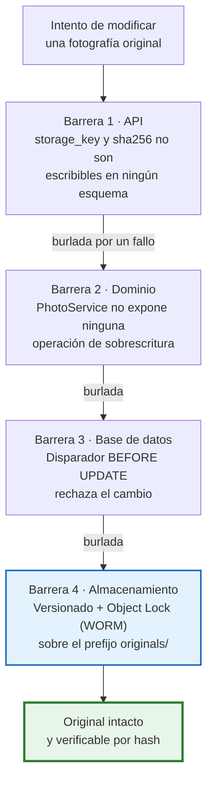
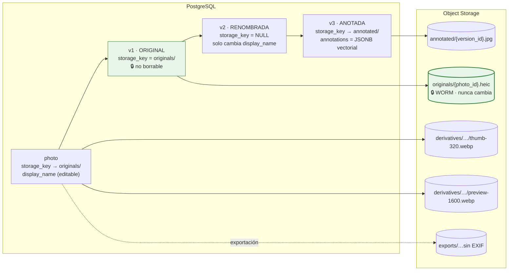
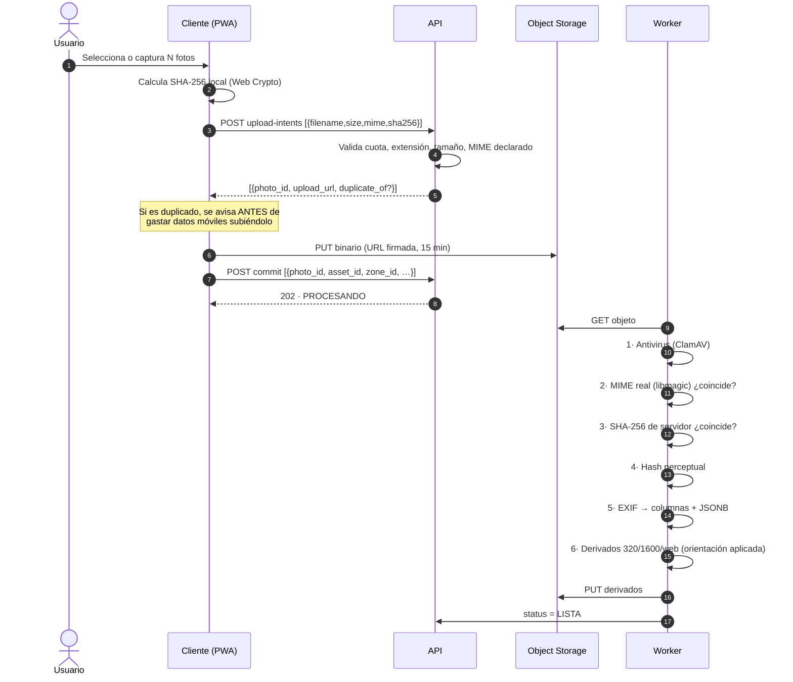
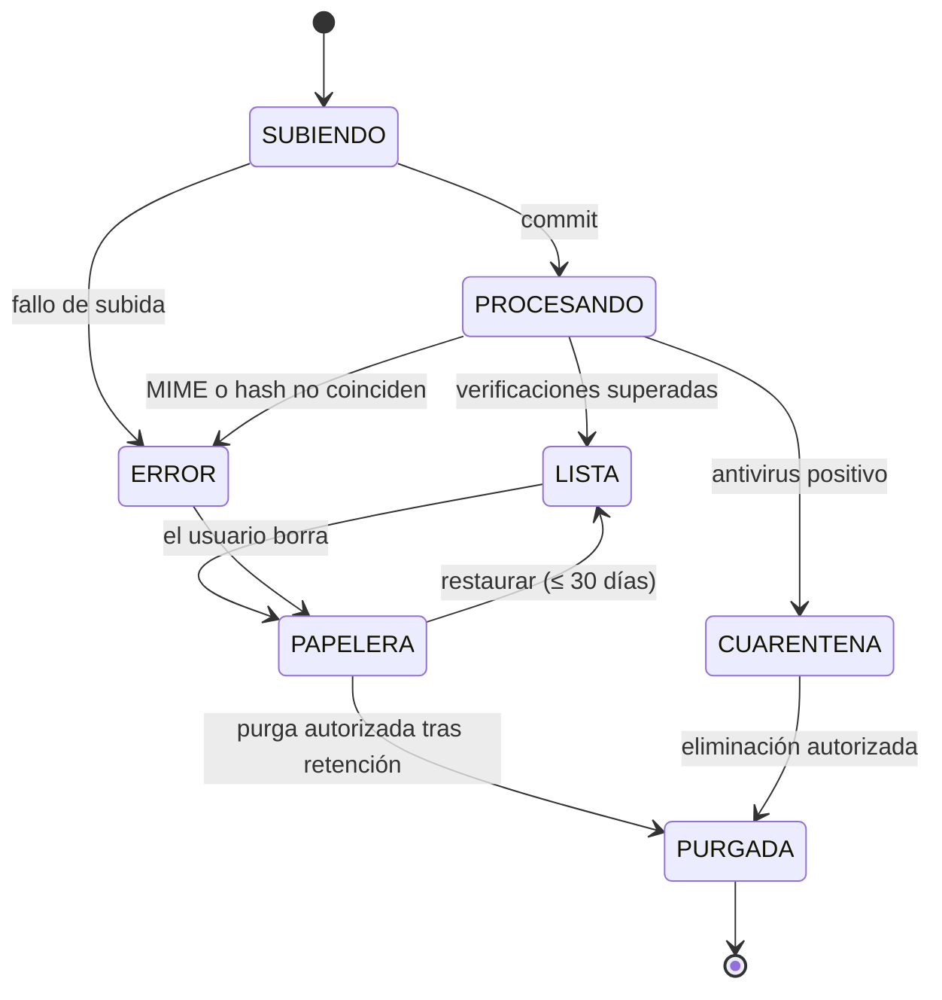

# 15. Estrategia de fotografías

---

## 15.1. La invariante que gobierna el bloque

> `[REQ]` **«Mantener siempre el archivo original.» «No sobrescribas los originales cuando se aplique
> el renombrado.»**

Se cumple con **cuatro barreras independientes**, no con una convención de código. Si una falla, las
otras tres siguen en pie:



**La separación clave**: el nombre visible y el objeto almacenado son cosas distintas.

| Concepto | Campo | Mutable | Para qué |
|---|---|:--:|---|
| Clave del objeto | `storage_key` (UUID) | **No** | Localizar el binario. Nunca se muestra al usuario |
| Nombre de llegada | `original_filename` | **No** | Trazabilidad: «esto llegó como `IMG_4821.HEIC`» |
| Nombre visible | `display_name` | Sí | Lo que el usuario ve, edita y descarga |
| Extensión | `file_extension` | **No** | Derivada del MIME real. El usuario nunca la controla |
| Huella | `sha256` | **No** | Integridad y detección de duplicados |

**Consecuencia:** renombrar es un `UPDATE` sobre un campo de texto. Coste O(1), sin transferir bytes,
reversible, y **es imposible perder la extensión porque nadie la escribe**. La extensión de descarga
se compone al servir: `display_name + "." + file_extension`.

---

## 15.2. Modelo de versiones



**Decisiones** `[REC]`:

1. **Una versión que solo renombra no duplica el binario** (`storage_key = NULL`). Con 1.500 fotos por
   proyecto y renombrados en lote, duplicar bytes por un cambio de nombre multiplicaría el coste sin
   aportar nada.
2. **Las anotaciones se guardan como capa vectorial JSON**, no como píxeles quemados: editables,
   reversibles, ocupan bytes en lugar de megabytes, y el original sigue limpio. Se rasteriza solo
   cuando hace falta (informe, exportación), y ese JPEG es un derivado desechable.
3. **La v1 es siempre `ORIGINAL` y no se puede borrar ni modificar.** Restaurar una versión anterior
   crea una versión nueva; no reescribe la historia.

```json
{
  "canvas": { "width": 4032, "height": 3024 },
  "shapes": [
    { "type": "rect",  "x": 1200, "y": 800, "w": 600, "h": 400,
      "stroke": "#E53935", "strokeWidth": 8 },
    { "type": "arrow", "x1": 900, "y1": 600, "x2": 1200, "y2": 800,
      "stroke": "#E53935", "strokeWidth": 8 },
    { "type": "text",  "x": 700, "y": 560, "text": "Corrosión activa",
      "fontSize": 72, "fill": "#E53935" }
  ]
}
```

Coordenadas en píxeles del original: la anotación es independiente de la resolución de visualización.

---

## 15.3. Canal de ingesta



| Paso | Comprobación | Si falla |
|:--:|---|---|
| 1 | Antivirus | `CUARENTENA`, no descargable, alerta al admin, **el objeto no se borra** (para análisis) |
| 2 | Tipo real frente a extensión (`libmagic`) | `415`, intento auditado |
| 3 | Hash de servidor frente al declarado | `422` por corrupción en tránsito; se pide reintento |
| 4 | Hash perceptual | Informativo: marca posible casi-duplicado |
| 5 | EXIF | Si no hay, campos vacíos. **Nunca se infiere fecha ni ubicación** `[REQ]` |
| 6 | Derivados | Si falla, `status = ERROR` con motivo; el original queda intacto y descargable |

**Formatos** `[SUP]` S-18: JPEG, PNG, WebP, HEIC/HEIF. `[LIM]` HEIC requiere `libheif`/`pillow-heif`
en la imagen del worker; los derivados se generan en WebP y JPEG para compatibilidad universal. RAW y
TIFF quedan fuera del MVP: multiplican por 5-10 el coste de proceso y almacenamiento sin necesidad
demostrada (P-20).

---

## 15.4. Sistema de nombres configurable

`[REQ]` Plantilla de ejemplo: `[Proyecto]_[Activo]_[Sistema]_[Zona]_[Número].[extensión]`

### Tokens

| Token | Origen | Ejemplo | Si falta |
|---|---|---|---|
| `[Proyecto]` | `project.internal_code` | `2026-014` | — |
| `[ProyectoNombre]` | `project.name` saneado | `CarteraLogisticaNorte` | — |
| `[Activo]` | `asset.asset_code` o `asset.name` | `NaveA` | `SinActivo` |
| `[Sistema]` | `technical_system.code` | `CLIMA` | `SinSistema` |
| `[Zona]` | `zone.code` (catálogo) | `Cubierta` | se omite con su separador |
| `[Espacio]` | `location_node` | `SalaMaquinas` | se omite |
| `[Capitulo]` | capítulo del código CAPEX | `H08` | se omite |
| `[Categoria]` | `photo_category` | `Climatizacion` | `Otros` |
| `[Fecha]` / `[Hora]` | `taken_at` o `uploaded_at` | `20260715` / `1142` | fecha de carga / se omite |
| `[Numero]` | correlativo | `007` | — |
| `[Autor]` | iniciales | `AL` | — |
| `[Etiqueta]` | primera etiqueta | `corrosion` | se omite |

### Reglas de saneado `[REC]`

1. Transliteración a ASCII: `Cubierta Nº1` → `CubiertaN1`; `Añadido` → `Anadido`.
2. Caracteres prohibidos (`/ \ : * ? " < > |`) y de control → `-`.
3. Espacios: eliminados dentro de los tokens, `_` como separador de campos.
4. Colapso de separadores repetidos: `NaveA__CLIMA` → `NaveA_CLIMA`.
5. Los tokens vacíos se omiten **junto con su separador**, sin dejar huecos.
6. Longitud máxima 200 caracteres; al recortar se preserva **siempre** el sufijo numérico.
7. Nombres reservados de Windows (`CON`, `PRN`, `AUX`, `NUL`, `COM1`…) reciben prefijo `_`.
8. **La extensión no forma parte de la plantilla ni del nombre editable.**

### Numeración

Ámbito configurable: por proyecto, por activo, por activo+sistema (por defecto) o por lote. Dígitos
configurables (3 por defecto). Es un correlativo **estable**: una vez asignado no cambia porque se
inserten otras fotos. Renumerar es una acción explícita y separada. `[REC]`

### Colisiones

```
2026-014_NaveA_CLIMA_Cubierta_004
2026-014_NaveA_CLIMA_Cubierta_004_b
2026-014_NaveA_CLIMA_Cubierta_004_c
```

Sufijo alfabético para no confundirlo con el correlativo. `[REC]`

### Renombrado en lote

`[REQ]` La previsualización es **obligatoria**: `dry_run: true` devuelve la tabla antes/después y las
colisiones **sin escribir nada**. Solo tras confirmar se aplica.

Fallo parcial: el lote **no se deshace en bloque**. Se renombran las permitidas y se informa de las
fallidas con su motivo. Es lo que un consultor espera: 38 de 40 es mejor que 0 de 40.

---

## 15.5. Duplicados

| Tipo | Método | Detecta | Acción |
|---|---|---|---|
| **Exacto** | SHA-256 | El mismo archivo subido dos veces | Se avisa antes de subir; el usuario decide |
| **Casi duplicado** `[REC]` | dHash 64 bits + Hamming ≤ 8 | Dos disparos de la misma escena | Se agrupan visualmente; **nunca** se borra nada |

Índice único parcial `UNIQUE(project_id, sha256) WHERE deleted_at IS NULL`: el mismo archivo puede
existir en dos proyectos (dos encargos sobre el mismo edificio es legítimo), pero no dos veces en el
mismo.

`[REQ]` **En ningún caso se borra automáticamente un duplicado.** Una foto aparentemente redundante
puede ser la única que documenta un detalle.

---

## 15.6. EXIF y privacidad

### Extracción

Campos útiles promocionados a columnas indexadas: `taken_at`, `gps_*`, `camera_make`, `camera_model`,
`orientation`, dimensiones. El EXIF completo se conserva en `exif_raw` (JSONB con índice GIN).

`[REQ]` Si no hay EXIF, GPS o fecha: **los campos quedan vacíos y marcados como no disponibles**. No
se infiere la fecha del sistema de archivos ni la ubicación del activo. Un dato inventado en una
evidencia técnica es peor que un dato ausente.

### Uso operativo del GPS `[REC]`

- Mapa de fotografías por activo: detecta al instante fotos asignadas al activo equivocado.
- Aviso `PHOTO_GPS_FAR_FROM_ASSET` si una foto dista más de un radio configurable (500 m por defecto)
  del activo. **Aviso, nunca bloqueo**: hay sótanos sin GPS y hay instalaciones exteriores legítimamente
  alejadas.

### Eliminación de metadatos al exportar `[REQ]`

| Destino | Comportamiento por defecto |
|---|---|
| Descarga interna del original | EXIF **completo** (es la evidencia) |
| Exportación para el cliente | EXIF **saneado**: se elimina GPS, número de serie del dispositivo, propietario y miniatura incrustada. Se conservan fecha y dimensiones |
| Inserción en el PPTX | Solo píxeles: los derivados no arrastran EXIF |

El interruptor está **activado por defecto** en los ajustes de organización. Cada exportación registra
en auditoría si se saneó o no.

---

## 15.7. Rendimiento con grandes volúmenes

`[SUP]` S-03: 300-1.500 fotos por proyecto; caso extremo de cartera, 10.000.

| Problema | Solución |
|---|---|
| Rejilla con miles de miniaturas | Virtualización + paginación por cursor + `loading="lazy"` |
| Tamaño de miniatura | WebP 320 px ≈ 15-25 KB. 60 miniaturas ≈ 1,2 MB |
| Latencia | Miniaturas desde CDN con URL firmada de 24 h y caché inmutable; originales, 5 min |
| Recuento total exacto | Se evita `COUNT(*)` por página: aproximado, exacto solo bajo petición `[REC]` |
| Subida de 200 fotos | Subida directa al almacenamiento + 4 en paralelo + reintento con espera creciente |
| Descarga en lote | ZIP en el worker, caducidad 7 días, enlace notificado. Nunca en la petición HTTP |
| Coste de almacenamiento | Ciclo de vida: originales a acceso infrecuente a los 180 días del cierre; derivados regenerables |

---

## 15.8. Trabajo de campo y baja conectividad

`[SUP]` S-19 / `[PDV]` P-11.

| Capacidad | MVP | Fase offline |
|---|:--:|:--:|
| Cola de subida persistente (IndexedDB) | ✅ | ✅ |
| Reintento con espera creciente | ✅ | ✅ |
| Miniatura optimista antes de subir | ✅ | ✅ |
| Idempotencia (sin duplicados al reintentar) | ✅ | ✅ |
| UUID generado en cliente | ✅ | ✅ |
| Borradores locales de hallazgos | ✅ | ✅ |
| Precarga del proyecto antes de salir (`sync-bundle`) | ✅ | ✅ |
| Navegación completa sin red | ❌ | ✅ |
| Fusión asistida de conflictos | ❌ `[LIM]` | ✅ |

`[LIM]` En el MVP, **última escritura gana a nivel de campo**, con el valor descartado registrado en
`change_history` y aviso al usuario. Aceptable porque el trabajo está repartido por activo y
especialidad, así que dos personas editando el mismo campo es infrecuente. No es aceptable como
solución definitiva.

`[LIM]` El navegador puede desalojar IndexedDB si el dispositivo se queda sin espacio. Se mitiga con
`navigator.storage.persist()`, aviso al superar un umbral y recuento de pendientes siempre visible. No
hay garantía absoluta en tecnología web: si el offline resulta crítico (P-11), habría que valorar una
aplicación nativa, lo que cambiaría el alcance del proyecto.

---

## 15.9. Papelera y recuperación



- El borrado siempre es lógico. `[REQ]`
- Papelera por proyecto, con el original recuperable íntegro.
- Purga tras 30 días `[SUP]`, y solo si la retención del proyecto lo permite.
- La purga física **conserva el registro de auditoría** con identificador, hash, quién la subió, quién
  la borró y con qué autorización, sin contenido. `[REQ]`
- Una foto referenciada por un **informe emitido** no se purga: `409 REFERENCED_BY_ISSUED_REPORT`. Un
  informe emitido debe seguir siendo reproducible. `[REC]`

---

## 15.10. Selección y orden para el informe

| Campo | Uso |
|---|---|
| `include_in_report` | Selección `[REQ]` |
| `report_order` | Orden de aparición `[REQ]` |
| `report_section` | Sección del informe `[REQ]` |
| `caption` | Pie de foto insertado en el PPTX |
| `photo_link.role` | `EVIDENCIA` / `GENERAL` / `DETALLE` / `ANTES` / `DESPUES` |

Reordenación por arrastre en una bandeja de seleccionadas, con vista previa de cómo quedarán agrupadas
por diapositiva según el mapeo.

Avisos previos a la generación:
- Activo sin fotos seleccionadas → media.
- Foto seleccionada sin pie → baja.
- Foto seleccionada en `CUARENTENA` o `ERROR` → **bloqueante**.
- Foto seleccionada sin activo → alta (no se sabría en qué diapositiva colocarla).

---

## 15.11. Documentos

Comparten el modelo (original inmutable, MIME real, antivirus, hash, borrado lógico, descarga
auditada) con cuatro diferencias:

1. **Sin derivados de imagen.** La previsualización de PDF se hace en el cliente con `pdf.js`.
2. **Nivel de confidencialidad** (`INTERNO`, `CONFIDENCIAL`, `RESTRINGIDO`) que condiciona la descarga.
3. **Versionado explícito** (`version_number`, `supersedes_document_id`): las rondas de Q&A y la
   documentación recibida se sustituyen con frecuencia, y hay que saber cuál era la vigente en la
   fecha del informe. `[REC]`
4. **Clasificación automática desde la fase**: adjuntar un documento a una línea del checklist de
   solicitud le asigna el `doc_type` correspondiente sin que el usuario lo elija.

Tipos permitidos: PDF, DOCX, XLSX, DWG, imágenes. **Se rechazan** ejecutables, ficheros con macros y
contenedores comprimidos anidados (riesgo de bomba de descompresión).

---

## 15.12. Estado de la implementación

Escrito después de construirlo, y con las pruebas delante. Lo que aquí figura como implementado tiene
prueba que lo respalda; lo que no, está marcado y **no se afirma que funcione**.

### Lo que funciona y está probado

| Capacidad | Dónde | Prueba |
|---|---|---|
| Subida desde **ordenador**, **carrete del móvil** y **cámara en directo** | `POST /projects/{id}/photos` | `test_fotografias.py` · un test por origen |
| **HEIC** del iPhone: se lee y se convierte | `evidence/images.py` + `pillow-heif` | `test_el_heic_del_iphone_se_lee_y_se_convierte` |
| Orientación EXIF aplicada al derivado | `generar_derivado()` | `test_el_derivado_aplica_la_orientacion_exif` |
| EXIF, GPS, fecha y cámara a columnas | `leer()` | 8 tests de EXIF |
| Duplicado exacto (SHA-256) y casi duplicado (perceptual) | `evidence/service.py` | 9 tests de duplicados |
| Nombres configurables: 13 tokens y 8 reglas de saneado | `evidence/naming.py` | 33 tests, uno por regla |
| Renombrado en lote con previsualización obligatoria | `POST /photos/bulk-rename` | previsualización + aplicación |
| Papelera, restauración y borrado siempre lógico | `DELETE` / `POST …/restore` | 6 tests |
| **El original nunca se sobrescribe** | disparadores `photo` y `photo_version` | 5 tests, escritos **saltándose la API** |
| Aislamiento entre organizaciones | RLS sobre las 4 tablas nuevas | `test_otra_organizacion_no_ve_la_foto` |
| Descarga y renombrado auditados | `audit_log` | 2 tests |

### Lo que no está y no se disimula

| Pendiente | Consecuencia hoy | `[LIM]` |
|---|---|---|
| **Antivirus (ClamAV)** | Ninguna foto pasa por `CUARENTENA`. El estado existe y la máquina de estados lo contempla, pero **nada lo activa** | Sí |
| **Almacén S3 con Object Lock** | Solo hay adaptador sobre disco y otro en memoria. La **barrera 4** (WORM) es una propiedad del bucket y **no se ha probado contra ninguno** | Sí |
| **URLs firmadas** | La descarga devuelve el binario en la respuesta en vez de un `302` de 5 minutos | Sí |
| **Worker asíncrono** (§15.3) | La subida es directa y síncrona. Aceptable para una visita; deja de serlo con 400 fotos | Sí |
| **Anotaciones vectoriales** | La tabla y el `CHECK` están; no hay ni editor ni rasterizado | Sí |
| **Descarga en lote (ZIP)** | No implementada | Sí |
| **Purga física** | `comprobar_purga()` está escrita y probada, pero ningún endpoint la invoca todavía | Sí |
| **Offline / IndexedDB** | Depende de la PWA, que no existe todavía | Sí |

### Tres decisiones que tomé al implementar

**C-10 · «El usuario decide» tiene un límite que este documento no explicitaba.** §15.5 dice que ante
un duplicado exacto *«se avisa antes de subir; el usuario decide»*, y a la vez impone
`UNIQUE (project_id, sha256) WHERE deleted_at IS NULL`. Las dos cosas no caben: el índice hace
**imposible** una segunda fila con el mismo fichero en el mismo proyecto. Resolución: el aviso llega
antes de gastar datos móviles, y lo que el usuario decide es **usar la que ya está** o no seguir. No
hay «subir de todas formas», porque solo produciría un error de base de datos más feo y más tarde. La
API devuelve `409` **diciendo qué fotografía es la que ya existe**, que es lo accionable. El caso de
verdad revisable —el **casi** duplicado— sí se sube siempre y solo se avisa.

**C-11 · Transliteración con NFD, no NFKD.** NFKD convertiría `Nº` en `No` y el ejemplo documentado
en la regla 1 (`Cubierta Nº1` → `CubiertaN1`) dejaría de cumplirse. Con NFD los diacríticos se
separan de su letra —`Añadido` → `Anadido`— y los símbolos que no son letras se pierden, que en un
nombre de fichero es justo lo que se quiere.

**C-12 · `getexif()` no basta.** Devuelve solo la IFD0, y `DateTimeOriginal` —la única fecha que
interesa, la del disparo— vive en la sub-IFD Exif. Sin leerla, **toda foto de móvil habría entrado
sin fecha**, y el campo vacío habría parecido cumplimiento del `[REQ]` de «no inventar fechas» cuando
en realidad era un fallo. Lo descubrió la prueba, no la lectura del código.
