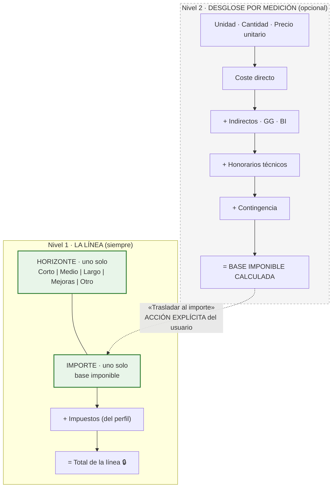
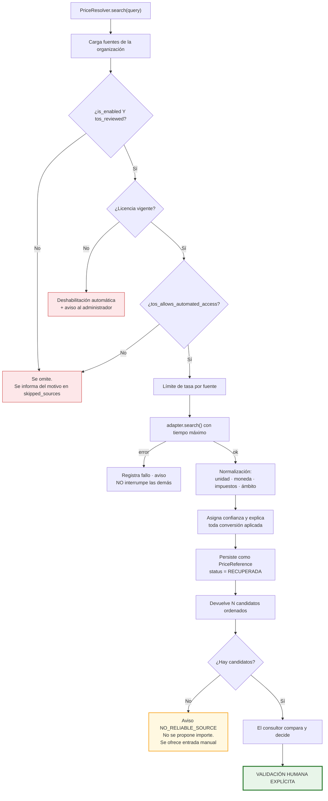
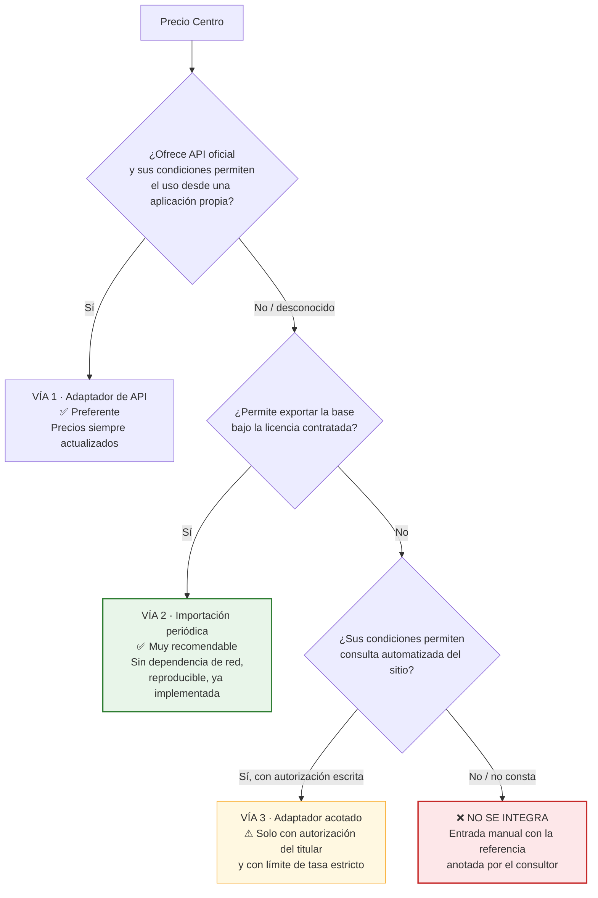
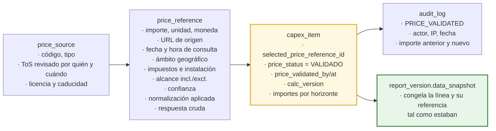

# 16. Motor de CAPEX y normalización de precios

---

## 16.1. Principios

| # | Principio | Consecuencia |
|---|---|---|
| 1 | **El cálculo es una función pura** | `CapexEngine` no accede a base de datos, red ni reloj. Entran datos, salen datos. Testeable al céntimo, en milisegundos `[REC]` |
| 2 | **Ninguna fórmula oculta** | Cada peldaño se persiste y se muestra con sus operandos `[REQ]` |
| 3 | **Decimal exacto, nunca coma flotante** | `Decimal` en Python, `NUMERIC` en PostgreSQL. El redondeo es una decisión explícita |
| 4 | **Una línea, un horizonte, un importe que lo incluye todo** | Horizontes mutuamente excluyentes; el importe es la base imponible final; el total con impuestos es columna generada `[REQ]` P-05 y P-05b |
| 5 | **Un precio sin procedencia no existe** | Toda línea con precio tiene una `price_reference`, incluida la entrada manual `[REQ]` |
| 6 | **La validación es humana, siempre** | No hay ruta de código que ponga `price_status = VALIDADO` sin usuario identificado `[REQ]` |
| 7 | **Las fuentes son adaptadores** | El núcleo no conoce ninguna fuente concreta `[REQ]` |
| 8 | **La versión del algoritmo se guarda** | `calc_version` permite reproducir un informe antiguo aunque la fórmula haya evolucionado `[REC]` |

---

## 16.2. Los dos niveles del importe

La especificación revisada plantea el CAPEX en **dos niveles que conviven**, y distinguirlos es la
decisión estructural de este bloque.



| | Nivel 1 · La línea | Nivel 2 · Medición |
|---|---|---|
| Origen | §3.3.4 «CAPEX estimado» | §3.3.5 (precios, GG, BI, contingencias) |
| Obligatorio | **Sí** | **No** `[SUP]` S-10 / P-08 |
| Qué contiene el importe | **Todo**: indirectos, honorarios y contingencia ya dentro | Los calcula, para ayudar a llegar a esa cifra |
| Contenido | **Un horizonte + un importe** | Cantidad, precio unitario y cascada |
| Para qué | Plan de inversión: cuánto y cuándo | Justificar de dónde sale el importe |
| Quién lo usa | Siempre | Cuando hay medición real o referencia de precio |
| Dónde se ve | Tabla principal de CAPEX | Panel de la línea, desplegable |

### Decisión P-05: un horizonte por línea

> **P-05 · DECIDIDO.** El importe se rellena **en una sola columna**. Una actuación se aplica en corto,
> medio o largo plazo; o se considera **mejora potencial** —que ahí decide el cliente—; o es **otro
> tipo de petición**. Son alternativas mutuamente excluyentes.

En el modelo esto es `time_horizon_id` (FK obligatoria) + `amount`, no cinco columnas. Tres
consecuencias, todas favorables:

| # | Consecuencia |
|---|---|
| 1 | **Es imposible que una línea quede repartida por error entre dos plazos.** Con cinco campos editables, un importe tecleado en la columna equivocada y olvidado en la otra pasa desapercibido |
| 2 | **La suma por horizonte es un `GROUP BY`**, no cinco sumas independientes que podrían descuadrar entre sí |
| 3 | **«Mejoras» queda bien definido.** No es un plazo, es una naturaleza: una línea no puede ser a la vez una necesidad a corto plazo y una mejora potencial que decide el cliente |

**La tabla puede seguir viéndose con cinco columnas** —es como se lee mejor y como está la hoja de
cálculo actual—, pero eso es **presentación**: la rejilla pivota el horizonte de cada línea a su
columna y el resto muestra «—». Ver [`09-ux-pantallas.md`](./09-ux-pantallas.md) pantalla 13.

### Qué representa el importe

> **P-05b · DECIDIDO.** El importe **incluye todo**: es la **base imponible final** de la línea, con
> los indirectos, honorarios, gastos generales, beneficio industrial y contingencia que el consultor
> estime ya dentro. Los impuestos van **encima**, desde el perfil de costes.

**La cascada no se aplica nunca sobre un importe tecleado a mano.** Cuando alguien escribe 48.500 € de
memoria, esa cifra ya lleva dentro lo que esa persona considera: aplicarle encima un 8 % de indirectos
y un 10 % de contingencia sería duplicar. Por eso el desglose es una **calculadora** cuyo resultado se
**traslada con un botón**, dejando constancia en `amount_source`, y la interfaz avisa cuando el importe
y la medición no coinciden.

#### Consecuencia sobre el perfil de costes `[REC]`

De los seis porcentajes del perfil, **solo uno se aplica a todas las líneas**:

| Porcentaje | Alcance | Cuándo se usa |
|---|---|---|
| **`tax_pct`** | **Todas** las líneas | Siempre, sobre `amount` |
| `indirect_pct` · `overhead_pct` · `profit_pct` · `fees_pct` · `contingency_pct` | **Solo** el desglose por medición | Valores por defecto de la calculadora, editables por línea |

Esto evita el malentendido más caro posible en este bloque: **creer que cambiar el porcentaje de
contingencia del perfil recalcula los 63 importes del proyecto.** No lo hace, y no debe hacerlo: esos
importes ya llevan dentro la contingencia que decidió el consultor. La interfaz de perfiles separa
visualmente ambos grupos y lo dice con esas palabras.

`[REC]` **Por qué el desglose sigue siendo opcional.** En muchas líneas el consultor pone un importe a
tanto alzado basado en su criterio, y solo en algunas hace una medición. Obligar a medir todo
ralentizaría el trabajo sin mejorar el resultado; eliminar la medición dejaría sin trazabilidad las
líneas donde sí la hay.

---

## 16.3. La cascada de costes

### Qué es la cascada, en una frase

Es el camino que lleva de **«el equipo cuesta 48.500 €»** a **«la actuación cuesta 72.679 €»**: los
porcentajes que se van sumando encima del precio desnudo —costes indirectos, gastos generales,
beneficio industrial, honorarios técnicos, contingencia— hasta llegar a la cifra que se presenta al
cliente.

### La pregunta de P-16 no es el orden, es la base `[REC]`

Conviene deshacer un equívoco que arrastraba la redacción anterior de esta sección. **Intercambiar dos
peldaños que se componen no cambia nada**, porque multiplicar es conmutativo:

| Secuencia | Resultado |
|---|---:|
| directo → indirectos → honorarios → contingencia | 61.075,08 € |
| directo → indirectos → **contingencia → honorarios** | 61.075,08 € |

Lo que sí cambia el resultado es **sobre qué se aplica cada porcentaje**: sobre el coste directo
desnudo, o sobre todo lo acumulado hasta ese punto. Con indirectos 8 %, GG 13 %, BI 6 %, honorarios
6 % y contingencia 10 % sobre un coste directo de 48.500 €:

| Criterio | Base imponible | Desviación |
|---|---:|---:|
| Todos los porcentajes sobre el **coste directo** (sin componer) | 69.355,00 € | −4,6 % |
| **Práctica estándar española** (PEM → PEC → honorarios → contingencia) | **72.679,35 €** | referencia |
| Todo compuesto en cadena, cada uno sobre lo acumulado | 73.155,73 € | +0,7 % |

**Ese es el rango real de P-16: un 5 %.** Sobre un CAPEX de 1,84 M€ son unos 84.000 €. No es
catastrófico, pero tampoco es ruido.

### Cascada adoptada ✅ P-16 CERRADA

> **P-16 · DECIDIDO por el cliente:** *«se queda así»*. Se adopta la cascada de este apartado —la
> convención española PEM → PEC → honorarios → contingencia— como **la cascada del sistema**, no como
> supuesto provisional.

`[REC]` **Corrijo mi propia propuesta anterior.** Tenía gastos generales y beneficio industrial
calculados sobre el coste directo desnudo. En la práctica española de presupuestación —y así lo recoge
el Reglamento General de la Ley de Contratos— **GG y BI se aplican sobre el PEM**, que ya incluye los
costes indirectos. La diferencia era de un −1,2 %: unos 22.000 € en un CAPEX de 1,84 M€. Adopto la
convención estándar como valor por defecto:

```
(1)  coste_directo        = cantidad × precio_unitario
(2)  indirectos           = coste_directo × %indirectos
(3)  PEM                  = (1)+(2)                      Presupuesto de Ejecución Material
(4)  gastos_generales     = PEM × %gastos_generales       ← sobre PEM, no sobre (1)
(5)  beneficio_industrial = PEM × %beneficio_industrial   ← sobre PEM, no sobre (1)
(6)  PEC                  = (3)+(4)+(5)                  Presupuesto de Ejecución por Contrata
(7)  honorarios_tecnicos  = PEC × %honorarios
(8)  subtotal_con_hon.    = (6)+(7)
(9)  contingencia         = (8) × %contingencia
(10) base_imponible       = (8)+(9)      ← FIN de la cascada: es `computed_base`
  ─────────────────────────────────────────────────────────────────────────
     ↓ el usuario traslada (10) al importe de la línea (`amount`)
  ─────────────────────────────────────────────────────────────────────────
(11) impuestos            = amount × %impuesto      ← A NIVEL DE LÍNEA
(12) total_cost           = amount + impuestos      ← columna generada
```

`[REC]` **Los pasos 11 y 12 están fuera de la cascada a propósito.** La cascada es una herramienta de
medición opcional; los impuestos se aplican **siempre**, sobre el importe de la línea, exista o no
desglose. Así, «impuestos configurables y separados del coste base» `[REQ]` se cumple igual en las 63
líneas del proyecto, y no solo en las que llevan medición.

| Decisión | Razón |
|---|---|
| Indirectos **sobre el coste directo** | Es la definición de PEM: ejecución material = directo + indirecto |
| GG y BI **sobre el PEM** | Convención española de presupuestación. GG suele ir al 13 % y BI al 6 %, ambos sobre PEM |
| Honorarios **sobre el PEC** | Los honorarios de proyecto y dirección se pactan sobre el presupuesto de ejecución por contrata, no sobre el coste desnudo del equipo |
| Contingencia **la última** | La incertidumbre afecta a todo el coste, incluidos sus honorarios |
| Impuestos **fuera de la cascada, sobre el importe de la línea** | Se aplican una sola vez y a todas las líneas por igual, lleven medición o no |

### Qué queda anotado, ahora que P-16 está cerrada

La estructura de la cascada queda fijada y hay una prueba que la ancla: con los porcentajes del
ejemplo, un coste directo de 48.500 € debe dar **72.679,35 €** de base imponible. Si alguien cambia un
peldaño sin querer, la prueba lo detecta.

Dos matices que conviene tener presentes, sin que ninguno reabra nada:

`[REC]` **Los porcentajes no son la cascada.** Lo que queda fijado es **sobre qué se aplica cada uno**;
los valores concretos (8 %, 13 %, 6 %, 6 %, 10 %) viven en el perfil de costes y **el cliente los edita
sin tocar código**. Los del ejemplo son los habituales del sector, no una imposición.

`[REC]` **Y si algún día no cuadra con un Excel de la consultora**, la corrección es cambiar
`cascade_config` —cinco líneas de JSON— y actualizar el valor esperado de esa prueba. No es desarrollo,
no es migración, y no afecta a ningún dato ya guardado: tras P-05b la cascada solo alimenta la
calculadora de medición, que es opcional, y **nunca recalcula un importe ya tecleado**.

### Configurabilidad `[REC]`

`cost_profile.cascade_config` (JSONB) declara el orden y la base de cada componente: adaptarse a la
práctica del cliente es configuración, no desarrollo.

```json
{
  "cascade_version": 1,
  "steps": [
    { "key": "indirect",    "base": ["direct"],                        "pct_field": "indirect_pct" },
    { "key": "overhead",    "base": ["direct","indirect"],             "pct_field": "overhead_pct" },
    { "key": "profit",      "base": ["direct","indirect"],             "pct_field": "profit_pct" },
    { "key": "fees",        "base": ["direct","indirect","overhead","profit"], "pct_field": "fees_pct" },
    { "key": "contingency", "base": ["direct","indirect","overhead","profit","fees"], "pct_field": "contingency_pct" }
  ],
  "// nota": "El impuesto NO es un paso de la cascada: se aplica sobre capex_item.amount.",
  "rounding": { "mode": "HALF_UP", "decimals": 2, "apply_at": ["step","total"] }
}
```

### Ejemplo trabajado

Perfil: indirectos 8 %, GG 13 %, BI 6 %, honorarios 6 %, contingencia 10 %, IVA 21 %.

| Paso | Operación | Importe |
|---|---|---:|
| Coste directo | 1 × 48.500,0000 | 48.500,00 € |
| Indirectos (8 %) | 48.500,00 × 0,08 | 3.880,00 € |
| **PEM** | ejecución material | **52.380,00 €** |
| Gastos generales (13 %) | 52.380,00 × 0,13 | 6.809,40 € |
| Beneficio industrial (6 %) | 52.380,00 × 0,06 | 3.142,80 € |
| **PEC** | ejecución por contrata | **62.332,20 €** |
| Honorarios (6 %) | 62.332,20 × 0,06 | 3.739,93 € |
| Contingencia (10 %) | 66.072,13 × 0,10 | 6.607,22 € |
| **Base imponible calculada** | fin de la cascada → `computed_base` | **72.679,35 €** |

Si el consultor traslada esa cifra al importe de la línea, el total con impuestos de la línea es:

| Paso | Operación | Importe |
|---|---|---:|
| Importe de la línea | trasladado desde la medición | 72.679,35 € |
| IVA (21 %) | 72.679,35 × 0,21 | 15.262,66 € |
| **Total de la línea** | columna generada | **87.942,01 €** |

`[SUP]` Los porcentajes del ejemplo son los habituales del sector; **los reales los fija el cliente en
el perfil de costes**. Lo que este documento fija es la **estructura**, no los valores.

### Redondeo `[REQ]`

| Aspecto | Decisión |
|---|---|
| Precisión interna | `NUMERIC(18,4)`; los intermedios conservan 4 decimales |
| Modo | `HALF_UP` (por defecto), `HALF_EVEN`, `UP`, `DOWN` |
| Dónde se aplica | Configurable: por peldaño y/o solo en el total |
| Presentación | Los agregados se redondean **al mostrar**, nunca antes de sumar |
| Garantía verificable | La suma de los totales de línea coincide **exactamente** con el total del proyecto. Es una prueba automatizada, no una promesa `[REC]` |

### Escenarios `[REQ]`

Dos modos por proyecto:

1. **Por factor de línea** (recomendado): `scenario_low_factor` y `scenario_high_factor`, con valores
   por defecto 0,85 y 1,25 `[SUP]`. Refleja que la incertidumbre no es igual en todas las líneas: un
   precio de oferta firme tiene menos horquilla que una estimación paramétrica.
2. **Por nivel de confianza**: derivado de `confidence` (`ALTA` ±10 %, `MEDIA` ±20 %, `BAJA` ±35 %)
   `[SUP]`.

`[REC]` Modo 1 con valores inicializados desde `confidence`: automatiza el caso general y permite
ajustar el particular.

### Recálculo `[REQ]` §9

Implementado **dos veces, a propósito**:

1. **`CapexEngine` en Python**: fuente de verdad para API, previsualización y exportaciones.
2. **Disparador en PostgreSQL**: red de seguridad ante escrituras que no pasen por el servicio
   (importaciones, correcciones, migraciones).

Una prueba compara ambas implementaciones sobre un corpus generado y **falla si difieren en un
céntimo**. Duplicar la lógica es un coste asumido: el riesgo de un total incoherente en un informe
firmado es mayor.

**Propagación**: cambiar el `cost_profile` del proyecto **no reescribe** en silencio las 63 líneas. Se
muestra el impacto (total actual → total nuevo, líneas afectadas) y se exige confirmación. Las líneas
con porcentaje personalizado se listan aparte y se respetan salvo indicación contraria. `[REC]`

---

## 16.4. Arquitectura de fuentes de precios

### La interfaz

`[REQ]` «Utiliza adaptadores para las distintas fuentes de precios, de forma que se puedan añadir,
desactivar o sustituir sin modificar el núcleo de CAPEX.»

```python
class PriceSourceAdapter(Protocol):
    """Contrato único que conoce el núcleo de CAPEX. Nada más."""

    key: str                        # coincide con price_source.adapter_key
    capabilities: SourceCapabilities

    def search(self, query: PriceQuery) -> list[PriceCandidate]:
        """Devuelve candidatos NORMALIZADOS. Nunca marca ninguno como seleccionado.

        Debe elevar SourceUnavailable ante cualquier fallo: el orquestador
        continúa con las demás fuentes y avisa al usuario.
        """


@dataclass(frozen=True)
class SourceCapabilities:
    supports_search: bool
    supports_geo_filter: bool
    requires_credentials: bool
    requires_licence: bool                # p. ej. bases de precios comerciales
    max_requests_per_minute: int
    tos_allows_automated_access: bool     # se rellena desde la revisión legal registrada
    tos_allows_storing_results: bool
    respects_robots: bool


@dataclass(frozen=True)
class PriceCandidate:
    unit_price: Decimal
    currency: str
    unit: str
    description: str
    source_url: str | None
    retrieved_at: datetime
    price_date: date | None
    geo_scope: str
    country_code: str
    includes_tax: bool | None            # None = la fuente no lo especifica
    includes_installation: bool | None
    scope_included: str | None
    scope_excluded: str | None
    confidence: Confidence
    raw_payload: dict
    # No existe ningún campo "selected", "recommended" ni "best".
```

### El orquestador



### Cumplimiento, grabado en el esquema

`[REQ]` §3.3.5: respetar términos de uso, propiedad intelectual, condiciones de API, restricciones de
extracción automatizada, protección de datos y normativa. «No realices scraping si está prohibido por
las condiciones de uso o por controles técnicos del sitio.»

Cómo se hace cumplir, y no solo se declara:

| Control | Mecanismo | Nivel |
|---|---|---|
| Una fuente no se activa sin revisión de condiciones | `CHECK (is_enabled = false OR (tos_reviewed = true AND tos_reviewed_by IS NOT NULL))` | **Base de datos** |
| Una licencia caducada deshabilita la fuente | Trabajo diario que comprueba `license_expires_at` | Código + datos |
| Solo `ADMIN` registra la revisión | Permiso `price_source:review_tos` | Autorización |
| Quién revisó y cuándo | `tos_reviewed_by/at`, `tos_url`, `tos_notes`, `license_reference` | Datos + auditoría |
| Se respeta `robots.txt` | Consulta y caché de `robots.txt`; si prohíbe la ruta, no se consulta | Código |
| Se respetan controles técnicos | Ante CAPTCHA, muro de sesión, `403` o `429` sistemático: **la fuente se deshabilita automáticamente** y se registra el motivo. **No se intenta eludir** | Código |
| Límite de tasa por fuente | `rate_limit_per_min` con contador en Redis | Código |
| Identificación honesta | `User-Agent` que identifica la aplicación y una URL de contacto. **No se suplanta un navegador** | Código |
| Trazabilidad | `raw_payload`, `source_url`, `retrieved_at` en cada referencia | Datos |

### Prioridad de fuentes `[REQ]`

| Prioridad | Tipo | Estado en el MVP |
|:--:|---|---|
| 1 | APIs oficiales o datos abiertos | `[PDV]` Ninguna concreta identificada aún |
| 2 | Bases de precios públicas y autorizadas | `[PDV]` **Precio Centro entra aquí** — ver §16.5 |
| 3 | Catálogos públicos de fabricantes o distribuidores | `[PDV]` Solo si sus condiciones lo permiten |
| 4 | **Entrada manual por usuario autorizado** | ✅ **Implementada** |
| — | **Catálogo interno licenciado del cliente** (importación XLSX/CSV) | ✅ **Implementada** `[REC]` |

---

## 16.5. Precio Centro: análisis honesto

> `[REQ]` §3.3.5 de la especificación revisada: *«Esta parte queda pendiente de revisión porque igual
> se conecta directamente a online.preciocentro.com.»*

### Lo que puedo afirmar y lo que no

| | |
|---|---|
| **Lo que sé** | Es una base de precios de la construcción de ámbito español, de acceso mediante **suscripción de pago**. Su contenido está protegido por derechos de propiedad intelectual sobre la base de datos |
| **Lo que NO he verificado y no voy a suponer** | Si ofrece **API pública o privada**; si permite **exportación** de su base en formato interoperable; qué dicen exactamente sus **condiciones de uso** sobre el acceso desde aplicaciones de terceros; si su `robots.txt` permite o prohíbe el acceso automatizado |
| **Lo que NO se va a hacer** | **Extracción automatizada del sitio web (scraping)**. Es una base de datos comercial protegida: aunque técnicamente fuese posible, hacerlo sin una autorización explícita sería un riesgo jurídico para el cliente, no una decisión de ingeniería |

`[REQ]` «No inventes APIs ni fuentes de precios» y «no afirmes que una integración funciona si no ha
sido probada». En consecuencia: **no se implementa ninguna integración con Precio Centro en el MVP**,
y no se afirma que vaya a funcionar.

### Las tres vías posibles, en orden de preferencia



`[REC]` **La vía 2 es la recomendada aunque exista API.** Motivos: un informe emitido debe ser
reproducible años después, y eso exige que el precio usado esté congelado en el sistema, no que
dependa de que un servicio externo siga respondiendo. Una importación periódica del catálogo
licenciado da precios reales **y** trazabilidad estable. El importador ya está en el MVP: si el
cliente puede exportar su suscripción, funciona desde el primer día.

### P-06 · DECIDIDO: sin fuente externa, precios editables a mano

> **P-06 · DECIDIDO por el cliente.** *«A falta de conectar una base de datos de precios externa, deja
> esos campos editables para que cada uno modifique a mano esa parte.»*

`[REQ]` **No hay integración con ninguna fuente externa, ni en el MVP ni en el horizonte visible.** El
precio es un campo que el consultor teclea y edita libremente. La arquitectura de adaptadores se
mantiene —cuesta lo mismo y deja la puerta abierta—, pero **no hay ningún adaptador externo activo** y
el sistema no afirma en ninguna pantalla que se haya consultado nada.

**Qué cambia respecto del diseño anterior** — y es un cambio de fricción, no de modelo:

| Antes | Ahora `[REQ]` |
|---|---|
| El precio venía de una referencia; a mano era la excepción, con justificación obligatoria | **A mano es el caso normal.** Precio unitario, cantidad y unidad se editan en la propia rejilla, sin diálogo intermedio |
| Justificación escrita obligatoria para cualquier precio manual | **La justificación deja de bloquear.** Se pide, no se exige. Ver abajo |
| El comparador de referencias era una pantalla central | Queda para comparar entradas del **catálogo interno importado**, que sigue siendo la vía recomendada |

`[REC]` **Por qué la justificación deja de ser obligatoria y qué se conserva en su lugar.** Exigir un
párrafo escrito en cada una de las 63 líneas de un proyecto, cuando *todas* son manuales porque no hay
otra cosa, no produce trazabilidad: produce sesenta y tres veces el texto «estimación propia». La
trazabilidad se conserva donde de verdad sirve y **sin pedirle nada al consultor**:

| Se conserva | Cómo |
|---|---|
| Quién puso el importe y cuándo | Automático, en `audit_log`. No depende de que nadie escriba nada |
| Qué importe había antes | El historial de cambios campo a campo, que ya existe |
| De dónde salió, cuando el consultor quiera decirlo | Campo de nota **opcional** y visible, con la fuente y la fecha |
| La revisión humana antes de emitir | `price_status` sigue existiendo. **Pasar a `VALIDADO` sí exige nota**, porque ahí sí hay una afirmación que alguien firma |
| El catálogo interno | Sigue siendo la vía recomendada: se importa una vez y se reutiliza entre proyectos |

`[REC]` **Esa es la diferencia útil:** teclear un precio es trabajo en curso y no debe costar nada;
declararlo validado es un acto de responsabilidad y sí debe pedir una línea de explicación.

`[LIM]` **Consecuencia que conviene asumir de frente: el catálogo de precios se va a desfasar.** Nada
lo actualiza solo. Quien lo detecta es el consultor que pide un presupuesto real, no el administrador
que mantiene el catálogo. Sin un canal, esa corrección se queda en un proyecto y el resto del equipo
sigue con el precio viejo. Es justo lo que resuelve el módulo de **Sugerencias**, tipo `PRECIO`:
[`19`](./19-sugerencias.md) §19.3. Los dos cambios llegan juntos y no es casualidad.

### Si algún día hay fuente externa

Los cuatro pasos siguen siendo los mismos, y **los dos primeros no son técnicos**:

1. Confirmar que existe **licencia vigente** y a nombre de quién.
2. Obtener y **revisar sus condiciones de uso**, y registrarlas en la ficha de la fuente.
3. Determinar el modo de acceso disponible (API, exportación, ninguno).
4. Implementar y **probar contra la fuente real** el adaptador correspondiente.

Mientras tanto, la fuente existe en el sistema **deshabilitada**, con su motivo visible en la pantalla
de administración, para que ningún consultor crea que se ha consultado.

### Adaptadores del MVP

| Adaptador | Qué hace | Estado |
|---|---|---|
| `ManualPriceSource` | **La vía principal** `[REQ]` P-06. Registra el precio que teclea el consultor y genera la `price_reference` en segundo plano, sin pedirle nada. La nota de procedencia es opcional | ✅ **Real** |
| `InternalCatalogSource` | Busca en el catálogo propio importado (XLSX/CSV con esquema documentado), con FTS en español sobre descripción y código. **La vía recomendada** para no reteclear entre proyectos | ✅ **Real** |
| `PrecioCentroSource` | **Andamio explícito.** Declara la interfaz, valida el contrato con datos de prueba y lanza `NotImplementedError` en producción | ⚠️ **ANDAMIO — no funcional, y sin fecha** |

---

## 16.6. Normalización

`[REQ]` Para cada precio recuperado se conserva: fuente, fecha y hora de consulta, unidad, moneda,
país o región, alcance incluido y excluido, impuestos incluidos o no, instalación incluida o no, nivel
de confianza y alternativas encontradas.

| Dimensión | Regla | Si no se puede normalizar |
|---|---|---|
| **Unidad** | Solo conversiones exactas y documentadas (m² ↔ m², ml ↔ m). **Nunca** entre unidades no equivalentes (m² → ud) | No se convierte. `UNIT_MISMATCH` y se muestra tal cual |
| **Moneda** | Se conserva la de origen. La conversión es una acción explícita del usuario, con tipo de cambio y fecha registrados | No se convierte |
| **Impuestos** | Se normaliza a base sin impuestos cuando la fuente lo declara | `includes_tax = NULL` y se muestra «no especificado». **No se asume** |
| **Instalación** | Ídem | `includes_installation = NULL` |
| **Ámbito geográfico** | Se conserva literal; el factor geográfico es un paso separado y visible | — |
| **Fecha** | `price_date` y `retrieved_at` son campos distintos | — |

`[REC]` La regla que más importa: **cuando la fuente no dice algo, el sistema dice «no especificado»,
no adivina.** Un precio marcado erróneamente como «IVA incluido» introduce un error del 21 % en el
informe de un cliente.

Todas las conversiones se escriben en `normalization_notes` en lenguaje llano:

```
Unidad sin conversión (ud → ud). Moneda sin conversión (EUR).
Impuestos: la fuente declara precio sin impuestos.
Índice aplicado: costes de construcción ES, 2025-11 (112,7) → 2026-07 (118,4), factor 1,0506.
Factor geográfico ES → ES-MAD: 1,05.
Precio original 48.500,0000 → precio normalizado 53.494,5200.
```

### Actualización por índices `[REQ]`

```
precio_actualizado = precio_origen
                   × (indice_destino / indice_origen)   ← actualización temporal
                   × factor_geografico                   ← ajuste territorial
                   × (1 + inflacion_adicional)           ← opcional
```

- El cálculo se **muestra** con sus operandos y **no se aplica hasta que el usuario lo confirma**.
- Aplicar una actualización **revierte `price_status` a `PENDIENTE_VALIDACION`**: el importe ha
  cambiado, luego hay que revalidarlo. `[REQ]`
- Si falta el índice de alguno de los periodos, **no se interpola**: se avisa y se ofrece introducir el
  valor o un precio manual. `[REC]`

---

## 16.7. Vistas de CAPEX

`[REQ]` Las vistas exigidas, más las que el modelo revisado hace posibles:

| Vista | Agrupación | Métricas | Uso |
|---|---|---|---|
| Por proyecto | — | Total, base, impuestos, escenarios, % sin validar | Cifra de portada |
| Por activo | `asset_id` | Total y **coste por m²** `[REC]` | Comparar edificios de una cartera |
| Por capítulo / código | `capex_code` (subárbol) | Total y % sobre el total | «¿Dónde está el dinero?» |
| **Por zona** | `zone_id` | Total por zona | Nueva con el modelo revisado: «la cubierta se lleva el 30 %» |
| **Por riesgo** | `risk_level_id` | Total por grado 01-04 | Justificar la urgencia |
| **Por concepto** | `capex_concept_id` | Normativa frente a mejora frente a vida útil | Negociación con el cliente |
| **Por horizonte** | `time_horizon_id` | Corto / medio / largo / mejoras / otro | **La tabla central del informe**. Cada línea cae en una sola categoría |
| Por año | `planned_year` | Total y acumulado | Plan de inversión plurianual |
| Por prioridad | `priority` | Total por nivel | Negociación |
| **Por recuperabilidad** | `tenant_recoverable` | Sí / No / N.A. | «¿Cuánto recae sobre la propiedad?» `[REC]` |

`[REC]` **Coste por m²** en la vista por activo: es el indicador que un inversor pide primero. Se
calcula sobre superficie total construida y se declara la base usada, para que nadie lo confunda con
superficie alquilable.

Con ≤ 300 líneas por proyecto `[SUP]` S-03, la agregación en PostgreSQL con índices responde en pocos
milisegundos. **No se introducen vistas materializadas en el MVP**: sería optimización prematura y
añadiría el problema de la invalidación.

---

## 16.8. Exportación

`[REQ]` XLSX y CSV. Y, desde la decisión **P-31**, con un propósito explícito que cambia dónde vive el
botón y qué aspecto tiene la hoja principal:

> **P-31 · DECIDIDO por el cliente.** La tabla de CAPEX del informe pasa a ser **tabla nativa de
> PowerPoint respetando el formato del Excel**, y la aplicación incorpora un **botón de exportar el
> CAPEX a XLSX** para que el equipo adjunte el fichero en los envíos que haga **fuera de la plataforma**.

Esa última frase es la que manda sobre el diseño de la exportación: el destinatario del XLSX **no es la
aplicación ni un analista interno, es un tercero** que recibe el fichero por correo junto al PPTX. Por
eso la hoja `CAPEX` debe **parecerse a la tabla del informe**, no a un volcado de base de datos.

### Dónde está el botón `[REQ]`

| Lugar | Comportamiento |
|---|---|
| **Editor de CAPEX** (pantalla 13) | Botón `Exportar a XLSX` en la barra de acciones, junto a `Importar`. Exporta **lo que se está viendo**: si hay filtros aplicados, lo advierte y ofrece exportar todo |
| **Ficha de proyecto** (pantalla 5) | Botón `Exportar CAPEX` en el bloque de CAPEX, sin pasar por el editor |
| **Versión de informe emitida** | Exporta desde el `data_snapshot` congelado, no desde los datos vivos: el XLSX **cuadra con el PPTX que se envió**, aunque el proyecto haya seguido cambiando |

`[REC]` Ese tercer caso es el que evita la incidencia clásica: «el Excel que me mandaste no cuadra con
el PowerPoint». Se marca en la propia hoja `Resumen`, con la versión y la fecha de emisión.

### Hojas del libro

| Hoja | Contenido |
|---|---|
| **`CAPEX`** | **Layout idéntico al de la tabla del informe** — ver §16.8bis, con las **cinco** columnas de plazo. Es la hoja que se abre al abrir el fichero |
| `Resumen` | Totales por horizonte, escenarios, perfil de costes aplicado, proyecto, versión de informe si procede, fecha y hora |
| `CAPEX detalle` | Una fila por línea con **todas las columnas**: código, capítulo, zona, riesgo, concepto, recuperable, horizonte, importe, impuestos, total, y la cascada completa si existe |
| `Trazabilidad` | Una fila por referencia de precio: fuente, URL, fecha de consulta, alcance, quién validó y cuándo |
| `Por capítulo` / `Por zona` / `Por riesgo` / `Por horizonte` | Tablas agregadas |
| `Hallazgos` | Hallazgos vinculados con su descripción, riesgo y comentarios |
| `Catálogos` | Leyenda de códigos y **definición íntegra de los cuatro grados de riesgo** `[REC]` |

`[REC]` La separación entre `CAPEX` (presentable) y `CAPEX detalle` (completa) es deliberada. Antes eran
una sola hoja y no podían serlo: la primera se envía a un tercero, la segunda es material de trabajo.

`[REC]` Las hojas `Trazabilidad` y `Catálogos` son las que convierten la exportación en un documento
defendible. Sin ellas, el XLSX es un Excel más.

### Auditoría y nombre del fichero

`[REC]` **Toda exportación se audita** como `EXPORT_CREATED`, con actor, fecha, proyecto, número de
líneas, importe total y si venía de datos vivos o de un snapshot. Es un fichero con el CAPEX íntegro de
un cliente saliendo por un canal que la aplicación ya no controla; que no quede rastro sería una laguna
difícil de justificar en una auditoría.

`[REC]` El nombre sigue una plantilla configurable, por coherencia con el renombrado de fotografías
([`10`](./10-fotografias.md) §15.4): `[Proyecto]_CAPEX_[Fecha]_v[N].xlsx`.

---

## 16.8bis. La hoja `CAPEX` y la tabla nativa comparten un solo diseño

`[REQ]` P-31. La estructura se ha **recuperado de los metarchivos EMF de las plantillas reales**
([`18`](./18-analisis-plantillas-reales.md) §18.7bis), de modo que no es una propuesta: es la tabla que
la consultora ya usa.

```
ESTIMATE ASSESSMENT OF THE ACTIONS REQUIRED IN THE PROPERTY: <CAPÍTULO>
┌───────────────┬─────────┬────────────┬─────────────────────────────────────────────┬──────────┐
│ Affected area │ Purpose │ Description│              ESTIMATED CAPEX                │ Comments │
│               │         │            ├─────────┬────────┬────────┬───────┬────────┤          │
│               │         │            │Short term│Mid term│Long t. │Improv.│ Other  │          │
└───────────────┴─────────┴────────────┴─────────┴────────┴────────┴───────┴────────┴──────────┘
```

| Columna | Origen en el modelo | Ancho `[SUP]` | Nota |
|---|---|:--:|---|
| Zona afectada | `zone.name` (i18n) | 1,10 in | |
| Concepto | `capex_concept.name` (i18n) | 0,90 in | |
| Descripción | `capex_item.description` | **2,65 in** | La que absorbe el desbordamiento. Ensanchada por P-38 |
| Corto plazo | `amount` si `horizon = CORTO` | 0,90 in | Vacío, **no «0,00 €»** |
| Medio plazo | `amount` si `horizon = MEDIO` | 0,90 in | |
| Largo plazo | `amount` si `horizon = LARGO` | 0,90 in | |
| Mejora potencial | `amount` si `horizon = MEJORA` | 0,90 in | |
| **Otro tipo de petición** | `amount` si `horizon = OTRO` | 0,90 in | ✅ **P-37: se muestra siempre**, en el informe y en el XLSX |
| Comentarios | `capex_item.comments` | 1,10 in | Estrechada: en las tablas reales va casi siempre vacía |

`[REQ]` **P-37 · las cinco columnas de plazo se muestran.** La imagen pegada en las plantillas solo
tenía cuatro, pero el Excel de trabajo del equipo sí lleva «Otro» y es la versión más actualizada. Ese
desfase es, por sí mismo, el mejor argumento para la tabla nativa: **se genera desde el dato, no desde
una captura de pantalla**, así que no puede volver a quedarse atrasada respecto de la hoja real.

**Reglas de composición, comunes a los dos formatos:**

| Regla | Valor |
|---|---|
| Cabecera | **Dos niveles**, con `ESTIMATED CAPEX` combinado sobre las **cinco** columnas de plazo |
| Título de bloque | Una fila por capítulo, con el texto `…: <CAPÍTULO>` |
| Formato de importe | `#.##0,00 €` — miles con punto, decimales con coma, según `output_locale` |
| Celda sin importe | **En blanco**. Es como está hoy y distingue «no aplica» de «cero» |
| Subtotales | Por capítulo, al cierre de cada bloque |
| Resumen final | `TOTAL CONTRACT BUDGET` y, como línea propia, los honorarios técnicos `[REC]` |
| **Tipografía** | **Gotham** ✅ P-38. `Gotham Light` en el cuerpo, `Gotham Medium` en encabezados y subtotales |
| Partición | 18 filas por diapositiva en el PPTX, encabezado repetido. Sin límite en el XLSX |

`[REQ]` **P-38 · se unifica todo en Gotham.** El Excel original venía en Century Gothic (y algún resto
de Calibri) simplemente porque era un fichero ajeno a la plantilla; al generar la tabla de forma nativa
esa frontera desaparece.

`[LIM]` **Tiene un coste medido:** Gotham es más ancha. Sobre el texto real de las tablas —3.769
caracteres extraídos de los metarchivos y comparados con las métricas de los `.otf`—, `Gotham Light`
ocupa un **+4,9 %** frente a Century Gothic (`Book` +6,2 %, `Medium` +8,2 %, `Bold` +9,6 %). De ahí las
dos correcciones de la tabla de arriba: **cuerpo en la variante más estrecha** y **5 % de anchura
trasvasado de `Comments` a `Description`**, que es donde el texto largo aparece de verdad. Con eso el
ancho total se mantiene en las 9,06 in medidas en el original.

`[LIM]` **La fidelidad no está verificada visualmente.** La estructura procede de los registros de texto
del EMF, que son exactos, pero los anchos son una reconstrucción a partir de las posiciones de dibujo y
**no se ha visto ninguna plantilla renderizada** en el entorno de análisis. La comparación lado a lado
—tabla generada contra la imagen EMF original— es un objetivo explícito de la prueba de concepto.

**Que compartan diseño no es cosmético:** el generador de la tabla nativa del PPTX y el de la hoja
`CAPEX` consumen **la misma estructura intermedia** (`CapexTableLayout`), de modo que una columna
añadida aparece en los dos sitios o en ninguno. Ver [`12`](./12-pptx.md) §17.6.

**Decisión consciente:** el XLSX contiene **valores, no fórmulas de Excel**. La fórmula viva está en la
aplicación y es auditable allí; reproducirla en Excel duplicaría la lógica donde nadie la mantiene y
donde el cliente podría alterarla sin rastro. Se incluyen todas las columnas intermedias para que el
cálculo sea verificable a mano.

**CSV**: tabla plana, UTF-8 con BOM (para que Excel en español lo abra bien), separador configurable
(`;` por defecto) y decimales según localización.

---

## 16.9. Trazabilidad del precio, punta a punta

`[REQ]` §9: «Una partida CAPEX debe conservar la trazabilidad de su precio.»



**Pregunta que el sistema responde tres años después, sobre un informe emitido:**
*«¿De dónde salió este importe de 48.500 € en el corto plazo?»*

→ Línea `CX-0117`, código `HC.H08.01 Producción de climatización`, zona Cubierta, riesgo 03 Alto,
concepto Vida útil, no recuperable a inquilino, horizonte **corto plazo (1-2 años)**. Precio
unitario del catálogo interno, referencia `CI-4471`, importada el 15/01/2026 de un catálogo con
licencia propia, precio con fecha 01/11/2025, ámbito ES-MAD, sin impuestos, instalación incluida, obra
civil y grúa excluidas. Validado por Luis Pérez el 28/07/2026 a las 10:42 desde la IP registrada.
Congelado en el snapshot de la versión 2 del informe, hash `c19e77…`.

Esa cadena completa es el producto real de este bloque.

---

## 16.10. Reglas de negocio implementadas

| Regla (`[REQ]` §9) | Dónde |
|---|---|
| Una partida conserva la trazabilidad de su precio | `CHECK (price_status = 'SIN_PRECIO' OR selected_price_reference_id IS NOT NULL)` |
| Un precio externo no está validado hasta revisión humana | `PriceCandidate` sin campo de selección; estado inicial `RECUPERADA`; `CHECK` que exige validador |
| Si cambia cantidad o precio, el total se recalcula | `CapexEngine` + disparador; prueba de equivalencia |
| Impuestos configurables y separados del coste base | Columnas independientes en modelo, API, vistas y exportación |
| Los cálculos son transparentes y editables | Cada peldaño persistido y editable; panel «Cómo se calcula» |
| Si no hay fuente fiable, se indica y no se inventa | `NO_RELIABLE_SOURCE`; entrada manual con justificación; línea `PENDIENTE_VALIDACION` |

---

## 16.11. Limitaciones declaradas

| # | Limitación | Consecuencia |
|---|---|---|
| 1 | `[LIM]` **Ninguna fuente externa está integrada ni probada**, incluida Precio Centro. Solo entrada manual y catálogo propio | El valor del CAPEX en el MVP depende del catálogo del cliente o del criterio del consultor. Limitación de alcance consciente, no un defecto |
| 2 | `[LIM]` La normalización de unidades solo cubre equivalencias exactas | Comparar €/m² con €/ud requiere criterio humano. El sistema avisa en lugar de inventar |
| 3 | `[LIM]` Sin conversión automática de moneda | Multi-moneda en un proyecto queda pendiente de P-19 |
| 4 | `[LIM]` Los índices se cargan manualmente | Automatizarlos exige una fuente con condiciones validadas |
| 5 | La cascada quedó fijada por P-16 (convención española). Los **porcentajes** siguen siendo del cliente | Se editan en el perfil de costes, sin tocar código. Cambiar la **estructura** es editar `cascade_config` |
| 6 | `[LIM]` Cambiar los porcentajes del perfil **no recalcula** los importes ya introducidos, por diseño (P-05b) | Si se quiere reestimar un proyecto entero con otra contingencia, hay que rehacer las mediciones línea a línea. Es el precio de que el importe sea la cifra que el consultor asume |
| 7 | `[LIM]` `PrecioCentroSource` es un andamio no funcional | Marcado como tal en código, documentación e interfaz. No se presenta como integración operativa |
