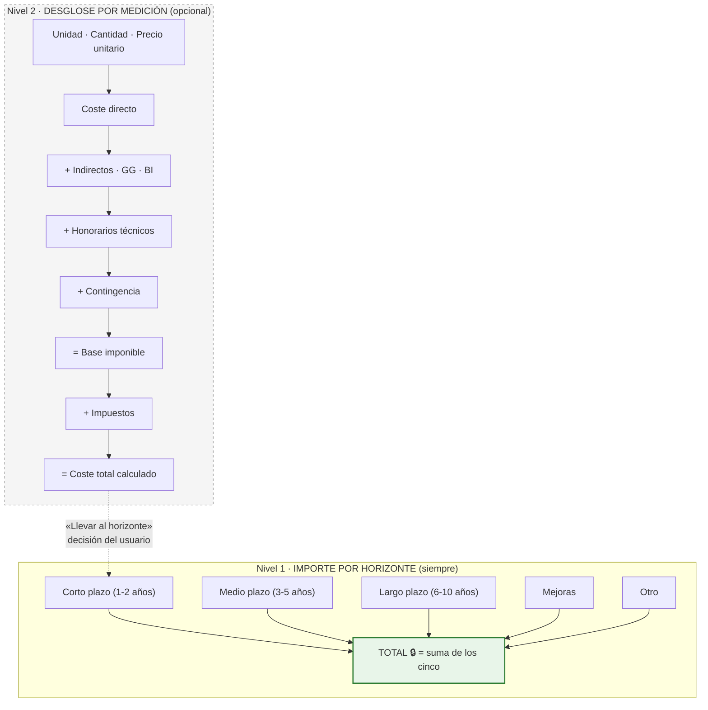
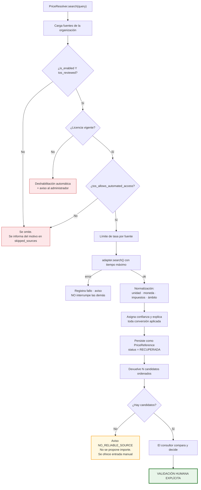
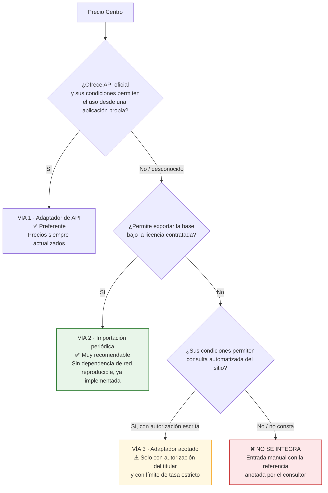
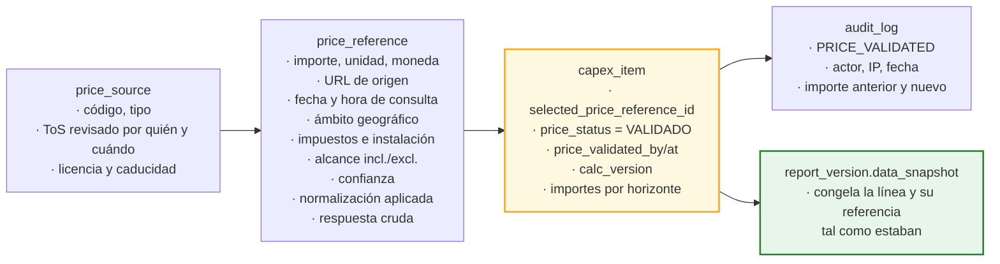

# 16. Motor de CAPEX y normalización de precios

---

## 16.1. Principios

| # | Principio | Consecuencia |
|---|---|---|
| 1 | **El cálculo es una función pura** | `CapexEngine` no accede a base de datos, red ni reloj. Entran datos, salen datos. Testeable al céntimo, en milisegundos `[REC]` |
| 2 | **Ninguna fórmula oculta** | Cada peldaño se persiste y se muestra con sus operandos `[REQ]` |
| 3 | **Decimal exacto, nunca coma flotante** | `Decimal` en Python, `NUMERIC` en PostgreSQL. El redondeo es una decisión explícita |
| 4 | **El total nunca se teclea** | Es la suma de los cinco horizontes, calculada en base de datos |
| 5 | **Un precio sin procedencia no existe** | Toda línea con precio tiene una `price_reference`, incluida la entrada manual `[REQ]` |
| 6 | **La validación es humana, siempre** | No hay ruta de código que ponga `price_status = VALIDADO` sin usuario identificado `[REQ]` |
| 7 | **Las fuentes son adaptadores** | El núcleo no conoce ninguna fuente concreta `[REQ]` |
| 8 | **La versión del algoritmo se guarda** | `calc_version` permite reproducir un informe antiguo aunque la fórmula haya evolucionado `[REC]` |

---

## 16.2. Los dos niveles del importe

La especificación revisada plantea el CAPEX en **dos niveles que conviven**, y distinguirlos es la
decisión estructural de este bloque.



| | Nivel 1 · Horizontes | Nivel 2 · Medición |
|---|---|---|
| Origen | §3.3.4 «CAPEX estimado» | §3.3.5 (precios, GG, BI, contingencias) |
| Obligatorio | **Sí** | **No** `[SUP]` S-10 / P-08 |
| Para qué | Plan de inversión: cuánto y cuándo | Justificar de dónde sale el importe |
| Quién lo usa | Siempre | Cuando hay una medición real o una referencia de precio |
| Dónde se ve | Tabla principal de CAPEX | Panel de la línea, desplegable |

`[REC]` **Por qué se modela así.** La especificación revisada presenta el CAPEX como una fila con
columnas por plazo y un total, que es exactamente la forma de la hoja de cálculo que estos equipos ya
usan: en muchas líneas el consultor pone un importe a tanto alzado basado en su criterio, y solo en
algunas hace una medición. Obligar a medir todo ralentizaría el trabajo sin mejorar el resultado;
eliminar la medición dejaría el CAPEX sin trazabilidad donde sí la hay. Los dos niveles conviven, y el
segundo alimenta al primero cuando existe.

`[PDV]` **P-05 sigue abierta**: se ha elegido la opción **más general** (cinco columnas de importe).
Si la respuesta es «una línea, un solo horizonte», reducirlo a `time_horizon_id` + `amount` es
trivial; lo contrario obligaría a partir líneas ya introducidas.

---

## 16.3. La cascada de costes

`[PDV]` **P-16 es la pregunta abierta más importante de este apartado**: el orden de aplicación de los
porcentajes cambia el resultado y debe coincidir con lo que la consultora ya usa.

### Cascada propuesta `[SUP]`

```
(1)  coste_directo        = cantidad × precio_unitario
(2)  indirectos           = coste_directo × %indirectos
(3)  gastos_generales     = coste_directo × %gastos_generales
(4)  beneficio_industrial = coste_directo × %beneficio_industrial
(5)  subtotal_ejecucion   = (1)+(2)+(3)+(4)
(6)  honorarios_tecnicos  = subtotal_ejecucion × %honorarios
(7)  subtotal_con_hon.    = (5)+(6)
(8)  contingencia         = subtotal_con_honorarios × %contingencia
(9)  base_imponible       = (7)+(8)
(10) impuestos            = base_imponible × %impuesto
(11) coste_total          = (9)+(10)
```

| Decisión | Razón |
|---|---|
| Indirectos, GG y BI **sobre el coste directo** | Práctica habitual de presupuestación de obra: son porcentajes sobre la ejecución material |
| Honorarios **sobre la ejecución completa** | Los honorarios de proyecto y dirección se pactan sobre el presupuesto de ejecución, no sobre el coste desnudo del equipo |
| Contingencia **después de honorarios** | La incertidumbre afecta a todo el coste, incluidos sus honorarios |
| Impuestos **al final, sobre la base imponible** | `[REQ]` «Impuestos configurables y separados del coste base»: son columnas independientes en todas las vistas |

### Configurabilidad `[REC]`

`cost_profile.cascade_config` (JSONB) declara el orden y la base de cada componente: adaptarse a la
práctica del cliente es configuración, no desarrollo.

```json
{
  "cascade_version": 1,
  "steps": [
    { "key": "indirect",    "base": ["direct"],                        "pct_field": "indirect_pct" },
    { "key": "overhead",    "base": ["direct"],                        "pct_field": "overhead_pct" },
    { "key": "profit",      "base": ["direct"],                        "pct_field": "profit_pct" },
    { "key": "fees",        "base": ["direct","indirect","overhead","profit"], "pct_field": "fees_pct" },
    { "key": "contingency", "base": ["direct","indirect","overhead","profit","fees"], "pct_field": "contingency_pct" },
    { "key": "tax",         "base": ["__subtotal_before_tax__"],       "pct_field": "tax_pct" }
  ],
  "rounding": { "mode": "HALF_UP", "decimals": 2, "apply_at": ["step","total"] }
}
```

### Ejemplo trabajado

Perfil: indirectos 8 %, honorarios 6 %, contingencia 10 %, IVA 21 %. GG y BI a 0.

| Paso | Operación | Importe |
|---|---|---:|
| Coste directo | 1 × 48.500,0000 | 48.500,00 € |
| Indirectos (8 %) | 48.500,00 × 0,08 | 3.880,00 € |
| Honorarios (6 %) | (48.500,00 + 3.880,00) × 0,06 | 3.142,80 € |
| Contingencia (10 %) | (52.380,00 + 3.142,80) × 0,10 | 5.552,28 € |
| **Base imponible** | | **61.075,08 €** |
| IVA (21 %) | 61.075,08 × 0,21 | 12.825,77 € |
| **Coste total** | | **73.900,85 €** |

### Redondeo `[REQ]`

| Aspecto | Decisión |
|---|---|
| Precisión interna | `NUMERIC(18,4)`; los intermedios conservan 4 decimales |
| Modo | `HALF_UP` (por defecto), `HALF_EVEN`, `UP`, `DOWN` |
| Dónde se aplica | Configurable: por peldaño y/o solo en el total |
| Presentación | Los agregados se redondean **al mostrar**, nunca antes de sumar |
| Garantía verificable | La suma de los totales de línea coincide **exactamente** con el total del proyecto. Es una prueba automatizada, no una promesa `[REC]` |

### Escenarios `[REQ]`

Dos modos por proyecto:

1. **Por factor de línea** (recomendado): `scenario_low_factor` y `scenario_high_factor`, con valores
   por defecto 0,85 y 1,25 `[SUP]`. Refleja que la incertidumbre no es igual en todas las líneas: un
   precio de oferta firme tiene menos horquilla que una estimación paramétrica.
2. **Por nivel de confianza**: derivado de `confidence` (`ALTA` ±10 %, `MEDIA` ±20 %, `BAJA` ±35 %)
   `[SUP]`.

`[REC]` Modo 1 con valores inicializados desde `confidence`: automatiza el caso general y permite
ajustar el particular.

### Recálculo `[REQ]` §9

Implementado **dos veces, a propósito**:

1. **`CapexEngine` en Python**: fuente de verdad para API, previsualización y exportaciones.
2. **Disparador en PostgreSQL**: red de seguridad ante escrituras que no pasen por el servicio
   (importaciones, correcciones, migraciones).

Una prueba compara ambas implementaciones sobre un corpus generado y **falla si difieren en un
céntimo**. Duplicar la lógica es un coste asumido: el riesgo de un total incoherente en un informe
firmado es mayor.

**Propagación**: cambiar el `cost_profile` del proyecto **no reescribe** en silencio las 63 líneas. Se
muestra el impacto (total actual → total nuevo, líneas afectadas) y se exige confirmación. Las líneas
con porcentaje personalizado se listan aparte y se respetan salvo indicación contraria. `[REC]`

---

## 16.4. Arquitectura de fuentes de precios

### La interfaz

`[REQ]` «Utiliza adaptadores para las distintas fuentes de precios, de forma que se puedan añadir,
desactivar o sustituir sin modificar el núcleo de CAPEX.»

```python
class PriceSourceAdapter(Protocol):
    """Contrato único que conoce el núcleo de CAPEX. Nada más."""

    key: str                        # coincide con price_source.adapter_key
    capabilities: SourceCapabilities

    def search(self, query: PriceQuery) -> list[PriceCandidate]:
        """Devuelve candidatos NORMALIZADOS. Nunca marca ninguno como seleccionado.

        Debe elevar SourceUnavailable ante cualquier fallo: el orquestador
        continúa con las demás fuentes y avisa al usuario.
        """


@dataclass(frozen=True)
class SourceCapabilities:
    supports_search: bool
    supports_geo_filter: bool
    requires_credentials: bool
    requires_licence: bool                # p. ej. bases de precios comerciales
    max_requests_per_minute: int
    tos_allows_automated_access: bool     # se rellena desde la revisión legal registrada
    tos_allows_storing_results: bool
    respects_robots: bool


@dataclass(frozen=True)
class PriceCandidate:
    unit_price: Decimal
    currency: str
    unit: str
    description: str
    source_url: str | None
    retrieved_at: datetime
    price_date: date | None
    geo_scope: str
    country_code: str
    includes_tax: bool | None            # None = la fuente no lo especifica
    includes_installation: bool | None
    scope_included: str | None
    scope_excluded: str | None
    confidence: Confidence
    raw_payload: dict
    # No existe ningún campo "selected", "recommended" ni "best".
```

### El orquestador



### Cumplimiento, grabado en el esquema

`[REQ]` §3.3.5: respetar términos de uso, propiedad intelectual, condiciones de API, restricciones de
extracción automatizada, protección de datos y normativa. «No realices scraping si está prohibido por
las condiciones de uso o por controles técnicos del sitio.»

Cómo se hace cumplir, y no solo se declara:

| Control | Mecanismo | Nivel |
|---|---|---|
| Una fuente no se activa sin revisión de condiciones | `CHECK (is_enabled = false OR (tos_reviewed = true AND tos_reviewed_by IS NOT NULL))` | **Base de datos** |
| Una licencia caducada deshabilita la fuente | Trabajo diario que comprueba `license_expires_at` | Código + datos |
| Solo `ADMIN` registra la revisión | Permiso `price_source:review_tos` | Autorización |
| Quién revisó y cuándo | `tos_reviewed_by/at`, `tos_url`, `tos_notes`, `license_reference` | Datos + auditoría |
| Se respeta `robots.txt` | Consulta y caché de `robots.txt`; si prohíbe la ruta, no se consulta | Código |
| Se respetan controles técnicos | Ante CAPTCHA, muro de sesión, `403` o `429` sistemático: **la fuente se deshabilita automáticamente** y se registra el motivo. **No se intenta eludir** | Código |
| Límite de tasa por fuente | `rate_limit_per_min` con contador en Redis | Código |
| Identificación honesta | `User-Agent` que identifica la aplicación y una URL de contacto. **No se suplanta un navegador** | Código |
| Trazabilidad | `raw_payload`, `source_url`, `retrieved_at` en cada referencia | Datos |

### Prioridad de fuentes `[REQ]`

| Prioridad | Tipo | Estado en el MVP |
|:--:|---|---|
| 1 | APIs oficiales o datos abiertos | `[PDV]` Ninguna concreta identificada aún |
| 2 | Bases de precios públicas y autorizadas | `[PDV]` **Precio Centro entra aquí** — ver §16.5 |
| 3 | Catálogos públicos de fabricantes o distribuidores | `[PDV]` Solo si sus condiciones lo permiten |
| 4 | **Entrada manual por usuario autorizado** | ✅ **Implementada** |
| — | **Catálogo interno licenciado del cliente** (importación XLSX/CSV) | ✅ **Implementada** `[REC]` |

---

## 16.5. Precio Centro: análisis honesto

> `[REQ]` §3.3.5 de la especificación revisada: *«Esta parte queda pendiente de revisión porque igual
> se conecta directamente a online.preciocentro.com.»*

### Lo que puedo afirmar y lo que no

| | |
|---|---|
| **Lo que sé** | Es una base de precios de la construcción de ámbito español, de acceso mediante **suscripción de pago**. Su contenido está protegido por derechos de propiedad intelectual sobre la base de datos |
| **Lo que NO he verificado y no voy a suponer** | Si ofrece **API pública o privada**; si permite **exportación** de su base en formato interoperable; qué dicen exactamente sus **condiciones de uso** sobre el acceso desde aplicaciones de terceros; si su `robots.txt` permite o prohíbe el acceso automatizado |
| **Lo que NO se va a hacer** | **Extracción automatizada del sitio web (scraping)**. Es una base de datos comercial protegida: aunque técnicamente fuese posible, hacerlo sin una autorización explícita sería un riesgo jurídico para el cliente, no una decisión de ingeniería |

`[REQ]` «No inventes APIs ni fuentes de precios» y «no afirmes que una integración funciona si no ha
sido probada». En consecuencia: **no se implementa ninguna integración con Precio Centro en el MVP**,
y no se afirma que vaya a funcionar.

### Las tres vías posibles, en orden de preferencia



`[REC]` **La vía 2 es la recomendada aunque exista API.** Motivos: un informe emitido debe ser
reproducible años después, y eso exige que el precio usado esté congelado en el sistema, no que
dependa de que un servicio externo siga respondiendo. Una importación periódica del catálogo
licenciado da precios reales **y** trazabilidad estable. El importador ya está en el MVP: si el
cliente puede exportar su suscripción, funciona desde el primer día.

### Qué hace falta para avanzar (P-06)

Cuatro pasos, y **los dos primeros no son técnicos**:

1. Confirmar que existe **licencia vigente** y a nombre de quién.
2. Obtener y **revisar sus condiciones de uso**, y registrarlas en la ficha de la fuente.
3. Determinar el modo de acceso disponible (API, exportación, ninguno).
4. Implementar y **probar contra la fuente real** el adaptador correspondiente.

Hasta entonces, la fuente existe en el sistema **deshabilitada**, con su motivo visible en la pantalla
de administración y en el comparador de precios, para que ningún consultor crea que se ha consultado.

### Adaptadores del MVP

| Adaptador | Qué hace | Estado |
|---|---|---|
| `ManualPriceSource` | Registra un precio introducido por un usuario, con justificación obligatoria. Genera una `price_reference` para que **incluso el precio a mano tenga trazabilidad** | ✅ **Real** |
| `InternalCatalogSource` | Busca en el catálogo propio importado (XLSX/CSV con esquema documentado), con FTS en español sobre descripción y código | ✅ **Real** |
| `PrecioCentroSource` | **Andamio explícito.** Declara la interfaz, valida el contrato con datos de prueba y lanza `NotImplementedError` en producción. Documenta los cuatro pasos anteriores | ⚠️ **ANDAMIO — no funcional** |

---

## 16.6. Normalización

`[REQ]` Para cada precio recuperado se conserva: fuente, fecha y hora de consulta, unidad, moneda,
país o región, alcance incluido y excluido, impuestos incluidos o no, instalación incluida o no, nivel
de confianza y alternativas encontradas.

| Dimensión | Regla | Si no se puede normalizar |
|---|---|---|
| **Unidad** | Solo conversiones exactas y documentadas (m² ↔ m², ml ↔ m). **Nunca** entre unidades no equivalentes (m² → ud) | No se convierte. `UNIT_MISMATCH` y se muestra tal cual |
| **Moneda** | Se conserva la de origen. La conversión es una acción explícita del usuario, con tipo de cambio y fecha registrados | No se convierte |
| **Impuestos** | Se normaliza a base sin impuestos cuando la fuente lo declara | `includes_tax = NULL` y se muestra «no especificado». **No se asume** |
| **Instalación** | Ídem | `includes_installation = NULL` |
| **Ámbito geográfico** | Se conserva literal; el factor geográfico es un paso separado y visible | — |
| **Fecha** | `price_date` y `retrieved_at` son campos distintos | — |

`[REC]` La regla que más importa: **cuando la fuente no dice algo, el sistema dice «no especificado»,
no adivina.** Un precio marcado erróneamente como «IVA incluido» introduce un error del 21 % en el
informe de un cliente.

Todas las conversiones se escriben en `normalization_notes` en lenguaje llano:

```
Unidad sin conversión (ud → ud). Moneda sin conversión (EUR).
Impuestos: la fuente declara precio sin impuestos.
Índice aplicado: costes de construcción ES, 2025-11 (112,7) → 2026-07 (118,4), factor 1,0506.
Factor geográfico ES → ES-MAD: 1,05.
Precio original 48.500,0000 → precio normalizado 53.494,5200.
```

### Actualización por índices `[REQ]`

```
precio_actualizado = precio_origen
                   × (indice_destino / indice_origen)   ← actualización temporal
                   × factor_geografico                   ← ajuste territorial
                   × (1 + inflacion_adicional)           ← opcional
```

- El cálculo se **muestra** con sus operandos y **no se aplica hasta que el usuario lo confirma**.
- Aplicar una actualización **revierte `price_status` a `PENDIENTE_VALIDACION`**: el importe ha
  cambiado, luego hay que revalidarlo. `[REQ]`
- Si falta el índice de alguno de los periodos, **no se interpola**: se avisa y se ofrece introducir el
  valor o un precio manual. `[REC]`

---

## 16.7. Vistas de CAPEX

`[REQ]` Las vistas exigidas, más las que el modelo revisado hace posibles:

| Vista | Agrupación | Métricas | Uso |
|---|---|---|---|
| Por proyecto | — | Total, base, impuestos, escenarios, % sin validar | Cifra de portada |
| Por activo | `asset_id` | Total y **coste por m²** `[REC]` | Comparar edificios de una cartera |
| Por capítulo / código | `capex_code` (subárbol) | Total y % sobre el total | «¿Dónde está el dinero?» |
| **Por zona** | `zone_id` | Total por zona | Nueva con el modelo revisado: «la cubierta se lleva el 30 %» |
| **Por riesgo** | `risk_level_id` | Total por grado 01-04 | Justificar la urgencia |
| **Por concepto** | `capex_concept_id` | Normativa frente a mejora frente a vida útil | Negociación con el cliente |
| **Por horizonte** | columnas | Corto / medio / largo / mejoras / otro | **La tabla central del informe** |
| Por año | `planned_year` | Total y acumulado | Plan de inversión plurianual |
| Por prioridad | `priority` | Total por nivel | Negociación |
| **Por recuperabilidad** | `tenant_recoverable` | Sí / No / N.A. | «¿Cuánto recae sobre la propiedad?» `[REC]` |

`[REC]` **Coste por m²** en la vista por activo: es el indicador que un inversor pide primero. Se
calcula sobre superficie total construida y se declara la base usada, para que nadie lo confunda con
superficie alquilable.

Con ≤ 300 líneas por proyecto `[SUP]` S-03, la agregación en PostgreSQL con índices responde en pocos
milisegundos. **No se introducen vistas materializadas en el MVP**: sería optimización prematura y
añadiría el problema de la invalidación.

---

## 16.8. Exportación

`[REQ]` XLSX y CSV.

**XLSX** (`openpyxl`), varias hojas:

| Hoja | Contenido |
|---|---|
| `Resumen` | Totales por horizonte, escenarios, perfil de costes aplicado, fecha |
| `CAPEX` | Una fila por línea con **todas las columnas**: código, capítulo, zona, riesgo, concepto, recuperable, los cinco horizontes, total, y la cascada completa si existe |
| `Trazabilidad` | Una fila por referencia de precio: fuente, URL, fecha de consulta, alcance, quién validó y cuándo |
| `Por capítulo` / `Por zona` / `Por riesgo` / `Por horizonte` | Tablas agregadas |
| `Hallazgos` | Hallazgos vinculados con su descripción, riesgo y comentarios |
| `Catálogos` | Leyenda de códigos y **definición íntegra de los cuatro grados de riesgo** `[REC]` |

`[REC]` Las hojas `Trazabilidad` y `Catálogos` son las que convierten la exportación en un documento
defendible. Sin ellas, el XLSX es un Excel más.

**Decisión consciente:** el XLSX contiene **valores, no fórmulas de Excel**. La fórmula viva está en la
aplicación y es auditable allí; reproducirla en Excel duplicaría la lógica donde nadie la mantiene y
donde el cliente podría alterarla sin rastro. Se incluyen todas las columnas intermedias para que el
cálculo sea verificable a mano.

**CSV**: tabla plana, UTF-8 con BOM (para que Excel en español lo abra bien), separador configurable
(`;` por defecto) y decimales según localización.

---

## 16.9. Trazabilidad del precio, punta a punta

`[REQ]` §9: «Una partida CAPEX debe conservar la trazabilidad de su precio.»



**Pregunta que el sistema responde tres años después, sobre un informe emitido:**
*«¿De dónde salió este importe de 48.500 € en el corto plazo?»*

→ Línea `CX-0117`, código `HC.H08.01 Producción de climatización`, zona Cubierta, riesgo 03 Alto,
concepto Vida útil, no recuperable a inquilino. Importe asignado al horizonte corto (1-2 años). Precio
unitario del catálogo interno, referencia `CI-4471`, importada el 15/01/2026 de un catálogo con
licencia propia, precio con fecha 01/11/2025, ámbito ES-MAD, sin impuestos, instalación incluida, obra
civil y grúa excluidas. Validado por Luis Pérez el 28/07/2026 a las 10:42 desde la IP registrada.
Congelado en el snapshot de la versión 2 del informe, hash `c19e77…`.

Esa cadena completa es el producto real de este bloque.

---

## 16.10. Reglas de negocio implementadas

| Regla (`[REQ]` §9) | Dónde |
|---|---|
| Una partida conserva la trazabilidad de su precio | `CHECK (price_status = 'SIN_PRECIO' OR selected_price_reference_id IS NOT NULL)` |
| Un precio externo no está validado hasta revisión humana | `PriceCandidate` sin campo de selección; estado inicial `RECUPERADA`; `CHECK` que exige validador |
| Si cambia cantidad o precio, el total se recalcula | `CapexEngine` + disparador; prueba de equivalencia |
| Impuestos configurables y separados del coste base | Columnas independientes en modelo, API, vistas y exportación |
| Los cálculos son transparentes y editables | Cada peldaño persistido y editable; panel «Cómo se calcula» |
| Si no hay fuente fiable, se indica y no se inventa | `NO_RELIABLE_SOURCE`; entrada manual con justificación; línea `PENDIENTE_VALIDACION` |

---

## 16.11. Limitaciones declaradas

| # | Limitación | Consecuencia |
|---|---|---|
| 1 | `[LIM]` **Ninguna fuente externa está integrada ni probada**, incluida Precio Centro. Solo entrada manual y catálogo propio | El valor del CAPEX en el MVP depende del catálogo del cliente o del criterio del consultor. Limitación de alcance consciente, no un defecto |
| 2 | `[LIM]` La normalización de unidades solo cubre equivalencias exactas | Comparar €/m² con €/ud requiere criterio humano. El sistema avisa en lugar de inventar |
| 3 | `[LIM]` Sin conversión automática de moneda | Multi-moneda en un proyecto queda pendiente de P-19 |
| 4 | `[LIM]` Los índices se cargan manualmente | Automatizarlos exige una fuente con condiciones validadas |
| 5 | `[LIM]` La cascada por defecto es un supuesto | Debe confirmarse contra los Excel reales del cliente antes del primer informe (P-16) |
| 6 | `[LIM]` El modelo de cinco columnas de importe es una interpretación | Pendiente de P-05. Se ha elegido la opción más general, reversible a la más simple |
| 7 | `[LIM]` `PrecioCentroSource` es un andamio no funcional | Marcado como tal en código, documentación e interfaz. No se presenta como integración operativa |
