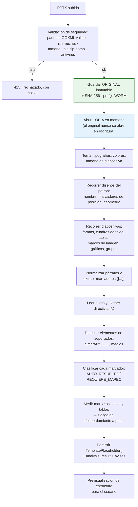
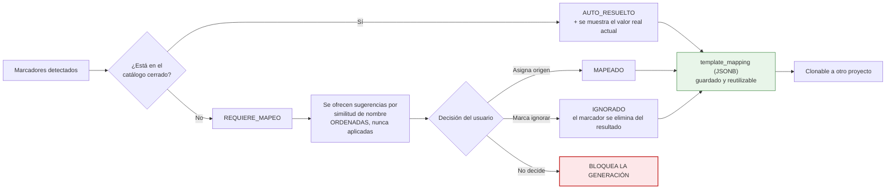
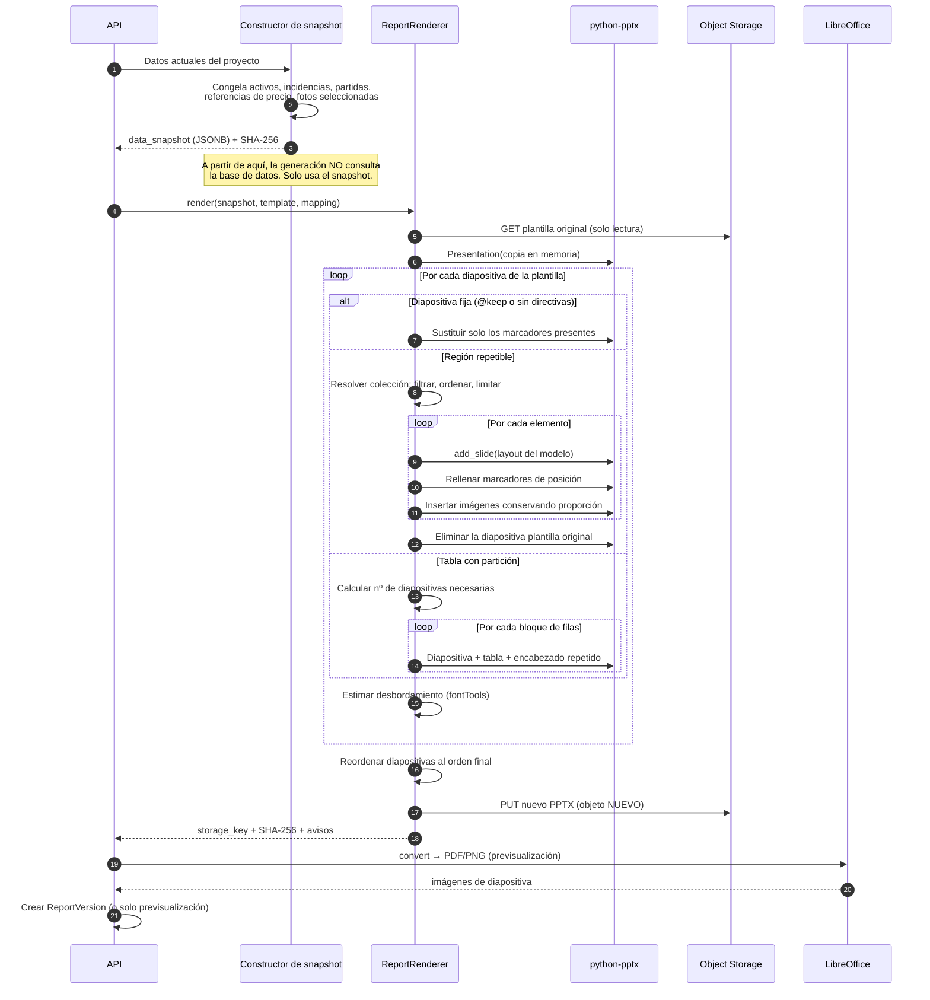
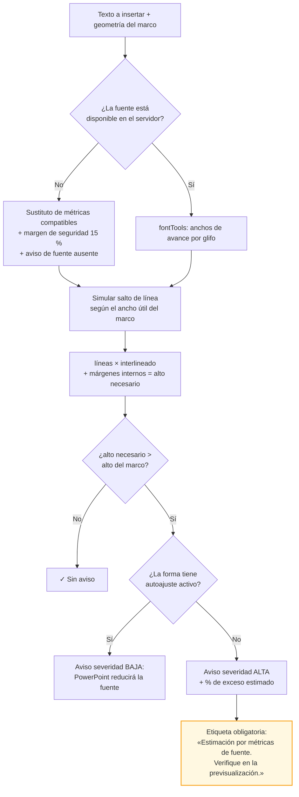
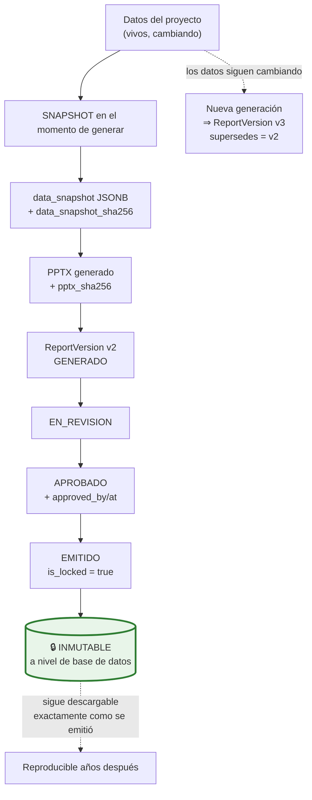

# 17. Estrategia de lectura, mapeo y generación de PPTX

> **Este es el bloque de mayor riesgo técnico del proyecto.** El documento empieza por las
> limitaciones reales, no por las promesas, porque las limitaciones condicionan todo lo demás.

---

## 17.1. Limitaciones técnicas reales (leer antes que nada)

`[LIM]` Todas verificables, todas con mitigación propuesta y ninguna resoluble por completo dentro
del ecosistema de licencia permisiva.

| # | Limitación | Impacto | Mitigación adoptada |
|---|---|---|---|
| **L1** | **`python-pptx` no ofrece una API oficial para duplicar diapositivas.** La copia de XML de diapositiva con reasignación de relaciones es una técnica de la comunidad, no soportada, y es frágil con gráficos, medios incrustados, SmartArt y objetos OLE | Es el corazón del requisito «una diapositiva por activo / por sistema / por incidencia» | **Estrategia principal:** las diapositivas repetibles se definen como **diseños (layouts) del patrón**, y cada repetición es una diapositiva nueva creada desde su diseño. Es el camino soportado por la biblioteca y el que hereda de forma nativa tema, tipografías, posiciones, logos y pies. **Estrategia secundaria** (clonado de XML de una diapositiva modelo) solo para casos que el diseño no cubra, con lista explícita de elementos no soportados |
| **L2** | **`python-pptx` no renderiza.** No hay forma de saber, desde la biblioteca, si un texto cabe o si una tabla desborda | La detección de desbordamiento no puede ser exacta | Doble vía: (a) **estimación** por métricas de fuente con `fontTools`; (b) **previsualización real** convirtiendo a PDF/PNG con LibreOffice headless. Los avisos se presentan **explícitamente como estimaciones** |
| **L3** | **LibreOffice no renderiza igual que PowerPoint.** Difieren en sustitución de fuentes, SmartArt, efectos, algunos gráficos y saltos de línea | La previsualización es indicativa, no idéntica al resultado en el ordenador del cliente | Se declara en la propia pantalla de previsualización. Se recomienda al menos una validación manual en PowerPoint por plantilla nueva. `[REC]` Si el cliente exige fidelidad exacta, existe una vía comercial (§17.9) |
| **L4** | **Las métricas de fuente exigen el archivo de la fuente.** Si la plantilla usa una tipografía corporativa no instalada en el servidor, la medición usa un sustituto y pierde precisión | Falsos positivos y falsos negativos en el aviso de desbordamiento | Se permite **subir los archivos de fuente** junto a la plantilla; si no están, se mide con un sustituto de métricas compatibles, se **amplía el margen de seguridad al 15 %** y el aviso indica que la fuente no estaba disponible |
| **L5** | **`python-pptx` no crea gráficos complejos.** Sí puede sustituir los datos de un gráfico que ya exista en la plantilla | No se pueden generar gráficos arbitrarios | **Contrato de plantilla:** los gráficos deben existir en la plantilla con su formato definitivo; la aplicación solo reemplaza sus datos |
| **L6** | **No hay API para SmartArt.** Es XML propietario que la biblioteca no modela | Un SmartArt con marcadores dentro no se rellenará | La plantilla no debe usar SmartArt en zonas de datos. Se **detecta y se avisa** durante el análisis, indicando la diapositiva. El SmartArt existente se conserva intacto |
| **L7** | **El texto de un marcador puede estar fragmentado en varios `run`.** Word y PowerPoint parten el texto por revisiones ortográficas o cambios de formato: `{{project.` + `name}}` | Los marcadores podrían no detectarse | El analizador **normaliza el texto del párrafo completo** antes de buscar marcadores, y al sustituir conserva el formato del primer `run` del marcador. Es un caso probado en la suite |
| **L8** | **PowerPoint puede autoajustar el texto** (`normAutofit` con `fontScale`), y ese cálculo lo hace PowerPoint, no el fichero | Un texto que la estimación marca como desbordado puede encogerse solo al abrirlo | Se detecta si la forma tiene autoajuste activo y, en ese caso, el aviso baja de severidad y lo indica |
| **L9** | **Las tablas creadas por código heredan el estilo, no el formato manual.** Si el autor de la plantilla dio formato a mano celda a celda, las filas nuevas no lo replican | Tablas largas con aspecto inconsistente | El generador **clona el XML de propiedades de una fila modelo** de la plantilla. Funciona bien con formato de fila; el formato irregular por celdas se declara no soportado |
| **L10** | Un PPTX con **objetos OLE, vídeo, audio o macros** no se procesa en esos elementos | Los `.pptm` se rechazan por política de seguridad; los objetos incrustados se conservan sin tocarlos | Se avisa en el análisis |

**Conclusión honesta:** con `python-pptx` y un **contrato de plantilla documentado** se puede generar
informes de alta calidad que conservan la identidad corporativa. Sin ese contrato, aceptar una
plantilla arbitraria y garantizar el resultado **no es técnicamente posible** con herramientas de
licencia permisiva. Esta es la razón de ser del supuesto S-09, y **P-01 (obtener plantillas reales)
es la pregunta abierta más urgente del proyecto**.

---

## 17.2. El contrato de plantilla

`[SUP]` S-09. Es una convención documentada que el autor de la plantilla sigue una vez. La aplicación
incluye una **plantilla de referencia descargable** y un **validador** que señala los
incumplimientos.

### Regla 1 · Los marcadores van en el cuerpo, las instrucciones en las notas

```
┌─ Diapositiva ────────────────────────────┐
│                                          │   ← El cuerpo contiene solo
│   {{asset.name}}                         │     los VALORES a insertar
│   {{asset.address}}                      │
│   ┌────────────┐                         │
│   │{{asset.    │                         │
│   │ main_photo}}│                        │
│   └────────────┘                         │
└──────────────────────────────────────────┘
┌─ Notas del orador ───────────────────────┐
│ @repeat: asset                           │   ← Las notas contienen las
│ @sort: name                              │     INSTRUCCIONES de generación
│ @photos: max=1, fit=contain              │
└──────────────────────────────────────────┘
```

`[REC]` **Por qué las directivas van en las notas del orador y no en el cuerpo:** son texto no
visual, no alteran el diseño, `python-pptx` las lee y escribe con fiabilidad, sobreviven a la edición
del diseño en PowerPoint, y el autor de la plantilla puede leerlas y modificarlas sin herramientas
especiales. Meterlas en cuadros de texto ocultos —una alternativa habitual— es frágil: alguien acaba
borrándolos o desplazándolos.

### Regla 2 · Las diapositivas repetibles se definen como diseños del patrón

Para una sección que se repite (por activo, por sistema, por incidencia), el autor crea un **diseño**
en el patrón de diapositivas y lo referencia. La aplicación instancia una diapositiva nueva desde
ese diseño por cada elemento.

**Ventaja decisiva:** al crear desde diseño, PowerPoint hereda automáticamente tema, tipografías,
colores, logos, posiciones, tamaños, encabezados y pies. **No hay que copiar el formato: se hereda.**
Esto es lo que hace viable el requisito de conservación de formato.

`[LIM]` Cuando la plantilla ya existe y no puede rediseñarse, se admite la **estrategia secundaria**:
marcar una diapositiva del cuerpo como modelo (`@model: asset`) y clonar su XML. Elementos **no
soportados** en el clonado, que se avisan durante el análisis: SmartArt, gráficos, vídeo, audio,
objetos OLE y transiciones.

### Regla 3 · Sintaxis de marcadores

| Forma | Uso | Ejemplo |
|---|---|---|
| `{{ruta.campo}}` | Valor escalar | `{{project.name}}` |
| `{{ruta.campo\|formato}}` | Con formato | `{{report_date\|d 'de' MMMM 'de' yyyy}}`, `{{capex.total\|#,##0.00 €}}` |
| `{{ruta.campo\|default:texto}}` | Valor alternativo si está vacío | `{{asset.year_last_refurb\|default:No consta}}` |
| `{{#tabla nombre}}` en una celda | Fila de tabla repetible | `{{#row capex_items}}` |
| `{{@imagen}}` en un marco | Inserción de imagen | `{{@asset.main_photo}}` |
| `{{@fotos}}` en varios marcos | Reparto de fotos entre marcos | `{{@selected_photos}}` |

### Regla 4 · Catálogo de marcadores reconocidos automáticamente

`[REQ]` El encargo propone un conjunto; se amplía y se documenta como catálogo cerrado y versionado:

| Ámbito | Marcadores |
|---|---|
| Proyecto | `{{project.name}}`, `{{project.code}}`, `{{project.dd_type}}`, `{{project.scope}}`, `{{project.status}}`, `{{project.currency}}`, `{{project.notes}}` |
| Cliente | `{{client.name}}`, `{{client.contact_name}}`, `{{client.contact_job}}`, `{{client.address}}` |
| Informe | `{{report_date}}`, `{{report_version}}`, `{{report_author}}`, `{{report_approver}}`, `{{report_title}}` |
| Activo | `{{asset.name}}`, `{{asset.code}}`, `{{asset.typology}}`, `{{asset.address}}`, `{{asset.city}}`, `{{asset.gfa}}`, `{{asset.lettable_area}}`, `{{asset.year_built}}`, `{{asset.year_last_refurb}}`, `{{asset.floors}}`, `{{asset.main_use}}`, `{{asset.description}}`, `{{@asset.main_photo}}` |
| Incidencia | `{{finding.code}}`, `{{finding.title}}`, `{{finding.description}}`, `{{finding.risk}}`, `{{finding.criticality}}`, `{{finding.action}}`, `{{finding.time_horizon}}`, `{{finding.recommendation}}`, `{{finding.regulatory_reference}}`, `{{@finding.photos}}` |
| Equipo | `{{equipment.type}}`, `{{equipment.manufacturer}}`, `{{equipment.model}}`, `{{equipment.install_year}}`, `{{equipment.condition}}`, `{{equipment.remaining_life}}` |
| Sistema | `{{system.name}}`, `{{system.findings_count}}`, `{{system.capex_total}}` |
| CAPEX | `{{capex.total}}`, `{{capex.total_before_tax}}`, `{{capex.tax}}`, `{{capex.scenario_low}}`, `{{capex.scenario_high}}`, `{{capex_table}}`, `{{capex_by_system_table}}`, `{{capex_by_year_table}}` |
| Fotos | `{{@selected_photos}}`, `{{photo.caption}}`, `{{photo.date}}` |
| Agregados | `{{executive_summary}}`, `{{findings}}`, `{{findings_summary_table}}`, `{{risk_matrix}}`, `{{visit_summary}}`, `{{access_limitations}}` |

`[REQ]` **Cualquier marcador fuera de este catálogo pasa a `REQUIERE_MAPEO` y bloquea la
generación** hasta que el usuario le asigne un origen o lo marque como ignorado. Nunca se adivina.

### Regla 5 · Directivas de las notas

| Directiva | Función | Ejemplo |
|---|---|---|
| `@repeat: <colección>` | Una diapositiva por elemento | `@repeat: asset` |
| `@filter: <expresión>` | Filtra la colección | `@filter: criticality in [ALTA, CRITICA]` |
| `@sort: <campo>` | Ordena (`-` = descendente) | `@sort: -risk_score` |
| `@max: <n>` | Límite de elementos | `@max: 20` |
| `@group_by: <campo>` | Agrupa antes de repetir | `@group_by: technical_system` |
| `@table: rows=<n>` | Filas por diapositiva al partir | `@table: rows=18, repeat_header=true, totals=last` |
| `@photos: max=<n>, fit=<modo>` | Fotos por diapositiva y ajuste | `@photos: max=3, fit=contain, caption=below` |
| `@if_empty: <acción>` | Qué hacer si la colección está vacía | `@if_empty: skip_slide` \| `keep_with_placeholder` \| `warn` |
| `@model: <colección>` | Marca esta diapositiva como modelo a clonar (estrategia secundaria) | `@model: finding` |
| `@keep` | Diapositiva fija que no se toca nunca | `@keep` |

`[REC]` `@if_empty: skip_slide` es más importante de lo que parece: evita las diapositivas vacías
que delatan un informe generado a máquina.

---

## 17.3. Fase 1 · Análisis de la plantilla



**Salida del análisis** (fragmento de `analysis_result`):

```json
{
  "slide_size": { "width_emu": 12192000, "height_emu": 6858000, "ratio": "16:9" },
  "theme": {
    "major_font": "Arial", "minor_font": "Arial",
    "colors": { "accent1": "#1F4E79", "accent2": "#E53935" },
    "fonts_available_on_server": true
  },
  "layouts": [
    { "index": 3, "name": "Ficha de activo", "placeholders": 5, "used_by_slides": [5] }
  ],
  "slides": [
    {
      "index": 5, "layout_name": "Ficha de activo",
      "shapes": [
        { "shape_id": "4", "name": "Título 1", "kind": "TITULO",
          "bbox": { "x": 838200, "y": 365125, "w": 10515600, "h": 1325563 },
          "tokens": ["{{asset.name}}"], "autofit": "none",
          "font": { "name": "Arial", "size_pt": 32, "bold": true } },
        { "shape_id": "7", "name": "Tabla datos", "kind": "TABLA",
          "dims": { "rows": 8, "cols": 2 },
          "tokens": ["{{asset.address}}", "{{asset.gfa}}", "{{asset.year_built}}"] },
        { "shape_id": "9", "name": "Marco imagen", "kind": "IMAGEN",
          "bbox": { "x": 6858000, "y": 2000250, "w": 4400550, "h": 3000375 },
          "tokens": ["{{@asset.main_photo}}"] },
        { "shape_id": "12", "name": "Mapa", "kind": "IMAGEN",
          "tokens": ["{{@asset.map}}"], "resolution_status": "REQUIERE_MAPEO" }
      ],
      "notes_directives": { "repeat": "asset", "sort": "name", "photos": { "max": 1, "fit": "contain" } },
      "warnings": []
    },
    {
      "index": 21, "layout_name": "Texto completo",
      "warnings": [
        { "code": "UNKNOWN_TOKEN", "token": "{{esg_summary}}", "severity": "BLOQUEANTE" },
        { "code": "SMARTART_DETECTED", "shape_id": "5", "severity": "MEDIA",
          "message": "Se conservará intacto; no se puede rellenar con datos." }
      ]
    }
  ],
  "summary": {
    "tokens_total": 31, "auto_resolved": 27, "require_mapping": 2, "ignored": 2,
    "repeat_regions": 5, "partitioned_tables": 1
  }
}
```

---

## 17.4. Fase 2 · Mapeo



`[REQ]` «Si no es posible determinar automáticamente dónde insertar un contenido, solicita que el
usuario realice el mapeo. No adivines ni sobrescribas elementos sin confirmación.»

Se implementa con tres reglas duras:

1. Un marcador fuera del catálogo **nunca** recibe origen automático. Se ofrecen sugerencias
   ordenadas por similitud, y el usuario elige.
2. Una forma **sin marcador no se toca jamás.** El texto corporativo, las notas legales y los pies
   escritos a mano permanecen literalmente intactos.
3. Un marcador `REQUIERE_MAPEO` **impide generar**. Solo un director de proyecto puede forzar la
   generación, con motivo escrito que queda auditado.

**Estructura del mapeo guardado:**

```json
{
  "version": 2,
  "tokens": {
    "{{project.name}}":     { "source": "project.name" },
    "{{report_date}}":      { "source": "system.now", "format": "d 'de' MMMM 'de' yyyy" },
    "{{executive_summary}}":{ "source": "project.notes",
                              "on_overflow": "warn", "max_chars": 1800 },
    "{{esg_summary}}":      { "source": "manual_text",
                              "value": "Texto introducido por el usuario" },
    "{{@asset.map}}":       { "source": "asset.static_map_image", "fit": "contain" }
  },
  "repeat_rules": [
    { "slide_index": 5,  "collection": "assets",   "sort": "name",
      "if_empty": "warn" },
    { "slide_index": 9,  "collection": "findings",
      "filter": { "criticality": ["ALTA", "CRITICA"] },
      "sort": "-risk_score", "max": 20, "if_empty": "skip_slide" },
    { "slide_index": 18, "collection": "assets",
      "photos": { "max": 3, "fit": "contain", "caption": "below" } }
  ],
  "table_rules": [
    { "slide_index": 14, "token": "{{capex_table}}",
      "columns": ["code", "description", "unit", "quantity", "unit_price", "total_cost"],
      "group_by": "asset", "rows_per_slide": 18,
      "repeat_header": true, "totals": "last", "number_slides": true,
      "decimals": 0 }
  ],
  "photo_rules": { "default_fit": "contain", "caption_source": "photo.caption",
                   "strip_exif": true }
}
```

---

## 17.5. Fase 3 · Generación



### Conservación del formato: cómo se consigue realmente

`[REQ]` Tema, patrón, tipografías, colores, logos, posiciones, tamaños, proporciones, encabezados y
pies.

| Elemento | Mecanismo | Fiabilidad |
|---|---|---|
| Tema, tipografías, colores | Se heredan del patrón: nunca se tocan | ✅ Alta |
| Logos, encabezados, pies | Viven en el patrón y el diseño; las diapositivas nuevas los heredan | ✅ Alta |
| Posiciones y tamaños | Al crear desde diseño, los marcadores de posición ya están colocados | ✅ Alta |
| Formato del texto sustituido | Se conserva el formato del primer `run` del marcador y se eliminan los `run` restantes del marcador | ✅ Alta |
| Proporción de imágenes | Se calcula el encaje (`contain` por defecto) y se centra en el marco. **Nunca se deforma** | ✅ Alta |
| Formato de filas de tabla nuevas | Se clona el XML de propiedades de una fila modelo | 🟡 Media (`[LIM]` L9) |
| Gráficos | Solo sustitución de datos de gráficos preexistentes | 🟡 Media (`[LIM]` L5) |
| SmartArt | Se conserva intacto, no se rellena | 🔴 No soportado (`[LIM]` L6) |
| Transiciones y animaciones | Se conservan en diapositivas fijas; no se replican al crear desde diseño | 🟡 Media |

### Inserción de imágenes conservando proporción

```
Marco: 4400550 × 3000375 EMU  (relación 1,467)
Foto:  4032 × 3024 px         (relación 1,333)

fit = contain  → la altura manda:
  alto_final  = 3000375
  ancho_final = 3000375 × 1,333 = 3999500
  x_final = x_marco + (4400550 − 3999500) / 2   ← centrado horizontal
  y_final = y_marco
  Resultado: la foto cabe completa, sin deformar, centrada en el marco.

fit = cover    → se recorta el exceso conservando la proporción (recorte centrado).
fit = stretch  → NO se ofrece: deformaría la evidencia fotográfica.
```

`[REC]` `stretch` se excluye deliberadamente del sistema. Deformar una fotografía de una instalación
técnica es un defecto, no una opción de maquetación.

### Detección de desbordamiento



`[LIM]` La estimación no considera kerning contextual, ligaduras, reglas de guionado del español ni
el algoritmo exacto de salto de línea de PowerPoint. Precisión esperada ±10–15 % `[SUP]`. Por eso
existe la previsualización con LibreOffice y por eso el aviso lo dice.

### Partición de tablas largas

```
62 filas de datos · 18 filas por diapositiva · encabezado repetido

Diapositiva 14  «CAPEX (1 de 4)»   encabezado + filas 1–18
Diapositiva 15  «CAPEX (2 de 4)»   encabezado + filas 19–36
Diapositiva 16  «CAPEX (3 de 4)»   encabezado + filas 37–54
Diapositiva 17  «CAPEX (4 de 4)»   encabezado + filas 55–62 + FILA DE TOTALES
```

Reglas `[REC]`:
- Nunca se parte un grupo (por ejemplo, las partidas de un activo) dejando una sola fila colgando en
  la diapositiva siguiente: si no caben al menos dos filas del grupo, el grupo entero pasa a la
  siguiente.
- Los totales solo aparecen en la última diapositiva del bloque.
- El «(n de N)» se inserta en el título si el marcador existe; si no, se avisa.

---

## 17.6. Versionado, inmutabilidad y snapshot



`[REQ]` §9: «Las partidas del informe deben corresponder a una versión concreta de los datos» y «un
informe emitido debe quedar bloqueado; cualquier cambio posterior debe crear una nueva versión».

| Garantía | Implementación |
|---|---|
| El informe corresponde a una versión concreta de los datos | `data_snapshot` JSONB obligatorio y no nulo. **La generación lee del snapshot, no de la base de datos**, de modo que un cambio concurrente durante la generación no puede producir un informe incoherente `[REC]` |
| El informe emitido está bloqueado | `is_locked` + disparador `BEFORE UPDATE` que rechaza toda modificación + `CHECK` de coherencia de estado |
| Cambios posteriores crean versión nueva | `supersedes_version_id` construye el linaje; la versión anterior nunca se altera |
| Integridad verificable | `pptx_sha256` permite comprobar que el fichero que tiene el cliente es exactamente el emitido |
| Trazabilidad completa | Plantilla usada (con su hash), mapeo usado, generador, aprobador, emisor, fechas |
| Comparación entre versiones | Diferencia entre snapshots: incidencias añadidas o eliminadas, partidas modificadas, variación del total |

`[REC]` Comparar dos snapshots y mostrar «el CAPEX subió 125.225 € porque se añadieron 4 partidas y se
descartó una» es la funcionalidad que hace útil el versionado en una revisión real. Sin ella, tener
versiones es solo acumular ficheros.

---

## 17.7. Previsualización y avisos

| Severidad | Código | Detecta | ¿Bloquea? |
|---|---|---|:--:|
| 🔴 BLOQUEANTE | `UNMAPPED_PLACEHOLDER` | Marcador sin origen de datos | **Sí** `[REQ]` |
| 🔴 BLOQUEANTE | `MISSING_TEMPLATE` | La plantilla no está o no se ha analizado | **Sí** |
| 🔴 BLOQUEANTE | `PHOTO_QUARANTINED` | Foto seleccionada en cuarentena o con error | **Sí** |
| 🔴 BLOQUEANTE | `INVALID_MAPPING_EXPRESSION` | El mapeo apunta a un campo inexistente | **Sí** |
| 🟠 ALTA | `TEXT_OVERFLOW` | Exceso estimado > 10 % | No |
| 🟠 ALTA | `TABLE_DOES_NOT_FIT` | La tabla se partirá en N diapositivas | No |
| 🟠 ALTA | `PHOTO_WITHOUT_ASSET` | Foto seleccionada sin activo | No |
| 🟡 MEDIA | `MISSING_PHOTO` | Activo o incidencia sin fotos seleccionadas | No |
| 🟡 MEDIA | `SMARTART_DETECTED` | SmartArt en zona de datos | No |
| 🟡 MEDIA | `FONT_NOT_AVAILABLE` | La fuente del tema no está en el servidor | No |
| 🟡 MEDIA | `UNVALIDATED_PRICES` | El informe incluye partidas con precio sin validar | No, pero **muy visible** `[REC]` |
| ⚪ BAJA | `EMPTY_FIELD` | Campo vacío; se insertará texto vacío | No |
| ⚪ BAJA | `MISSING_CAPTION` | Foto sin pie de foto | No |
| ⚪ BAJA | `AUTOFIT_WILL_SHRINK` | PowerPoint reducirá la fuente | No |

`[REC]` `UNVALIDATED_PRICES` merece atención especial: generar un informe con precios sin validar es
legítimo (un borrador para discusión interna), pero enviarlo al cliente sin darse cuenta es un
problema real. Aparece en la previsualización, en la portada del borrador con una marca de agua
«BORRADOR — precios pendientes de validación», y desaparece al validar. La marca de agua **solo** se
inserta si el mapeo declara un marcador para ella, para no alterar el diseño sin permiso.

**Comportamiento ante campo vacío** `[REQ]`: el marcador se sustituye por **texto vacío**, nunca por
el literal `{{...}}` ni por «N/D» inventado. Si el mapeo declara `default:`, se usa ese texto.

---

## 17.8. Seguridad del procesamiento de PPTX

Un PPTX es un ZIP con XML: dos vectores de ataque clásicos.

| Riesgo | Mitigación |
|---|---|
| **Bomba de descompresión** (zip bomb) | Límite de tamaño descomprimido total (200 MB `[SUP]`), límite de número de entradas, y ratio máximo de compresión. Se comprueba **antes** de descomprimir |
| **Ataques XML** (XXE, expansión de entidades, «billion laughs») | Analizador XML con entidades externas y DTD deshabilitadas. `defusedxml` donde el analizador sea configurable |
| **Recorrido de rutas** en los nombres de entrada del ZIP | Se valida cada nombre de entrada; se rechaza `..` y rutas absolutas |
| **Macros** | `.pptm` rechazado por política; se comprueba también la presencia de `vbaProject.bin` en el paquete |
| **Contenido activo** (OLE, objetos incrustados) | Se conservan sin ejecutar ni analizar. Se avisa de su presencia |
| **Agotamiento de recursos** | El worker de PPTX corre con límites de CPU, memoria y tiempo. Se ejecuta en un contenedor **sin acceso de red saliente** `[REC]` |
| **Malware en el fichero** | Antivirus antes de procesar |
| **Fuga entre organizaciones** | El worker recibe solo las claves de objeto autorizadas; no puede enumerar el bucket |

`[REC]` Que el worker de PPTX y el de LibreOffice no tengan salida a Internet es una medida
importante: son los componentes que procesan ficheros de terceros con el mayor superficie de ataque
del sistema.

---

## 17.9. Alternativas si `python-pptx` resulta insuficiente

`[REQ]` «Si una dependencia no permite conservar correctamente el formato PPTX, explica la limitación
y propone alternativas.»

**Criterio de decisión:** al final de la fase de pruebas con el corpus de plantillas reales (P-01), se
mide el porcentaje de diapositivas generadas que un consultor considera entregables sin retoque. Si es
**≥ 90 %**, se sigue con `python-pptx`. Si está entre 70 y 90 %, se refuerza el contrato de plantilla.
Si es **< 70 %**, se activa un plan alternativo. `[SUP]` Umbral propuesto, a validar con el cliente.

| Alternativa | Cuándo | A favor | En contra | Coste de cambio |
|---|---|---|---|---|
| **Reforzar el contrato de plantilla** | Primera opción siempre | Coste cero de licencia; resuelve la mayoría de los casos | Exige rediseñar la plantilla corporativa una vez | Bajo |
| **Servicio Java con Apache POI (XSLF)** | Si el problema es específicamente el clonado de diapositivas complejas | Licencia Apache 2.0; mejor soporte de copia de diapositivas | Añade la JVM al inventario; se mantiene `python-pptx` para el análisis | Medio: un microservicio con una interfaz clara |
| **Motor comercial de alta fidelidad** | Si el cliente exige fidelidad casi perfecta y renderizado propio | Fidelidad muy alta, renderizado sin LibreOffice, soporte comercial | Coste por servidor y dependencia de proveedor | Medio: se sustituye la implementación detrás de la interfaz `ReportRenderer` |
| **Servidor de documentos (Collabora / OnlyOffice)** | Si además se quiere edición en el navegador | Código abierto; conversión y edición | Componente pesado de operar; su API no está pensada para plantillado con datos | Alto |
| **Generación desde cero con plantilla propia** | Último recurso | Control total y resultado predecible | **Renuncia al requisito de usar la plantilla del cliente.** Cambia el producto | Alto y con impacto funcional |

`[REC]` La arquitectura está preparada para el cambio: `ReportRenderer` es una interfaz, la
generación ocurre en un worker aislado y el resultado es un objeto en almacenamiento. Sustituir el
motor no toca el modelo de datos, la API ni el frontend. **Esa es la mitigación estructural del riesgo
número uno del proyecto**: no se apuesta todo a una biblioteca, se apuesta a una frontera bien
definida.

---

## 17.10. Corpus de pruebas de plantillas

`[REQ]` §13 exige pruebas con PPTX de diferente complejidad. Corpus mínimo, versionado en el
repositorio como ficheros de prueba **sin datos reales de cliente**:

| # | Plantilla de prueba | Qué verifica |
|---|---|---|
| T1 | Mínima: 3 diapositivas, solo texto | Camino feliz básico |
| T2 | 16:9 con tema completo, logos, encabezado y pie | Conservación de identidad corporativa |
| T3 | 4:3 | Adaptación de proporción de imágenes |
| T4 | Con diseños de repetición por activo y por incidencia | Generación de N diapositivas desde diseño |
| T5 | Con tabla de 6 columnas y fila modelo formateada | Partición y clonado de formato de fila |
| T6 | Con gráfico preexistente | Sustitución de datos de gráfico |
| T7 | Con SmartArt en zona de datos | Aviso correcto y conservación intacta |
| T8 | Con texto deliberadamente largo en marco pequeño | Detección de desbordamiento |
| T9 | Con marcadores partidos en varios `run` | Normalización de párrafo (L7) |
| T10 | Con fuente corporativa no instalada en el servidor | Aviso `FONT_NOT_AVAILABLE` y margen ampliado |
| T11 | Sin ningún marcador | Aviso y guía al usuario, sin fallo |
| T12 | 120 diapositivas y 40 diseños | Rendimiento y consumo de memoria |
| T13 | Corrupta: paquete válido, una diapositiva ilegible | Degradación controlada con aviso |
| T14 | No es un PPTX (renombrada) | Rechazo por contenido real |
| T15 | Zip bomb sintética | Rechazo antes de descomprimir |
| T16 | `.pptm` con macros | Rechazo por política |
| T17 | Con XXE incrustado | Analizador seguro, sin acceso a recursos externos |
| T18 | Con marcadores de idiomas y acentos (`{{activo.dirección}}`) | Codificación UTF-8 correcta |

Cada plantilla del corpus tiene su prueba automatizada, y para T2, T4, T5 y T8 se comparan además las
imágenes renderizadas contra una referencia aprobada, con tolerancia de píxel, para detectar
regresiones visuales. `[REC]`
