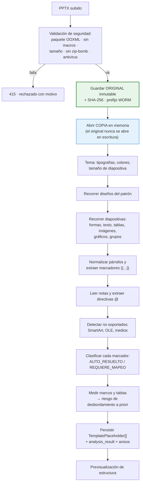
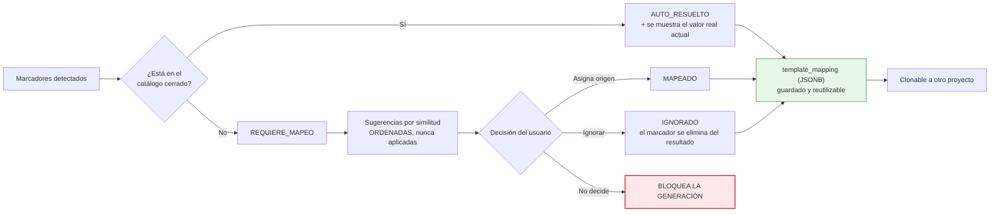
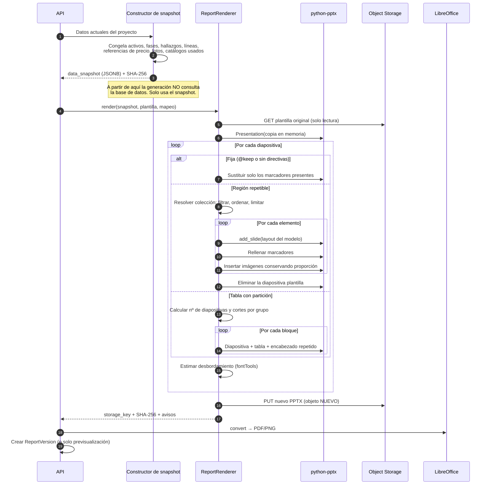
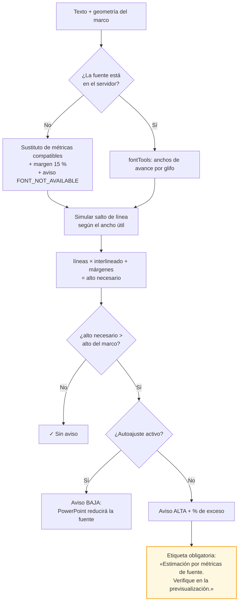
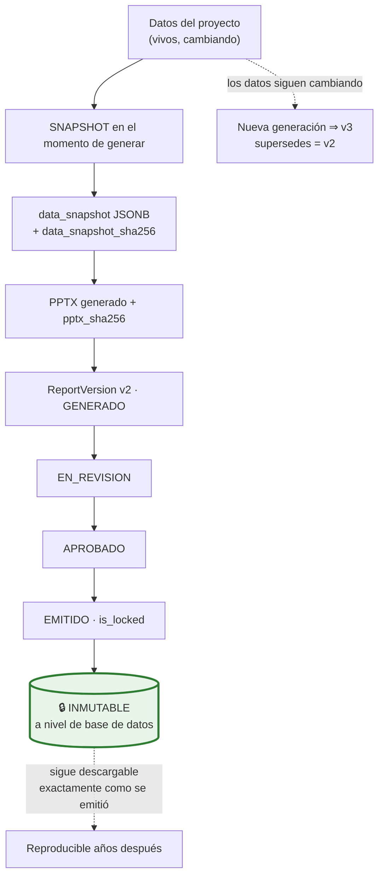

# 17. Estrategia de lectura, mapeo y generación de PPTX

> **Este es el bloque de mayor riesgo técnico del proyecto.** Empieza por las limitaciones reales, no
> por las promesas, porque las limitaciones condicionan todo lo demás.
>
> ⚠️ **Este documento se escribió antes de disponer de las plantillas reales.**
> [`18-analisis-plantillas-reales.md`](./18-analisis-plantillas-reales.md) analiza las cuatro
> plantillas facilitadas por el cliente y **corrige cinco decisiones de este documento**: se invierten
> la estrategia principal y la secundaria (C-1), cambia el modelo de desbordamiento (C-2), la tabla de
> CAPEX resulta ser una imagen pegada de Excel (C-3), se confirman fuentes no estándar (C-4) y los
> catálogos necesitan traducción (C-5). **Léase el doc 18 junto con este.**

---

## 17.1. Limitaciones técnicas reales (leer antes que nada)

`[LIM]` Todas verificables, todas con mitigación, y ninguna resoluble por completo dentro del
ecosistema de licencia permisiva.

| # | Limitación | Impacto | Mitigación adoptada |
|---|---|---|---|
| **L1** ⚠️ | *(Ver C-1 del doc 18: con las plantillas reales el clonado pasa a ser la estrategia **principal**, y es seguro porque no hay gráficos, SmartArt ni OLE.)* **`python-pptx` no ofrece API oficial para duplicar diapositivas.** La copia de XML con reasignación de relaciones es una técnica de la comunidad, no soportada, y frágil con gráficos, medios incrustados, SmartArt y objetos OLE | Es el corazón de «una diapositiva por activo / por sistema / por incidencia» | **Estrategia principal:** las diapositivas repetibles se definen como **diseños del patrón**, y cada repetición es una diapositiva nueva creada desde su diseño. Es el camino soportado y el que hereda de forma nativa tema, tipografías, posiciones, logos y pies. **Estrategia secundaria** (clonado de XML) solo para lo que el diseño no cubra, con lista explícita de elementos no soportados |
| **L2** | **`python-pptx` no renderiza.** No hay forma de saber desde la biblioteca si un texto cabe o si una tabla desborda | La detección de desbordamiento no puede ser exacta | Doble vía: **estimación** por métricas de fuente con `fontTools`, y **previsualización real** convirtiendo a PDF/PNG con LibreOffice headless. Los avisos se presentan **explícitamente como estimaciones** |
| **L3** | **LibreOffice no renderiza igual que PowerPoint.** Difieren en sustitución de fuentes, SmartArt, efectos, algunos gráficos y saltos de línea | La previsualización es indicativa, no idéntica | Se declara en la propia pantalla. Se recomienda una validación manual en PowerPoint por plantilla nueva. Si el cliente exige fidelidad exacta, existe vía comercial (§17.9) |
| **L4** | **Las métricas de fuente exigen el archivo de la fuente.** Si la plantilla usa una tipografía corporativa no instalada en el servidor, la medición usa un sustituto | Falsos positivos y negativos en el aviso de desbordamiento | Se permite **subir los archivos de fuente** junto a la plantilla; si no están, se mide con un sustituto de métricas compatibles, se **amplía el margen al 15 %** y el aviso lo indica |
| **L5** | **`python-pptx` no crea gráficos complejos.** Sí puede sustituir los datos de un gráfico existente | No se pueden generar gráficos arbitrarios | **Contrato de plantilla:** los gráficos deben existir con su formato definitivo; la aplicación solo reemplaza sus datos |
| **L6** | **No hay API para SmartArt.** Es XML propietario que la biblioteca no modela | Un SmartArt con marcadores dentro no se rellenará | La plantilla no debe usar SmartArt en zonas de datos. Se **detecta y se avisa** durante el análisis. El SmartArt existente se conserva intacto |
| **L7** | **El texto de un marcador puede estar fragmentado en varios `run`.** PowerPoint lo parte por revisiones ortográficas o cambios de formato: `{{project.` + `name}}` | Los marcadores podrían no detectarse | El analizador **normaliza el párrafo completo** antes de buscar, y al sustituir conserva el formato del primer `run`. Caso probado en la suite |
| **L8** ⚠️ | **PowerPoint puede autoajustar el texto** (`normAutofit`)… **pero en las plantillas reales no hay ni un solo caso**: el 68 % de los cuadros usa «ajustar forma al texto», que hace crecer la forma y **sale de la diapositiva**. Ver C-2 del doc 18 | El texto no se encoge: se desborda fuera de la página | El criterio pasa a ser «¿el marco crecido rebasa el alto de la diapositiva o pisa la forma de debajo?», que es **más fiable** de estimar |
| **L9** | **Las tablas creadas por código heredan el estilo, no el formato manual.** Si el autor dio formato a mano celda a celda, las filas nuevas no lo replican | Tablas largas con aspecto inconsistente | El generador **clona el XML de propiedades de una fila modelo**. Funciona con formato de fila; el formato irregular por celdas se declara no soportado |
| **L10** | Un PPTX con **objetos OLE, vídeo, audio o macros** no se procesa en esos elementos | Los `.pptm` se rechazan por política; los objetos incrustados se conservan sin tocar | Se avisa en el análisis |

**Conclusión honesta:** con `python-pptx` y un **contrato de plantilla documentado** se pueden generar
informes de alta calidad que conservan la identidad corporativa. Sin ese contrato, aceptar una
plantilla arbitraria y garantizar el resultado **no es técnicamente posible** con herramientas de
licencia permisiva. Esa es la razón del supuesto S-15, y **P-07 (obtener plantillas reales) es la
pregunta más urgente del proyecto**.

---

## 17.2. El contrato de plantilla

`[SUP]` S-15. Convención documentada que el autor de la plantilla sigue una vez. Se incluye una
**plantilla de referencia descargable** y un **validador** que señala incumplimientos.

### Regla 1 · Los marcadores en el cuerpo, las instrucciones en las notas

```
┌─ Diapositiva ────────────────────────────┐
│   {{asset.name}}                         │   ← el cuerpo contiene solo
│   {{asset.address}}                      │     los VALORES a insertar
│   ┌────────────┐                         │
│   │{{asset.    │                         │
│   │ main_photo}}│                        │
│   └────────────┘                         │
└──────────────────────────────────────────┘
┌─ Notas del orador ───────────────────────┐
│ @repeat: asset                           │   ← las notas contienen las
│ @sort: name                              │     INSTRUCCIONES de generación
│ @photos: max=1, fit=contain              │
└──────────────────────────────────────────┘
```

`[REC]` **Por qué en las notas del orador:** es texto no visual, no altera el diseño, `python-pptx` lo
lee y escribe con fiabilidad, sobrevive a la edición del diseño en PowerPoint, y el autor puede leerlo
y modificarlo sin herramientas especiales. La alternativa habitual —cuadros de texto ocultos— es
frágil: alguien acaba borrándolos o desplazándolos.

### Regla 2 · Las diapositivas repetibles se definen como diseños del patrón

> ⚠️ **Corregido por C-1 del doc 18.** Las plantillas reales **no usan marcadores de posición** (0 de
> 67 diapositivas), de modo que esta regla no es aplicable a ellas: la vía real es **clonar la
> diapositiva modelo**, marcada con `@model`. Esta regla se mantiene como recomendación para plantillas
> nuevas o rediseñadas.

El autor crea un **diseño** en el patrón para cada sección que se repite. La aplicación instancia una
diapositiva nueva desde ese diseño por cada elemento.

**Ventaja decisiva:** al crear desde diseño, se heredan automáticamente tema, tipografías, colores,
logos, posiciones, tamaños, encabezados y pies. **No hay que copiar el formato: se hereda.** Eso es lo
que hace viable el requisito de conservación.

`[LIM]` Si la plantilla ya existe y no puede rediseñarse, se admite la **estrategia secundaria**:
marcar una diapositiva del cuerpo como modelo (`@model: asset`) y clonar su XML. **No soportados** en
el clonado, y avisados durante el análisis: SmartArt, gráficos, vídeo, audio, objetos OLE y
transiciones.

### Regla 3 · Sintaxis de marcadores

| Forma | Uso | Ejemplo |
|---|---|---|
| `{{ruta.campo}}` | Valor escalar | `{{project.name}}` |
| `{{ruta.campo\|formato}}` | Con formato | `{{report_date\|d 'de' MMMM 'de' yyyy}}`, `{{capex.total\|#,##0.00 €}}` |
| `{{ruta.campo\|default:texto}}` | Alternativa si está vacío | `{{asset.year_last_refurb\|default:No consta}}` |
| `{{#row coleccion}}` en una celda | Fila de tabla repetible | `{{#row capex_items}}` |
| `{{@imagen}}` en un marco | Inserción de imagen | `{{@asset.main_photo}}` |
| `{{@fotos}}` en varios marcos | Reparto entre marcos | `{{@selected_photos}}` |

### Regla 4 · Catálogo cerrado de marcadores

`[REQ]` La especificación propone un conjunto; se amplía para cubrir el modelo revisado:

| Ámbito | Marcadores |
|---|---|
| Proyecto | `{{project.name}}`, `{{project.code}}`, `{{project.dd_type}}`, `{{project.scope}}`, `{{project.currency}}`, `{{project.notes}}` |
| Cliente | `{{client.name}}`, `{{client.contact_name}}`, `{{client.contact_job}}`, `{{client.address}}` |
| Informe | `{{report_date}}`, `{{report_version}}`, `{{report_author}}`, `{{report_approver}}`, `{{report_title}}` |
| **Fases** `[REC]` | `{{phase.visit_dates}}`, `{{phase.doc_status_table}}`, `{{report_limitations}}` |
| Activo | `{{asset.name}}`, `{{asset.code}}`, `{{asset.typology}}`, `{{asset.address}}`, `{{asset.city}}`, `{{asset.plot_area}}`, `{{asset.gfa}}`, `{{asset.lettable_area}}`, `{{asset.warehouse_area}}`, `{{asset.office_area}}`, `{{asset.warehouse_height}}`, `{{asset.year_built}}`, `{{asset.year_last_refurb}}`, `{{asset.floors}}`, `{{asset.main_use}}`, `{{asset.description}}`, `{{@asset.main_photo}}` |
| Hallazgo | `{{finding.code}}`, `{{finding.title}}`, `{{finding.description}}`, `{{finding.comments}}`, `{{finding.zone}}`, `{{finding.capex_code}}`, `{{finding.capex_chapter}}`, `{{finding.risk_code}}`, `{{finding.risk_name}}`, **`{{finding.risk_definition}}`**, `{{finding.concept}}`, `{{finding.recommendation}}`, `{{finding.regulatory_reference}}`, `{{@finding.photos}}` |
| CAPEX | `{{capex.total}}`, `{{capex.total_before_tax}}`, `{{capex.tax}}`, `{{capex.short}}`, `{{capex.mid}}`, `{{capex.long}}`, `{{capex.improvements}}`, `{{capex.other}}` *(agregados por horizonte)*, `{{capex.recoverable_yes}}`, `{{capex.recoverable_no}}`, `{{capex.scenario_low}}`, `{{capex.scenario_high}}`, `{{capex_table}}`, `{{capex_by_chapter_table}}`, `{{capex_by_zone_table}}`, `{{capex_by_risk_table}}`, `{{capex_by_horizon_table}}` |
| Equipo | `{{equipment.type}}`, `{{equipment.manufacturer}}`, `{{equipment.model}}`, `{{equipment.install_year}}`, `{{equipment.remaining_life}}` |
| Fotos | `{{@selected_photos}}`, `{{photo.caption}}`, `{{photo.date}}` |
| Agregados | `{{executive_summary}}`, `{{findings}}`, `{{risk_legend}}`, `{{visit_summary}}`, `{{access_limitations}}` |

`[REC]` Dos marcadores merecen atención especial:

- **`{{finding.risk_definition}}`** vuelca la definición íntegra del grado de riesgo. Permite que el
  informe explique el criterio en la misma diapositiva del hallazgo, que es exactamente para lo que las
  cuatro definiciones de §3.3.4 están escritas.
- **`{{report_limitations}}`** se alimenta automáticamente de la documentación en `NO_DISPONIBLE` o
  `PARCIAL` y de las limitaciones de acceso de las visitas. En una TDD, declarar qué no se ha podido
  revisar es una obligación profesional que hoy suele hacerse de memoria.

`[REQ]` **Cualquier marcador fuera de este catálogo pasa a `REQUIERE_MAPEO` y bloquea la generación.**

### Regla 5 · Directivas de las notas

| Directiva | Función | Ejemplo |
|---|---|---|
| `@repeat: <colección>` | Una diapositiva por elemento | `@repeat: asset` |
| `@filter: <expresión>` | Filtra | `@filter: risk in [03,04]` |
| `@sort: <campo>` | Ordena (`-` descendente) | `@sort: -risk` |
| `@max: <n>` | Límite | `@max: 20` |
| `@group_by: <campo>` | Agrupa antes de repetir | `@group_by: capex_chapter` |
| `@table: rows=<n>` | Filas por diapositiva | `@table: rows=18, repeat_header=true, subtotals=group, totals=last` |
| `@photos: max=<n>, fit=<modo>` | Fotos por diapositiva | `@photos: max=3, fit=contain, caption=below` |
| `@if_empty: <acción>` | Colección vacía | `@if_empty: skip_slide` \| `keep_with_placeholder` \| `warn` |
| `@model: <colección>` | Diapositiva modelo a clonar (estrategia secundaria) | `@model: finding` |
| `@keep` | Diapositiva fija que no se toca | `@keep` |

`[REC]` `@if_empty: skip_slide` importa más de lo que parece: evita las diapositivas vacías que
delatan un informe generado a máquina.

---

## 17.3. Fase 1 · Análisis



Fragmento de `analysis_result`:

```json
{
  "slide_size": { "width_emu": 12192000, "height_emu": 6858000, "ratio": "16:9" },
  "theme": {
    "major_font": "Arial", "minor_font": "Arial",
    "colors": { "accent1": "#1F4E79", "accent2": "#E53935" },
    "fonts_available_on_server": true
  },
  "layouts": [
    { "index": 3, "name": "Ficha de activo", "placeholders": 5, "used_by_slides": [5] }
  ],
  "slides": [
    {
      "index": 9, "layout_name": "Ficha hallazgo",
      "shapes": [
        { "shape_id": "4", "name": "Título 1", "kind": "TITULO",
          "bbox": { "x": 838200, "y": 365125, "w": 10515600, "h": 1325563 },
          "tokens": ["{{finding.code}}", "{{finding.title}}"], "autofit": "none",
          "font": { "name": "Arial", "size_pt": 28, "bold": true } },
        { "shape_id": "7", "name": "Definición riesgo", "kind": "TEXTO",
          "tokens": ["{{finding.risk_definition}}"],
          "warnings": [{ "code": "OVERFLOW_RISK_A_PRIORI",
                         "message": "El marco admite ~380 caracteres; la definición del grado 04 tiene 412." }] }
      ],
      "notes_directives": { "repeat": "finding",
                            "filter": "risk in [03,04]", "sort": "-risk", "max": 20 },
      "warnings": []
    }
  ],
  "summary": {
    "tokens_total": 31, "auto_resolved": 27, "require_mapping": 2, "ignored": 2,
    "repeat_regions": 5, "partitioned_tables": 1
  }
}
```

`[REC]` El aviso `OVERFLOW_RISK_A_PRIORI` se emite **al analizar la plantilla**, sin necesidad de
datos: si el marco no admite la definición del grado 04, conviene saberlo antes de generar 20
diapositivas.

---

## 17.4. Fase 2 · Mapeo



`[REQ]` «Si no es posible determinar automáticamente dónde insertar un contenido, solicita que el
usuario realice el mapeo. No adivines ni sobrescribas elementos sin confirmación.» Tres reglas duras:

1. Un marcador fuera del catálogo **nunca** recibe origen automático. Se ofrecen sugerencias
   ordenadas; el usuario elige.
2. Una forma **sin marcador no se toca jamás.** El texto corporativo, las notas legales y los pies
   escritos a mano permanecen literalmente intactos.
3. Un marcador `REQUIERE_MAPEO` **impide generar**. Solo un director puede forzar, con motivo auditado.

```json
{
  "version": 2,
  "tokens": {
    "{{project.name}}":            { "source": "project.name" },
    "{{report_date}}":             { "source": "system.now", "format": "d 'de' MMMM 'de' yyyy" },
    "{{report_limitations}}":      { "source": "phases.limitations",
                                     "on_overflow": "warn" },
    "{{finding.risk_definition}}": { "source": "finding.risk_level.definition" },
    "{{esg_summary}}":             { "source": "manual_text", "value": "…" },
    "{{@asset.map}}":              { "source": "asset.static_map_image", "fit": "contain" }
  },
  "repeat_rules": [
    { "slide_index": 5,  "collection": "assets", "sort": "name", "if_empty": "warn" },
    { "slide_index": 9,  "collection": "findings",
      "filter": { "risk_level_code": ["03", "04"] },
      "sort": "-risk_level_score", "max": 20, "if_empty": "skip_slide" },
    { "slide_index": 18, "collection": "assets",
      "photos": { "max": 3, "fit": "contain", "caption": "below" } }
  ],
  "table_rules": [
    { "slide_index": 14, "token": "{{capex_table}}",
      "columns": ["code", "description", "zone", "risk_code",
                  "h_short", "h_mid", "h_long", "h_improvements", "h_other"],
      "pivot_by": "time_horizon",
      "group_by": "capex_chapter", "subtotals": true,
      "rows_per_slide": 18, "repeat_header": true, "totals": "last",
      "number_slides": true, "decimals": 0 }
  ],
  "photo_rules": { "default_fit": "contain", "caption_source": "photo.caption",
                   "strip_exif": true }
}
```

---

## 17.5. Fase 3 · Generación



### Conservación del formato: cómo se consigue

| Elemento | Mecanismo | Fiabilidad |
|---|---|:--:|
| Tema, tipografías, colores | Se heredan del patrón: nunca se tocan | ✅ Alta |
| Logos, encabezados, pies | Viven en el patrón y el diseño; se heredan | ✅ Alta |
| Posiciones y tamaños | Al crear desde diseño, los marcadores ya están colocados | ✅ Alta |
| Formato del texto sustituido | Se conserva el del primer `run` del marcador | ✅ Alta |
| Proporción de imágenes | Encaje calculado (`contain` por defecto) y centrado. **Nunca se deforma** | ✅ Alta |
| Formato de filas nuevas de tabla | Clonado del XML de una fila modelo | 🟡 Media (L9) |
| Gráficos | Solo sustitución de datos de gráficos preexistentes | 🟡 Media (L5) |
| SmartArt | Se conserva intacto, no se rellena | 🔴 No soportado (L6) |
| Transiciones y animaciones | Se conservan en diapositivas fijas; no se replican al crear desde diseño | 🟡 Media |

### Inserción de imágenes conservando proporción

```
Marco: 4400550 × 3000375 EMU  (relación 1,467)
Foto:  4032 × 3024 px         (relación 1,333)

fit = contain  → la altura manda:
  alto_final  = 3000375
  ancho_final = 3000375 × 1,333 = 3999500
  x_final = x_marco + (4400550 − 3999500) / 2   ← centrado horizontal
  Resultado: la foto cabe completa, sin deformar, centrada.

fit = cover    → recorte centrado conservando la proporción.
fit = stretch  → NO se ofrece: deformaría la evidencia fotográfica.
```

`[REC]` `stretch` se excluye deliberadamente. Deformar la fotografía de una instalación técnica es un
defecto, no una opción de maquetación.

### Detección de desbordamiento



`[LIM]` La estimación no considera kerning contextual, ligaduras, guionado del español ni el algoritmo
exacto de salto de línea de PowerPoint. Precisión esperada ±10-15 % `[SUP]`. Por eso existe la
previsualización y por eso el aviso lo dice.

### Partición de tablas largas

```
62 filas · 18 por diapositiva · encabezado repetido · agrupado por capítulo

Diapositiva 14  «CAPEX (1 de 4)»  encabezado + H01…H06  + subtotales de grupo
Diapositiva 15  «CAPEX (2 de 4)»  encabezado + H08      + subtotales
Diapositiva 16  «CAPEX (3 de 4)»  encabezado + H09…H10  + subtotales
Diapositiva 17  «CAPEX (4 de 4)»  encabezado + H11…H15  + subtotales + TOTALES
```

Reglas `[REC]`:
- **Nunca se parte un grupo dejando una fila huérfana**: si no caben al menos dos filas del capítulo,
  el capítulo entero pasa a la diapositiva siguiente.
- Los totales generales solo en la última; los subtotales de capítulo, al cerrar cada grupo.
- El «(n de N)» se inserta en el título si existe el marcador; si no, se avisa.

---

## 17.6. Versionado, inmutabilidad y snapshot



`[REQ]` §9: «Las partidas del informe deben corresponder a una versión concreta de los datos» y «un
informe emitido debe quedar bloqueado; cualquier cambio posterior debe crear una nueva versión».

| Garantía | Implementación |
|---|---|
| El informe corresponde a una versión concreta de los datos | `data_snapshot` obligatorio. **La generación lee del snapshot, no de la base de datos**: un cambio concurrente no puede producir un informe incoherente `[REC]` |
| El informe emitido está bloqueado | `is_locked` + disparador `BEFORE UPDATE` + `CHECK` de coherencia |
| Cambios posteriores crean versión nueva | `supersedes_version_id`; la anterior nunca se altera |
| Integridad verificable | `pptx_sha256` permite comprobar que el fichero del cliente es el emitido |
| Trazabilidad | Plantilla con su hash, mapeo, generador, aprobador, emisor, fechas |
| Comparación entre versiones | Diferencia entre snapshots: hallazgos, líneas y **variación del CAPEX por horizonte** |

`[REC]` El snapshot incluye **los catálogos usados** (nombres de códigos, zonas y definiciones de
riesgo vigentes en ese momento). Sin ello, retirar un código dos años después haría que el informe
antiguo mostrase huecos. Es la diferencia entre archivar un PDF y poder reconstruir el informe.

---

## 17.7. Avisos

| Severidad | Código | Detecta | ¿Bloquea? |
|---|---|---|:--:|
| 🔴 BLOQUEANTE | `UNMAPPED_PLACEHOLDER` | Marcador sin origen | **Sí** `[REQ]` |
| 🔴 BLOQUEANTE | `MISSING_TEMPLATE` | Plantilla ausente o sin analizar | **Sí** |
| 🔴 BLOQUEANTE | `PHOTO_QUARANTINED` | Foto seleccionada en cuarentena o error | **Sí** |
| 🔴 BLOQUEANTE | `INVALID_MAPPING_EXPRESSION` | El mapeo apunta a un campo inexistente | **Sí** |
| 🔴 BLOQUEANTE | `ZONE_REVIEW_PENDING` | Líneas con zona a revisar tras cambio de tipología | **Sí** `[REC]` |
| 🟠 ALTA | `TEXT_OVERFLOW` | Exceso estimado > 10 % | No |
| 🟠 ALTA | `TABLE_DOES_NOT_FIT` | La tabla se partirá en N diapositivas | No |
| 🟠 ALTA | `PHOTO_WITHOUT_ASSET` | Foto seleccionada sin activo | No |
| 🟡 MEDIA | `UNVALIDATED_PRICES` | Líneas con precio sin validar, con su importe | No, pero **muy visible** `[REC]` |
| 🟡 MEDIA | `MISSING_PHOTO` | Activo o hallazgo sin fotos seleccionadas | No |
| 🟡 MEDIA | `SMARTART_DETECTED` | SmartArt en zona de datos | No |
| 🟡 MEDIA | `FONT_NOT_AVAILABLE` | Fuente del tema no instalada | No |
| 🟡 MEDIA | `PENDING_DOC_REQUESTS` | Documentación aún en «solicitada» `[REC]` | No |
| ⚪ BAJA | `EMPTY_FIELD` | Campo vacío; se insertará texto vacío | No |
| ⚪ BAJA | `MISSING_CAPTION` | Foto sin pie | No |
| ⚪ BAJA | `AUTOFIT_WILL_SHRINK` | PowerPoint reducirá la fuente | No |

`[REC]` `UNVALIDATED_PRICES` merece atención: generar con precios sin validar es legítimo (un borrador
interno), pero enviarlo al cliente sin darse cuenta es un problema real. Aparece en la
previsualización y, si el mapeo declara un marcador de marca de agua, se inserta «BORRADOR — precios
pendientes de validación». La marca **solo** se inserta si la plantilla lo prevé: no se altera el
diseño sin permiso.

**Ante campo vacío** `[REQ]`: el marcador se sustituye por **texto vacío**, nunca por el literal
`{{...}}` ni por un «N/D» inventado. Si el mapeo declara `default:`, se usa ese texto.

---

## 17.8. Seguridad del procesamiento

Un PPTX es un ZIP con XML: dos vectores clásicos.

| Riesgo | Mitigación |
|---|---|
| **Bomba de descompresión** | Límite de tamaño descomprimido (200 MB `[SUP]`), de número de entradas y de ratio, comprobados **antes** de descomprimir |
| **Ataques XML** (XXE, expansión de entidades) | Analizador con entidades externas y DTD deshabilitadas; `defusedxml` donde sea configurable |
| **Recorrido de rutas** en nombres de entrada | Se valida cada nombre; se rechaza `..` y rutas absolutas |
| **Macros** | `.pptm` rechazado; se comprueba la presencia de `vbaProject.bin` en el paquete |
| **Contenido activo** (OLE, incrustados) | Se conservan sin ejecutar ni analizar. Se avisa |
| **Agotamiento de recursos** | Worker con límites de CPU, memoria y tiempo, en contenedor **sin salida a Internet** `[REC]` |
| **Malware** | Antivirus antes de procesar |
| **Fuga entre organizaciones** | El worker recibe solo las claves autorizadas; no puede enumerar el bucket |

---

## 17.9. Alternativas si `python-pptx` resulta insuficiente

`[REQ]` «Si una dependencia no permite conservar correctamente el formato PPTX, explica la limitación
y propone alternativas.»

**Criterio de decisión:** al terminar las pruebas con el corpus real (P-07) se mide el porcentaje de
diapositivas generadas que un consultor considera entregables sin retoque. **≥ 90 %** → se sigue con
`python-pptx`. Entre 70 y 90 % → se refuerza el contrato de plantilla. **< 70 %** → plan alternativo.
`[SUP]` Umbral a validar con el cliente.

| Alternativa | Cuándo | A favor | En contra | Coste |
|---|---|---|---|---|
| **Reforzar el contrato de plantilla** | Primera opción siempre | Coste cero de licencia; resuelve la mayoría | Exige rediseñar la plantilla corporativa una vez | Bajo |
| **Servicio Java con Apache POI (XSLF)** | Si el problema es el clonado de diapositivas complejas | Apache 2.0; mejor copia de diapositivas | Añade la JVM; se mantiene `python-pptx` para el análisis | Medio |
| **Motor comercial de alta fidelidad** | Si se exige fidelidad casi perfecta y renderizado propio | Fidelidad muy alta, sin LibreOffice, con soporte | Coste por servidor y dependencia de proveedor | Medio |
| **Servidor de documentos (Collabora / OnlyOffice)** | Si además se quiere edición en el navegador | Código abierto | Pesado de operar; su API no está pensada para plantillado con datos | Alto |
| **Generación desde cero con plantilla propia** | Último recurso | Control total, resultado predecible | **Renuncia al requisito de usar la plantilla del cliente.** Cambia el producto | Alto, con impacto funcional |

`[REC]` La arquitectura está preparada para el cambio: `ReportRenderer` es una interfaz, la generación
ocurre en un worker aislado y el resultado es un objeto en almacenamiento. Sustituir el motor no toca
modelo de datos, API ni frontend. **Esa es la mitigación estructural del riesgo número uno**: no se
apuesta todo a una biblioteca, se apuesta a una frontera bien definida.

---

## 17.10. Corpus de pruebas

Ficheros versionados en el repositorio, **sin datos reales de cliente**:

| # | Plantilla | Qué verifica |
|---|---|---|
| T1 | Mínima: 3 diapositivas, solo texto | Camino feliz |
| T2 | 16:9 con tema completo, logos, encabezado y pie | Conservación de identidad corporativa |
| T3 | 4:3 | Adaptación de proporción de imágenes |
| T4 | Con diseños de repetición por activo y por hallazgo | Generación de N diapositivas desde diseño |
| T5 | Con tabla de 9 columnas (pivote de los cinco horizontes) y fila modelo formateada | Partición, subtotales por capítulo, clonado de formato, **pivote correcto: una sola casilla con valor por fila** |
| T6 | Con gráfico preexistente | Sustitución de datos |
| T7 | Con SmartArt en zona de datos | Aviso correcto y SmartArt intacto |
| T8 | Texto deliberadamente largo en marco pequeño | Detección de desbordamiento |
| T9 | Marcadores partidos en varios `run` | Normalización de párrafo (L7) |
| T10 | Fuente corporativa no instalada | `FONT_NOT_AVAILABLE` y margen ampliado |
| T11 | Sin ningún marcador | Aviso y guía, sin fallo |
| T12 | 120 diapositivas y 40 diseños | Rendimiento y memoria |
| T13 | Corrupta: paquete válido, diapositiva ilegible | Degradación controlada |
| T14 | No es un PPTX (renombrada) | Rechazo por contenido real |
| T15 | Zip bomb sintética | Rechazo antes de descomprimir |
| T16 | `.pptm` con macros | Rechazo por política |
| T17 | Con XXE incrustado | Analizador seguro |
| T18 | Marcadores con acentos y `ñ` | Codificación UTF-8 |
| T19 | Con `{{finding.risk_definition}}` en marco justo | Desbordamiento de la definición del grado 04 `[REC]` |
| T20 | Con `{{report_limitations}}` y proyecto sin limitaciones | `@if_empty: skip_slide` |

Para T2, T4, T5 y T8 se comparan además las imágenes renderizadas contra referencias aprobadas, con
tolerancia de píxel, para detectar regresiones visuales. `[REC]`
