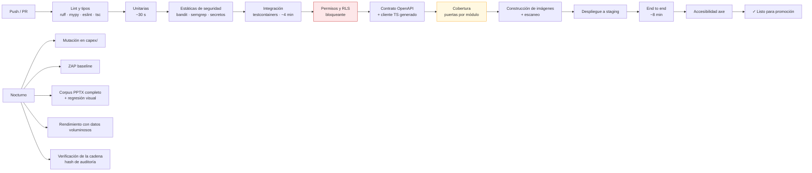

# 19. Estrategia de pruebas

---

## 19.1. Forma de la pirámide y objetivos

```
                    ╱╲
                   ╱E2E╲          ~30 escenarios · Playwright
                  ╱──────╲        Los 6 flujos críticos, en Chromium + WebKit
                 ╱ Integr. ╲      ~250 pruebas · pytest + testcontainers
                ╱────────────╲    PostgreSQL y MinIO reales, no simulados
               ╱   Unitarias   ╲  ~800 pruebas · pytest / vitest
              ╱──────────────────╲ Dominio puro, sin E/S
             ╱ Estáticas y contrato╲ mypy · ruff · bandit · OpenAPI
            ╱──────────────────────╲
```

`[REC]` **Dónde se concentra el esfuerzo, y por qué:** el `CapexEngine` y el `ReportRenderer`
absorben la mayor densidad de pruebas unitarias, porque un error en el primero produce un informe con
cifras erróneas firmado por un profesional, y un error en el segundo produce un entregable
inutilizable. El resto del sistema es CRUD con autorización: importante, pero de riesgo acotado.

### Objetivos de cobertura `[SUP]`

| Ámbito | Objetivo | Puerta en CI |
|---|---|:--:|
| `capex/` (motor de cálculo) | **≥ 95 %** de líneas y ramas | Sí, bloqueante |
| `reporting/` (PPTX) | ≥ 85 % | Sí |
| `authz/` (autorización) | **100 % de las rutas de decisión** | Sí, bloqueante |
| `evidence/` (fotografías) | ≥ 85 % | Sí |
| Global backend | ≥ 80 % | Sí |
| Frontend (lógica, no maquetación) | ≥ 70 % | Aviso |

La cobertura es un indicador, no un objetivo. Se acompaña de **pruebas de mutación**
(`mutmut`) sobre `capex/` con umbral de mutantes sobrevividos, porque el 95 % de cobertura en una
función de cálculo puede convivir con aserciones que no comprueban nada. `[REC]`

---

## 19.2. Pruebas unitarias

### Motor de CAPEX — el corazón

| Familia | Casos |
|---|---|
| **Cascada correcta** | Casos dorados con importes calculados a mano y verificados por un tercero. El ejemplo de 48.500 € → 73.900,85 € es el caso canónico |
| **Exactitud decimal** | `Decimal("0.1") + Decimal("0.2") == Decimal("0.3")`; cantidades con 4 decimales; precios con 4 decimales; **ninguna aparición de `float` en la ruta de cálculo**, verificada por una prueba que inspecciona los tipos |
| **Redondeo** | Los cuatro modos; casos frontera `0,005`, `0,015`, `0,025` (donde `HALF_UP` y `HALF_EVEN` difieren); redondeo por peldaño frente a solo en el total |
| **Suma coherente** | La suma de totales de partida coincide **exactamente** con el total del proyecto, con 300 partidas de importes aleatorios. Propiedad verificada con `hypothesis` |
| **Porcentajes** | 0 %; 100 %; valores con decimales (`8,25 %`); todos a cero (el total debe igualar el coste directo) |
| **Escenarios** | Bajo < probable < alto siempre; factor 1,0 devuelve el probable; factores derivados del nivel de confianza |
| **Índices** | Actualización con índices válidos; **índice ausente ⇒ no calcula y avisa** (no interpola); índice cero o negativo ⇒ error; factor geográfico 1,0 no altera nada |
| **Valores límite** | Cantidad 0 (total 0); precio 0; importes muy grandes (10⁹) sin desbordamiento de `NUMERIC(18,4)`; cantidad con 4 decimales significativos |
| **Errores** | Cantidad negativa; precio negativo; porcentaje > 100 %; porcentaje negativo; moneda inválida; unidad vacía |
| **Equivalencia Python ↔ SQL** | Corpus de 1.000 casos generados: el resultado del `CapexEngine` y el del disparador de PostgreSQL deben coincidir **al céntimo**. Prueba bloqueante `[REC]` |
| **`calc_version`** | Un informe antiguo generado con `calc_version = 1` sigue reproduciéndose con esa versión aunque exista la 2 |

### Nomenclatura de fotografías

| Familia | Casos |
|---|---|
| Tokens | Cada token individualmente; todos combinados; token con valor vacío (se omite con su separador) |
| Saneado | Acentos (`Cubierta Nº1`); `ñ`; caracteres prohibidos `/ \ : * ? " < > \|`; caracteres de control; emoji; espacios múltiples; separadores repetidos |
| Extensión | **La extensión nunca se pierde**, con las cuatro combinaciones: mayúsculas/minúsculas y con/sin extensión en el nombre introducido. Un nombre que contiene `.pdf` no cambia el tipo real |
| Longitud | Nombre resultante de 500 caracteres se recorta a 200 **conservando el sufijo numérico** |
| Colisiones | Dos, tres y cien nombres idénticos; sufijos deterministas y reproducibles |
| Nombres reservados | `CON`, `PRN`, `AUX`, `NUL`, `COM1`…`LPT9` |
| Idempotencia | Renombrar dos veces con la misma plantilla produce el mismo resultado |

### Máquinas de estado

Para proyecto, incidencia y versión de informe: **matriz completa** de transiciones válidas e
inválidas (`n × n`), con verificación de que cada guarda se comprueba y de que cada transición emite
su evento de auditoría. Una tabla de datos, no 80 funciones de prueba. `[REC]`

### Frontend (vitest)

Validación de formularios espejo de la del backend, formateo de importes y fechas en español,
construcción del nombre en la previsualización de renombrado, lógica de la cola de subida (reintentos,
idempotencia, orden), y cálculo de la cascada mostrada en pantalla (que debe coincidir con la del
servidor).

---

## 19.3. Pruebas de integración

Con `testcontainers`: **PostgreSQL y MinIO reales**. No se simula la base de datos: las pruebas más
valiosas de este sistema son precisamente las que verifican restricciones, disparadores y RLS, que un
doble de prueba no ejerce. `[REC]`

| Familia | Qué verifica |
|---|---|
| **Restricciones de integridad** | Que sea **imposible** insertar: partida con `price_status = VALIDADO` sin validador; partida con precio y sin referencia; proyecto fuera de borrador sin cliente; versión emitida sin `is_locked`; fuente de precios habilitada sin revisión de condiciones |
| **Disparadores de inmutabilidad** | Que `UPDATE` sobre `photo.storage_key`, `photo.sha256`, `report_template.storage_key` o cualquier campo de un `report_version` bloqueado **falle a nivel de base de datos** |
| **Recálculo automático** | Que cambiar cantidad o precio por SQL directo recalcule la cascada |
| **RLS** | Con dos organizaciones sembradas: que la organización A **no pueda leer ni escribir** ninguna fila de B, en las 30 tablas de negocio. Prueba paramétrica sobre la lista de tablas, para que una tabla nueva sin política haga fallar la suite `[REC]` |
| **Índices únicos parciales** | Que un código borrado lógicamente pueda reutilizarse y que un código activo no pueda duplicarse |
| **Auditoría transaccional** | Que si la escritura del evento de auditoría falla, la operación completa se deshaga |
| **Auditoría inmutable** | Que el usuario de aplicación no pueda ejecutar `UPDATE` ni `DELETE` sobre `audit_log` |
| **Almacenamiento** | Subida, URL firmada, caducidad de la firma, que una URL de otro recurso no sirva, y que el objeto original conserve su hash tras renombrar |
| **Trabajos en cola** | Encolado, ejecución, reintento, fallo definitivo, cancelación, e idempotencia ante ejecución duplicada |
| **API completa** | Cada endpoint: camino feliz, validación, autorización, `404` entre organizaciones, `409` de concurrencia, `422` de reglas de negocio |
| **Contrato OpenAPI** | Que el esquema generado sea válido y que el cliente TypeScript comprometido coincida con el generado |
| **Migraciones** | Que la migración completa hacia arriba y hacia abajo funcione sobre una base vacía y sobre una base con datos de prueba |

---

## 19.4. Pruebas de permisos

`[REQ]` §13. Implementadas como **matriz declarativa en un fichero de datos**, recorrida de forma
paramétrica:

```yaml
# tests/fixtures/permission_matrix.yaml
- endpoint: "POST /api/v1/projects/{id}/photos/commit"
  expected:
    ADMIN: 202
    DIRECTOR_PROYECTO: 202
    CONSULTOR: 202
    TECNICO_ESPECIALISTA_ASIGNADO: 202
    TECNICO_ESPECIALISTA_NO_ASIGNADO: 403
    REVISOR: 403
    LECTOR: 403
    OTRA_ORGANIZACION: 404
    NO_AUTENTICADO: 401
```

| Prueba | Verifica |
|---|---|
| Matriz completa rol × endpoint | Cada celda de [`06-roles-permisos.md`](./06-roles-permisos.md) §11.3 |
| **Cobertura del router** | Que **todo** endpoint registrado aparezca en la matriz y declare política de autorización. Añadir un endpoint sin política **rompe la build** `[REC]` |
| Alcance del técnico especialista | Que el límite por activo y especialidad se aplique en el servidor, llamando a la API directamente |
| Rol efectivo | Que el máximo entre rol de organización y rol de proyecto se calcule bien |
| Escalada de privilegios | Token con `organization_id` manipulado; token con rol manipulado; token expirado; token de usuario suspendido; token firmado con clave incorrecta |
| Prohibiciones absolutas | Que **ningún** rol pueda sobrescribir un original, modificar un informe emitido o alterar la auditoría |
| Denegaciones auditadas | Que cada denegación produzca un evento `ACCESS_DENIED` |
| Acceso de administrador | Que el acceso de un `ADMIN` a un proyecto ajeno se permita **y** genere un evento crítico |

---

## 19.5. Pruebas de seguridad

| Familia | Casos |
|---|---|
| **Aislamiento entre organizaciones** | Recorrer todos los endpoints con identificadores de otra organización: siempre `404`, nunca `403` ni `200` |
| **Inyección SQL** | Cargas útiles clásicas en todos los campos de texto, filtros y parámetros de ordenación; verificación de que el ordenamiento solo acepta la lista blanca |
| **XSS** | Cargas útiles en nombres de proyecto, pies de foto, descripciones y comentarios; verificación de escapado en la API y en el DOM renderizado |
| **CSRF** | Petición de refresco sin la cabecera requerida; origen no permitido |
| **Subida de archivos** | Extensión falsificada; polyglot JPEG/PHP; SVG con script; `.pptm`; zip bomb; XXE en PPTX; recorrido de rutas en el nombre; archivo de 0 bytes; archivo por encima del límite; archivo con MIME declarado distinto del real |
| **URLs firmadas** | Firma caducada; firma de otro recurso; firma manipulada; reutilización tras revocación del acceso del usuario |
| **Autenticación** | Fuerza bruta con bloqueo progresivo; enumeración de usuarios (respuesta y tiempo uniformes); reutilización de token de refresco ⇒ revocación de la familia; token robado tras cambio de contraseña |
| **Límite de tasa** | Que se aplique y que devuelva `Retry-After` |
| **Fuga en errores** | Que ningún `5xx` incluya traza, SQL, ruta de fichero o nombre de bucket. Prueba que fuerza errores en cada capa y examina el cuerpo de la respuesta `[REC]` |
| **Fuga en logs** | Que ningún log contenga contraseñas, tokens ni secretos, forzando su paso por el sistema |
| **Cabeceras** | Presencia y valor de CSP, HSTS, `X-Content-Type-Options`, `Referrer-Policy` |
| **Estático** | `bandit`, `semgrep` con reglas propias (prohibido SQL concatenado, prohibido `pickle`, prohibido `dangerouslySetInnerHTML`) |
| **Dependencias** | `pip-audit`, `npm audit`, escaneo de imágenes de contenedor |
| **Dinámico** | ZAP baseline nocturno contra `staging` (fase 2) |

---

## 19.6. Pruebas de carga y proceso de imágenes

| Familia | Casos |
|---|---|
| **Formatos válidos** | JPEG progresivo y de línea base, PNG con canal alfa, PNG entrelazado, WebP con y sin pérdida, HEIC de iPhone, HEIF |
| **Orientación EXIF** | Las 8 orientaciones posibles: los derivados deben aparecer correctamente rotados |
| **EXIF** | Con GPS; sin GPS; sin EXIF; EXIF corrupto; EXIF con fechas imposibles (año 1900, año 2200); GPS en los cuatro hemisferios; GPS en 0,0 (que debe tratarse como sospechoso, no como válido) `[REC]` |
| **Metadatos extremos** | EXIF de 500 KB; EXIF con caracteres no UTF-8; miniatura incrustada mayor que la imagen |
| **Dimensiones** | 1×1 px; 20.000×20.000 px (bomba de descompresión de imagen); relación de aspecto extrema 1:100 |
| **Archivos dañados** | JPEG truncado al 50 %; cabecera válida y cuerpo aleatorio; PNG con CRC incorrecto; archivo de 0 bytes; archivo de solo cabecera. **En todos: la subida se rechaza o queda en `ERROR` con motivo legible, sin dejar el sistema en estado inconsistente** |
| **Duplicados** | Archivo idéntico (mismo SHA-256); misma imagen recomprimida (distinto SHA-256, hash perceptual cercano); imágenes visualmente distintas con hash perceptual cercano (falso positivo controlado) |
| **Carga** | 200 fotos en un lote; 3 usuarios subiendo simultáneamente en el mismo proyecto; interrupción a mitad de lote y reintento (**sin duplicados**) |
| **Volumen** | Rejilla con 10.000 fotos: tiempo de respuesta del listado paginado y consumo de memoria del cliente |
| **Renombrado en lote** | 500 fotos; con colisiones; con fallo parcial de permisos; concurrente con otra edición de la misma foto |
| **ZIP** | Lote de 300 fotos con nombres visibles y metadatos eliminados; verificación de que el ZIP contiene los nombres correctos con su extensión y de que el EXIF sensible se ha eliminado |
| **Papelera** | Borrado, restauración, purga; que una foto referenciada por un informe emitido **no se pueda purgar** |
| **Concurrencia** | Dos usuarios renombrando la misma foto: uno gana, el otro recibe `409` y ningún dato se pierde |

---

## 19.7. Pruebas de PPTX

El corpus T1–T18 está definido en [`11-pptx.md`](./11-pptx.md) §17.10. Qué se comprueba sobre él:

| Familia | Casos |
|---|---|
| **Análisis** | Que cada plantilla del corpus produzca la estructura esperada: recuento de diapositivas, diseños, marcadores, directivas y avisos |
| **Marcadores partidos** | T9: marcador repartido en varios `run` detectado y sustituido conservando el formato |
| **Conservación de formato** | T2: comparación del XML del tema, del patrón y de los diseños **antes y después** de generar: deben ser idénticos |
| **Original intacto** | Que el SHA-256 de la plantilla sea el mismo tras generar 20 informes |
| **Repetición** | T4: 3 activos ⇒ 3 diapositivas; 0 activos con `if_empty: skip_slide` ⇒ 0 diapositivas; 1 activo ⇒ 1; 50 activos ⇒ 50 |
| **Filtros y orden** | 40 incidencias con filtro de criticidad y `max: 20` ⇒ exactamente 20, en el orden esperado |
| **Tablas** | T5: 1, 17, 18, 19, 36, 37 y 62 filas con 18 por diapositiva; casos frontera exactos; encabezado repetido; totales solo en la última; grupo no partido dejando una fila huérfana |
| **Fotografías** | Proporción conservada (foto 4:3 en marco 16:9 y al revés); `contain` y `cover`; foto vertical; 0, 1, 2, 3 y 7 fotos con 3 marcos por diapositiva; pie presente y ausente |
| **Desbordamiento** | T8: textos de longitud creciente contra el mismo marco, verificando que el aviso aparece en el umbral esperado; con fuente disponible y sin ella; con autoajuste activo y sin él |
| **Gráficos** | T6: sustitución de datos con el formato conservado |
| **SmartArt** | T7: aviso emitido y SmartArt intacto en la salida |
| **Marcadores sin mapear** | Que un marcador desconocido **bloquee** la generación; que `force` con motivo la permita y quede auditado |
| **Campos vacíos** | Que el resultado contenga texto vacío y **nunca** el literal `{{...}}`. Prueba que busca `{{` en todo el texto del PPTX generado `[REC]` |
| **Ficheros problemáticos** | T13 corrupta (degradación con aviso); T14 no es PPTX (rechazo); T15 zip bomb (rechazo antes de descomprimir); T16 con macros (rechazo); T17 XXE (sin acceso externo) |
| **Rendimiento** | T12: 120 diapositivas y 40 diseños; proyecto de 15 activos, 300 incidencias y 200 fotos: tiempo y memoria dentro de los objetivos |
| **Regresión visual** | T2, T4, T5, T8 renderizadas con LibreOffice y comparadas con imágenes de referencia aprobadas, con tolerancia de píxel `[REC]` |
| **Determinismo** | Generar dos veces desde el mismo snapshot produce PPTX con el **mismo SHA-256** (fijando fecha y semillas). Es lo que permite confiar en la reproducibilidad de un informe emitido `[REC]` |

---

## 19.8. Pruebas de trazabilidad de precios

`[REQ]` §13.

| Caso | Verificación |
|---|---|
| Precio manual | Se crea `price_reference` de tipo manual con justificación; sin justificación ⇒ `422` |
| Precio de catálogo | Se conserva fuente, referencia, fecha del precio y fecha de consulta |
| **Ninguna validación automática** | Que ninguna ruta de código lleve una referencia a `VALIDADA` sin usuario. Prueba que recorre todos los endpoints de precios y comprueba el estado resultante `[REC]` |
| Validación humana | Se registran validador y fecha; se emite `PRICE_VALIDATED` |
| Cambio de precio | El estado vuelve a `PENDIENTE_VALIDACION`, se limpian validador y fecha, se conserva el histórico, se recalculan los totales |
| Fuente sin revisar | No participa en búsquedas; no puede habilitarse; la restricción de base de datos lo impide |
| `robots.txt` prohibitivo | La fuente no se consulta y se registra el motivo |
| Control técnico detectado | Ante `403`/`429` sistemático o CAPTCHA, la fuente se deshabilita automáticamente y se audita |
| Fuente caída | Los resultados de las demás fuentes llegan; se avisa del fallo; el trabajo continúa |
| Sin resultados | Aviso `NO_RELIABLE_SOURCE`; **ningún importe propuesto**; se ofrece entrada manual |
| Normalización | Conversión exacta aplicada y explicada; conversión imposible ⇒ no se convierte y se avisa; impuestos no declarados ⇒ `NULL`, no `false` |
| Actualización por índice | Cálculo correcto; índice ausente ⇒ no calcula; aplicar índice revierte la validación |
| Cadena completa | Prueba extremo a extremo que parte de un informe emitido y reconstruye el origen del importe hasta la fuente y el validador |

---

## 19.9. Pruebas de recuperación y versionado

| Caso | Verificación |
|---|---|
| Versiones de fotografía | Crear v2 y v3; restaurar v2 crea v4 (no reescribe la historia); v1 no se puede borrar ni modificar |
| Papelera | Borrar, listar en papelera, restaurar; purga tras el plazo; **una foto de un informe emitido no se purga** |
| Versiones de informe | v1 emitida sigue intacta y descargable tras generar v2; `supersedes` correcto; comparación de snapshots correcta |
| Bloqueo | Toda modificación de una versión emitida devuelve `409 REPORT_LOCKED`, incluida la llamada directa a la API y el `UPDATE` por SQL |
| Reproducibilidad | Regenerar desde un snapshot antiguo, con la plantilla y `calc_version` de entonces, produce el mismo resultado |
| Snapshot congelado | Modificar los datos del proyecto **no altera** el snapshot de una versión ya generada |
| Borrado lógico | Ninguna consulta de negocio devuelve filas borradas; el código liberado se puede reutilizar |
| Borrado autorizado | Elimina contenido y objetos; **conserva el registro de auditoría sin datos personales** |
| Concurrencia | Bloqueo optimista con `If-Match`: `409` y ningún dato perdido |
| Sincronización | Lote con operaciones duplicadas (misma clave de idempotencia) ⇒ sin duplicados; conflicto de campo ⇒ registrado y notificado |
| Restauración | Ensayo de recuperación a un punto en el tiempo con reconciliación base de datos ↔ objetos; se verifica que no queden referencias huérfanas |
| Fallo de trabajo | Un `render_report` que falla no deja `ReportVersion` a medio crear; un `process_photo` que falla deja la foto en `ERROR` con el original intacto |

---

## 19.10. Pruebas end to end

Playwright, en Chromium y WebKit (por Safari e iOS), con datos de prueba ficticios.

| # | Escenario | Cubre |
|---|---|---|
| E1 | Del alta de proyecto a la transición a preparación, con cliente y dos activos | HU-01, HU-02 |
| E2 | Asignación de equipo con alcance por activo, y verificación de que el técnico no ve lo que no debe | HU-03 |
| E3 | **Emulando móvil:** fijar contexto, capturar 5 fotos, ver miniaturas, esperar procesado, crear incidencia desde una foto | HU-04, HU-06, HU-08 |
| E4 | Renombrado en lote con previsualización, colisión, confirmación y verificación de que el original conserva su hash | HU-05 |
| E5 | Alta de equipo, incidencia, partida CAPEX, comprobación de la cascada en pantalla, validación de precio | HU-07, HU-09, HU-11 |
| E6 | Carga de plantilla, mapeo de un marcador desconocido, previsualización con avisos, corrección, generación, revisión, aprobación, emisión, y comprobación del bloqueo | HU-12 a HU-15 |
| E7 | Consulta y filtrado del registro de auditoría; verificación de que las operaciones anteriores dejaron rastro | HU-16 |
| E8 | **Degradación de red:** desconectar durante una subida, reconectar, verificar que se completa sin duplicados | S-11 |
| E9 | Accesibilidad: recorrido completo por teclado de los flujos E1 y E5; `axe-core` sin violaciones graves en las 19 pantallas | WCAG 2.2 AA |
| E10 | Responsive: los 6 flujos críticos a 375 px, 768 px y 1440 px, verificando que el cuerpo nunca desplaza horizontalmente | Diseño responsive |

`[REC]` Se limita deliberadamente el número de pruebas end to end. Son las más caras de mantener y las
más frágiles. Cubren **flujos**, no casos: los casos se cubren en las capas inferiores, que son rápidas
y estables.

---

## 19.11. Datos de prueba

`[REQ]` §15: «Incluye datos de prueba ficticios. No utilices datos personales o confidenciales
reales.»

| Regla | Implementación |
|---|---|
| Todo ficticio | Nombres de personas, empresas, direcciones y coordenadas inventados. Empresas con sufijo «Ficticia» para que sea evidente `[REC]` |
| Fotografías | Imágenes generadas sintéticamente (patrones, texto sobreimpreso) o de bancos de dominio público, **sin personas identificables** |
| Plantillas PPTX | Creadas para el proyecto, sin identidad visual de ningún cliente real |
| Sin datos reales, nunca | Prohibido en CI y en `staging`. Verificado en revisión de código |
| Reproducibilidad | Semilla fija: el conjunto de datos sembrado es idéntico en cada ejecución |
| Volumen | Dos conjuntos: mínimo (1 proyecto, 2 activos, 20 fotos) para el desarrollo diario, y voluminoso (5 proyectos, 15 activos, 3.000 fotos, 500 partidas) para pruebas de rendimiento |

---

## 19.12. Integración continua



Objetivo: **el ciclo bloqueante por debajo de 15 minutos** `[SUP]`. Lo lento (mutación, corpus PPTX
completo, rendimiento, escaneo dinámico) se ejecuta de noche y su fallo abre una incidencia, no bloquea
la entrega. `[REC]` Una CI que tarda 40 minutos se acaba saltando; una que tarda 15 se respeta.

---

## 19.13. Casos límite y escenarios de error: resumen consolidado

`[REQ]` §13 pide explícitamente casos límite y escenarios de error. Consolidados en una tabla, con el
comportamiento esperado:

| # | Escenario | Comportamiento esperado |
|---|---|---|
| 1 | Proyecto sin cliente ni activo intenta salir de borrador | `422` con la lista de guardas incumplidas |
| 2 | Dos usuarios editan el mismo proyecto | `409` con el estado del servidor; ningún dato perdido |
| 3 | Foto sin EXIF | Se acepta; campos vacíos; **no se inventa nada** |
| 4 | Foto con extensión falsificada | `415`; intento auditado |
| 5 | Foto infectada | `CUARENTENA`; alerta; objeto conservado para análisis |
| 6 | Foto de 80 MB | `413` antes de transferir |
| 7 | Foto de 0 bytes | Rechazo con motivo legible |
| 8 | Foto corrupta al 50 % | `ERROR` con motivo; original conservado |
| 9 | Renombrado con 100 colisiones | Sufijos deterministas; el usuario los ve antes de aplicar |
| 10 | Renombrado con fallo parcial de permisos | Se aplica a las permitidas; se informa de las demás |
| 11 | Pérdida de red durante la subida de 200 fotos | Reintento automático; **sin duplicados** |
| 12 | Cantidad o precio negativo | `422` en frontend y backend |
| 13 | Todos los porcentajes a cero | Total = coste directo, exacto |
| 14 | Índice de precio ausente | No se calcula; se avisa; se ofrece entrada manual |
| 15 | Ninguna fuente de precios devuelve resultados | Aviso explícito; **no se propone importe**; entrada manual |
| 16 | Fuente de precios caída | Los demás resultados llegan; se avisa |
| 17 | Plantilla que no es un PPTX | `415` por contenido real |
| 18 | Plantilla con macros | Rechazo por política |
| 19 | Plantilla corrupta parcialmente | Análisis con aviso; parte utilizable disponible |
| 20 | Plantilla sin marcadores | Análisis correcto + guía al usuario |
| 21 | Zip bomb o XXE en PPTX | Rechazo antes de procesar |
| 22 | Marcador desconocido | Bloquea la generación; `force` con motivo auditado |
| 23 | Tabla de 62 filas en espacio para 18 | Partición en 4 con encabezado repetido |
| 24 | Activo sin fotos seleccionadas | Aviso medio; marcos vacíos, sin relleno inventado |
| 25 | Texto de 3.000 caracteres en marco de 1.800 | Aviso alto con exceso estimado y etiqueta de estimación |
| 26 | Fuente corporativa ausente en el servidor | Aviso; margen ampliado al 15 % |
| 27 | Generación de informe fallida | `FALLIDA` con mensaje sin datos internos; sin versión a medias |
| 28 | Intento de modificar informe emitido | `409 REPORT_LOCKED`, también por SQL directo |
| 29 | Purgar foto de informe emitido | `409 REFERENCED_BY_ISSUED_REPORT` |
| 30 | Acceso a recurso de otra organización | `404`; auditado como `ACCESS_DENIED` |
| 31 | Token manipulado o expirado | `401` |
| 32 | Usuario suspendido con token válido | `401` |
| 33 | Escritura en proyecto archivado | `409` |
| 34 | Último director de proyecto intenta retirarse | `422` |
| 35 | Aprobar el propio informe con separación de funciones activa | `403` |
| 36 | Error interno cualquiera | `5xx` genérico + `request_id`; **cero fuga de información** |
