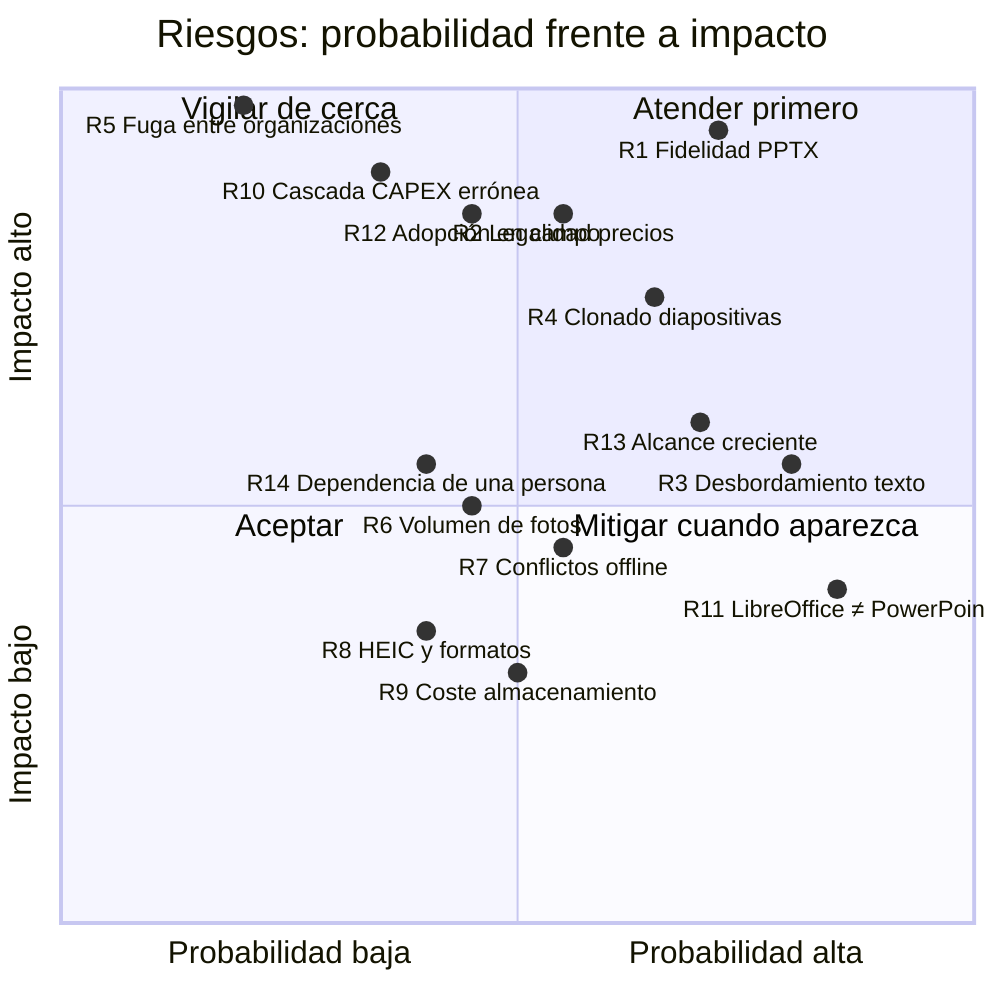

# 20. Alcance del MVP · 21. Plan de implementación por fases · 22. Riesgos y mitigaciones

---

## 20. Alcance del MVP

### 20.1. Criterio del MVP

`[REC]` El MVP se define por un objetivo verificable, no por una lista de funciones:

> **Un consultor debe poder llevar a cabo una due diligence técnica real de principio a fin —desde
> abrir el proyecto hasta emitir el PPTX— sin salirse de la herramienta ni una sola vez.**

Todo lo que hace falta para eso está dentro. Todo lo demás, fuera. Es lo que distingue un MVP de una
demo: si el consultor tiene que abrir Excel para el CAPEX o retocar el PPTX a mano, no hemos entregado
nada.

### 20.2. Contenido del MVP

`[REQ]` §11 del encargo, con el detalle de qué significa cada punto:

| # | Requisito del encargo | Qué incluye exactamente | Qué **no** incluye |
|---|---|---|---|
| 1 | Autenticación y usuarios | Email + contraseña (Argon2id), TOTP opcional, recuperación, invitaciones, roles de organización, suspensión | SSO/OIDC, política de contraseñas corporativa |
| 2 | Clientes, proyectos y activos | Ficha completa, contactos, máquina de estados con guardas, activos con todos los campos, jerarquía de ubicaciones, mapa con adaptador configurable, búsqueda y filtros, duplicado selectivo, archivado, historial y actividad, exportación JSON/XLSX | Permisos por activo para terceros externos |
| 3 | Asignación del equipo | Miembros con rol de proyecto, asignación a activos, especialidades, matriz de cobertura, alcance aplicado en el servidor | Delegación temporal, calendario de disponibilidad |
| 4 | Repositorio de fotografías | Carga múltiple, captura desde cámara, original inmutable con cuatro barreras, EXIF completo, GPS, duplicados por hash exacto y perceptual, clasificación jerárquica y por sistema, etiquetas, comentarios, descripción, selección y orden para informe, papelera, versiones, descarga individual y en ZIP con eliminación de metadatos, **anotación básica** (rectángulo, elipse, flecha, texto) | Anotación avanzada (pinceles, difuminado, medidas), reconocimiento de contenido |
| 5 | Renombrado sin modificar originales | Plantilla configurable con 12 tokens, previsualización obligatoria con colisiones, lote, reversión, extensión inalterable, auditado | — |
| 6 | Registro de equipos e incidencias | Inventario completo con vida residual calculada, importación XLSX con informe de errores, incidencias con riesgo, criticidad, acción, horizonte y estado, recomendaciones alternativas, matriz de riesgos, atajo «incidencia desde foto» | Plantillas de incidencia por tipología |
| 7 | CAPEX con precio manual | Partidas con los 24 campos, cascada visible y editable peldaño a peldaño, perfiles de coste, escenarios, redondeo configurable, actualización por índices, las **siete vistas** agregadas, exportación XLSX (con hoja de trazabilidad) y CSV | Consulta automatizada de fuentes externas |
| 8 | Registro de referencias y URLs | `PriceSourceAdapter` completo, adaptador manual con justificación obligatoria, importador de catálogo propio, comparador lado a lado, validación humana con restricción en base de datos, registro de fuentes con revisión de condiciones de uso | Adaptadores a fuentes externas reales |
| 9 | Carga de plantilla PPTX | Original inmutable con WORM, análisis completo de estructura, detección de marcadores y directivas, previsualización de estructura, avisos de elementos no soportados, validaciones de seguridad del paquete | Editor de plantillas dentro de la aplicación |
| 10 | Mapeo básico de marcadores | Catálogo cerrado con resolución automática, mapeo manual de lo desconocido, guardado y clonado del mapeo, reglas de repetición por activo, sistema e incidencia, partición de tablas, reglas de fotos, validación del mapeo | Mapeo visual por arrastre sobre la diapositiva |
| 11 | Generación de un informe de prueba | Generación real con conservación de tema, patrón, tipografías, colores, logos, posiciones y proporciones. Previsualización con LibreOffice. Avisos de campos vacíos, desbordamiento, imágenes ausentes y tablas | Fidelidad garantizada con plantillas arbitrarias `[LIM]` |
| 12 | Control de versiones básico | `ReportVersion` con snapshot de datos, hash del PPTX, linaje, estados, flujo de revisión y aprobación de un nivel, bloqueo del emitido, comparación entre versiones | Aprobación multi-nivel, firma electrónica |
| 13 | Auditoría de operaciones críticas | Las 11 categorías de eventos, escritura transaccional, tabla append-only particionada, cadena hash, consulta filtrada, exportación CSV, historial de cambios por campo | Panel de análisis de auditoría |

### 20.3. Añadidos al MVP no pedidos explícitamente

`[REC]` Cuatro elementos que se incluyen porque **omitirlos costaría más caro después**:

| Añadido | Coste ahora | Coste si se posterga |
|---|---|---|
| **Multi-organización con RLS desde el día uno** | ~1 semana | Reescribir el acceso a datos y migrar todos los proyectos existentes. Es la decisión menos reversible del sistema |
| **Cola de subida persistente y claves de idempotencia** | ~1 semana | Rehacer toda la capa de datos del cliente. Y sin ella el trabajo en campo con red intermitente no funciona |
| **i18n con catálogo de traducción** | ~3 días | Recorrer cientos de componentes buscando cadenas incrustadas |
| **`AsyncTask` con progreso visible** | ~3 días | El usuario mirando una pantalla congelada durante la carga de 200 fotos. Se acaba añadiendo con prisas y peor |

### 20.4. Fuera del MVP, y por qué

`[REQ]` §11 lista lo que debe posponerse. Se confirma, con el motivo técnico:

| Funcionalidad | Fase | Motivo de posponerla |
|---|:--:|---|
| Consulta automatizada de múltiples fuentes de precios | 7 | Depende de decisiones **legales y comerciales del cliente** (P-03), no técnicas. La arquitectura ya está lista |
| Modo offline completo | 8 | Es el componente más caro del backlog. El MVP incluye la parte que da el 80 % del valor (cola de subida, borradores, precarga) |
| Anotación avanzada de imágenes | 9 | La anotación básica cubre el caso real: señalar dónde está el problema |
| Extracción inteligente de información de fotografías | 10 | Requiere IA, política de consentimiento y validación de precisión. Riesgo alto, valor no demostrado |
| Generación narrativa mediante IA | 10 | Ídem. Además, un texto de informe técnico generado sin control es un riesgo de responsabilidad profesional `[REC]` |
| Integraciones con sistemas corporativos | 11 | No hay integración identificada aún (P-14). La API REST documentada es el punto de extensión |
| Analítica avanzada | 11 | Sin datos históricos no hay analítica que hacer. Con 3 proyectos, un panel de tendencias es decorativo |
| Aprobación multi-nivel y firma electrónica | 6 o posterior | Depende de P-07 |
| SSO/OIDC | 6 | Depende de P-06. Interfaz preparada |
| OpenSearch para búsqueda | 11 | PostgreSQL FTS es suficiente para el volumen supuesto |
| Permisos por activo para subcontratistas externos | 11 | Depende de P-17 |

### 20.5. Criterios de aceptación del MVP

El MVP se considera terminado cuando, con datos ficticios y sobre una plantilla PPTX real del cliente:

- [ ] Un consultor completa el flujo E1–E7 de [`13-pruebas.md`](./13-pruebas.md) §19.10 sin bloqueos.
- [ ] Se genera un informe de al menos 40 diapositivas con 3 activos, 40 incidencias, 60 partidas y
      35 fotografías, y **un consultor lo considera entregable con retoques menores** (≥ 90 % de
      diapositivas sin retocar) `[SUP]`.
- [ ] El hash del original de cada plantilla y de cada fotografía es idéntico al de subida, tras 100
      operaciones de renombrado y 20 generaciones.
- [ ] La suite completa está verde, con las puertas de cobertura por módulo cumplidas.
- [ ] Las pruebas de la matriz de permisos y de aislamiento entre organizaciones pasan al 100 %.
- [ ] Ningún endpoint carece de política de autorización declarada.
- [ ] `axe-core` no reporta violaciones graves en las 19 pantallas.
- [ ] El flujo de campo funciona en un móvil real con red intermitente, sin duplicados.
- [ ] Un ensayo de restauración de copia de seguridad se ha ejecutado y documentado.
- [ ] La documentación de instalación local permite a alguien ajeno al equipo arrancar el sistema.

---

## 21. Plan de implementación por fases

### 21.1. Vista general

```mermaid
gantt
    title Plan de implementación · MVP en 16 semanas (supuesto S-07)
    dateFormat YYYY-MM-DD
    axisFormat S%W

    section Preparación
    F0 · Cimientos técnicos           :f0, 2026-09-01, 14d
    Corpus de plantillas reales (P-01):crit, p01, 2026-09-01, 10d

    section Núcleo
    F1 · Proyectos, clientes, activos :f1, after f0, 21d
    F2 · Equipo, roles y auditoría    :f2, after f1, 10d

    section Evidencia
    F3 · Repositorio de fotografías   :f3, after f2, 21d

    section Diagnóstico
    F4 · Inventario e incidencias     :f4, after f3, 14d
    F5 · Motor de CAPEX y precios     :f5, after f4, 17d

    section Informe
    F6 · PPTX: análisis y mapeo       :crit, f6, after f5, 14d
    F7 · PPTX: generación y versiones :crit, f7, after f6, 17d

    section Cierre
    F8 · Endurecimiento y entrega     :f8, after f7, 14d

    section Prototipo de riesgo
    Prueba de concepto PPTX           :crit, poc, 2026-09-08, 14d
```

`[SUP]` Estimaciones basadas en el equipo de S-07 (1 tech lead + 2 full stack + diseñador y QA a
media jornada). **No son un compromiso contractual**: cambian con el equipo real, con la respuesta a
las preguntas abiertas y con la complejidad real de las plantillas.

### 21.2. Detalle de fases

#### F0 · Cimientos técnicos — 2 semanas

| Entregable | Detalle |
|---|---|
| Monorepo y herramientas | Estructura de [`15-estructura-carpetas.md`](./15-estructura-carpetas.md), lint, tipos, formateo, hooks de pre-commit |
| `docker-compose` completo | API, worker, PostgreSQL, Redis, MinIO, ClamAV, MailHog, LibreOffice. **Un `make up` levanta todo** |
| Migraciones base | Alembic; organización, usuario, rol; **políticas RLS y su prueba** |
| Autenticación completa | Argon2id, JWT, refresco rotatorio, TOTP, recuperación |
| Motor de autorización | Módulo `authz`, dependencias de FastAPI, matriz declarativa, prueba de cobertura del router |
| Auditoría | Tabla particionada, escritura transaccional, cadena hash, `AuditLogger` |
| Esqueleto de frontend | Vite, enrutado, cliente generado desde OpenAPI, pantalla de acceso, diseño base, i18n |
| CI completa | Todas las puertas de §19.12 |
| Observabilidad | OpenTelemetry, logs estructurados, sondas |

**Hito de salida:** un usuario se registra, entra, y todo lo que hace queda auditado.

> **En paralelo y con máxima prioridad:** obtener el corpus de plantillas reales (P-01) y arrancar la
> **prueba de concepto de PPTX** (§21.3). No esperar a la fase F6 para descubrir el riesgo.

#### F1 · Proyectos, clientes y activos — 3 semanas

Cliente y contactos; proyecto con todos los campos; `ProjectStateMachine` con guardas y su prueba
exhaustiva; activos con validaciones geográficas y cronológicas; `location_node` con árbol y `ltree`;
adaptador `MapProvider` con MapLibre; catálogo de sistemas técnicos con semilla; búsqueda y filtros;
duplicado selectivo; archivado; historial de cambios y actividad; exportación JSON/XLSX.
Pantallas 3, 4, 5 y 6.

**Hito:** un director crea un proyecto con cliente y tres activos y lo pasa a preparación.

#### F2 · Equipo, roles y auditoría visible — 1,5 semanas

Miembros con rol de proyecto; asignación a activos; especialidades; matriz de cobertura; alcance del
técnico especialista aplicado en el servidor; invitaciones; **matriz de permisos completa en pruebas**;
notificaciones in-app; comentarios con menciones; pantalla de auditoría. Pantallas 2, 7 y 19.

**Hito:** las pruebas de la matriz de permisos pasan al 100 % y ningún endpoint queda sin política.

#### F3 · Repositorio de fotografías — 3 semanas

La fase con más carga técnica del bloque de evidencia:

| Semana | Foco |
|---|---|
| 1 | Adaptador `ObjectStorage`, URLs firmadas, intención de subida, confirmación, idempotencia, cola de subida en IndexedDB, WORM sobre `originals/` |
| 2 | Worker de proceso: antivirus, MIME real, hashes, EXIF, derivados, orientación, duplicados. Disparadores de inmutabilidad y sus pruebas |
| 3 | Rejilla virtualizada, visor, clasificación, etiquetas, versiones, papelera, **renombrado en lote con previsualización**, anotación básica, ZIP con eliminación de metadatos, flujo móvil completo |

Pantallas 8 y 9.

**Hito:** subir 200 fotos desde un móvil real con red intermitente, renombrarlas en lote y comprobar
que los 200 hashes originales son idénticos a los de origen.

#### F4 · Inventario e incidencias — 2 semanas

Inventario con vida residual calculada; importación XLSX con informe de errores por fila; incidencias
con riesgo, criticidad, acción, horizonte y estado; recomendaciones; matriz de riesgos accesible;
atajo «incidencia desde foto»; asociación de fotos con `photo_link`; flujo de validación por revisor.
Pantallas 10, 11 y 12.

**Hito:** registrar 50 equipos y 30 incidencias con evidencia fotográfica, desde el móvil.

#### F5 · Motor de CAPEX y precios — 2,5 semanas

| Semana | Foco |
|---|---|
| 1 | `CapexEngine` puro con cascada configurable, redondeo, escenarios. **Pruebas doradas, de propiedad y de mutación.** Disparador SQL y prueba de equivalencia |
| 2 | Partidas, perfiles de coste, las siete vistas agregadas, exportación XLSX con hoja de trazabilidad y CSV. Editor con el panel «Cómo se calcula» |
| 2,5 | `PriceSourceAdapter`, adaptador manual, importador de catálogo, `price_source` con revisión de condiciones de uso, comparador, validación humana, índices y factores |

Pantallas 13 y 14.

**Hito:** un CAPEX de 60 partidas con la cadena de trazabilidad completa, y la exportación auditable.

#### F6 · PPTX: análisis y mapeo — 2 semanas · **fase crítica**

`TemplateAnalyzer`; validaciones de seguridad del paquete; extracción de marcadores con normalización
de párrafos; lectura de directivas de notas; detección de elementos no soportados; catálogo cerrado de
marcadores; previsualización de estructura; pantalla de mapeo; guardado y clonado; validación del
mapeo; corpus T1–T18 con sus pruebas. Pantallas 15 y 16.

**Hito:** las 18 plantillas del corpus se analizan correctamente, incluidas las maliciosas y las
corruptas.

#### F7 · PPTX: generación y versiones — 2,5 semanas · **fase crítica**

| Semana | Foco |
|---|---|
| 1 | `ReportRenderer`: sustitución de marcadores, creación desde diseño, repetición con filtros y orden, inserción de imágenes con proporción |
| 2 | Partición de tablas con formato de fila clonado; sustitución de datos de gráficos; estimación de desbordamiento con `fontTools`; previsualización con LibreOffice |
| 2,5 | Snapshot y hashes; `ReportVersion`; flujo de revisión, aprobación y emisión; bloqueo; comparación entre versiones; panel de avisos |

Pantallas 17 y 18.

**Hito:** informe de 47 diapositivas generado desde la plantilla real del cliente, revisado, aprobado,
emitido y bloqueado, con el original de la plantilla intacto.

#### F8 · Endurecimiento y entrega — 2 semanas

Suite de seguridad completa; pruebas de carga con el conjunto voluminoso; accesibilidad en las 19
pantallas; rendimiento y consultas lentas; endurecimiento de contenedores; ensayo de restauración de
copias documentado; purga programada; documentación de despliegue y de operación; manual de uso;
formación del equipo; despliegue en `staging` con datos ficticios; validación con un consultor real
sobre un caso real.

**Hito:** los diez criterios de aceptación del MVP (§20.5) marcados.

### 21.3. La prueba de concepto de PPTX: por qué va primero

`[REC]` **Esta es la recomendación de calendario más importante del plan.** El riesgo del Bloque 4 no
debe descubrirse en la semana 12.

**Semanas 2–3, en paralelo a F0/F1**, un desarrollador dedica dos semanas a un prototipo desechable
—marcado como tal— que responda a cuatro preguntas con las plantillas reales del cliente:

| Pregunta | Cómo se responde | Si la respuesta es mala |
|---|---|---|
| ¿La repetición por diseño produce diapositivas indistinguibles de las hechas a mano? | Generar 3 fichas de activo y compararlas visualmente con una hecha a mano | Se refuerza el contrato de plantilla o se activa el plan B |
| ¿La partición de tablas conserva el formato corporativo? | Generar una tabla de 62 filas y revisarla en PowerPoint | Se simplifica el diseño de la tabla en la plantilla |
| ¿La estimación de desbordamiento es útil (±15 %)? | Comparar la estimación con el render real de LibreOffice en 20 casos | Se baja la ambición del aviso: se avisa siempre por encima de un umbral de caracteres |
| ¿Cuánta desviación hay entre LibreOffice y PowerPoint? | Renderizar la misma plantilla en ambos y comparar | Se ajusta la expectativa de la previsualización y se documenta |

**Coste: 2 semanas de una persona. Beneficio: se conoce el riesgo mayor del proyecto en la semana 3 en
lugar de la 12**, cuando aún hay margen para cambiar de motor sin romper el calendario.

### 21.4. Fases posteriores al MVP

| Fase | Contenido | Duración `[SUP]` | Depende de |
|:--:|---|---|---|
| **F9** | SSO/OIDC · MFA obligatorio por política · aprobación multi-nivel · panel de auditoría | 4 semanas | P-06, P-07 |
| **F10** | Adaptadores a fuentes de precios reales · sincronización de índices | 4–8 semanas | **P-03 y validación legal.** Sin ella no empieza |
| **F11** | Modo offline completo · fusión asistida de conflictos | 6–8 semanas | P-04. Es la fase más cara |
| **F12** | Anotación avanzada · medidas sobre imagen · comparación antes/después | 3 semanas | — |
| **F13** | Funciones de IA con consentimiento explícito y revisión humana | 6 semanas | Política del cliente y §18.10 |
| **F14** | Integraciones corporativas · webhooks · API pública | variable | P-14 |
| **F15** | Analítica de cartera · comparativas entre activos · panel de dirección | 4 semanas | Datos históricos suficientes |

`[REC]` Recomendación de orden: **F10 antes que F11**. Los precios automatizados aumentan el valor del
producto para todos los usuarios; el offline completo resuelve un problema de una minoría de visitas.
Salvo que la respuesta a P-04 revele que sin offline la herramienta no se usa en campo, en cuyo caso el
orden se invierte.

---

## 22. Riesgos técnicos y medidas de mitigación

### 22.1. Matriz de riesgos



### 22.2. Fichas de riesgo

#### R1 · La generación de PPTX no conserva el formato con suficiente calidad
**Probabilidad alta · Impacto crítico.** Si el informe sale descuadrado, el producto no se usa: es la
razón de ser de la herramienta.

| Mitigación | Cuándo |
|---|---|
| Obtener plantillas reales (P-01) antes de escribir código de informe | Semana 1 |
| Prueba de concepto dedicada de 2 semanas (§21.3) | Semanas 2–3 |
| Contrato de plantilla documentado + plantilla de referencia + validador | F6 |
| Estrategia de repetición **por diseño** en lugar de clonado de XML | F7 |
| Corpus de 18 plantillas con pruebas de regresión visual | F6–F7 |
| Métrica de aceptación explícita (≥ 90 % de diapositivas sin retocar) | F8 |
| `ReportRenderer` como interfaz, para poder cambiar de motor sin tocar el resto | F0 |
| Planes B identificados y valorados (§17.9) | Desde el inicio |

**Indicador de alarma:** si en la prueba de concepto menos del 70 % de las diapositivas son
aceptables, se convoca la decisión de cambio de motor **en la semana 4**, no en la 14.

#### R2 · Las fuentes de precios no pueden usarse legalmente
**Probabilidad media-alta · Impacto alto.** Es un riesgo jurídico, no técnico, y no se resuelve
programando.

| Mitigación |
|---|
| **El MVP no depende de ninguna fuente externa.** Entrada manual + catálogo propio |
| Ninguna fuente se activa sin revisión documentada, exigida por una restricción de base de datos |
| Se respeta `robots.txt` y los controles técnicos; nunca se intenta eludirlos |
| Deshabilitación automática de la fuente ante señales de bloqueo, con auditoría |
| No se nombra ninguna fuente concreta en la propuesta ni se afirma que funcione |
| P-03 planteada como pregunta de impacto crítico |

**Riesgo residual aceptado:** el valor del CAPEX en el MVP depende del catálogo del cliente o del
criterio del consultor. Es una limitación de alcance consciente y comunicada.

#### R3 · La detección de desbordamiento de texto no es fiable
**Probabilidad alta · Impacto medio.** `python-pptx` no renderiza (`[LIM]` L2).

| Mitigación |
|---|
| Doble vía: estimación por `fontTools` + previsualización real con LibreOffice |
| El aviso **declara** que es una estimación, con su margen |
| Posibilidad de subir los archivos de fuente corporativa |
| Margen de seguridad ampliado al 15 % cuando la fuente no está disponible |
| Detección de autoajuste para bajar la severidad cuando PowerPoint va a encoger el texto |
| Recomendación de contrato: marcos con holgura del 20 % en las zonas de texto libre |

**Riesgo residual aceptado y comunicado:** el consultor debe revisar la previsualización. La
herramienta reduce el trabajo de revisión, no lo elimina.

#### R4 · El clonado de diapositivas complejas falla
**Probabilidad media-alta · Impacto alto** (`[LIM]` L1).

| Mitigación |
|---|
| Estrategia principal por diseño, que es el camino soportado |
| Clonado de XML solo como vía secundaria, con lista explícita de elementos no soportados |
| Detección de esos elementos durante el análisis, con aviso previo al usuario |
| Corpus T4 y T7 en las pruebas |
| Apache POI identificado como alternativa concreta y acotada |

#### R5 · Fuga de datos entre organizaciones
**Probabilidad baja · Impacto catastrófico.** Un solo incidente destruye la confianza del cliente.

| Mitigación |
|---|
| RLS en PostgreSQL: el aislamiento no depende del código de aplicación |
| Usuario de aplicación **sin** `BYPASSRLS` |
| Claves de objeto namespaced por organización |
| `404` en lugar de `403` para no confirmar existencia |
| Prueba paramétrica de aislamiento sobre **todas** las tablas: una tabla nueva sin política rompe la build |
| URLs firmadas de 5 minutos, un recurso, generadas tras autorizar |
| Auditoría de todo acceso y toda denegación |
| Prueba de penetración externa antes del primer cliente real |

#### R6 · El volumen de fotografías degrada la experiencia
**Probabilidad media · Impacto medio.**

| Mitigación |
|---|
| Subida directa a almacenamiento: la API no toca los bytes |
| Derivados en tres tamaños; miniaturas WebP de 15–25 KB servidas por CDN |
| Rejilla virtualizada + paginación por cursor |
| Sin `COUNT(*)` en cada página |
| ZIP y exportaciones en cola, con progreso visible |
| Pruebas de carga con 10.000 fotos en el conjunto voluminoso |
| Reglas de ciclo de vida para reducir el coste de almacenamiento |

#### R7 · Conflictos de sincronización tras el trabajo en campo
**Probabilidad media · Impacto medio** (`[LIM]` MVP: última escritura gana por campo).

| Mitigación |
|---|
| Claves de idempotencia y UUID generados en cliente: **sin duplicados**, que es el fallo más doloroso |
| Resolución por campo, no por registro entero |
| El valor descartado se registra en `change_history` y se avisa al usuario |
| Reparto natural del trabajo por activo y especialidad, que reduce la colisión real |
| Fusión asistida planificada en F11 |

#### R8 · Formatos de imagen problemáticos (HEIC, RAW)
**Probabilidad media-baja · Impacto bajo-medio.**

| Mitigación |
|---|
| `pillow-heif`/`libheif` en la imagen del worker, con prueba de fotos reales de iPhone |
| Derivados siempre en WebP y JPEG, universalmente visualizables |
| RAW y TIFF explícitamente fuera del MVP (S-10, P-12) |
| Un formato no soportado deja la foto en `ERROR` con motivo legible; el original se conserva y es descargable |

#### R9 · Coste de almacenamiento superior al previsto
**Probabilidad media · Impacto bajo.** 300 proyectos × 1.000 fotos × 5 MB ≈ 1,5 TB/año de originales
`[SUP]`.

| Mitigación |
|---|
| No se duplican binarios al renombrar |
| Anotaciones vectoriales en lugar de imágenes rasterizadas |
| Ciclo de vida a clase de acceso infrecuente tras el cierre del proyecto |
| Derivados regenerables: se pueden purgar y reconstruir |
| Cuota por organización y por proyecto, con aviso al acercarse |
| Panel de consumo por organización |

#### R10 · Un error en la cascada de CAPEX llega a un informe firmado
**Probabilidad media-baja · Impacto muy alto.** Es un riesgo de responsabilidad profesional del
cliente.

| Mitigación |
|---|
| `CapexEngine` puro, determinista, sin E/S |
| Cobertura ≥ 95 % con pruebas doradas verificadas a mano por un tercero |
| Pruebas de propiedad con `hypothesis`: la suma siempre cuadra |
| Pruebas de mutación con umbral |
| Doble implementación (Python y SQL) con prueba de equivalencia al céntimo |
| `Decimal` en toda la ruta, verificado por una prueba que inspecciona tipos |
| **La cascada se muestra al usuario con sus operandos**: el propio consultor es la última barrera |
| `calc_version` para reproducir informes antiguos |
| Validación de la cascada contra los Excel reales del cliente antes del primer informe (P-10) |

#### R11 · La previsualización de LibreOffice no coincide con PowerPoint
**Probabilidad alta · Impacto bajo-medio** (`[LIM]` L3). Va a ocurrir; la cuestión es la expectativa.

| Mitigación |
|---|
| Se declara en la propia pantalla de previsualización |
| Se recomienda una validación manual en PowerPoint por cada plantilla nueva |
| Descarga del borrador siempre disponible |
| Fuentes corporativas instalables en el contenedor de LibreOffice para mejorar la coincidencia |
| Si se exige fidelidad exacta, existe la vía comercial de §17.9 |

#### R12 · La herramienta no se adopta en campo
**Probabilidad media · Impacto alto.** Un producto perfecto que nadie usa vale cero.

| Mitigación |
|---|
| El flujo de campo (§5.2) es la primera prioridad de diseño, no un añadido responsive |
| Objetivo medible: incidencia con foto en ≤ 4 toques |
| Contexto persistente, autoguardado, miniaturas optimistas, dictado por voz |
| Objetivos táctiles grandes y contraste alto: se usa con guantes y a contraluz |
| Validación con un consultor real sobre una visita real en F8, **antes** de considerar el MVP terminado |
| Modo oscuro para salas técnicas |

`[REC]` La mitigación más eficaz de este riesgo no es técnica: es acompañar a un consultor en una
visita real durante F3 y observar qué le estorba. Dos horas de observación valen más que dos semanas de
suposiciones.

#### R13 · Crecimiento incontrolado del alcance
**Probabilidad alta · Impacto medio.** El encargo es amplio y la tentación de añadir es constante.

| Mitigación |
|---|
| Alcance del MVP definido por un objetivo verificable, no por una lista |
| Diez criterios de aceptación explícitos y comprobables |
| Lo excluido está documentado **con su motivo**, para no rediscutirlo cada semana |
| Etiquetas `[REQ]`/`[SUP]`/`[REC]` que distinguen lo pedido de lo propuesto |
| Fases posteriores ya planificadas: pedir algo no lo pierde, lo coloca |
| Revisión de alcance al final de cada fase, con el *product owner* (P-22) |

#### R14 · Concentración de conocimiento en una persona
**Probabilidad media · Impacto medio.** El módulo de PPTX es el candidato natural a convertirse en
territorio de una sola persona.

| Mitigación |
|---|
| Contrato de plantilla y decisiones documentadas en este repositorio, no en la cabeza de nadie |
| Revisión cruzada obligatoria del código de `capex/` y `reporting/` |
| Corpus de pruebas que documenta el comportamiento esperado mejor que cualquier wiki |
| Rotación: quien escribe el analizador no escribe el generador |
| Decisiones arquitectónicas registradas como ADR en `docs/adr/` |

### 22.3. Riesgos residuales aceptados

Con nombre y apellidos, para que nadie se sorprenda después:

| # | Riesgo residual | Por qué se acepta |
|---|---|---|
| 1 | La previsualización no es idéntica a PowerPoint | Alternativa: motor comercial. Coste no justificado en el MVP |
| 2 | El aviso de desbordamiento es una estimación con ±15 % | Límite técnico real de la biblioteca. Mitigado con previsualización |
| 3 | El SmartArt no se rellena | Se detecta y se avisa. El contrato de plantilla lo evita |
| 4 | La resolución de conflictos del MVP es última escritura gana | El reparto del trabajo hace la colisión infrecuente. Se avisa y se registra |
| 5 | Ninguna fuente externa de precios está integrada | Depende de decisiones del cliente. Arquitectura lista |
| 6 | Sin RAW ni TIFF | Sin necesidad demostrada. Coste alto |
| 7 | La cadena hash de auditoría no impide la manipulación por alguien con acceso a la base de datos | La hace detectable, que es lo alcanzable sin un servicio externo de sellado temporal |
| 8 | IndexedDB puede ser desalojada por el navegador | Límite de la plataforma web. Se solicita persistencia y se avisa del pendiente |
| 9 | Sin firma electrónica cualificada | S-13. Requiere proveedor externo y cambia el flujo de emisión |
| 10 | Una sola región de despliegue | S-14/S-17. 99,9 % exigiría redundancia activa y más coste |
