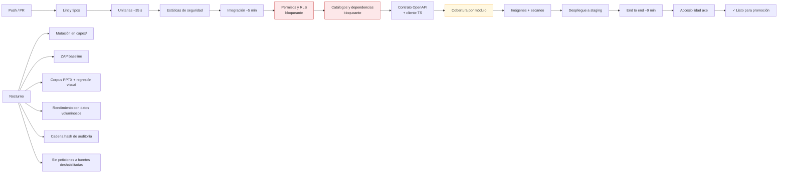

# 19. Estrategia de pruebas

---

## 19.1. Forma de la pirámide

```
                    ╱╲
                   ╱E2E╲          ~30 escenarios · Playwright
                  ╱──────╲        Los flujos críticos, en Chromium + WebKit
                 ╱ Integr. ╲      ~280 pruebas · pytest + testcontainers
                ╱────────────╲    PostgreSQL y MinIO reales, no simulados
               ╱   Unitarias   ╲  ~900 pruebas · pytest / vitest
              ╱──────────────────╲ Dominio puro, sin E/S
             ╱ Estáticas y contrato╲ mypy · ruff · bandit · OpenAPI
            ╱──────────────────────╲
```

`[REC]` **Dónde se concentra el esfuerzo:** `CapexEngine`, `PhaseEngine`, la validación de catálogos
dependientes y `ReportRenderer` absorben la mayor densidad de pruebas unitarias. Un error en el primero
produce cifras erróneas en un informe firmado; en el segundo, una lista de verificación que miente; en
el tercero, hallazgos clasificados en zonas imposibles; en el cuarto, un entregable inutilizable. El
resto es CRUD con autorización: importante, pero de riesgo acotado.

### Objetivos de cobertura `[SUP]`

| Ámbito | Objetivo | Puerta en CI |
|---|---|:--:|
| `capex/` (motor de cálculo) | **≥ 95 %** líneas y ramas | Bloqueante |
| `authz/` (autorización) | **100 % de rutas de decisión** | Bloqueante |
| `catalogs/` (validación de dependencias) | **≥ 95 %** | Bloqueante |
| `phases/` (motor de fases) | ≥ 90 % | Sí |
| `reporting/` (PPTX) | ≥ 85 % | Sí |
| `evidence/` (fotografías) | ≥ 85 % | Sí |
| Global backend | ≥ 80 % | Sí |
| Frontend (lógica, no maquetación) | ≥ 70 % | Aviso |

La cobertura es un indicador, no un objetivo: se acompaña de **pruebas de mutación** (`mutmut`) sobre
`capex/` con umbral, porque el 95 % de cobertura en una función de cálculo puede convivir con
aserciones que no comprueban nada. `[REC]`

---

## 19.2. Pruebas unitarias

### Motor de CAPEX

| Familia | Casos |
|---|---|
| **Horizonte único** | `time_horizon_id` obligatorio: sin él, `422`. Importe 0 admitido. El total con impuestos es columna generada y **nunca** escribible |
| **Cascada** | Casos dorados calculados a mano y verificados por un tercero. El ejemplo 48.500 € → 73.900,85 € es el caso canónico |
| **Exactitud decimal** | `Decimal("0.1") + Decimal("0.2") == Decimal("0.3")`; cantidades y precios con 4 decimales; **ninguna aparición de `float` en la ruta de cálculo**, verificada por una prueba que inspecciona los tipos |
| **Redondeo** | Los cuatro modos; frontera `0,005`, `0,015`, `0,025` (donde `HALF_UP` y `HALF_EVEN` difieren); por peldaño frente a solo total |
| **Suma coherente** | La suma de totales de línea coincide **exactamente** con el total del proyecto, con 300 líneas de importes aleatorios. Propiedad con `hypothesis` |
| **Pivote a columnas** | Una línea produce valor en **exactamente una** de las cinco columnas y «—» en las otras cuatro; la suma de las cinco columnas coincide con el total del proyecto |
| **Porcentajes** | 0 %; 100 %; decimales (`8,25 %`); todos a cero (base = coste directo) |
| **No propagación** `[REC]` | Cambiar `contingency_pct` del perfil **no modifica** el `amount` de ninguna línea existente; cambiar `tax_pct` **sí** recalcula `tax_amount` y `total_cost` de todas. Es la prueba que protege la decisión P-05b |
| **La cascada no se autoaplica** | Una línea con importe tecleado y `amount_source = MANUAL` conserva su importe aunque se rellene el desglose por medición; solo cambia al trasladarlo explícitamente |
| **Escenarios** | Bajo < probable < alto siempre; factor 1,0 devuelve el probable; factores derivados de `confidence` |
| **Índices** | Actualización con índices válidos; **índice ausente ⇒ no calcula y avisa** (no interpola); índice cero o negativo ⇒ error |
| **Valores límite** | Cantidad 0; precio 0; importes de 10⁹ sin desbordar `NUMERIC(18,4)` |
| **Errores** | Importes o cantidades negativos; porcentaje > 100 % o negativo; moneda inválida |
| **Equivalencia Python ↔ SQL** | 1.000 casos generados: `CapexEngine` y el disparador deben coincidir **al céntimo**. Bloqueante `[REC]` |
| **`calc_version`** | Un informe generado con `calc_version = 1` se reproduce con esa versión aunque exista la 2 |

### Catálogos y dependencias `[REC]`

Familia nueva, y de las más importantes del modelo revisado:

| Caso | Verificación |
|---|---|
| Zona válida para la tipología | Las **86 combinaciones** de la matriz de §5.2, una a una |
| Zona inválida | `Almacén` en `Oficinas` ⇒ rechazo con la lista de zonas válidas |
| Zona común | `Cubierta` es válida en las **6 tipologías** |
| Código no seleccionable | Nivel 1 y nivel 2 ⇒ `CAPEX_CODE_NOT_SELECTABLE` |
| Código retirado | No aparece en el selector; **sí se resuelve** en un informe antiguo |
| Cambio de tipología | Las líneas conservan su zona y se marcan `REVISAR_ZONA`; **nunca se borra la zona** |
| Coherencia código ↔ concepto | Código `SC.*` con concepto distinto de `Soft Cost` ⇒ **aviso, no bloqueo** (§5.5) |
| Valor «–» | `NULL` en zona, riesgo, concepto y recuperabilidad; las agregaciones lo tratan como «sin clasificar», no como una categoría |
| Integridad del árbol | 4 categorías, 18 capítulos, 121 elementos; `path` coherente con `parent_id`; sin ciclos |
| Definiciones de riesgo | Las cuatro presentes, no vacías, y expuestas por la API |

### Motor de fases `[REC]`

| Caso | Verificación |
|---|---|
| Selección al alta | Solo se crean las fases marcadas; el resto queda `NO_APLICA` |
| Activación posterior | `NO_APLICA` → `PENDIENTE` |
| Estado derivado | `RED_FLAG_CAPEX` no se puede escribir por API ⇒ `422` |
| Cálculo de Red Flag/CAPEX | 0 líneas → pendiente; líneas con precio sin validar → en curso; todas validadas → completada |
| Cálculo de Full Report | Sin versión → pendiente; versión generada → en curso; versión emitida → completada |
| Visita agregada | 3 activos, 2 visitados → fase en curso; 3 visitados → completada |
| Solicitud de documentación | 5 líneas, 3 recibidas → «3 de 5»; con líneas en `SOLICITADA` no se completa |
| Limitaciones | Las líneas en `NO_DISPONIBLE` y `PARCIAL` aparecen en `report-limitations`; las demás no |

### Nomenclatura de fotografías

Tokens individuales y combinados; token vacío omitido con su separador; acentos, `ñ`, caracteres
prohibidos, de control y emoji; **la extensión nunca se pierde** en las cuatro combinaciones de
mayúsculas y de nombre con extensión; recorte a 200 caracteres conservando el sufijo; colisiones
deterministas; nombres reservados de Windows; idempotencia del renombrado repetido.

### Máquinas de estado

Para proyecto, hallazgo, fase y versión de informe: **matriz completa** `n × n` de transiciones
válidas e inválidas, verificando que cada guarda se comprueba y que cada transición emite su evento.
Una tabla de datos, no 80 funciones. `[REC]`

### Frontend (vitest)

Validación espejo de la del backend; formateo de importes y fechas en español; construcción del nombre
en la previsualización de renombrado; lógica de la cola de subida (reintentos, idempotencia, orden);
**cálculo de la cascada y del total por horizontes mostrados en pantalla**, que deben coincidir con el
servidor; filtrado del selector de zonas por tipología.

---

## 19.3. Pruebas de integración

Con `testcontainers`: **PostgreSQL y MinIO reales**. No se simula la base de datos: las pruebas más
valiosas de este sistema verifican restricciones, disparadores y RLS, que un doble no ejerce. `[REC]`

| Familia | Qué verifica |
|---|---|
| **Restricciones** | Que sea **imposible** insertar: línea con `price_status = VALIDADO` sin validador; línea con precio y sin referencia; proyecto fuera de borrador sin cliente; versión emitida sin `is_locked`; fuente habilitada sin revisión de condiciones; código no seleccionable |
| **Disparadores de inmutabilidad** | Que `UPDATE` sobre `photo.storage_key`, `photo.sha256`, `report_template.storage_key` o un `report_version` bloqueado **falle en base de datos** |
| **Total generado** | Que `total_cost` sea siempre `amount + tax_amount`, y que `time_horizon_id` sea obligatorio, incluso escribiendo por SQL directo |
| **Recálculo** | Que cambiar cantidad o precio por SQL recalcule la cascada |
| **Estado derivado de fase** | Que un `UPDATE` directo del estado de una fase derivada sea revertido por el disparador |
| **RLS** | Con dos organizaciones sembradas: que A **no pueda leer ni escribir** ninguna fila de B, en las ~40 tablas. Prueba paramétrica sobre la lista de tablas: una tabla nueva sin política **rompe la suite** `[REC]` |
| **Índices únicos parciales** | Código borrado lógicamente reutilizable; código activo no duplicable |
| **Auditoría transaccional** | Si la escritura del evento falla, la operación completa se deshace |
| **Auditoría inmutable** | El usuario de aplicación no puede `UPDATE` ni `DELETE` sobre `audit_log` |
| **Almacenamiento** | Subida, URL firmada, caducidad, URL de otro recurso, y que el original conserve su hash tras renombrar |
| **Trabajos en cola** | Encolado, ejecución, reintento, fallo definitivo, cancelación e idempotencia |
| **API completa** | Cada endpoint: camino feliz, validación, autorización, `404` entre organizaciones, `409` de concurrencia, `422` de negocio |
| **Contrato OpenAPI** | Esquema válido y cliente TypeScript comprometido igual al generado |
| **Migraciones** | Ida y vuelta sobre base vacía y sobre base con datos de prueba |
| **Semilla de catálogos** | Que la migración cargue **6 tipologías, 20 zonas, 86 relaciones**, 121 códigos, 4 riesgos, 10 conceptos, 5 horizontes, 8 fases |

---

## 19.4. Pruebas de permisos

`[REQ]` §13. Matriz declarativa en fichero de datos, recorrida de forma paramétrica:

```yaml
# tests/fixtures/permission_matrix.yaml
- endpoint: "PATCH /api/v1/project-phases/{id}"
  context: { phase: "RED_FLAG_CAPEX", field: "status" }
  expected:
    ADMIN: 422           # estado derivado: nadie puede
    DIRECTOR_PROYECTO: 422
    CONSULTOR: 422
    REVISOR: 403
    LECTOR: 403
    OTRA_ORGANIZACION: 404
    NO_AUTENTICADO: 401
```

| Prueba | Verifica |
|---|---|
| Matriz completa rol × endpoint | Cada celda de [`07`](./07-roles-permisos.md) §11.3 |
| **Cobertura del router** | Que **todo** endpoint aparezca en la matriz y declare política. Añadir uno sin política **rompe la build** `[REC]` |
| Alcance del técnico especialista | El límite por activo y especialidad se aplica llamando a la API directamente |
| Rol efectivo | El máximo entre organización y proyecto |
| Escalada de privilegios | Token con `organization_id` manipulado, con rol manipulado, expirado, de usuario suspendido, firmado con clave incorrecta |
| **Prohibiciones absolutas** | Que **ningún** rol pueda sobrescribir un original, escribir el estado de una fase derivada, editar un catálogo del sistema, modificar un informe emitido ni alterar la auditoría |
| Denegaciones auditadas | Cada denegación produce `ACCESS_DENIED` |
| Acceso de administrador | Permitido **y** con evento crítico |

---

## 19.5. Pruebas de seguridad

| Familia | Casos |
|---|---|
| **Aislamiento entre organizaciones** | Todos los endpoints con identificadores ajenos: siempre `404`, nunca `403` ni `200` |
| **Inyección SQL** | Cargas útiles en todos los campos de texto, filtros y parámetros de ordenación; la ordenación solo acepta lista blanca |
| **XSS** | Cargas en nombres de proyecto, descripciones de hallazgo, comentarios y pies de foto; escapado en API y en DOM renderizado |
| **CSRF** | Refresco sin cabecera requerida; origen no permitido |
| **SSRF** | **Que el enlace del VDR nunca se resuelva desde el servidor**, ni siquiera para validarlo `[REC]` |
| **Subida de archivos** | Extensión falsificada; polyglot JPEG/PHP; SVG con script; `.pptm`; zip bomb; XXE en PPTX; recorrido de rutas; 0 bytes; por encima del límite; MIME declarado distinto del real |
| **URLs firmadas** | Firma caducada, de otro recurso, manipulada, reutilizada tras revocar el acceso |
| **Autenticación** | Fuerza bruta con bloqueo; enumeración de usuarios (respuesta y tiempo uniformes); reutilización de refresco ⇒ revocación de familia; token robado tras cambio de contraseña |
| **Límite de tasa** | Se aplica y devuelve `Retry-After` |
| **Fuga en errores** | Que ningún `5xx` incluya traza, SQL, ruta o nombre de bucket. Se fuerzan errores en cada capa y se examina el cuerpo `[REC]` |
| **Fuga en logs** | Que ningún log contenga contraseñas, tokens ni secretos |
| **Cabeceras** | CSP, HSTS, `X-Content-Type-Options`, `Referrer-Policy` |
| **Estático** | `bandit`, `semgrep` con reglas propias (prohibido SQL concatenado, `pickle`, `dangerouslySetInnerHTML`) |
| **Dependencias** | `pip-audit`, `npm audit`, escaneo de imágenes |
| **Dinámico** | ZAP baseline nocturno (fase 2) |

---

## 19.6. Pruebas de carga y proceso de imágenes

| Familia | Casos |
|---|---|
| **Formatos válidos** | JPEG progresivo y de línea base, PNG con alfa y entrelazado, WebP con y sin pérdida, HEIC de iPhone, HEIF |
| **Orientación EXIF** | Las 8 orientaciones: los derivados deben salir correctamente rotados |
| **EXIF** | Con GPS; sin GPS; sin EXIF; corrupto; fechas imposibles (1900, 2200); GPS en los cuatro hemisferios; GPS en 0,0 (sospechoso, no válido) `[REC]` |
| **Metadatos extremos** | EXIF de 500 KB; caracteres no UTF-8; miniatura incrustada mayor que la imagen |
| **Dimensiones** | 1×1 px; 20.000×20.000 px (bomba de descompresión de imagen); relación 1:100 |
| **Archivos dañados** | JPEG truncado al 50 %; cabecera válida y cuerpo aleatorio; PNG con CRC incorrecto; 0 bytes; solo cabecera. **En todos: rechazo o `ERROR` con motivo legible, sin dejar el sistema incoherente** |
| **Duplicados** | Idéntico (mismo SHA-256); misma imagen recomprimida (hash perceptual cercano); imágenes distintas con hash cercano (falso positivo controlado) |
| **Carga** | 200 fotos en un lote; 3 usuarios simultáneos en el mismo proyecto; interrupción a mitad y reintento (**sin duplicados**) |
| **Volumen** | Rejilla con 10.000 fotos: tiempo de listado y memoria del cliente |
| **Renombrado en lote** | 500 fotos; con colisiones; con fallo parcial de permisos; concurrente con otra edición |
| **ZIP** | 300 fotos con nombres visibles y metadatos eliminados; verificación de nombres, extensiones y ausencia de EXIF sensible |
| **Papelera** | Borrado, restauración, purga; foto de informe emitido **no purgable** |
| **Concurrencia** | Dos usuarios renombrando la misma foto: uno gana, el otro `409`, ningún dato perdido |

---

## 19.7. Pruebas de PPTX

Corpus T1-T20 de [`12-pptx.md`](./12-pptx.md) §17.10.

| Familia | Casos |
|---|---|
| **Análisis** | Cada plantilla produce la estructura esperada: diapositivas, diseños, marcadores, directivas y avisos |
| **Marcadores partidos** | T9: repartido en varios `run`, detectado y sustituido conservando formato |
| **Conservación de formato** | T2: el XML de tema, patrón y diseños es **idéntico antes y después** de generar |
| **Original intacto** | El SHA-256 de la plantilla no cambia tras 20 generaciones |
| **Repetición** | T4: 3 activos ⇒ 3 diapositivas; 0 con `if_empty: skip_slide` ⇒ 0; 1 ⇒ 1; 50 ⇒ 50 |
| **Filtros y orden** | 40 hallazgos con filtro de riesgo `[03,04]` y `max: 20` ⇒ exactamente 20, en el orden esperado |
| **Tablas** | T5: 1, 17, 18, 19, 36, 37 y 62 filas con 18 por diapositiva; encabezado repetido; **subtotales por capítulo**; totales solo en la última; grupo no partido dejando una fila huérfana; las **nueve columnas** (pivote de los cinco horizontes + total), con **una sola casilla con valor por fila** |
| **Fotografías** | Proporción conservada (4:3 en marco 16:9 y al revés); `contain` y `cover`; vertical; 0, 1, 2, 3 y 7 fotos con 3 marcos; pie presente y ausente |
| **Desbordamiento** | T8: textos de longitud creciente contra el mismo marco, verificando el umbral; con y sin fuente disponible; con y sin autoajuste |
| **Definición de riesgo** | T19: `{{finding.risk_definition}}` con la definición del grado 04 (412 caracteres) en un marco justo ⇒ aviso `[REC]` |
| **Limitaciones** | T20: proyecto sin documentación no disponible ⇒ la diapositiva se omite con `@if_empty: skip_slide` |
| **Gráficos y SmartArt** | T6 sustitución de datos; T7 aviso y SmartArt intacto |
| **Marcadores sin mapear** | Bloquean; `force` con motivo los permite y queda auditado |
| **Campos vacíos** | El resultado contiene texto vacío y **nunca** el literal `{{...}}`. Prueba que busca `{{` en todo el texto del PPTX generado `[REC]` |
| **Ficheros problemáticos** | T13 corrupta; T14 no es PPTX; T15 zip bomb; T16 macros; T17 XXE |
| **Rendimiento** | T12: 120 diapositivas; proyecto de 15 activos, 300 hallazgos y 200 fotos: tiempo y memoria dentro de objetivos |
| **Regresión visual** | T2, T4, T5, T8 renderizadas y comparadas con referencias aprobadas, con tolerancia de píxel `[REC]` |
| **Determinismo** | Generar dos veces desde el mismo snapshot produce el **mismo SHA-256** (fijando fecha y semillas). Es lo que permite confiar en la reproducibilidad `[REC]` |
| **Snapshot de catálogos** | Retirar un código después de emitir un informe **no altera** su contenido `[REC]` |

---

## 19.8. Pruebas de trazabilidad de precios

| Caso | Verificación |
|---|---|
| Precio manual | Se crea referencia manual con justificación; sin ella ⇒ `422` |
| Precio de catálogo | Se conserva fuente, referencia, fecha del precio y de consulta |
| **Ninguna validación automática** | Ninguna ruta de código lleva una referencia a `VALIDADA` sin usuario. Prueba que recorre **todos** los endpoints de precios y comprueba el estado resultante `[REC]` |
| Validación humana | Se registran validador y fecha; se emite `PRICE_VALIDATED` |
| Cambio de precio | Vuelve a `PENDIENTE_VALIDACION`; se limpian validador y fecha; se conserva el histórico; se recalculan totales |
| Cambio de importe de horizonte | Mismo comportamiento |
| Fuente sin revisar | No participa en búsquedas; no puede habilitarse; la restricción de base de datos lo impide |
| **Licencia caducada** | La fuente se deshabilita automáticamente y se audita `[REC]` |
| **Precio Centro** | Que **no se realice ninguna petición de red** al sitio mientras la fuente esté deshabilitada. Prueba con red interceptada que falla si hay cualquier salida `[REC]` |
| `robots.txt` prohibitivo | No se consulta y se registra el motivo |
| Control técnico detectado | Ante `403`/`429` sistemático, la fuente se deshabilita y se audita |
| Fuente caída | Los demás resultados llegan; se avisa; el trabajo continúa |
| Sin resultados | `NO_RELIABLE_SOURCE`; **ningún importe propuesto**; entrada manual ofrecida |
| `skipped_sources` | La respuesta enumera qué fuentes no se consultaron **y por qué** |
| Normalización | Conversión exacta explicada; conversión imposible ⇒ no se convierte y se avisa; impuestos no declarados ⇒ `NULL`, no `false` |
| Actualización por índice | Cálculo correcto; índice ausente ⇒ no calcula; aplicar índice revierte la validación |
| Cadena completa | Prueba extremo a extremo que parte de un informe emitido y reconstruye el origen del importe hasta la fuente y el validador |

---

## 19.9. Pruebas de recuperación y versionado

| Caso | Verificación |
|---|---|
| Versiones de fotografía | Crear v2 y v3; restaurar v2 crea v4 (no reescribe la historia); v1 no borrable |
| Papelera | Borrar, listar, restaurar; purga tras plazo; **foto de informe emitido no purgable** |
| Versiones de informe | v1 emitida intacta tras generar v2; `supersedes` correcto; comparación de snapshots correcta |
| Bloqueo | Toda modificación de una versión emitida ⇒ `409`, también por SQL directo |
| Reproducibilidad | Regenerar desde un snapshot antiguo con su plantilla y `calc_version` produce el mismo resultado |
| Snapshot congelado | Modificar los datos **no altera** el snapshot de una versión ya generada |
| Versionado de documentos | Subir una ronda de Q&A nueva no borra la anterior; `supersedes_document_id` correcto |
| Borrado lógico | Ninguna consulta de negocio devuelve filas borradas; el código liberado es reutilizable |
| Borrado autorizado | Elimina contenido y objetos; **conserva la auditoría sin datos personales** |
| Concurrencia | `If-Match`: `409` y ningún dato perdido |
| Sincronización | Lote con claves de idempotencia duplicadas ⇒ sin duplicados; conflicto de campo ⇒ registrado y notificado |
| Restauración | PITR con reconciliación base de datos ↔ objetos; sin referencias huérfanas |
| Fallo de trabajo | `render_report` fallido no deja `ReportVersion` a medias; `process_photo` fallido deja la foto en `ERROR` con el original intacto |

---

## 19.10. Pruebas end to end

Playwright, en Chromium y WebKit (por Safari e iOS), con datos ficticios.

| # | Escenario | Cubre |
|---|---|---|
| E1 | Alta de proyecto **con selección de fases**, cliente y dos activos de tipologías distintas, hasta la transición a preparación | HU-01, HU-02 |
| E2 | Fase de solicitud de documentación: checklist, recepción, no disponible con motivo, y comprobación de que llega a las limitaciones | HU-17 |
| E3 | Asignación de equipo con alcance por activo, y verificación de que el técnico no ve lo que no debe | HU-03 |
| E4 | **Emulando móvil:** fijar contexto, capturar 5 fotos, esperar procesado, crear hallazgo desde una foto con código, zona y riesgo | HU-04, HU-06, HU-08 |
| E5 | Renombrado en lote con previsualización, colisión, confirmación y verificación del hash original | HU-05 |
| E6 | Línea de CAPEX completa: código del árbol, zona filtrada por tipología, riesgo con su definición, **horizonte e importe**, desglose con traslado explícito y validación de precio | HU-08, HU-09, HU-11 |
| E7 | **Cambio de tipología de activo** con líneas afectadas: aviso, confirmación, marcado `REVISAR_ZONA` y bloqueo de la emisión | HU-02 |
| E8 | Carga de plantilla, mapeo de un marcador desconocido, previsualización con avisos, corrección, generación, revisión, aprobación, emisión y comprobación del bloqueo | HU-12 a HU-15 |
| E9 | Consulta y filtrado de auditoría; verificación de que lo anterior dejó rastro | HU-16 |
| E10 | **Degradación de red:** desconectar durante una subida, reconectar, verificar que se completa sin duplicados | S-19 |
| E11 | Accesibilidad: recorrido por teclado de E1 y E6; `axe-core` sin violaciones graves en las 19 pantallas | WCAG 2.2 AA |
| E12 | Responsive: los flujos críticos a 375, 768 y 1440 px, sin desplazamiento horizontal del cuerpo | Diseño responsive |

`[REC]` Se limita deliberadamente el número de pruebas end to end: son las más caras de mantener y las
más frágiles. Cubren **flujos**, no casos; los casos van en las capas inferiores, rápidas y estables.

---

## 19.11. Datos de prueba

`[REQ]` §15: «Incluye datos de prueba ficticios. No utilices datos personales o confidenciales reales.»

| Regla | Implementación |
|---|---|
| Todo ficticio | Nombres, empresas, direcciones y coordenadas inventados. Empresas con sufijo «Ficticia» para que sea evidente `[REC]` |
| Fotografías | Generadas sintéticamente o de dominio público, **sin personas identificables** |
| Plantillas PPTX | Creadas para el proyecto, sin identidad visual de ningún cliente real |
| **Precios** | Importes inventados. **Ningún dato procedente de una base de precios licenciada** `[REC]` |
| Sin datos reales, nunca | Prohibido en CI y `staging`, verificado en revisión de código |
| Reproducibilidad | Semilla fija: el conjunto sembrado es idéntico en cada ejecución |
| Volumen | Dos conjuntos: mínimo (1 proyecto, 2 activos, 20 fotos) para el día a día, y voluminoso (5 proyectos, 15 activos, 3.000 fotos, 500 líneas) para rendimiento |
| Cobertura de catálogos | El conjunto voluminoso usa **todas** las tipologías y al menos un código de cada capítulo `[REC]` |

---

## 19.12. Integración continua



Objetivo: **ciclo bloqueante por debajo de 15 minutos** `[SUP]`. Lo lento (mutación, corpus completo,
rendimiento, escaneo dinámico) se ejecuta de noche y abre una incidencia en lugar de bloquear. `[REC]`
Una CI de 40 minutos se acaba saltando; una de 15 se respeta.

---

## 19.13. Casos límite y escenarios de error: resumen

| # | Escenario | Comportamiento esperado |
|---|---|---|
| 1 | Proyecto sin cliente ni activo intenta salir de borrador | `422` con las guardas incumplidas |
| 2 | Marcar a mano una fase con estado derivado | `422 PHASE_STATUS_IS_DERIVED` con el detalle de lo que falta |
| 3 | Zona no válida para la tipología | `422` con el enlace a las zonas válidas |
| 4 | Código de nivel 1 o 2 en una línea | `422 CAPEX_CODE_NOT_SELECTABLE` |
| 5 | Código retirado en una línea nueva | `422`; en un informe antiguo se resuelve bien |
| 6 | Cambio de tipología con líneas afectadas | Aviso previo; se conserva la zona; se marca `REVISAR_ZONA`; bloquea la emisión |
| 7 | Dos usuarios editan el mismo proyecto | `409` con el estado del servidor; ningún dato perdido |
| 8 | Foto sin EXIF | Se acepta; campos vacíos; **no se inventa nada** |
| 9 | Foto con extensión falsificada | `415`; intento auditado |
| 10 | Foto infectada | `CUARENTENA`; alerta; objeto conservado para análisis |
| 11 | Foto de 80 MB / de 0 bytes / corrupta al 50 % | `413` / rechazo / `ERROR` con motivo; original conservado |
| 12 | Renombrado con 100 colisiones | Sufijos deterministas, visibles antes de aplicar |
| 13 | Renombrado con fallo parcial de permisos | Se aplica a las permitidas; se informa del resto |
| 14 | Pérdida de red subiendo 200 fotos | Reintento automático; **sin duplicados** |
| 15 | Importe o cantidad negativos | `422` en frontend y backend |
| 16 | Importe a cero | Total 0; línea marcada como pendiente de valorar |
| 17 | Intento de escribir el total con impuestos | Campo no editable; `422` por API |
| 17b | Línea sin horizonte asignado | `422 TIME_HORIZON_REQUIRED` |
| 18 | Índice de precio ausente | No se calcula; se avisa; se ofrece entrada manual |
| 19 | Ninguna fuente devuelve resultados | Aviso explícito; **ningún importe propuesto** |
| 20 | Fuente de precios caída | Los demás resultados llegan; se avisa |
| 21 | Licencia de fuente caducada | Deshabilitación automática y aviso |
| 22 | Plantilla que no es PPTX / con macros / corrupta / sin marcadores | `415` / rechazo / aviso con parte utilizable / guía al usuario |
| 23 | Zip bomb o XXE en PPTX | Rechazo antes de procesar |
| 24 | Marcador desconocido | Bloquea; `force` con motivo auditado |
| 25 | Tabla de 62 filas en espacio para 18 | Partición en 4 con encabezado y subtotales |
| 26 | Activo sin fotos seleccionadas | Aviso medio; marcos vacíos, sin relleno inventado |
| 27 | Definición de riesgo que no cabe en su marco | Aviso alto con exceso estimado y etiqueta de estimación |
| 28 | Fuente corporativa ausente en el servidor | Aviso; margen ampliado al 15 % |
| 29 | Generación de informe fallida | `FALLIDA` con mensaje sin datos internos; sin versión a medias |
| 30 | Intento de modificar informe emitido | `409 REPORT_LOCKED`, también por SQL directo |
| 31 | Purgar foto de informe emitido | `409 REFERENCED_BY_ISSUED_REPORT` |
| 32 | Acceso a recurso de otra organización | `404`; auditado |
| 33 | Token manipulado, expirado o de usuario suspendido | `401` |
| 34 | Escritura en proyecto archivado | `409` |
| 35 | Último director intenta retirarse | `422` |
| 36 | Aprobar el propio informe con separación de funciones | `403` |
| 37 | Error interno cualquiera | `5xx` genérico + `request_id`; **cero fuga de información** |
