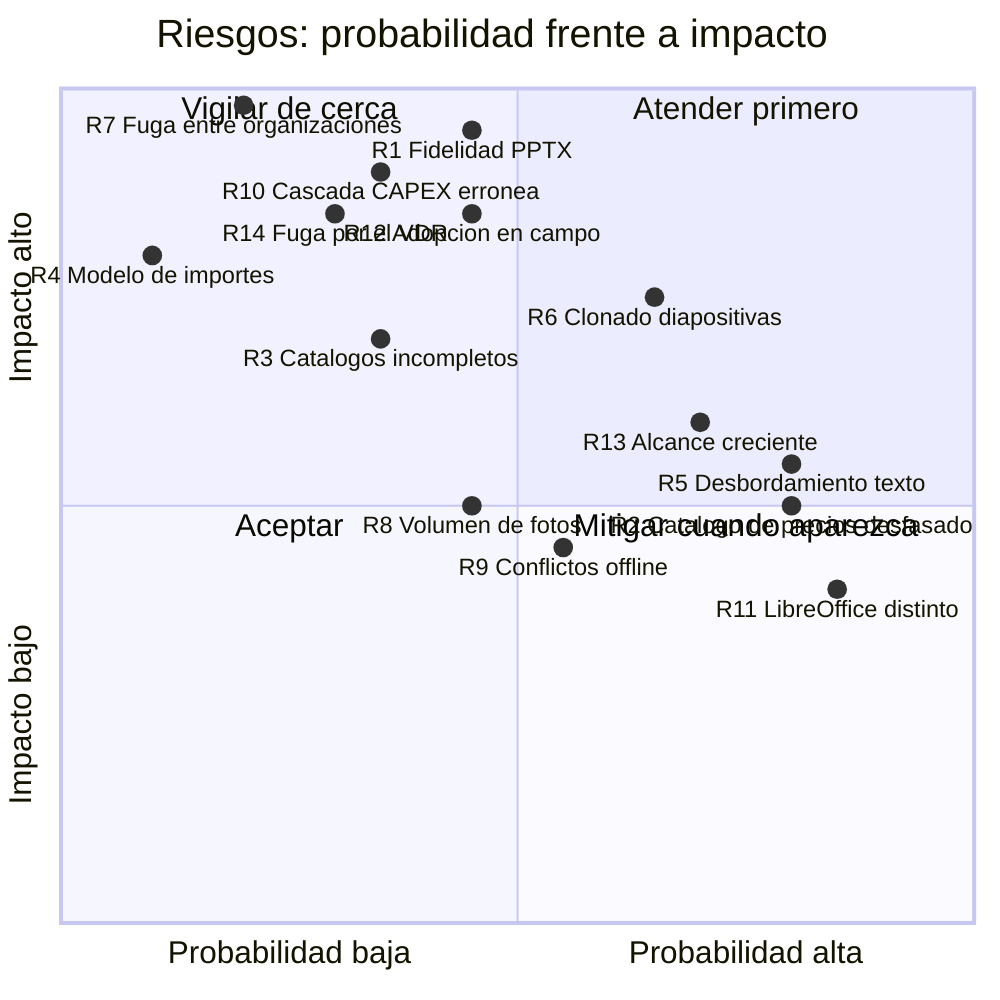

# 20. Alcance del MVP · 21. Plan por fases · 22. Riesgos y mitigaciones

---

## 20. Alcance del MVP

### 20.1. Criterio

`[REC]` El MVP se define por un objetivo verificable, no por una lista:

> **Un consultor debe poder llevar a cabo una due diligence técnica real de principio a fin —desde
> abrir el encargo y pedir la documentación hasta emitir el PPTX— sin salirse de la herramienta ni una
> sola vez.**

Si tiene que abrir Excel para el CAPEX o retocar el PPTX a mano, no hemos entregado nada.

### 20.2. Contenido

`[REQ]` §11, con el detalle de qué significa cada punto en el modelo revisado:

| # | Requisito | Qué incluye | Qué no |
|---|---|---|---|
| 1 | Autenticación y usuarios | Email + contraseña (Argon2id), TOTP opcional, recuperación, invitaciones, roles, suspensión | SSO/OIDC |
| 2 | Clientes, proyectos y activos | Ficha completa, contactos, máquina de estados con guardas, **selección de fases al alta**, activos con la unión de campos de §3.1.3 y §3.3.1, **campos y zonas dependientes de la tipología**, jerarquía de ubicaciones, mapa configurable, búsqueda y filtros, duplicado selectivo, archivado, historial, actividad, exportación XLSX/CSV | Permisos por activo para terceros |
| 3 | **Fases del proceso** `[REQ]` §3.1.5 | Las ocho fases con estado y responsable; checklist de solicitud de documentación con adjuntos y limitaciones; enlace al VDR; visitas por activo con estado y fecha; rondas de Q&A versionadas; **estado derivado** de Red Flag/CAPEX y Full Report; presentación y defensa con fecha y notas | Gestor estructurado de preguntas del Q&A; replicación del contenido del VDR |
| 4 | Asignación del equipo | Miembros con rol, activos, especialidades, matriz de cobertura, responsables de fase, alcance aplicado en el servidor | Delegación temporal |
| 5 | Repositorio de fotografías | Carga múltiple, captura desde cámara, original inmutable con cuatro barreras, EXIF y GPS, duplicados por hash exacto y perceptual, clasificación por zona y sistema, etiquetas, comentarios, selección y orden para informe, papelera, versiones, descarga individual y ZIP con eliminación de metadatos, **anotación básica** | Anotación avanzada, reconocimiento de contenido |
| 6 | Renombrado sin modificar originales | Plantilla configurable con 12 tokens, previsualización obligatoria con colisiones, lote, reversión, extensión inalterable, auditado | — |
| 7 | **Catálogos** | **6 tipologías**, 20 zonas con su matriz de **86 relaciones**, **121 códigos CAPEX en árbol de 3 niveles**, 4 grados de riesgo **con su definición íntegra**, 10 conceptos, 5 horizontes, 14 sistemas técnicos. Sembrados, versionados y ampliables por organización | Editor visual del árbol |
| 8 | Hallazgos e inventario | Línea con código, zona validada, descripción, comentarios, riesgo, concepto y recuperabilidad; atajo «hallazgo desde foto»; recomendaciones alternativas; matriz riesgo × horizonte; inventario de equipos opcional con importación XLSX | Plantillas de hallazgo por tipología |
| 9 | CAPEX con precio manual | **Un horizonte y un importe por línea**, con pivote a cinco columnas en la rejilla y el informe; desglose por medición opcional con cascada visible y editable peldaño a peldaño, trasladable con acción explícita; perfiles de coste; escenarios; índices; **las diez vistas agregadas**; **botón de exportar el CAPEX a XLSX** `[REQ]` P-31, con la hoja `CAPEX` en el mismo formato que la tabla del informe y hojas de trazabilidad y catálogos, y CSV | Consulta automatizada de fuentes externas |
| 10 | Precios editables a mano `[REQ]` P-06 | **Precio unitario, cantidad y unidad editables en la propia rejilla, sin fricción**; nota de procedencia opcional; `PriceSourceAdapter` completo con adaptador manual e importador de catálogo propio; validación humana con restricción en base de datos —**y ahí sí con nota obligatoria**—; trazabilidad automática por auditoría e historial de campo | Integración con Precio Centro ni ninguna otra fuente externa. **Ni prevista** |
| 11 | Carga de plantilla PPTX | Original inmutable con WORM, análisis completo, detección de marcadores y directivas, previsualización de estructura, avisos de no soportados, validaciones de seguridad del paquete | Editor de plantillas en la aplicación |
| 12 | Mapeo básico de marcadores | Catálogo cerrado ampliado (incluye `{{finding.risk_definition}}` y `{{report_limitations}}`), mapeo manual de lo desconocido, guardado y clonado, reglas de repetición, partición de tablas con subtotales, reglas de fotos, validación | Mapeo visual por arrastre |
| 13 | Generación de un informe | Generación real conservando tema, patrón, tipografías, colores, logos, posiciones y proporciones. Previsualización con LibreOffice. Avisos de campos vacíos, desbordamiento, imágenes ausentes y tablas | Fidelidad garantizada con plantillas arbitrarias `[LIM]` |
| 14 | Control de versiones básico | `ReportVersion` con snapshot **incluidos los catálogos usados**, hash del PPTX, linaje, estados, revisión y aprobación de un nivel, bloqueo del emitido, comparación entre versiones | Aprobación multinivel, firma electrónica |
| 15 | Auditoría de operaciones críticas | Las 13 categorías de eventos, escritura transaccional, tabla append-only particionada, cadena hash, consulta filtrada, exportación CSV, historial por campo | Panel de análisis de auditoría |
| **16** | **Sugerencias** `[REQ]` — alcance mínimo | Los cuatro tipos, alta con contexto capturado por referencia, bandeja del administrador, «Mis sugerencias», ciclo de estados con respuesta obligatoria al rechazar, visibilidad por **RLS**, auditoría | `payload` estructurado, botón «Aplicar» que rellena el editor, agrupación de duplicados, hilo de comentarios, avisos por correo |

### 20.3. Añadidos no pedidos explícitamente

`[REC]` Cinco elementos que se incluyen porque **omitirlos costaría más caro después**:

| Añadido | Coste ahora | Coste si se posterga |
|---|---|---|
| **Multi-organización con RLS desde el día uno** | ~1 semana | Reescribir el acceso a datos y migrar todos los proyectos. Es la decisión menos reversible |
| **Catálogos como datos, no como enumerados** | ~4 días | Una migración por cada corrección del árbol, que tiene tres categorías pendientes de desglose (P-03) |
| **Cola de subida persistente e idempotencia** | ~1 semana | Rehacer la capa de datos del cliente. Sin ella el trabajo con red intermitente no funciona |
| **i18n con catálogo de traducción** | ~3 días | Recorrer cientos de componentes buscando cadenas incrustadas |
| **`AsyncTask` con progreso visible** | ~3 días | El usuario mirando una pantalla congelada al cargar 200 fotos |

### 20.4. Fuera del MVP, y por qué

| Funcionalidad | Fase | Motivo |
|---|:--:|---|
| **Cualquier fuente de precios externa** | F12 `[PDV]` | **P-06 cerrada sin fuente externa**: los precios se editan a mano. La arquitectura de adaptadores queda lista por si algún día la hay, pero **no está planificada** |
| Modo offline completo | F11 | El componente más caro. El MVP incluye lo que da el 80 % del valor |
| Anotación avanzada de imágenes | F12 | La básica cubre el caso real: señalar dónde está el problema |
| Extracción inteligente de información de fotos | F13 | Requiere IA, consentimiento y validación de precisión. Riesgo alto, valor no demostrado |
| Generación narrativa mediante IA | F13 | Ídem. Un texto de informe técnico generado sin control es un riesgo de responsabilidad profesional `[REC]` |
| Integraciones corporativas | F14 | No hay ninguna identificada (P-23). La API REST es el punto de extensión |
| Analítica avanzada | F15 | Sin datos históricos no hay analítica. Con 3 proyectos, un panel de tendencias es decorativo |
| Q&A estructurado | F12 | Depende de P-12 |
| Aprobación multinivel y firma electrónica | F9 | Depende de P-22 |
| SSO/OIDC | F9 | Depende de P-17. Interfaz preparada |
| OpenSearch | F15 | PostgreSQL FTS es suficiente para el volumen supuesto |

### 20.5. Criterios de aceptación del MVP

Con datos ficticios y sobre una plantilla PPTX real del cliente:

- [ ] Un consultor completa los flujos E1-E9 de [`14-pruebas.md`](./14-pruebas.md) §19.10 sin bloqueos.
- [ ] Se genera un informe de ≥ 40 diapositivas con 3 activos, 40 hallazgos, 60 líneas y 35
      fotografías, y **un consultor lo considera entregable con retoques menores** (≥ 90 % de
      diapositivas sin retocar) `[SUP]`.
- [ ] El hash del original de cada plantilla y fotografía es idéntico al de subida tras 100
      renombrados y 20 generaciones.
- [ ] Las **86 combinaciones** zona × tipología se comportan según la matriz, y un cambio de tipología
      no destruye ningún dato.
- [ ] Cada línea cae en **un solo horizonte**, y la suma de las cinco columnas pivotadas coincide
      exactamente con el total del proyecto en las 10 vistas agregadas.
- [ ] Las fases derivadas reflejan el trabajo real y no son marcables a mano.
- [ ] La suite completa está verde, con las puertas de cobertura por módulo cumplidas.
- [ ] Permisos, RLS y aislamiento entre organizaciones pasan al 100 %.
- [ ] Ningún endpoint carece de política de autorización declarada.
- [ ] **Ninguna petición de red sale hacia una fuente de precios deshabilitada.**
- [ ] `axe-core` sin violaciones graves en las 19 pantallas.
- [ ] El flujo de campo funciona en un móvil real con red intermitente, sin duplicados.
- [ ] Un ensayo de restauración de copia se ha ejecutado y documentado.
- [ ] Alguien ajeno al equipo arranca el sistema siguiendo la documentación.

---

## 21. Plan de implementación por fases

### 21.1. Vista general

```mermaid
gantt
    title Plan de implementación · MVP en 19,5 semanas (supuesto S-06)
    dateFormat YYYY-MM-DD
    axisFormat S%W

    section Preparación
    F0 · Cimientos técnicos            :f0, 2026-09-01, 14d
    Corpus de plantillas reales (P-07) :crit, p07, 2026-09-01, 10d
    Semilla de catálogos (P-01..P-05 ✓) :pcat, 2026-09-01, 10d

    section Núcleo
    F1 · Catálogos y taxonomías        :f1, after f0, 10d
    F2 · Proyectos, clientes, activos  :f2, after f1, 17d
    F3 · Fases del proceso             :f3, after f2, 14d
    F4 · Equipo, roles y auditoría     :f4, after f3, 10d

    section Evidencia
    F5 · Repositorio de fotografías    :f5, after f4, 21d

    section Diagnóstico
    F6 · Hallazgos e inventario        :f6, after f5, 12d
    F7 · Motor de CAPEX y precios      :f7, after f6, 17d

    section Informe
    F8 · PPTX: análisis y mapeo        :crit, f8, after f7, 14d
    F9 · PPTX: generación y versiones  :crit, f9, after f8, 17d

    section Cierre
    F10bis · Sugerencias (mínimo)      :f10b, after f9, 8d
    F10 · Endurecimiento y entrega     :f10, after f10b, 14d

    section Riesgo
    Prueba de concepto PPTX            :crit, poc, 2026-09-08, 14d
```

`[SUP]` Estimaciones para el equipo de S-06. **No son un compromiso contractual**: cambian con el
equipo real, con las respuestas a las preguntas abiertas y con la complejidad de las plantillas.

> **F10bis · Sugerencias, y por qué no está al final del todo.** `[REC]` El módulo lo pide el cliente
> tras cerrar P-06, y se planifica **dentro del MVP en su alcance mínimo** (1,5 semanas), no en F11.
> Motivo: el canal vale mucho más cuando la herramienta es nueva. Las primeras semanas de uso real son
> cuando aparecen los códigos que faltan y los precios desfasados; si el módulo llega seis meses
> después, esa información ya se ha perdido. **El MVP pasa de 18 a 19,5 semanas.** Si el compromiso de
> 18 semanas fuese firme, el módulo entero se va a F11 y no ocurre nada grave: es la única parte del
> plan que se puede mover sin arrastrar a ninguna otra. Alcance y coste en
> [`19`](./19-sugerencias.md) §19.12.

> **Diferencia respecto de una planificación genérica:** hay una fase **F1 dedicada a catálogos**,
> antes que los proyectos. Motivo: zonas, códigos, riesgos y conceptos son la estructura sobre la que
> se apoya todo el bloque de CAPEX, y sembrarlos mal obliga a migrar datos reales después. Diez días
> al principio ahorran semanas al final. `[REC]`

### 21.2. Detalle

#### F0 · Cimientos técnicos — 2 semanas

Monorepo y herramientas; `docker-compose` completo (un `make up` levanta todo); migraciones base con
**políticas RLS y su prueba**; autenticación completa (Argon2id, JWT, refresco rotatorio, TOTP);
motor de autorización con matriz declarativa y prueba de cobertura del router; auditoría con tabla
particionada, escritura transaccional y cadena hash; esqueleto de frontend con cliente generado desde
OpenAPI e i18n; CI con todas las puertas; observabilidad.

**Hito:** un usuario entra y todo lo que hace queda auditado.

> **En paralelo y con máxima prioridad:** obtener las plantillas reales (P-07) y arrancar la **prueba
> de concepto de PPTX** (§21.3). Las incoherencias de catálogo (P-01 a P-05) ya están **resueltas**, de
> modo que F1 puede sembrar datos definitivos desde el primer día.

#### F1 · Catálogos y taxonomías — 2 semanas `[REC]`

Modelo de catálogos; semilla completa (6 tipologías, 20 zonas, 86 relaciones, 121 códigos, 4 riesgos
con definición, 10 conceptos, 5 horizontes, 14 sistemas, 8 fases, 5 categorías de documentación);
`CatalogService`; endpoints con filtrado dependiente; validación de zona por tipología y de código
seleccionable; retirada por `deprecated_at`; componentes de frontend (selector de árbol de 3 niveles,
selector de zona filtrado, selector de riesgo **con definición visible**).

**Hito:** las 86 combinaciones zona × tipología se comportan según la matriz, verificado en pruebas.

#### F2 · Proyectos, clientes y activos — 2,5 semanas

Cliente y contactos; proyecto con todos los campos; `ProjectStateMachine` con guardas; activos con la
unión de campos y **visualización condicionada por tipología**; **cambio de tipología con
previsualización de impacto**; `location_node` con `ltree`; adaptador `MapProvider`; búsqueda y
filtros; duplicado selectivo; archivado; historial y actividad; exportación XLSX/CSV.
Pantallas 3, 4, 5, 6.

**Hito:** un director crea un proyecto con cliente y tres activos de tipologías distintas y lo pasa a
preparación.

#### F3 · Fases del proceso — 2 semanas `[REC]`

`PhaseDefinition` y `ProjectPhase`; selección de fases en el alta; `PhaseEngine` con **estados
derivados**; checklist de solicitud de documentación con adjuntos, motivos y exportación a XLSX;
`report-limitations`; enlace del VDR con permisos restringidos y auditoría crítica; visitas por activo
con estado y fecha; rondas de Q&A con documentos versionados; eventos de presentación y defensa.
Panel de fases en la ficha de proyecto y columna de fases en el listado.

**Hito:** la ficha de proyecto muestra el estado real del trabajo, y las fases derivadas no se pueden
falsear.

#### F4 · Equipo, roles y auditoría visible — 1,5 semanas

Miembros con rol de proyecto; asignación a activos; especialidades; matriz de cobertura; responsables
de fase; alcance del técnico especialista aplicado en el servidor; invitaciones; **matriz de permisos
completa en pruebas**; notificaciones; comentarios con menciones; pantalla de auditoría.
Pantallas 2, 7, 19.

**Hito:** la matriz de permisos pasa al 100 % y ningún endpoint queda sin política.

#### F5 · Repositorio de fotografías — 3 semanas

| Semana | Foco |
|---|---|
| 1 | `ObjectStorage`, URLs firmadas, intención de subida, confirmación, idempotencia, cola en IndexedDB, WORM sobre `originals/` |
| 2 | Worker: antivirus, MIME real, hashes, EXIF, derivados, orientación, duplicados. Disparadores de inmutabilidad y sus pruebas |
| 3 | Rejilla virtualizada, visor, clasificación por zona y sistema, etiquetas, versiones, papelera, **renombrado en lote con previsualización**, anotación básica, ZIP con eliminación de metadatos, flujo móvil completo |

Pantallas 8, 9.

**Hito:** subir 200 fotos desde un móvil real con red intermitente, renombrarlas en lote y comprobar
que los 200 hashes originales son idénticos.

#### F6 · Hallazgos e inventario — 1,5 semanas

Línea de hallazgo con código, zona validada, riesgo, concepto y recuperabilidad; creación conjunta de
`Finding` + `CapexItem`; atajo «hallazgo desde foto» con capítulo propuesto; recomendaciones;
asociación de fotos; flujo de validación por revisor; matriz riesgo × horizonte; inventario de equipos
opcional con importación XLSX. Pantallas 10, 11, 12.

**Hito:** registrar 30 hallazgos con evidencia desde el móvil, con código y zona correctos.

#### F7 · Motor de CAPEX y precios — 2,5 semanas

| Semana | Foco |
|---|---|
| 1 | `CapexEngine` puro: total por horizontes, cascada configurable, redondeo, escenarios. **Pruebas doradas, de propiedad y de mutación.** Disparador SQL y prueba de equivalencia |
| 2 | Editor de CAPEX con las columnas por horizonte y el panel «Cómo se calcula»; las diez vistas agregadas; exportación XLSX con hojas de trazabilidad y catálogos, y CSV |
| 2,5 | `PriceSourceAdapter`, adaptador manual, importador de catálogo, `price_source` con revisión de condiciones y control de licencia, comparador con `skipped_sources`, validación humana, índices |

Pantallas 13, 14.

**Hito:** un CAPEX de 60 líneas con trazabilidad completa y exportación auditable.

#### F8 · PPTX: análisis y mapeo — 2 semanas · **crítica**

`TemplateAnalyzer`; validaciones de seguridad del paquete; extracción de marcadores con normalización
de párrafos; directivas de notas; detección de no soportados; catálogo cerrado ampliado;
previsualización de estructura; pantalla de mapeo; guardado y clonado; validación; corpus T1-T20.
Pantallas 15, 16.

**Hito:** las 20 plantillas del corpus se analizan correctamente, incluidas las maliciosas y las
corruptas.

#### F9 · PPTX: generación y versiones — 2,5 semanas · **crítica**

| Semana | Foco |
|---|---|
| 1 | `ReportRenderer`: sustitución, creación desde diseño, repetición con filtros, inserción de imágenes con proporción |
| 2 | Partición de tablas con subtotales por capítulo y las nueve columnas; sustitución de datos de gráficos; estimación de desbordamiento; previsualización con LibreOffice |
| 2,5 | Snapshot **con catálogos**; hashes; `ReportVersion`; revisión, aprobación y emisión; bloqueo; comparación entre versiones; panel de avisos |

Pantallas 17, 18.

**Hito:** informe generado desde la plantilla real del cliente, revisado, aprobado, emitido y
bloqueado, con el original de la plantilla intacto.

#### F10 · Endurecimiento y entrega — 2 semanas

Suite de seguridad completa; carga con el conjunto voluminoso; accesibilidad en las 19 pantallas;
rendimiento y consultas lentas; endurecimiento de contenedores; ensayo de restauración documentado;
purga programada; documentación de despliegue y operación; manual de uso; formación; despliegue en
`staging`; **validación con un consultor real sobre un caso real**.

**Hito:** los catorce criterios de aceptación (§20.5) marcados.

### 21.3. La prueba de concepto de PPTX

`[REC]` **La recomendación de calendario más importante del plan.** El riesgo del bloque 4 no debe
descubrirse en la semana 16.

**Semanas 2-3, en paralelo a F0/F1**, un desarrollador dedica dos semanas a un prototipo desechable
—marcado como tal—. Con las plantillas ya analizadas (doc 18), **el objetivo cambia**: ya no es
«¿es esto viable?» sino **«¿el clonado de la diapositiva de sistema produce un resultado
indistinguible del original, con las fuentes Gotham instaladas?»**. Preguntas concretas:

| Pregunta | Cómo se responde | Si la respuesta es mala |
|---|---|---|
| ¿El **clonado** de la diapositiva 13-14 (Cimentación) produce diapositivas indistinguibles del original? | Clonar para 3 sistemas y comparar en PowerPoint, con Gotham instalada | Se rediseña la plantilla con marcadores de posición, o se activa el plan B |
| **¿La tabla nativa reproduce el formato del Excel?** (P-31, ya decidida) | Generar una tabla de 62 filas y **ponerla al lado de la imagen EMF original**, columna a columna: cabecera de dos niveles, anchos, formato de importe, celdas en blanco | Se replantea como imagen generada por el servidor |
| ¿El **XLSX exportado** cuadra con la tabla del informe? | Exportar el mismo proyecto en los dos formatos y comparar celda a celda | Se corrige `CapexTableLayout`, que es la pieza compartida |
| ¿La estimación de desbordamiento es útil (±15 %)? | Comparar con el render de LibreOffice en 20 casos | Se baja la ambición: aviso por umbral de caracteres |
| ¿Cuánta desviación hay entre LibreOffice y PowerPoint? | Renderizar en ambos y comparar | Se ajusta la expectativa y se documenta |
| ¿Los **4.405 caracteres** de capacidad **medida con Gotham Light real** por diapositiva de sistema bastan para dos subsistemas? | Rellenar con textos reales de un informe emitido | Se parte la diapositiva o se acorta el texto |
| ¿La tabla en **Gotham** (P-38) sigue siendo legible a cuerpo pequeño, y cabe en las 9,06 in? | Generar la tabla con descripciones reales y compararla con la imagen original | Se sube medio punto el cuerpo, o se reajustan los anchos otra vez |
| ¿La resolución de catálogos **en inglés** produce un informe coherente? | Generar la misma sección con `A_ES` y `A_EN` | Se revisa el modelo de traducción (C-5) |

**Coste: 2 semanas de una persona. Beneficio: conocer el riesgo mayor en la semana 3 en lugar de la
16**, cuando aún hay margen para cambiar de motor sin romper el calendario.

### 21.4. Fases posteriores

| Fase | Contenido | Duración `[SUP]` | Depende de |
|:--:|---|---|---|
| **F11** | SSO/OIDC · MFA obligatorio · aprobación multinivel · panel de auditoría | 4 semanas | P-17, P-22 |
| **F11bis** | **Sugerencias, alcance completo**: `payload` estructurado, botón «Aplicar», duplicados, hilo, avisos | 1,5 semanas | Uso real del alcance mínimo |
| **F12** | **Adaptador de fuente de precios externa** (API o importación) · sincronización de índices | 3-6 semanas | `[PDV]` **Aparcada.** P-06 se cerró sin fuente externa. Si algún día la hay, y con validación legal |
| **F13** | Modo offline completo · fusión asistida de conflictos | 6-8 semanas | P-11. La fase más cara |
| **F14** | Q&A estructurado · anotación avanzada · comparación antes/después | 4 semanas | P-12 |
| **F15** | Funciones de IA con consentimiento explícito y revisión humana | 6 semanas | Política del cliente y §18.10 |
| **F16** | Integraciones corporativas · webhooks · API pública | variable | P-23 |
| **F17** | Analítica de cartera · comparativas entre activos | 4 semanas | Datos históricos suficientes |

`[REC]` **F11bis pronto, F12 sin fecha.** Tras cerrar P-06 sin fuente externa, la fase del adaptador
deja de ser prioridad y pasa a ser una posibilidad. Lo que sí conviene adelantar es el alcance completo
de Sugerencias: con precios que se mantienen a mano, **el buzón es el mecanismo real de actualización
del catálogo**, y el botón «Aplicar» es lo que hace que el administrador no abandone la tarea.

---

## 22. Riesgos y mitigaciones

### 22.1. Matriz



### 22.2. Fichas

#### R1 · La generación de PPTX no conserva el formato con suficiente calidad
**Probabilidad media · Impacto crítico.** `[REEVALUADO con las plantillas reales]` Baja de *alta* a
*media*: el análisis del doc 18 §18.7 confirma que **no hay gráficos, SmartArt, OLE ni medios** —los
tres elementos que hacían frágil el clonado— y que las cuatro plantillas son **una sola estructura**.
Sube por la ausencia total de marcadores de posición y por las fuentes corporativas Gotham. Sigue
siendo crítico en impacto: si el informe sale descuadrado, el producto no se usa.

| Mitigación | Cuándo |
|---|---|
| ✅ **Plantillas reales obtenidas y analizadas** (doc 18) | Hecho |
| ✅ **Las seis fuentes Gotham recibidas y verificadas**, con métricas reales medidas para texto y titulares | Hecho |
| ✅ **P-31 decidida**: tabla nativa respetando el formato del Excel, con la estructura recuperada del propio EMF | Hecho |
| ✅ **P-37 y P-38 decididas**: cinco columnas de plazo y tipografía unificada en Gotham, con el +4,9 % de anchura ya medido y absorbido | Hecho |
| Instalar las fuentes en el worker desde el artefacto privado, con verificación de arranque | Antes de la prueba de concepto |
| Prueba de concepto dedicada de 2 semanas (§21.3) | Semanas 2-3 |
| Contrato de plantilla + plantilla de referencia + validador | F8 |
| Repetición **por diseño** en lugar de clonado de XML | F9 |
| Corpus de 20 plantillas sintéticas **+ las 4 reales (T21-T24)** con regresión visual | F8-F9 |
| Métrica de aceptación explícita (≥ 90 % sin retocar) | F10 |
| `ReportRenderer` como interfaz, para cambiar de motor sin tocar el resto | F0 |
| Planes B identificados y valorados (§17.9) | Desde el inicio |

**Alarma:** si en la prueba de concepto menos del 70 % de las diapositivas son aceptables, se convoca
la decisión de cambio de motor **en la semana 4**, no en la 18.

#### R2 · El catálogo de precios se desfasa `[REEVALUADO tras P-06]`
**Probabilidad alta · Impacto medio.** El riesgo original —«Precio Centro no puede integrarse»— **ya no
existe**: P-06 se cerró decidiendo que no habrá fuente externa, así que no hay integración que pueda
fallar. Lo que queda en su lugar es la consecuencia asumida de esa decisión: **nada actualiza los
precios solos**, y un catálogo interno envejece sin avisar.

Baja de impacto alto a medio porque no compromete el producto, pero sube de probabilidad a alta porque
es lo que **va a pasar** salvo que algo lo contrarreste.

| Mitigación |
|---|
| **Módulo de Sugerencias, tipo `PRECIO`** ([`19`](./19-sugerencias.md) §19.3): la vía por la que una corrección detectada en un proyecto llega al catálogo del resto. **Es la mitigación principal**, y por eso el módulo entra en el MVP |
| Catálogo interno importable desde XLSX/CSV y reutilizable entre proyectos: se actualiza en bloque, no línea a línea |
| Fecha de la referencia visible en la línea de CAPEX, para que la antigüedad se vea sin buscarla |
| `[REC]` Aviso al usar una referencia con más de N meses, configurable. Barato y evita el error silencioso |
| Índices de actualización de costes, ya en el MVP: permiten envejecer un catálogo entero con un factor |
| Ninguna fuente externa puede activarse sin revisión documentada, si algún día se añade |
| Prueba que verifica que **no sale ninguna petición de red** hacia una fuente deshabilitada |

**Riesgo residual aceptado:** el valor del CAPEX depende del criterio del consultor y de la disciplina
del equipo al mantener el catálogo. Es una consecuencia directa de P-06, comunicada y asumida.

#### R3 · Los catálogos están incompletos o mal reconciliados `[REC]`
**Probabilidad media-baja · Impacto alto.** Riesgo muy reducido tras las decisiones del cliente: las
tipologías están fijadas (las 6 de §3.3.1), las zonas deduplicadas y los horizontes cerrados. Queda
pendiente el desglose de tres categorías del árbol de códigos.

| Mitigación |
|---|
| Las cinco cuestiones de catálogo (P-01 a P-05) están **resueltas antes de escribir código**, no descubiertas a mitad del desarrollo |
| **Catálogos como datos**: ampliar o corregir no requiere migración de código |
| Las categorías sin desglose se siembran con un capítulo «General» utilizable desde el día uno |
| `deprecated_at` en lugar de borrado: retirar un código no rompe informes antiguos |
| El snapshot del informe incluye los catálogos usados: un cambio posterior no altera lo emitido |
| Fase F1 dedicada, **antes** de que existan datos reales que migrar |
| Cambio de tipología con previsualización de impacto y sin destruir datos |

#### R4 · El modelo de importes no coincide con el trabajo real
**Probabilidad muy baja · Impacto alto.** `[RESUELTO]` P-05 y P-05b están cerradas: **una línea, un
horizonte, un importe que lo incluye todo**. No queda ninguna cuestión estructural abierta.

| Mitigación |
|---|
| P-05 respondida antes de escribir código: el modelo es `time_horizon_id` + `amount`, no cinco columnas |
| La rejilla **pivota** a cinco columnas, de modo que la vista sigue siendo la de la hoja de cálculo actual sin que el dato se pueda repartir por error |
| El desglose por medición es **opcional** y se traslada con acción explícita, nunca automáticamente |
| El total con impuestos es columna generada, nunca tecleado |
| **P-05b confirmada**: el importe incluye indirectos, honorarios y contingencia. La cascada nunca se aplica sobre lo tecleado, y solo el impuesto del perfil afecta a todas las líneas |

#### R5 · La detección de desbordamiento no es fiable
**Probabilidad alta · Impacto medio** (`[LIM]` L2).

| Mitigación |
|---|
| Doble vía: estimación con `fontTools` + previsualización real con LibreOffice |
| El aviso **declara** que es una estimación, con su margen |
| Posibilidad de subir los archivos de fuente corporativa |
| Margen ampliado al 15 % cuando la fuente no está disponible |
| Detección de autoajuste para bajar la severidad |
| Aviso `OVERFLOW_RISK_A_PRIORI` al analizar la plantilla, **antes** de generar |
| Recomendación de contrato: marcos con holgura del 20 % en zonas de texto libre |

**Residual aceptado:** el consultor debe revisar la previsualización. La herramienta reduce el trabajo
de revisión, no lo elimina.

#### R6 · El clonado de diapositivas complejas falla
**Probabilidad media-alta · Impacto alto** (`[LIM]` L1). Estrategia principal por diseño; clonado solo
como vía secundaria con lista explícita de no soportados; detección durante el análisis; corpus T4 y
T7; Apache POI identificado como alternativa acotada.

#### R7 · Fuga de datos entre organizaciones
**Probabilidad baja · Impacto catastrófico.**

| Mitigación |
|---|
| RLS en PostgreSQL: el aislamiento no depende del código de aplicación |
| Usuario de aplicación **sin** `BYPASSRLS` |
| Claves de objeto por organización |
| `404` en lugar de `403` para no confirmar existencia |
| Prueba paramétrica sobre **todas** las tablas: una tabla nueva sin política rompe la build |
| URLs firmadas de 5 minutos, un recurso, tras autorizar |
| Auditoría de todo acceso y toda denegación |
| Prueba de penetración externa antes del primer cliente real |

#### R8 · El volumen de fotografías degrada la experiencia
**Probabilidad media · Impacto medio.** Subida directa; derivados en tres tamaños; miniaturas WebP por
CDN; rejilla virtualizada; sin `COUNT(*)` por página; ZIP en cola; pruebas con 10.000 fotos; ciclo de
vida para el coste.

#### R9 · Conflictos de sincronización tras el trabajo en campo
**Probabilidad media · Impacto medio** (`[LIM]` última escritura gana por campo). Claves de
idempotencia y UUID de cliente: **sin duplicados**, que es el fallo más doloroso. Resolución por campo,
valor descartado registrado, aviso al usuario. Reparto natural del trabajo por activo y especialidad.
Fusión asistida en F13.

#### R10 · Un error en la cascada llega a un informe firmado
**Probabilidad media-baja · Impacto muy alto.** Riesgo de responsabilidad profesional del cliente.

| Mitigación |
|---|
| `CapexEngine` puro y determinista |
| Cobertura ≥ 95 % con casos dorados verificados a mano por un tercero |
| Propiedades con `hypothesis`: la suma siempre cuadra, en horizontes y en cascada |
| Pruebas de mutación con umbral |
| Doble implementación (Python y SQL) con equivalencia al céntimo |
| `Decimal` en toda la ruta, verificado por una prueba que inspecciona tipos |
| **El total por horizontes es una columna generada**: imposible que no cuadre con sus sumandos |
| **La cascada se muestra con sus operandos**: el consultor es la última barrera |
| `calc_version` para reproducir informes antiguos |
| ✅ Cascada cerrada por P-16 y anclada con una prueba de valor exacto (72.679,35 €) |

#### R11 · LibreOffice no coincide con PowerPoint
**Probabilidad alta · Impacto bajo-medio** (`[LIM]` L3). Va a ocurrir; la cuestión es la expectativa.
Se declara en la propia pantalla; se recomienda validación manual por plantilla nueva; descarga del
borrador siempre disponible; fuentes corporativas instalables en el contenedor; vía comercial
identificada si se exige fidelidad exacta.

#### R12 · La herramienta no se adopta en campo
**Probabilidad media · Impacto alto.** Un producto perfecto que nadie usa vale cero.

| Mitigación |
|---|
| El flujo de campo (§5.4) es la primera prioridad de diseño, no un añadido responsive |
| Objetivo medible: hallazgo con foto en ≤ 4 toques |
| **El importe no se pide en campo**: en la visita se captura el diagnóstico; el dinero se pone en gabinete |
| Contexto persistente, autoguardado, miniaturas optimistas, dictado por voz |
| Objetivos táctiles grandes y contraste alto: se usa con guantes y a contraluz |
| Validación con un consultor real sobre una visita real en F10, **antes** de dar el MVP por terminado |

`[REC]` La mitigación más eficaz no es técnica: es acompañar a un consultor en una visita real durante
F5 y observar qué le estorba. Dos horas de observación valen más que dos semanas de suposiciones.

#### R13 · Crecimiento incontrolado del alcance
**Probabilidad alta · Impacto medio.** MVP definido por objetivo verificable; catorce criterios de
aceptación; lo excluido documentado **con su motivo**; etiquetas que distinguen lo pedido de lo
propuesto; fases posteriores planificadas (pedir algo no lo pierde, lo coloca); revisión de alcance al
final de cada fase con el *product owner* (P-29).

#### R14 · Fuga a través del enlace del VDR `[REC]`
**Probabilidad baja-media · Impacto alto.** Riesgo específico de la especificación revisada: el VDR
contiene *toda* la documentación de la operación.

| Mitigación |
|---|
| **No se almacenan credenciales del VDR**, solo el enlace y una nota de a quién pedir acceso |
| Modificar el enlace requiere rol director; registrarlo por primera vez, consultor |
| Todo cambio del enlace se audita como evento **crítico** y genera alerta |
| El backend **nunca resuelve** el enlace: no hay vector SSRF ni caché del contenido |
| El enlace no es visible para lectores salvo habilitación expresa |
| Fecha de caducidad registrada, con aviso al vencer |

### 22.3. Riesgos residuales aceptados

Con nombre y apellidos, para que nadie se sorprenda después:

| # | Riesgo residual | Por qué se acepta |
|---|---|---|
| 1 | La previsualización no es idéntica a PowerPoint | La alternativa es un motor comercial. Coste no justificado en el MVP |
| 2 | El aviso de desbordamiento es una estimación ±15 % | Límite técnico real. Mitigado con previsualización |
| 3 | El SmartArt no se rellena | Se detecta y se avisa. El contrato de plantilla lo evita |
| 4 | La resolución de conflictos es última escritura gana | El reparto del trabajo hace la colisión infrecuente. Se avisa y se registra |
| 5 | **Ninguna fuente externa de precios está integrada**, incluida Precio Centro | Depende de decisiones del cliente. Arquitectura lista |
| 6 | Tres categorías del árbol de códigos sin desglose | Se siembran con «General» utilizable. Ampliables sin migración |
| 7 | El modelo de cinco columnas de importe es una interpretación | Se ha elegido la opción más general, reversible |
| 8 | Sin RAW ni TIFF | Sin necesidad demostrada. Coste alto |
| 9 | La cadena hash de auditoría no impide la manipulación con acceso a la base de datos | La hace detectable, que es lo alcanzable sin sellado externo |
| 10 | IndexedDB puede ser desalojada por el navegador | Límite de la plataforma web. Se solicita persistencia y se avisa |
| 11 | Sin firma electrónica cualificada | Requiere proveedor externo y cambia el flujo de emisión |
| 12 | Una sola región de despliegue | 99,9 % exigiría redundancia activa y más coste |
