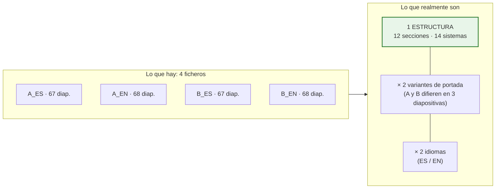

# Análisis de las plantillas PPTX reales (resuelve P-07)

> **Qué es este documento.** El cliente ha facilitado las cuatro plantillas reales de Full Report. Este
> documento recoge el análisis estructural que se ha hecho sobre ellas, y **corrige las decisiones de
> diseño del bloque 4 que no resistían el contacto con la realidad**. Sustituye a los supuestos que
> [`12-pptx.md`](./12-pptx.md) daba por buenos antes de tener las plantillas.

**Ficheros analizados:**

| Alias | Fichero |
|---|---|
| `A_ES` | `YYY.MM.DD__Modelo_A_Full_Report__CASTELLANO_V.2.pptx` |
| `A_EN` | `YYY.MM.DD__Modelo_A_Full_Report__ENGLISH_V.2.pptx` |
| `B_ES` | `YYY.MM.DD__Modelo_B_Full_Report__CASTELLANO_V.2.pptx` |
| `B_EN` | `YYY.MM.DD__Modelo_B_Full_Report__ENGLISH_V.2.pptx` |

---

## 18.0. Alcance y honestidad del análisis

| Qué se ha hecho | Cómo |
|---|---|
| ✅ Análisis estructural completo de los cuatro ficheros | Lectura del paquete OOXML con `python-pptx` 1.0.2 y del ZIP en crudo |
| ✅ Inventario de diapositivas, diseños, formas, imágenes, tablas, gráficos, notas y fuentes | Recuento programático, no muestreo |
| ✅ Medición de geometría de marcos de texto e imagen | Coordenadas EMU reales |
| ✅ Comparación A/B y ES/EN diapositiva a diapositiva | Diferencia de firma estructural |
| ❌ **Verificación visual del render** | **No se ha podido hacer**: LibreOffice no arranca en este entorno (falla también con un PPTX trivial). No he visto las plantillas renderizadas |
| ❌ Prueba de generación real | Pendiente de la prueba de concepto de F0 |

`[LIM]` Todo lo que sigue procede de la **estructura del fichero**, que es verificable y exacta. **No
he hecho ninguna afirmación sobre cómo se ven.**

> ✅ **Superado.** La prueba de concepto ([`20`](./20-poc-pptx.md)) sí ha renderizado las plantillas:
> faltaba el módulo Impress de LibreOffice, no era un problema de fondo. **Ver el render corrigió
> cuatro afirmaciones de este documento** —las columnas de la tabla, la presencia del riesgo, la
> tipografía del cuerpo y una marca de agua— y destapó un conflicto con P-05. Léase el doc 20 después
> de este.

---

## 18.1. Las cuatro plantillas son una sola estructura

El hallazgo que más simplifica el problema:



**A y B difieren en 3 diapositivas de 67**: la portada, el índice y una que usa otro diseño para el
mismo contenido. El cuerpo del informe —secciones, sistemas, CAPEX, disclaimer— es **idéntico**.

`[REC]` **Consecuencia práctica:** no hay que mantener cuatro mapeos, sino **uno**, con variantes. El
`template_mapping` ya se diseñó como clonable; aquí eso deja de ser una comodidad y pasa a ser la
pieza que hace el bloque 4 sostenible.

---

## 18.2. Ficha técnica

| Métrica | A_ES | A_EN | B_ES | B_EN |
|---|:--:|:--:|:--:|:--:|
| Diapositivas | 67 | 68 | 67 | 68 |
| **Tamaño** | **10 × 7,5 in · 4:3** | ídem | ídem | ídem |
| Diseños en el patrón | 14 | 15 | 14 | 14 |
| **Diapositivas que usan marcadores de posición del diseño** | **0** | **0** | **0** | **0** |
| Tablas de PowerPoint | **0** | 0 | 0 | 0 |
| Gráficos nativos | **0** | 0 | 0 | 0 |
| SmartArt · OLE · vídeo · audio | **0** | 0 | 0 | 0 |
| Imágenes | 41 | 42 | 41 | 41 |
| — de ellas **EMF** (pegado desde Excel) | **13** | 14 | 13 | 13 |
| Autoformas con texto | 154 | 154 | 155 | 154 |
| Cuadros de texto | 216 | 219 | 214 | 216 |
| — con **autoajuste de forma al texto** | **146 (68 %)** | 149 | 145 | 147 |
| — con autoajuste de fuente (`normAutofit`) | **0** | 0 | 0 | 0 |
| **Notas del orador con texto** | **0** | 0 | 0 | 0 |
| Huecos `XXXX` por rellenar | **35** | 39 | 35 | 39 |
| Marcos de foto 4:3 | **56** (14 × 4) | 56 | 56 | 56 |

**Fuentes usadas en las diapositivas:** `Gotham Light`, `Gotham Ultra`, `Californian FB`,
`Century Gothic`, `Lucida Sans`, `Arial`, `Calibri`, `Wingdings`.

**Paleta del tema:** la de Office por defecto (`1F497D`, `4F81BD`, `C0504D`…). **El tema no está
personalizado**: el color corporativo se aplica forma a forma.

---

## 18.3. Estructura del informe

12 portadillas de sección numeradas, idénticas en A y B:

| # | Diap. | Sección | Contenido |
|:--:|:--:|---|---|
| — | 1 | Portada | Título, cliente, fecha |
| — | 2 | Índice | Lista de las 9 secciones |
| 01 | 3-5 | **Resumen ejecutivo** | Dos bloques de texto libre: *Arquitectura* e *Instalaciones* |
| 02 | 6-9 | **Localización y descripción** | Emplazamiento (plano + ficha catastral), descripción, plantas (6 imágenes) |
| 03 | 10-11 | **Análisis de licencias** | Texto libre |
| 04a | 12-30 | **Análisis técnico · Arquitectura** | **9 sistemas × 2 diapositivas** |
| 04b | 31-41 | **Análisis técnico · Instalaciones** | **5 sistemas × 2 diapositivas** |
| 04c | 42-49 | **Análisis técnico · Mediciones** | Criterio AEO — **contenido fijo, no se rellena** |
| 05 | 50-51 | **Urbanismo** | |
| 06 | 52-53 | **Medioambiental** | |
| 07 | 54-60 | **CAPEX** | **6 diapositivas, todas de imágenes EMF** |
| 08 | 61-62 | **Documentación consultada** | |
| 09 | 63-66 | **Disclaimer** | Nota legal — contenido fijo |
| — | 67 | Contraportada | |

### El patrón de sistema: dos diapositivas por sistema

Es el corazón repetitivo del informe y encaja **exactamente** con el diseño de repetición previsto:

```
Diapositiva impar (texto)          Diapositiva par (fotos)
┌────────────────────────────┐     ┌────────────────────────────┐
│ CIMENTACIÓN                │     │  ┌────────┐   ┌────────┐   │
│ XXXXXXXXXXXXXXXXXXXX       │     │  │ 3,15 × │   │ 3,15 × │   │
│ Valoración                 │     │  │ 2,36in │   │ 2,36in │   │
│ XXXXXXXXXXXXXXXXXXXX       │     │  └────────┘   └────────┘   │
│                            │     │  Descripción  Descripción  │
│ ESTRUCTURA                 │     │  ┌────────┐   ┌────────┐   │
│ XXXXXXXXXXXXXXXXXXXX       │     │  │        │   │        │   │
│ Valoración                 │     │  └────────┘   └────────┘   │
│ XXXXXXXXXXXXXXXXXXXX       │     │  Descripción  Descripción  │
└────────────────────────────┘     └────────────────────────────┘
 1 cuadro de texto, 10 pt            4 marcos 4:3 + 4 pies de foto
 ~4.200 caracteres de capacidad      8 autoformas
```

**Los 14 sistemas del informe:**

| Arquitectura (9) | Instalaciones (5) |
|---|---|
| Cimentación *(+ Estructura en la misma diapositiva)* | Aire acondicionado y ventilación |
| Cubierta | Electricidad e iluminación |
| Fachadas | Telecomunicaciones |
| Particiones interiores | Protección contra incendios |
| Suelos y techos | Ascensores |
| Carpintería y cerrajería | |
| Zonas exteriores | |
| Protección pasiva contra incendios | |
| Accesibilidad | |

### Correspondencia con el árbol de códigos CAPEX

Muy buena, y revela un desajuste concreto:

| Sección del informe | Capítulo del árbol (§5.3) |
|---|---|
| Cimentación + Estructura | `H01` Estructura |
| Cubierta | `H02` Cubierta |
| Fachadas | `H03` Fachadas |
| Particiones interiores · Suelos y techos · Carpintería y cerrajería | `H04` Interiores — **el informe lo desglosa en 3 secciones** |
| Zonas exteriores | `H05` Zonas exteriores |
| Protección pasiva contra incendios | `H06` |
| Accesibilidad | `H07` |
| Aire acondicionado y ventilación | `H08` HVAC |
| Electricidad e iluminación | `H09` Electricidad |
| Protección contra incendios | `H10` PCI activa |
| Ascensores | `H12` Transporte vertical |
| Telecomunicaciones | `H14` Telecomunicaciones |
| **— no existe sección —** | **`H11` Fontanería y saneamiento** |
| **— no existe sección —** | **`H13` Seguridad, CCTV y BMS** |
| **— no existe sección —** | **`H15` Otros** |

`[PDV]` **P-30 (nueva).** El árbol tiene 15 capítulos y el informe 14 secciones, que no se
corresponden una a una. Tres capítulos **no tienen sección en la plantilla**: fontanería, seguridad y
otros. Hay que decidir: (a) añadir tres secciones a la plantilla; (b) agrupar esos hallazgos bajo una
sección existente; o (c) generar sus diapositivas solo si hay hallazgos. **Recomendación:** (c), con
`@if_empty: skip_slide`, que es lo que ya soporta el diseño y no obliga a tocar la plantilla.

---

## 18.4. Lo que el análisis corrige del diseño

Cinco decisiones que hay que rectificar. Ninguna invalida la arquitectura; todas afectan al bloque 4.

### C-1 · Se invierten la estrategia principal y la secundaria

`12-pptx.md` §17.2 daba como **estrategia principal** «las diapositivas repetibles se definen como
diseños del patrón, y cada repetición se crea desde su diseño», porque así se heredan tema, fuentes y
posiciones. Y dejaba el clonado de XML como vía secundaria y frágil.

**Con estas plantillas eso no es aplicable:**

| Evidencia | Consecuencia |
|---|---|
| **0 de 67 diapositivas usan marcadores de posición** | No hay nada que rellenar al crear desde diseño: saldría una diapositiva vacía |
| Los 14 diseños **no declaran marcadores de contenido** (solo fecha, pie y número en dos de ellos) | El formato vive en las formas de cada diapositiva, no en el diseño |
| El tema **no está personalizado** | Heredar del tema no aporta el aspecto corporativo |

**Corrección:** la **estrategia principal pasa a ser el clonado de la diapositiva modelo**. Y la buena
noticia es que en este corpus el clonado es **mucho más seguro de lo que se temía**: los riesgos que
lo hacían frágil —gráficos, SmartArt, OLE, vídeo, audio— **no existen en ninguna de las cuatro
plantillas**. Solo hay formas, imágenes y líneas, que es justo lo que el clonado maneja bien.

La alternativa —rediseñar la plantilla para que use marcadores de posición— sigue disponible, pero
ahora es una recomendación a medio plazo, no un requisito de arranque.

### C-2 · El desbordamiento no encoge la fuente: empuja fuera de la diapositiva

`12-pptx.md` L8 preveía que PowerPoint reduciría la fuente (`normAutofit`) y que eso bajaría la
severidad del aviso.

**Evidencia:** **0 cuadros con `normAutofit`**; **146 de 216 (68 %) con «ajustar forma al texto»**.

**Corrección:** el modo real es el contrario y es **más peligroso**: el texto no se encoge ni se
recorta, **la forma crece y el contenido se sale de la diapositiva** sin que nada lo advierta.

El criterio de detección cambia, y para bien: en lugar de estimar si un texto «cabe» dentro de un
marco fijo —que es lo difícil—, hay que comprobar si **el marco crecido rebasa el alto de la
diapositiva o pisa la forma siguiente**:

```
alto_estimado = f(caracteres, ancho útil, tamaño de fuente)
¿ top + alto_estimado > 7,5 in ?          → aviso ALTO: se saldrá de la diapositiva
¿ top + alto_estimado > top_forma_debajo? → aviso ALTO: pisará la forma de debajo
```

`[REC]` Esta comprobación es **más fiable** que la anterior, porque el margen de error de la
estimación de altura se compara contra una distancia grande (pulgadas), no contra el ajuste fino de
una caja.

**Capacidad medida** de las diapositivas de sistema, a 10 pt sobre 8,8 in de ancho y ~6 in de alto
disponible: **≈ 4.200 caracteres**. Ese es el presupuesto de texto para descripción y valoración de
los subsistemas de esa diapositiva, y es el número que la interfaz debe mostrar al consultor mientras
escribe.

### C-3 · La tabla de CAPEX hoy es una imagen pegada desde Excel

**Evidencia:** las 6 diapositivas de la sección CAPEX (54-60) contienen **exclusivamente imágenes
EMF**. Cero tablas de PowerPoint en las cuatro plantillas.

```
Diapositiva 55: 2 imágenes EMF (1484×88 y 1484×1013 px)
Diapositiva 57: 3 imágenes EMF
Diapositiva 59: 1 imagen EMF (1495×527)
Diapositiva 60: 1 imagen EMF (1154×459)
```

Es el patrón inequívoco de **copiar un rango de Excel y pegarlo como metarchivo**.

**Corrección y decisión que hay que tomar** `[PDV]` **P-31 (nueva):**

| Opción | Resultado | Valoración |
|---|---|---|
| **A · Tabla nativa de PowerPoint** generada por la aplicación | Texto real, editable, seleccionable, se parte en varias diapositivas, accesible | ✅ **Recomendada.** Es lo que el diseño ya contempla. **Cambia el aspecto** respecto a la imagen actual, así que hay que aprobarlo |
| B · Imagen generada por la aplicación | Reproduce el aspecto actual | ❌ No editable, se pixela al ampliar, sin accesibilidad. Además `python-pptx` **no genera EMF** `[LIM]`, sería PNG |
| C · Hueco reservado y pegado manual | Statu quo | ❌ Deja fuera del alcance justo lo que más tiempo consume |

`[REC]` **Opción A**, diciéndolo claramente: la tabla de CAPEX **dejará de ser una captura de Excel y
pasará a ser una tabla de verdad**. Es una mejora objetiva, pero es un cambio visible y el cliente
debe aprobarlo antes de que se diseñe su estilo.

### C-4 · Las fuentes corporativas no son estándar

**Evidencia:** las diapositivas usan **Gotham Light** y **Gotham Ultra**, que no acompañan a Office ni
están en un servidor Linux por defecto.

**Consecuencia, ya prevista en L4 pero ahora confirmada y agravada:**

1. La **estimación de desbordamiento** medirá con una fuente sustituta si no se aportan los ficheros.
2. La **previsualización con LibreOffice** sustituirá la fuente, de modo que las longitudes de línea
   que muestre **no serán las reales**.

`[REC]` Se eleva de recomendación a **requisito de la fase F0**: obtener de la consultora los ficheros
de Gotham (o su licencia) e instalarlos en el contenedor del worker. Sin eso, tanto el aviso de
desbordamiento como la previsualización pierden buena parte de su valor en un informe de 67
diapositivas cuyo riesgo principal es, precisamente, el texto que se sale.

> ✅ **Resuelto.** El cliente ha facilitado **las seis familias Gotham**, verificadas en §18.7bis. Los
> dos problemas de arriba desaparecen. Conviene además leer §18.7bis para deshacer un malentendido que
> este apartado puede inducir: **la fuente hace falta para medir y para previsualizar, no para
> generar**. El PPTX sale con los textos en Gotham aunque el servidor no la tenga instalada.

### C-5 · Los catálogos necesitan traducción

**Evidencia:** las plantillas EN traducen **todo** el contenido que en el diseño procede de catálogos:

| Español (A_ES) | Inglés (A_EN) |
|---|---|
| CIMENTACIÓN | FOUNDATION |
| CUBIERTA | ROOF |
| FACHADAS | FAÇADES |
| PARTICIONES INTERIORES | INTERIOR PARTITIONS |
| SUELOS Y TECHOS | FLOORS AND CEILINGS |
| CARPINTERÍA Y CERRAJERÍA | CARPENTRY AND LOCKSMITH |
| PROTECCIÓN PASIVA CONTRA INCENDIOS | PASSIVE FIRE PROTECTION |
| AIRE ACONDICIONADO Y VENTILACIÓN | AIR CONDITIONING/VENTILATION |
| «Anomalías irrefutables que se prevén sean reclamados por el comprador…» | «Irrefutable anomalies that are foreseen to be claimed by the buyer…» |

Esa última fila es la importante: **las definiciones de los cuatro grados de riesgo aparecen en el
informe, y están traducidas.** Confirma la decisión de guardarlas íntegras en base de datos… y obliga
a corregir el modelo, que las guarda en **una sola columna**.

**Corrección del modelo de datos** `[REC]`:

```
risk_level (…, name, definition)                    ← antes
risk_level (…, code, score, color_token)            ← ahora
risk_level_i18n (risk_level_id, locale, name, definition)   ← nueva tabla
```

Mismo tratamiento para `zone.name`, `capex_code.name`, `capex_concept.name`, `time_horizon.name` y
`asset_typology.name`. Es una tabla de traducción por catálogo, con `locale` (`es-ES`, `en-GB`), y una
regla de resolución: idioma del informe → idioma por defecto de la organización → español.

`[REC]` **El idioma es del informe, no del usuario.** Un consultor español genera informes en inglés
para un fondo internacional sin cambiar el idioma de su interfaz. Por eso el idioma se elige **al
generar** y se guarda en `report_version`, y por eso el `data_snapshot` debe congelar **los textos
resueltos en ese idioma**: si mañana alguien corrige la traducción de un capítulo, el informe emitido
no puede cambiar.

Se confirma además que la plantilla determina el idioma: hay una plantilla ES y una EN. La aplicación
debe **avisar si el idioma elegido no coincide con el de la plantilla** en lugar de mezclarlos.

---

## 18.5. Lo que el análisis confirma

No todo eran correcciones. Cinco decisiones salen reforzadas:

| Decisión | Evidencia |
|---|---|
| **Las directivas en las notas del orador** | **0 notas con texto** en las cuatro plantillas: el canal está completamente libre, no hay nada que romper |
| **Repetición por sistema y por hallazgo** | El informe ya está construido así: 14 pares de diapositivas con el mismo patrón. Es exactamente `@repeat` |
| **Fotos con pie, agrupadas** | 56 marcos de foto en 14 diapositivas, 4 por diapositiva, con su pie debajo: es `@photos: max=4, caption=below` literal |
| **Guardar la definición íntegra del riesgo** | Aparece en el informe, en las dos lenguas |
| **Marcadores `{{...}}` en el cuerpo del texto** | Los 35 huecos `XXXX` están **dentro de párrafos** de cuadros de texto que contienen varias subsecciones. Un marcador por forma no habría servido; por párrafo, sí |

Y una confirmación sobre las proporciones: los marcos de foto son **4:3 (3,15 × 2,36 in)**, la
proporción nativa de la mayoría de cámaras de móvil en horizontal. El encaje `contain` funcionará sin
bandas en el caso más común, y las fotos verticales dejarán banda lateral, como es inevitable.

---

## 18.6. Esfuerzo de preparación de la plantilla

`[REQ]` El contrato de plantilla (S-15) exige preparar el fichero. Ahora se puede **cuantificar**:

| Tarea | Volumen medido | Esfuerzo estimado `[SUP]` |
|---|---|---|
| Sustituir los huecos `XXXX` por marcadores `{{…}}` | 35 (ES) / 39 (EN) en 19-21 diapositivas | ~3 h por plantilla |
| Añadir directivas `@repeat` en las notas de las 14 diapositivas de sistema | 14 notas | ~1 h |
| Añadir directivas `@photos` en las 14 diapositivas de fotos | 14 notas | ~1 h |
| Marcar las diapositivas de contenido fijo con `@keep` (mediciones AEO, disclaimer) | ~12 diapositivas | ~0,5 h |
| Definir el estilo de la tabla nativa de CAPEX (si se aprueba la opción A de C-3) | 1 diseño | ~4 h, una sola vez |
| Revisión y prueba de generación | — | ~4 h por plantilla |

**Total: en torno a 1,5 jornadas por plantilla**, y como A y B comparten cuerpo, **dos jornadas
cubren las cuatro**. Es un coste real pero acotado, y se hace **una vez**.

---

## 18.7. Reevaluación del riesgo R1

`15-mvp-plan-riesgos.md` daba la fidelidad del PPTX como **probabilidad alta · impacto crítico**, con
la advertencia de que sin plantillas reales el riesgo quedaba sin medir. Ya está medido:

| Factor | Antes (supuesto) | Ahora (medido) | Efecto |
|---|---|---|---|
| Gráficos que sustituir | Posibles | **0** | ⬇️ |
| SmartArt en zonas de datos | Posible | **0** | ⬇️ |
| Objetos OLE, vídeo, audio | Posibles | **0** | ⬇️ |
| Tablas nativas que replicar | Se asumían | **0** — son imágenes | ⬇️ riesgo técnico, ⬆️ decisión de producto (C-3) |
| Notas ocupadas | Posible | **0** | ⬇️ |
| Marcadores de posición aprovechables | Se asumían | **0** | ⬆️ obliga a clonar |
| Fuentes no estándar | Posible | **Confirmado: Gotham** | ⬆️ |
| Volumen | ~25-47 diapositivas | **67-68** | ⬆️ tiempo de generación |
| Nº de plantillas distintas | 2-3 | **1 estructura** | ⬇️⬇️ |

**Nueva valoración: probabilidad media · impacto crítico.** El riesgo baja de forma apreciable porque
desaparecen los tres elementos que hacían frágil el clonado (gráficos, SmartArt, OLE) y porque hay una
sola estructura que preparar. Sube por la ausencia de marcadores de posición y por las fuentes
corporativas, pero ambas cosas tienen solución conocida.

`[REC]` **La prueba de concepto de las semanas 2-3 sigue siendo necesaria**, pero cambia de objetivo:
ya no es «¿es esto viable?», sino **«¿el clonado de la diapositiva de sistema produce un resultado
indistinguible del original, con las fuentes corporativas instaladas?»**. Es una pregunta mucho más
concreta, y se responde con dos diapositivas, no con un prototipo entero.

---

## 18.7bis. Segunda vuelta: fuentes Gotham y estructura real de la tabla

El cliente ha facilitado las fuentes y ha resuelto P-31. Esto permite **sustituir estimaciones por
mediciones** y recuperar la estructura de la tabla de CAPEX desde los propios EMF.

### Fuentes: las seis recibidas y verificadas ✅ P-32 CERRADA

| Fichero recibido | Familia (nombre Windows) | PostScript | Uso en las plantillas |
|---|---|---|:--:|
| `GOTHAMLIGHT.OTF` | Gotham Light | `Gotham-Light` | ✅ **86-130 apariciones** · texto corrido |
| `GOTHAMULTRA.OTF` | Gotham Ultra | `Gotham-Ultra` | ✅ **86-94 apariciones** · titulares |
| `GOTHAMBOOK.OTF` | Gotham Book | `Gotham-Book` | recibida, sin uso hoy |
| `GOTHAMMEDIUM.OTF` | Gotham Medium | `Gotham-Medium` | recibida, sin uso hoy |
| `GOTHAMBOLD.OTF` | Gotham Bold | `Gotham-Bold` | recibida, sin uso hoy |
| `GOTHAMBLACK.OTF` | Gotham Black | `Gotham-Black` | recibida, sin uso hoy |

Las seis son OTF válidas: 1000 upm, 637 glifos, interlineado natural 1,200 em, y **ninguna carece de
los caracteres del español** —acentos, `ñ`, `¿`, `¡`, `€`, comillas tipográficas—, cosa que se ha
comprobado glifo a glifo. El nombre de familia Windows de cada fichero (`Gotham Light`, `Gotham
Ultra`…) **coincide exactamente** con el `typeface` que las plantillas escriben en su XML, de modo que
la correspondencia es directa y no hace falta ningún mapeo de nombres.

`[REQ]` **P-32 queda cerrada.** Ya no hay ninguna familia que medir con sustituta.

### Qué se puede y qué no se puede hacer con estas fuentes

`[LIM]` **Dato leído del propio fichero, no una suposición:** las seis declaran `fsType = 0x0004`, que
en la especificación OpenType significa **«Preview & Print embedding»**. Traducido:

| Operación | ¿Lo permite el fichero? |
|---|:--:|
| Instalarla en el servidor para medir y previsualizar | ✅ Sí |
| Incrustarla en un PPTX para que el destinatario **lo vea y lo imprima** igual | ✅ Sí |
| Incrustarla para que el destinatario **edite** el documento con ella | ❌ No |
| Redistribuir el `.otf` como fichero suelto | ❌ No |

`[PDV]` La lectura de `fsType` es objetiva; **la interpretación de la licencia comercial concreta que la
consultora tiene contratada no lo es**, y no la he visto. Antes de activar la incrustación conviene que
alguien con acceso al contrato lo confirme. Es una comprobación de cinco minutos, no un proyecto.

### Medición real del texto, ya sin heurística ni sustitutas

Con `Gotham Light` cargada en `fontTools`: **ancho medio de carácter = 0,4971 em**, **interlineado
natural = 1,20 em**. Capacidad real de los marcos principales a 10 pt:

| Marco | Geometría | **Capacidad real** | Estimación previa | Error |
|---|---|:--:|:--:|:--:|
| Diapositiva de sistema | 8,79 × 5,90 in | **4.405 car.** (124 × 35) | 4.284 | +2,8 % |
| Resumen ejecutivo | 8,61 × 5,90 in | **4.312 car.** (122 × 35) | 4.216 | +2,3 % |
| Definición de riesgo | 7,70 × 5,20 in | **3.389 car.** (109 × 31) | — | — |

`[REC]` **La heurística de estimación queda validada**: se desviaba menos del 3 % de la medición con la
fuente real.

**Y los titulares ya no son una estimación.** Con `Gotham Ultra` medida sobre los titulares reales de
las plantillas, el ancho medio es **0,6326 em** —bastante más ancha que el texto corrido, como
corresponde a una tipografía de titular—:

| Cuerpo | Caracteres por línea en un marco de 8,79 in |
|:--:|:--:|
| 24 pt | **42** |
| 18 pt | **56** |
| 14 pt | **71** |

`[REC]` Ese dato es el que evita un error caro y frecuente: *«Sistema de climatización y ventilación:
descripción y valoración»* son 62 caracteres, y **a 24 pt no cabe en una línea**. Ahora el aviso puede
decirlo antes de generar, en vez de descubrirse en la revisión del borrador.

**Cifra para la interfaz:** el editor debe mostrar al consultor un contador de **4.400 caracteres**
para la descripción y valoración conjuntas de una diapositiva de sistema, y avisar al 90 %.

### Para qué hace falta la fuente, y para qué no

Conviene deshacer un malentendido razonable, porque cambia por completo la magnitud del problema:
**la fuente instalada en el servidor no es lo que hace que el PPTX salga en Gotham.**

Un PPTX **no contiene tipografías**, contiene **nombres de tipografía**. Cuando el generador escribe un
titular, deja en el XML `typeface="Gotham Ultra"` y nada más. Quien decide qué se ve es el programa que
abre el fichero, con las fuentes que tenga esa máquina.

Comprobado, no supuesto: se ha generado un PPTX con `python-pptx` **en una máquina donde Gotham no está
instalada** (`fc-list` devuelve cero coincidencias). El XML resultante contiene
`typeface="Gotham Ultra"` correctamente y el fichero no incluye ningún dato tipográfico. Es decir:

| Tarea | ¿Necesita la fuente en el servidor? |
|---|:--:|
| **Generar el PPTX con textos en Gotham** | ❌ **No.** Se escribe el nombre; el fichero sale igual |
| Calcular si un texto **desborda** su marco | ✅ Sí — hay que medirlo, y medir exige métricas reales |
| **Previsualizar** el informe en la aplicación (LibreOffice → PDF/PNG) | ✅ Sí — aquí sí se dibuja |
| Que el **destinatario** lo vea en Gotham | ❌ No depende del servidor: depende de **su** equipo |

Esa última fila es la que importa de verdad, y **no la introduce esta aplicación: ya ocurre hoy.** Las
cuatro plantillas facilitadas **no llevan las fuentes incrustadas** —cero registros `embeddedFont`, cero
ficheros de fuente dentro del `.pptx`, verificado en las cuatro—. Cualquier informe que la consultora
haya enviado hasta ahora se ve en Gotham si el receptor tiene Gotham, y con una sustituta si no. El
comportamiento de la aplicación será **exactamente el mismo**, ni mejor ni peor.

`[REC]` **Y se puede mejorar, si interesa.** PowerPoint permite incrustar las fuentes en el fichero, y
`fsType = 0x0004` lo admite para ver e imprimir. Consecuencias de activarlo, para decidirlo con datos:

| | Sin incrustar (como hoy) | Incrustando |
|---|---|---|
| El receptor sin Gotham | Ve una sustituta; el texto puede descuadrar | **Lo ve en Gotham** |
| Tamaño del fichero | Los informes actuales rondan 8-9 MB | **+300-600 KB** con las seis familias, menos si se subconjunta |
| Edición por el receptor | Sin restricción | La fuente incrustada **no le permite editar** con ella (`Preview & Print`) |
| Soporte | Universal | PowerPoint sí; **Google Slides y Keynote la descartan al importar** `[LIM]` |
| Licencia | Sin discusión | `[PDV]` Conviene confirmarlo contra el contrato antes de activarlo |

`[REC]` **Propuesta:** dejarlo como **opción por proyecto, desactivada por defecto**. Mantiene el
comportamiento actual sin sorpresas, y permite activarla para el envío final a un cliente concreto una
vez que alguien haya mirado el contrato. Cuesta poco implementarlo y evita cerrarse una puerta.

`[LIM]` `python-pptx` **no incrusta fuentes**: no expone la parte `fontTable` del paquete. Si se decide
activarlo hay que escribir esa parte manipulando el `.pptx` como zip y añadiendo los `p:embeddedFont`
en `presentation.xml`. Es trabajo conocido pero **no gratuito**: estimo 2-3 jornadas, y **no está
incluido en el MVP**. Fuera de eso, ninguna decisión sobre fuentes bloquea nada.

### Provisión de las fuentes: no van al repositorio `[REC]`

Gotham es una tipografía **comercial y licenciada**. Incluir los `.otf` en el repositorio de código
sería redistribuirla, lo que muy probablemente incumple su licencia y además las expone a cualquiera
con acceso al repositorio.

**Procedimiento propuesto:**

| Dónde | Cómo |
|---|---|
| Repositorio | **No.** `.gitignore` incluye `*.otf` y `*.ttf` en `assets/fonts/` |
| Almacenamiento | Artefacto privado (bucket de la organización, prefijo `fonts/`, cifrado) |
| Contenedor del worker | Se descargan en el arranque y se instalan en `/usr/share/fonts/opentype/`, seguido de `fc-cache` |
| Documentación | `docs/operacion/instalar-fuentes-corporativas.md`, con la referencia de licencia |
| Verificación | Prueba de arranque que comprueba que `fc-list` encuentra las familias esperadas y **falla si falta alguna** |

### Estructura real de la tabla de CAPEX, recuperada de los EMF

Los metarchivos conservan los registros de texto, de modo que se ha podido **leer la cabecera y el
contenido de la tabla original de Excel** sin tener el fichero:

```
ESTIMATE ASSESSMENT OF THE ACTIONS REQUIRED IN THE PROPERTY: ARCHITECTURE
┌───────────────┬──────────┬──────────────┬──────────────────────────────────────────┬──────────┐
│ Affected area │ Purpose  │ Description  │            ESTIMATED CAPEX               │ Comments │
│               │          │              ├─────────┬─────────┬──────────┬─────────┤          │
│               │          │              │Short term│Mid term│Long term │Improvem.│          │
├───────────────┼──────────┼──────────────┼─────────┼─────────┼──────────┼─────────┼──────────┤
│ General       │ …        │ Replacement  │12.000,00€│        │          │         │          │
│               │          │ compressor…  │          │        │          │         │          │
└───────────────┴──────────┴──────────────┴─────────┴─────────┴──────────┴─────────┴──────────┘
```

Y en la última diapositiva de la sección, un resumen:

```
TOTAL CONTRACT BUDGET                                              980.307,11 €
Drafting of Projects and Technical Management (DF)               1.040.078,95 €
```

**Correspondencia con el modelo de datos** — es casi exacta, y valida las decisiones P-05 y P-05b:

| Columna del Excel real | Campo del modelo | |
|---|---|:--:|
| Affected area | `zone_id` | ✅ |
| Purpose | `capex_concept_id` | ✅ |
| Description | `description` | ✅ |
| Short term · Mid term · Long term · Improvements | pivote de `time_horizon_id` + `amount` | ✅ |
| Comments | `comments` | ✅ |
| Agrupación «: ARCHITECTURE» | `capex_code` nivel 1-2 | ✅ |

**Tres observaciones que esto revela:**

| # | Observación | Consecuencia |
|---|---|---|
| 1 | La imagen EMF de la plantilla tiene **4 columnas de horizonte**, no 5: no aparece «Otro» | ✅ **P-37 DECIDIDO: se deja «Otro»**, porque el Excel de trabajo sí lo tiene y es la versión más actualizada. La imagen pegada en la plantilla estaba **desfasada respecto de la hoja real**, y esto lo confirma: la tabla nativa se genera desde el dato, no desde una captura, así que este desfase deja de poder ocurrir |
| 2 | La tabla **no lleva ni código ni riesgo**. El riesgo se explica aparte, en las diapositivas 56 y 58 | Confirma que el código es de trabajo interno y de agregación, no de presentación. El mapeo ya permite elegir columnas |
| 3 | El resumen final añade **«Drafting of Projects and Technical Management»** como línea propia | `[REC]` Dato relevante para **P-16**: los honorarios técnicos aparecen como **partida separada al final**, no repartidos dentro de cada línea. Encaja con P-05b (el importe de línea ya lo incluye todo) y sugiere que los honorarios de proyecto y DF se tratan como una línea más |

### Decisión P-31: tabla nativa respetando el formato del Excel

> **P-31 · DECIDIDO.** Tabla **nativa** de PowerPoint, **respetando el formato del Excel**, y además un
> **botón de exportar el CAPEX a XLSX** para que el equipo adjunte el fichero en los envíos que haga
> fuera de la plataforma.

**Qué implica «respetando el formato»:**

| Elemento | Cómo se reproduce |
|---|---|
| Cabecera de dos niveles (`ESTIMATED CAPEX` sobre las columnas de plazo) | Celdas combinadas en la primera fila de la tabla nativa |
| Título de bloque (`…: ARCHITECTURE`) | Fila de título o marcador de la diapositiva, según el mapeo |
| **Columnas de plazo** | **Cinco**, incluyendo «Otro» ✅ P-37 |
| Anchos de columna | Parten de la geometría medida en el EMF (9,06 in de ancho total), reajustados por P-38 |
| **Tipografía** | **Gotham** ✅ P-38 — *no* Century Gothic, que es lo que llevaba el Excel original |
| Formato de importe | `#.##0,00 €`, separador de miles con punto y decimal con coma, como en el original |
| Celdas vacías | En blanco, no «0,00 €» — es como está hoy |
| Partición | 18 filas por diapositiva, encabezado repetido, subtotales por capítulo |

### Decisión P-38: se unifica todo en Gotham, y esto es lo que cuesta

> **P-38 · DECIDIDO.** Toda la tipografía del informe en **Gotham**. La tabla de CAPEX deja de ir en
> Century Gothic.

Es la decisión coherente: hoy el informe mezcla **Gotham** en las diapositivas de texto con **Century
Gothic** (y algún resto de **Calibri**) dentro de las imágenes de tabla, sencillamente porque esas
tablas venían de un Excel ajeno a la plantilla. Al generar la tabla de forma nativa, esa frontera
desaparece y no tiene sentido conservar la mezcla.

**Tiene un coste medible, y conviene tenerlo delante:** Gotham es más ancha que Century Gothic. Medido
sobre **el texto real de las tablas** —3.769 caracteres extraídos de los propios EMF, comparados glifo
a glifo con las métricas de los `.otf` recibidos—:

| Tipografía | Ancho medio sobre ese texto | Diferencia |
|---|:--:|:--:|
| Century Gothic *(medida en el EMF)* | 0,5241 em | referencia |
| **Gotham Light** | 0,5499 em | **+4,9 %** |
| Gotham Book | 0,5564 em | +6,2 % |
| Gotham Medium | 0,5672 em | +8,2 % |
| Gotham Bold | 0,5746 em | +9,6 % |
| Gotham Ultra | 0,5751 em | +9,7 % |

`[REC]` **Consecuencia práctica:** con `Gotham Light` para el cuerpo de la tabla, el texto ocupa un
**4,9 % más**. Sobre columnas de 0,95 in eso son 0,05 in — no rompe nada, pero sí basta para que alguna
descripción larga pase de dos a tres líneas. Tres medidas, por orden de preferencia:

1. **Gotham Light para el cuerpo de la tabla**, que es la variante más estrecha y además la que ya usa
   el texto corrido del informe. Coherente y con la menor penalización.
2. **Ensanchar la columna `Description` un 5 %** a costa de `Comments`, que en las tablas reales va casi
   siempre vacía. Absorbe la diferencia sin tocar el resto.
3. Reservar `Gotham Medium` o `Bold` para **encabezados y subtotales**, donde el texto es corto y el
   ensanchamiento no tiene efecto.

`[LIM]` No he visto ninguna de las dos tipografías renderizada: la comparación es de **métricas de
avance**, que es lo que determina si el texto cabe, pero **no captura diferencias de altura de x, de
color de página ni de legibilidad a cuerpo pequeño**. Century Gothic tiene un ojo medio notablemente
grande; si a 8-9 pt la tabla en Gotham resulta menos legible, se verá en la prueba de concepto y la
respuesta será subir medio punto el cuerpo, no volver atrás.

`[REC]` La reproducción se validará **en la prueba de concepto**, comparando la tabla generada con la
imagen EMF original puesta al lado. Con P-38 la comparación **ya no busca identidad**: busca que el
cambio de tipografía sea el único cambio visible y que nada descuadre.

**Exportación a XLSX** `[REQ]` — ya estaba en el diseño ([`11`](./11-capex-precios.md) §16.8) y ahora
queda confirmada con un propósito concreto: **adjuntar el fichero en envíos fuera de la plataforma**.
Consecuencias:

1. El botón vive en el **editor de CAPEX** (pantalla 13) y en la **ficha de proyecto**, no escondido en
   administración.
2. La hoja `CAPEX` debe salir **con el mismo layout que la tabla del informe** —mismas columnas, mismo
   orden, mismos encabezados de dos niveles— para que quien la reciba reconozca el documento.
3. Se mantienen además las hojas `Trazabilidad` y `Catálogos`, que son las que hacen el fichero
   defendible.
4. `[REC]` **La exportación se audita** (`EXPORT_CREATED`): es un fichero con el CAPEX íntegro de un
   cliente saliendo de la plataforma por un canal que la aplicación ya no controla.
5. `[REC]` El nombre del fichero sigue una plantilla configurable, por coherencia con el renombrado de
   fotografías: `[Proyecto]_CAPEX_[Fecha]_v[N].xlsx`.

---

## 18.8. Preguntas nuevas que abre este análisis

| # | Pregunta | Impacto | Propuesta |
|---|---|---|---|
| **P-30** | Tres capítulos del árbol (`H11` fontanería, `H13` seguridad/CCTV/BMS, `H15` otros) **no tienen sección en la plantilla**. ¿Se añaden secciones, se agrupan, o solo se generan si hay hallazgos? | Alto | Generarlas solo si hay hallazgos (`@if_empty: skip_slide`), sin tocar la plantilla |
| ~~**P-31**~~ | ~~¿Se aprueba que la tabla de CAPEX pase de **imagen pegada de Excel** a **tabla nativa**?~~ | — | ✅ **CERRADA.** Tabla nativa respetando el formato del Excel **+ botón de exportar a XLSX**. Detalle en §18.7bis |
| ~~**P-32**~~ | ~~¿Se pueden facilitar los **ficheros de las fuentes Gotham**?~~ | — | ✅ **CERRADA.** Las seis familias recibidas y verificadas, incluida `Gotham Ultra`. Medición sin sustitutas |
| **P-33** | Los idiomas confirmados son **español e inglés**. ¿Habrá más? | Medio | Modelo de traducción por catálogo, `locale` abierto |
| **P-34** | El informe agrupa **Cimentación y Estructura** en una diapositiva, y desglosa `H04` en tres. ¿Se mantiene esa agrupación o se normaliza al árbol? | Medio | Mantener la plantilla como está: la agrupación se resuelve en el mapeo |
| **P-35** | Las diapositivas de **Mediciones AEO** (42-49) y **Disclaimer** (63-66) son contenido fijo. ¿Se marcan como intocables (`@keep`) o alguna parte se rellena? | Bajo | `@keep`, salvo indicación contraria |
| **P-36** | ¿Qué diferencia funcional hay entre **Modelo A y Modelo B**, más allá de portada e índice? ¿Cuándo se usa cada uno? | Medio | Se tratan como dos variantes de portada del mismo mapeo |
| ~~**P-37**~~ | ~~¿«Otro tipo de petición» sale como quinta columna del informe?~~ | — | ✅ **CERRADA: sí.** El Excel de trabajo la tiene y es la versión más actualizada; la imagen de la plantilla estaba desfasada. **Cinco columnas de plazo** |
| ~~**P-38**~~ | ~~¿La tabla nativa mantiene Century Gothic o se unifica?~~ | — | ✅ **CERRADA: todo en Gotham.** Cuesta un **+4,9 %** de anchura de texto, absorbible con Gotham Light y un reajuste de columnas |

---

## 18.9. Qué hacer a continuación

1. ✅ **Fuentes completas.** Las seis familias recibidas y verificadas. No queda nada pendiente aquí.
2. **Provisionar las fuentes** en el contenedor del worker según §18.7bis (**no** en el repositorio:
   son comerciales y licenciadas).
3. 🟡 `[PDV]` **Aplazado:** el cliente no localiza el contrato de licencia, así que no se puede
   confirmar si permite incrustar las fuentes. **La incrustación queda desactivada**, que es lo que
   hacen hoy las plantillas. No bloquea nada y se retoma si el contrato aparece.
4. **Prueba de concepto acotada** (semanas 2-3), con un objetivo único: clonar la diapositiva 13-14
   (Cimentación) para tres sistemas y comparar el resultado con el original en PowerPoint. **Con P-38,
   incluye comprobar la legibilidad de la tabla en Gotham a cuerpo pequeño.**
5. **Preparar `A_ES` como plantilla piloto**: 35 marcadores y 28 directivas, ~1,5 jornadas.
6. Incorporar las cuatro plantillas al **corpus de pruebas** como T21-T24, sustituyendo a las
   plantillas sintéticas que se habían previsto para lo que ahora está cubierto por las reales.
