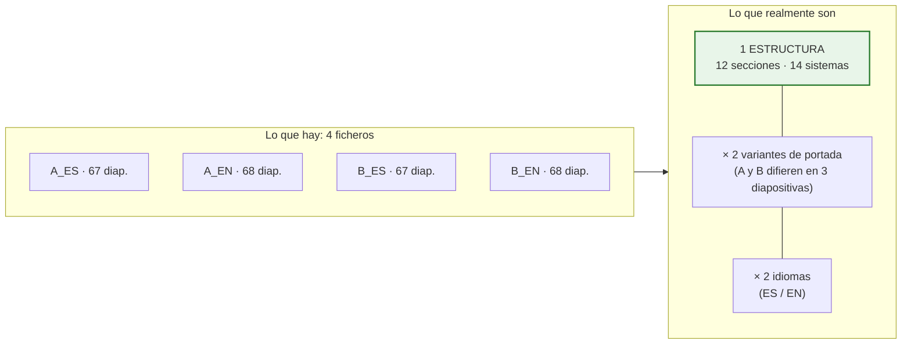

# Análisis de las plantillas PPTX reales (resuelve P-07)

> **Qué es este documento.** El cliente ha facilitado las cuatro plantillas reales de Full Report. Este
> documento recoge el análisis estructural que se ha hecho sobre ellas, y **corrige las decisiones de
> diseño del bloque 4 que no resistían el contacto con la realidad**. Sustituye a los supuestos que
> [`12-pptx.md`](./12-pptx.md) daba por buenos antes de tener las plantillas.

**Ficheros analizados:**

| Alias | Fichero |
|---|---|
| `A_ES` | `YYY.MM.DD__Modelo_A_Full_Report__CASTELLANO_V.2.pptx` |
| `A_EN` | `YYY.MM.DD__Modelo_A_Full_Report__ENGLISH_V.2.pptx` |
| `B_ES` | `YYY.MM.DD__Modelo_B_Full_Report__CASTELLANO_V.2.pptx` |
| `B_EN` | `YYY.MM.DD__Modelo_B_Full_Report__ENGLISH_V.2.pptx` |

---

## 18.0. Alcance y honestidad del análisis

| Qué se ha hecho | Cómo |
|---|---|
| ✅ Análisis estructural completo de los cuatro ficheros | Lectura del paquete OOXML con `python-pptx` 1.0.2 y del ZIP en crudo |
| ✅ Inventario de diapositivas, diseños, formas, imágenes, tablas, gráficos, notas y fuentes | Recuento programático, no muestreo |
| ✅ Medición de geometría de marcos de texto e imagen | Coordenadas EMU reales |
| ✅ Comparación A/B y ES/EN diapositiva a diapositiva | Diferencia de firma estructural |
| ❌ **Verificación visual del render** | **No se ha podido hacer**: LibreOffice no arranca en este entorno (falla también con un PPTX trivial). No he visto las plantillas renderizadas |
| ❌ Prueba de generación real | Pendiente de la prueba de concepto de F0 |

`[LIM]` Todo lo que sigue procede de la **estructura del fichero**, que es verificable y exacta. **No
he hecho ninguna afirmación sobre cómo se ven.** La validación visual sigue siendo parte de la prueba
de concepto.

---

## 18.1. Las cuatro plantillas son una sola estructura

El hallazgo que más simplifica el problema:



**A y B difieren en 3 diapositivas de 67**: la portada, el índice y una que usa otro diseño para el
mismo contenido. El cuerpo del informe —secciones, sistemas, CAPEX, disclaimer— es **idéntico**.

`[REC]` **Consecuencia práctica:** no hay que mantener cuatro mapeos, sino **uno**, con variantes. El
`template_mapping` ya se diseñó como clonable; aquí eso deja de ser una comodidad y pasa a ser la
pieza que hace el bloque 4 sostenible.

---

## 18.2. Ficha técnica

| Métrica | A_ES | A_EN | B_ES | B_EN |
|---|:--:|:--:|:--:|:--:|
| Diapositivas | 67 | 68 | 67 | 68 |
| **Tamaño** | **10 × 7,5 in · 4:3** | ídem | ídem | ídem |
| Diseños en el patrón | 14 | 15 | 14 | 14 |
| **Diapositivas que usan marcadores de posición del diseño** | **0** | **0** | **0** | **0** |
| Tablas de PowerPoint | **0** | 0 | 0 | 0 |
| Gráficos nativos | **0** | 0 | 0 | 0 |
| SmartArt · OLE · vídeo · audio | **0** | 0 | 0 | 0 |
| Imágenes | 41 | 42 | 41 | 41 |
| — de ellas **EMF** (pegado desde Excel) | **13** | 14 | 13 | 13 |
| Autoformas con texto | 154 | 154 | 155 | 154 |
| Cuadros de texto | 216 | 219 | 214 | 216 |
| — con **autoajuste de forma al texto** | **146 (68 %)** | 149 | 145 | 147 |
| — con autoajuste de fuente (`normAutofit`) | **0** | 0 | 0 | 0 |
| **Notas del orador con texto** | **0** | 0 | 0 | 0 |
| Huecos `XXXX` por rellenar | **35** | 39 | 35 | 39 |
| Marcos de foto 4:3 | **56** (14 × 4) | 56 | 56 | 56 |

**Fuentes usadas en las diapositivas:** `Gotham Light`, `Gotham Ultra`, `Californian FB`,
`Century Gothic`, `Lucida Sans`, `Arial`, `Calibri`, `Wingdings`.

**Paleta del tema:** la de Office por defecto (`1F497D`, `4F81BD`, `C0504D`…). **El tema no está
personalizado**: el color corporativo se aplica forma a forma.

---

## 18.3. Estructura del informe

12 portadillas de sección numeradas, idénticas en A y B:

| # | Diap. | Sección | Contenido |
|:--:|:--:|---|---|
| — | 1 | Portada | Título, cliente, fecha |
| — | 2 | Índice | Lista de las 9 secciones |
| 01 | 3-5 | **Resumen ejecutivo** | Dos bloques de texto libre: *Arquitectura* e *Instalaciones* |
| 02 | 6-9 | **Localización y descripción** | Emplazamiento (plano + ficha catastral), descripción, plantas (6 imágenes) |
| 03 | 10-11 | **Análisis de licencias** | Texto libre |
| 04a | 12-30 | **Análisis técnico · Arquitectura** | **9 sistemas × 2 diapositivas** |
| 04b | 31-41 | **Análisis técnico · Instalaciones** | **5 sistemas × 2 diapositivas** |
| 04c | 42-49 | **Análisis técnico · Mediciones** | Criterio AEO — **contenido fijo, no se rellena** |
| 05 | 50-51 | **Urbanismo** | |
| 06 | 52-53 | **Medioambiental** | |
| 07 | 54-60 | **CAPEX** | **6 diapositivas, todas de imágenes EMF** |
| 08 | 61-62 | **Documentación consultada** | |
| 09 | 63-66 | **Disclaimer** | Nota legal — contenido fijo |
| — | 67 | Contraportada | |

### El patrón de sistema: dos diapositivas por sistema

Es el corazón repetitivo del informe y encaja **exactamente** con el diseño de repetición previsto:

```
Diapositiva impar (texto)          Diapositiva par (fotos)
┌────────────────────────────┐     ┌────────────────────────────┐
│ CIMENTACIÓN                │     │  ┌────────┐   ┌────────┐   │
│ XXXXXXXXXXXXXXXXXXXX       │     │  │ 3,15 × │   │ 3,15 × │   │
│ Valoración                 │     │  │ 2,36in │   │ 2,36in │   │
│ XXXXXXXXXXXXXXXXXXXX       │     │  └────────┘   └────────┘   │
│                            │     │  Descripción  Descripción  │
│ ESTRUCTURA                 │     │  ┌────────┐   ┌────────┐   │
│ XXXXXXXXXXXXXXXXXXXX       │     │  │        │   │        │   │
│ Valoración                 │     │  └────────┘   └────────┘   │
│ XXXXXXXXXXXXXXXXXXXX       │     │  Descripción  Descripción  │
└────────────────────────────┘     └────────────────────────────┘
 1 cuadro de texto, 10 pt            4 marcos 4:3 + 4 pies de foto
 ~4.200 caracteres de capacidad      8 autoformas
```

**Los 14 sistemas del informe:**

| Arquitectura (9) | Instalaciones (5) |
|---|---|
| Cimentación *(+ Estructura en la misma diapositiva)* | Aire acondicionado y ventilación |
| Cubierta | Electricidad e iluminación |
| Fachadas | Telecomunicaciones |
| Particiones interiores | Protección contra incendios |
| Suelos y techos | Ascensores |
| Carpintería y cerrajería | |
| Zonas exteriores | |
| Protección pasiva contra incendios | |
| Accesibilidad | |

### Correspondencia con el árbol de códigos CAPEX

Muy buena, y revela un desajuste concreto:

| Sección del informe | Capítulo del árbol (§5.3) |
|---|---|
| Cimentación + Estructura | `H01` Estructura |
| Cubierta | `H02` Cubierta |
| Fachadas | `H03` Fachadas |
| Particiones interiores · Suelos y techos · Carpintería y cerrajería | `H04` Interiores — **el informe lo desglosa en 3 secciones** |
| Zonas exteriores | `H05` Zonas exteriores |
| Protección pasiva contra incendios | `H06` |
| Accesibilidad | `H07` |
| Aire acondicionado y ventilación | `H08` HVAC |
| Electricidad e iluminación | `H09` Electricidad |
| Protección contra incendios | `H10` PCI activa |
| Ascensores | `H12` Transporte vertical |
| Telecomunicaciones | `H14` Telecomunicaciones |
| **— no existe sección —** | **`H11` Fontanería y saneamiento** |
| **— no existe sección —** | **`H13` Seguridad, CCTV y BMS** |
| **— no existe sección —** | **`H15` Otros** |

`[PDV]` **P-30 (nueva).** El árbol tiene 15 capítulos y el informe 14 secciones, que no se
corresponden una a una. Tres capítulos **no tienen sección en la plantilla**: fontanería, seguridad y
otros. Hay que decidir: (a) añadir tres secciones a la plantilla; (b) agrupar esos hallazgos bajo una
sección existente; o (c) generar sus diapositivas solo si hay hallazgos. **Recomendación:** (c), con
`@if_empty: skip_slide`, que es lo que ya soporta el diseño y no obliga a tocar la plantilla.

---

## 18.4. Lo que el análisis corrige del diseño

Cinco decisiones que hay que rectificar. Ninguna invalida la arquitectura; todas afectan al bloque 4.

### C-1 · Se invierten la estrategia principal y la secundaria

`12-pptx.md` §17.2 daba como **estrategia principal** «las diapositivas repetibles se definen como
diseños del patrón, y cada repetición se crea desde su diseño», porque así se heredan tema, fuentes y
posiciones. Y dejaba el clonado de XML como vía secundaria y frágil.

**Con estas plantillas eso no es aplicable:**

| Evidencia | Consecuencia |
|---|---|
| **0 de 67 diapositivas usan marcadores de posición** | No hay nada que rellenar al crear desde diseño: saldría una diapositiva vacía |
| Los 14 diseños **no declaran marcadores de contenido** (solo fecha, pie y número en dos de ellos) | El formato vive en las formas de cada diapositiva, no en el diseño |
| El tema **no está personalizado** | Heredar del tema no aporta el aspecto corporativo |

**Corrección:** la **estrategia principal pasa a ser el clonado de la diapositiva modelo**. Y la buena
noticia es que en este corpus el clonado es **mucho más seguro de lo que se temía**: los riesgos que
lo hacían frágil —gráficos, SmartArt, OLE, vídeo, audio— **no existen en ninguna de las cuatro
plantillas**. Solo hay formas, imágenes y líneas, que es justo lo que el clonado maneja bien.

La alternativa —rediseñar la plantilla para que use marcadores de posición— sigue disponible, pero
ahora es una recomendación a medio plazo, no un requisito de arranque.

### C-2 · El desbordamiento no encoge la fuente: empuja fuera de la diapositiva

`12-pptx.md` L8 preveía que PowerPoint reduciría la fuente (`normAutofit`) y que eso bajaría la
severidad del aviso.

**Evidencia:** **0 cuadros con `normAutofit`**; **146 de 216 (68 %) con «ajustar forma al texto»**.

**Corrección:** el modo real es el contrario y es **más peligroso**: el texto no se encoge ni se
recorta, **la forma crece y el contenido se sale de la diapositiva** sin que nada lo advierta.

El criterio de detección cambia, y para bien: en lugar de estimar si un texto «cabe» dentro de un
marco fijo —que es lo difícil—, hay que comprobar si **el marco crecido rebasa el alto de la
diapositiva o pisa la forma siguiente**:

```
alto_estimado = f(caracteres, ancho útil, tamaño de fuente)
¿ top + alto_estimado > 7,5 in ?          → aviso ALTO: se saldrá de la diapositiva
¿ top + alto_estimado > top_forma_debajo? → aviso ALTO: pisará la forma de debajo
```

`[REC]` Esta comprobación es **más fiable** que la anterior, porque el margen de error de la
estimación de altura se compara contra una distancia grande (pulgadas), no contra el ajuste fino de
una caja.

**Capacidad medida** de las diapositivas de sistema, a 10 pt sobre 8,8 in de ancho y ~6 in de alto
disponible: **≈ 4.200 caracteres**. Ese es el presupuesto de texto para descripción y valoración de
los subsistemas de esa diapositiva, y es el número que la interfaz debe mostrar al consultor mientras
escribe.

### C-3 · La tabla de CAPEX hoy es una imagen pegada desde Excel

**Evidencia:** las 6 diapositivas de la sección CAPEX (54-60) contienen **exclusivamente imágenes
EMF**. Cero tablas de PowerPoint en las cuatro plantillas.

```
Diapositiva 55: 2 imágenes EMF (1484×88 y 1484×1013 px)
Diapositiva 57: 3 imágenes EMF
Diapositiva 59: 1 imagen EMF (1495×527)
Diapositiva 60: 1 imagen EMF (1154×459)
```

Es el patrón inequívoco de **copiar un rango de Excel y pegarlo como metarchivo**.

**Corrección y decisión que hay que tomar** `[PDV]` **P-31 (nueva):**

| Opción | Resultado | Valoración |
|---|---|---|
| **A · Tabla nativa de PowerPoint** generada por la aplicación | Texto real, editable, seleccionable, se parte en varias diapositivas, accesible | ✅ **Recomendada.** Es lo que el diseño ya contempla. **Cambia el aspecto** respecto a la imagen actual, así que hay que aprobarlo |
| B · Imagen generada por la aplicación | Reproduce el aspecto actual | ❌ No editable, se pixela al ampliar, sin accesibilidad. Además `python-pptx` **no genera EMF** `[LIM]`, sería PNG |
| C · Hueco reservado y pegado manual | Statu quo | ❌ Deja fuera del alcance justo lo que más tiempo consume |

`[REC]` **Opción A**, diciéndolo claramente: la tabla de CAPEX **dejará de ser una captura de Excel y
pasará a ser una tabla de verdad**. Es una mejora objetiva, pero es un cambio visible y el cliente
debe aprobarlo antes de que se diseñe su estilo.

### C-4 · Las fuentes corporativas no son estándar

**Evidencia:** las diapositivas usan **Gotham Light** y **Gotham Ultra**, que no acompañan a Office ni
están en un servidor Linux por defecto.

**Consecuencia, ya prevista en L4 pero ahora confirmada y agravada:**

1. La **estimación de desbordamiento** medirá con una fuente sustituta si no se aportan los ficheros.
2. La **previsualización con LibreOffice** sustituirá la fuente, de modo que las longitudes de línea
   que muestre **no serán las reales**.

`[REC]` Se eleva de recomendación a **requisito de la fase F0**: obtener de la consultora los ficheros
de Gotham (o su licencia) e instalarlos en el contenedor del worker. Sin eso, tanto el aviso de
desbordamiento como la previsualización pierden buena parte de su valor en un informe de 67
diapositivas cuyo riesgo principal es, precisamente, el texto que se sale.

### C-5 · Los catálogos necesitan traducción

**Evidencia:** las plantillas EN traducen **todo** el contenido que en el diseño procede de catálogos:

| Español (A_ES) | Inglés (A_EN) |
|---|---|
| CIMENTACIÓN | FOUNDATION |
| CUBIERTA | ROOF |
| FACHADAS | FAÇADES |
| PARTICIONES INTERIORES | INTERIOR PARTITIONS |
| SUELOS Y TECHOS | FLOORS AND CEILINGS |
| CARPINTERÍA Y CERRAJERÍA | CARPENTRY AND LOCKSMITH |
| PROTECCIÓN PASIVA CONTRA INCENDIOS | PASSIVE FIRE PROTECTION |
| AIRE ACONDICIONADO Y VENTILACIÓN | AIR CONDITIONING/VENTILATION |
| «Anomalías irrefutables que se prevén sean reclamados por el comprador…» | «Irrefutable anomalies that are foreseen to be claimed by the buyer…» |

Esa última fila es la importante: **las definiciones de los cuatro grados de riesgo aparecen en el
informe, y están traducidas.** Confirma la decisión de guardarlas íntegras en base de datos… y obliga
a corregir el modelo, que las guarda en **una sola columna**.

**Corrección del modelo de datos** `[REC]`:

```
risk_level (…, name, definition)                    ← antes
risk_level (…, code, score, color_token)            ← ahora
risk_level_i18n (risk_level_id, locale, name, definition)   ← nueva tabla
```

Mismo tratamiento para `zone.name`, `capex_code.name`, `capex_concept.name`, `time_horizon.name` y
`asset_typology.name`. Es una tabla de traducción por catálogo, con `locale` (`es-ES`, `en-GB`), y una
regla de resolución: idioma del informe → idioma por defecto de la organización → español.

`[REC]` **El idioma es del informe, no del usuario.** Un consultor español genera informes en inglés
para un fondo internacional sin cambiar el idioma de su interfaz. Por eso el idioma se elige **al
generar** y se guarda en `report_version`, y por eso el `data_snapshot` debe congelar **los textos
resueltos en ese idioma**: si mañana alguien corrige la traducción de un capítulo, el informe emitido
no puede cambiar.

Se confirma además que la plantilla determina el idioma: hay una plantilla ES y una EN. La aplicación
debe **avisar si el idioma elegido no coincide con el de la plantilla** en lugar de mezclarlos.

---

## 18.5. Lo que el análisis confirma

No todo eran correcciones. Cinco decisiones salen reforzadas:

| Decisión | Evidencia |
|---|---|
| **Las directivas en las notas del orador** | **0 notas con texto** en las cuatro plantillas: el canal está completamente libre, no hay nada que romper |
| **Repetición por sistema y por hallazgo** | El informe ya está construido así: 14 pares de diapositivas con el mismo patrón. Es exactamente `@repeat` |
| **Fotos con pie, agrupadas** | 56 marcos de foto en 14 diapositivas, 4 por diapositiva, con su pie debajo: es `@photos: max=4, caption=below` literal |
| **Guardar la definición íntegra del riesgo** | Aparece en el informe, en las dos lenguas |
| **Marcadores `{{...}}` en el cuerpo del texto** | Los 35 huecos `XXXX` están **dentro de párrafos** de cuadros de texto que contienen varias subsecciones. Un marcador por forma no habría servido; por párrafo, sí |

Y una confirmación sobre las proporciones: los marcos de foto son **4:3 (3,15 × 2,36 in)**, la
proporción nativa de la mayoría de cámaras de móvil en horizontal. El encaje `contain` funcionará sin
bandas en el caso más común, y las fotos verticales dejarán banda lateral, como es inevitable.

---

## 18.6. Esfuerzo de preparación de la plantilla

`[REQ]` El contrato de plantilla (S-15) exige preparar el fichero. Ahora se puede **cuantificar**:

| Tarea | Volumen medido | Esfuerzo estimado `[SUP]` |
|---|---|---|
| Sustituir los huecos `XXXX` por marcadores `{{…}}` | 35 (ES) / 39 (EN) en 19-21 diapositivas | ~3 h por plantilla |
| Añadir directivas `@repeat` en las notas de las 14 diapositivas de sistema | 14 notas | ~1 h |
| Añadir directivas `@photos` en las 14 diapositivas de fotos | 14 notas | ~1 h |
| Marcar las diapositivas de contenido fijo con `@keep` (mediciones AEO, disclaimer) | ~12 diapositivas | ~0,5 h |
| Definir el estilo de la tabla nativa de CAPEX (si se aprueba la opción A de C-3) | 1 diseño | ~4 h, una sola vez |
| Revisión y prueba de generación | — | ~4 h por plantilla |

**Total: en torno a 1,5 jornadas por plantilla**, y como A y B comparten cuerpo, **dos jornadas
cubren las cuatro**. Es un coste real pero acotado, y se hace **una vez**.

---

## 18.7. Reevaluación del riesgo R1

`15-mvp-plan-riesgos.md` daba la fidelidad del PPTX como **probabilidad alta · impacto crítico**, con
la advertencia de que sin plantillas reales el riesgo quedaba sin medir. Ya está medido:

| Factor | Antes (supuesto) | Ahora (medido) | Efecto |
|---|---|---|---|
| Gráficos que sustituir | Posibles | **0** | ⬇️ |
| SmartArt en zonas de datos | Posible | **0** | ⬇️ |
| Objetos OLE, vídeo, audio | Posibles | **0** | ⬇️ |
| Tablas nativas que replicar | Se asumían | **0** — son imágenes | ⬇️ riesgo técnico, ⬆️ decisión de producto (C-3) |
| Notas ocupadas | Posible | **0** | ⬇️ |
| Marcadores de posición aprovechables | Se asumían | **0** | ⬆️ obliga a clonar |
| Fuentes no estándar | Posible | **Confirmado: Gotham** | ⬆️ |
| Volumen | ~25-47 diapositivas | **67-68** | ⬆️ tiempo de generación |
| Nº de plantillas distintas | 2-3 | **1 estructura** | ⬇️⬇️ |

**Nueva valoración: probabilidad media · impacto crítico.** El riesgo baja de forma apreciable porque
desaparecen los tres elementos que hacían frágil el clonado (gráficos, SmartArt, OLE) y porque hay una
sola estructura que preparar. Sube por la ausencia de marcadores de posición y por las fuentes
corporativas, pero ambas cosas tienen solución conocida.

`[REC]` **La prueba de concepto de las semanas 2-3 sigue siendo necesaria**, pero cambia de objetivo:
ya no es «¿es esto viable?», sino **«¿el clonado de la diapositiva de sistema produce un resultado
indistinguible del original, con las fuentes corporativas instaladas?»**. Es una pregunta mucho más
concreta, y se responde con dos diapositivas, no con un prototipo entero.

---

## 18.8. Preguntas nuevas que abre este análisis

| # | Pregunta | Impacto | Propuesta |
|---|---|---|---|
| **P-30** | Tres capítulos del árbol (`H11` fontanería, `H13` seguridad/CCTV/BMS, `H15` otros) **no tienen sección en la plantilla**. ¿Se añaden secciones, se agrupan, o solo se generan si hay hallazgos? | Alto | Generarlas solo si hay hallazgos (`@if_empty: skip_slide`), sin tocar la plantilla |
| **P-31** | ¿Se aprueba que la tabla de CAPEX pase de **imagen pegada de Excel** a **tabla nativa** generada por la aplicación? Cambia el aspecto | **Alto** | Sí, opción A de C-3 |
| **P-32** | ¿Se pueden facilitar los **ficheros de las fuentes Gotham** (o su licencia) para instalarlas en el servidor? | **Alto** | Necesario para que el aviso de desbordamiento y la previsualización sean fiables |
| **P-33** | Los idiomas confirmados son **español e inglés**. ¿Habrá más? | Medio | Modelo de traducción por catálogo, `locale` abierto |
| **P-34** | El informe agrupa **Cimentación y Estructura** en una diapositiva, y desglosa `H04` en tres. ¿Se mantiene esa agrupación o se normaliza al árbol? | Medio | Mantener la plantilla como está: la agrupación se resuelve en el mapeo |
| **P-35** | Las diapositivas de **Mediciones AEO** (42-49) y **Disclaimer** (63-66) son contenido fijo. ¿Se marcan como intocables (`@keep`) o alguna parte se rellena? | Bajo | `@keep`, salvo indicación contraria |
| **P-36** | ¿Qué diferencia funcional hay entre **Modelo A y Modelo B**, más allá de portada e índice? ¿Cuándo se usa cada uno? | Bajo | Se tratan como dos variantes de portada del mismo mapeo |

---

## 18.9. Qué hacer a continuación

1. **Responder P-31 y P-32**, que son las dos que condicionan el trabajo de F8-F9.
2. **Instalar las fuentes Gotham** en el contenedor del worker (P-32) antes de la prueba de concepto.
3. **Prueba de concepto acotada** (semanas 2-3), con un objetivo único: clonar la diapositiva 13-14
   (Cimentación) para tres sistemas y comparar el resultado con el original en PowerPoint.
4. **Preparar `A_ES` como plantilla piloto**: 35 marcadores y 28 directivas, ~1,5 jornadas.
5. Incorporar las cuatro plantillas al **corpus de pruebas** como T21-T24, sustituyendo a las
   plantillas sintéticas que se habían previsto para lo que ahora está cubierto por las reales.
