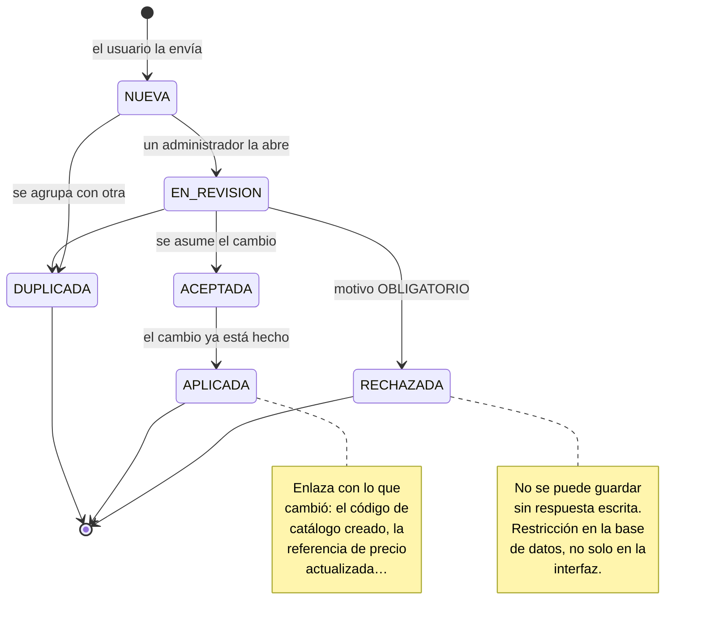

# 19. Módulo de Sugerencias

> **Entregable añadido.** No estaba en el encargo original (§14): lo pide el cliente tras cerrar P-06.
> Se documenta aquí completo —modelo, API, pantallas, permisos, pruebas y coste— para que la decisión
> sobre cuándo construirlo se tome con el alcance delante.

---

## 19.0. Qué se ha pedido, exactamente

> *«Quisiera tener además un módulo extra que sea "Sugerencias" y que sirva para que cada usuario el día
> de mañana proponga cambios y solo el/los usuario/s administrador pueda/n ver las propuestas.»*

Tres requisitos, y ninguno más:

| # | Requisito `[REQ]` |
|---|---|
| 1 | **Cualquier usuario** puede proponer un cambio |
| 2 | **Solo el administrador** (o los administradores) ven las propuestas |
| 3 | Sirve para el **día de mañana**: es un canal permanente, no una encuesta de lanzamiento |

Todo lo demás de este documento es propuesta mía, etiquetada como tal.

---

## 19.1. El riesgo de este módulo no es técnico

Un buzón de sugerencias es trivial de programar y **muy fácil de convertir en un cementerio**. El
patrón conocido: se lanza, la gente escribe durante tres semanas, nadie responde, deja de escribir, y
al año el módulo es una tabla con cuarenta filas que nadie ha leído. Peor que no tenerlo, porque
enseña a la plantilla que proponer no sirve de nada.

`[REC]` Tres decisiones de diseño lo evitan, y las tres son baratas:

| Decisión | Qué problema resuelve |
|---|---|
| **Se sugiere desde donde se ve el problema**, no desde un formulario en blanco | Un formulario genérico produce quejas vagas. Un botón «Sugerir» en la línea de CAPEX que está mal produce una propuesta accionable, con su contexto ya capturado |
| **La sugerencia está tipada**, no es texto libre | Permite agrupar duplicados, dirigirla al administrador correcto y, en el caso de catálogos, **convertirla en el cambio con un clic** |
| **Cerrar exige responder** | El estado `RECHAZADA` no se puede guardar sin motivo. Es la única regla que sostiene el resto |

---

## 19.2. Qué se puede sugerir `[REC]`

El tipo no es burocracia: determina qué contexto se captura y qué puede hacer el administrador con la
propuesta.

| Tipo | Ejemplo real | Qué puede hacer el administrador |
|---|---|---|
| **`CATALOGO`** | «Falta el código para *Sistemas de detección de gas* en H10» · «La zona *Muelle de carga* debería estar en Comercial, no solo en Industrial» | **Aplicarla directamente**: el módulo abre el editor de catálogos con los datos ya rellenos |
| **`PRECIO`** | «La enfriadora de 300 kW está a 48.500 € desde 2024; hoy no baja de 61.000 €» | Actualizar la referencia del catálogo interno, o marcarla como caducada |
| **`PLANTILLA`** | «En la diapositiva de Cimentación el texto de valoración siempre desborda» · «Falta una sección para fontanería» | Ajustar el mapeo o la plantilla |
| **`APLICACION`** | «Al subir fotos desde el móvil se pierde el orden» · «Haría falta filtrar el CAPEX por técnico» | Priorizar como mejora o incidencia |

`[REC]` **El tipo `CATALOGO` es el que justifica el módulo por sí solo.** El diseño decidió que los
catálogos son datos y no código, precisamente para poder corregirlos sin desplegar. Pero eso deja una
pregunta sin responder: **¿quién detecta que falta un código?** El consultor que está en la nave a las
ocho de la mañana y no encuentra dónde clasificar lo que tiene delante. Sin un canal, lo clasifica en
«Otros» y esa información se pierde para siempre.

Este módulo es, en la práctica, **el mecanismo de mantenimiento de los catálogos**.

---

## 19.3. El módulo y P-06: por qué llegan juntos

`[REQ]` **P-06 cerrada: no hay base de precios externa.** Los precios se teclean y se editan a mano.
Eso tiene una consecuencia que conviene mirar de frente: **el catálogo de precios se va a quedar
desfasado**, porque nada lo actualiza solo.

Quien primero nota que un precio está viejo no es el administrador que mantiene el catálogo: es el
consultor que pide un presupuesto real y ve que no se parece. Sin canal, esa corrección se queda en su
proyecto y los otros ocho consultores siguen usando el precio viejo.

`[REC]` Por eso el tipo `PRECIO` lleva **campos estructurados**, no solo texto: precio observado,
fecha, proveedor o fuente, y referencia afectada. Convierte una queja en una actualización de catálogo
que el administrador puede aplicar leyendo tres campos. Ver §19.7.

---

## 19.4. Visibilidad: la decisión delicada

`[REQ]` **Solo los administradores ven las propuestas.** Un consultor no ve las de sus compañeros.

`[REC]` **Con una excepción que propongo: el autor ve las suyas.** Sin eso, quien sugiere algo escribe
en un buzón sin fondo: no sabe si se leyó, no sabe si se rechazó, y a la tercera vez deja de escribir —
o peor, vuelve a sugerir lo mismo. Es exactamente el fallo descrito en §19.1.

Resumen de quién ve qué:

| | Ve sus propias | Ve las de otros | Cambia el estado | Ve quién la escribió |
|---|:--:|:--:|:--:|:--:|
| Autor (cualquier rol) | ✅ con su estado y la respuesta | ❌ | ❌ | — |
| **`ADMIN`** | ✅ | ✅ **todas** | ✅ | ✅ |
| Resto de roles | ✅ solo las suyas | ❌ | ❌ | ❌ |

`[PDV]` **P-40 · ¿Se acepta esa excepción?** Si la respuesta es que ni siquiera el autor debe volver a
ver lo que escribió, se implementa así —es más sencillo— pero **recomiendo lo contrario** por lo dicho.

`[REC]` **P-41 · ¿Hace falta un rol intermedio?** Ver las sugerencias exige hoy ser `ADMIN`, que además
gestiona usuarios, catálogos y organización. Si se quiere que alguien atienda el buzón sin darle esas
llaves, propongo un permiso separable `GESTIONAR_SUGERENCIAS`, asignable a un `DIRECTOR_PROYECTO`. Es
media jornada de trabajo y evita repartir cuentas de administrador por un motivo menor.

### El problema de privacidad que esto abre, y cómo se resuelve `[REC]`

Hay una tensión real, y prefiero señalarla antes de que aparezca en una auditoría.

El diseño establece ([`07`](./07-roles-permisos.md) §11.1, principio 5) que **`ADMIN` no es omnipotente
sobre el contenido**: si entra en un proyecto del que no es miembro, queda auditado como evento
crítico. Es deliberado — impide que el rol técnico sea una puerta trasera silenciosa a información
confidencial de clientes.

Un buzón de sugerencias **puede saltarse esa regla sin querer**. Si un consultor escribe *«el CAPEX de
Inversora Ficticia sale en 1,84 M€ y el cliente dice que…»*, acaba de meter datos de un proyecto
confidencial en una bandeja que el administrador lee sin dejar rastro de acceso al proyecto.

Cuatro medidas, todas baratas:

| Medida | Cómo |
|---|---|
| El contexto se guarda **por referencia, no copiado** | `project_id`, `capex_item_id`… El administrador ve *«sugerencia sobre el proyecto 2026-014»*, y para ver el dato tiene que entrar en el proyecto — con la auditoría de siempre |
| **Aviso en el formulario** | Un texto breve y sin sermón: «No hace falta copiar datos del cliente: el contexto se adjunta solo» |
| Abrir una sugerencia con contexto de proyecto **se audita** | `SUGGESTION_VIEWED` con el proyecto referenciado. No bloquea nada; deja rastro |
| El autor puede marcarla **«sin contexto de proyecto»** | Para sugerencias generales, no se adjunta nada y no hay nada que auditar |

---

## 19.5. Ciclo de vida



`[REC]` **`DUPLICADA` no es un descarte, es una agrupación.** La sugerencia se enlaza con la original y
esta muestra *«+3 personas han sugerido lo mismo»*. Esa cifra es el mejor dato de priorización que va a
tener el administrador, y sale gratis.

`[REC]` **`ACEPTADA` y `APLICADA` están separadas a propósito.** Aceptar es una intención; aplicar es un
hecho con fecha y con enlace a lo que cambió. Sin esa distinción, «aceptada» se convierte en un
sinónimo educado de «archivada».

---

## 19.6. Modelo de datos

### `suggestion`

| Campo | Tipo | Nota |
|---|---|---|
| `id` | UUID PK | |
| `organization_id` | UUID FK **NOT NULL** | RLS, como todo `[REQ]` |
| `type` | ENUM(`CATALOGO`,`PRECIO`,`PLANTILLA`,`APLICACION`) NOT NULL | §19.2 |
| `status` | ENUM(`NUEVA`,`EN_REVISION`,`ACEPTADA`,`RECHAZADA`,`DUPLICADA`,`APLICADA`) NOT NULL DEFAULT `NUEVA` | |
| `title` | VARCHAR(160) NOT NULL | Obligatorio: fuerza a resumir |
| `body` | TEXT NOT NULL | |
| `payload` | JSONB NULL | Campos estructurados según `type`. §19.7 |
| `created_by` | UUID FK → `user` NOT NULL | |
| `created_at` | TIMESTAMPTZ NOT NULL | |
| `context_project_id` | UUID FK → `project` NULL | **Referencia, nunca copia** §19.4 |
| `context_entity_type` | VARCHAR(40) NULL | `capex_item`, `capex_code`, `zone`, `report_template`… |
| `context_entity_id` | UUID NULL | |
| `context_screen` | VARCHAR(60) NULL | Desde qué pantalla se envió. Ayuda más de lo que parece |
| `duplicate_of_id` | UUID FK → `suggestion` NULL | Solo si `status = DUPLICADA` |
| `resolved_by` | UUID FK → `user` NULL | |
| `resolved_at` | TIMESTAMPTZ NULL | |
| `resolution_note` | TEXT NULL | **Obligatoria si `RECHAZADA`** |
| `applied_entity_type` / `applied_entity_id` | VARCHAR(40) / UUID NULL | Qué se creó o cambió al aplicarla |

**Restricciones** `[REC]`:

```sql
-- Rechazar exige explicarse. En la base de datos, no solo en la interfaz.
CHECK (status <> 'RECHAZADA' OR (resolution_note IS NOT NULL AND length(trim(resolution_note)) >= 10))

-- Resolver deja siempre quién y cuándo.
CHECK (status IN ('NUEVA','EN_REVISION') OR (resolved_by IS NOT NULL AND resolved_at IS NOT NULL))

-- Duplicada exige decir de cuál, y no de sí misma.
CHECK (status <> 'DUPLICADA' OR (duplicate_of_id IS NOT NULL AND duplicate_of_id <> id))

-- Aplicada exige haber pasado por aceptada y apuntar a algo.
CHECK (status <> 'APLICADA' OR applied_entity_id IS NOT NULL)
```

### Row Level Security `[REQ]`

La visibilidad de §19.4 **no se implementa filtrando en el servicio**: se implementa en la base de
datos, como el aislamiento entre organizaciones. Si mañana alguien escribe una consulta nueva y olvida
el filtro, la fila sigue sin aparecer.

```sql
CREATE POLICY suggestion_read ON suggestion FOR SELECT
  USING (
    organization_id = current_setting('app.current_org_id')::uuid
    AND (
      created_by = current_setting('app.current_user_id')::uuid   -- el autor ve las suyas
      OR current_setting('app.can_manage_suggestions') = 'true'   -- el administrador, todas
    )
  );
```

`[REC]` Esa política es el motivo por el que este módulo es seguro de construir deprisa: **la regla que
el cliente ha pedido explícitamente vive en un sitio y solo en uno.**

### `suggestion_comment` `[REC]`

Un hilo corto entre el administrador y el autor, para pedir aclaraciones sin rechazar por
malentendido. `id`, `suggestion_id`, `author_id`, `body`, `created_at`. Visible para los dos, con las
mismas reglas de RLS.

---

## 19.7. El `payload` por tipo `[REC]`

Lo que convierte una sugerencia en algo aplicable con un clic.

**`CATALOGO`** — el administrador abre el editor con esto ya relleno:

```json
{ "catalog": "capex_code", "action": "ALTA",
  "parent_code": "HC.H10", "proposed_code": "HC.H10.07",
  "proposed_name": "Sistemas de detección de gas",
  "justification": "Tres proyectos industriales seguidos sin dónde clasificarlo" }
```

**`PRECIO`** — los campos que hacen falta para actualizar una referencia, y ninguno más:

```json
{ "price_reference_id": "…", "current_amount": "48500.00",
  "observed_amount": "61000.00", "unit": "ud",
  "observed_at": "2026-07-14", "source": "Presupuesto de Clima Norte S.L.",
  "scope_note": "Suministro y montaje, sin grúa" }
```

`[REC]` Con esos seis campos el administrador actualiza el catálogo interno **sin abrir el proyecto**,
que es justo lo que interesa por lo dicho en §19.4.

---

## 19.8. API

| Método | Ruta | Nota |
|---|---|---|
| `POST` | `/suggestions` | Cualquier usuario autenticado `[REQ]` |
| `GET` | `/suggestions/mine` | Las del usuario, con estado y respuesta `[REC]` P-40 |
| `GET` | `/suggestions?status=&type=&project_id=` | **Solo con `GESTIONAR_SUGERENCIAS`**. Para el resto, `403` |
| `GET` | `/suggestions/{id}` | RLS decide. Abrirla con contexto de proyecto audita `SUGGESTION_VIEWED` |
| `POST` | `/suggestions/{id}/transitions` | `{to, resolution_note, duplicate_of_id}`. Guardas de §19.5 |
| `POST` | `/suggestions/{id}/apply` | Solo desde `ACEPTADA`. Crea el cambio y enlaza `applied_entity_id` |
| `GET`/`POST` | `/suggestions/{id}/comments` | Hilo autor ↔ administrador |
| `GET` | `/suggestions/summary` | Contadores para la insignia del menú |

`[REC]` `POST /suggestions` **no acepta `organization_id` ni `created_by` del cliente**: se toman del
token. Es el error clásico en un endpoint abierto a cualquier rol.

---

## 19.9. Pantallas

### Pantalla 20 · Enviar una sugerencia

Se abre desde el menú **o desde el botón «Sugerir» de cualquier pantalla**, que es como se usará el
90 % de las veces.

```
┌───────────────────── Sugerir un cambio ──────────────────────┐
│                                                               │
│  ¿Sobre qué?                                                  │
│   ○ Catálogos    ⓘ falta un código, una zona, un concepto    │
│   ◉ Precios      ⓘ un precio está desfasado                  │
│   ○ Informe      ⓘ la plantilla o cómo se rellena            │
│   ○ La aplicación                                             │
│                                                               │
│  Título *  ┌──────────────────────────────────────────────┐  │
│            │ Enfriadora 300 kW: el precio está viejo      │  │
│            └──────────────────────────────────────────────┘  │
│                                                               │
│  ── Datos del precio ──────────────────────────────────────  │
│  Referencia   CI-4471 · Enfriadora 300 kW · 48.500,00 €      │
│  Precio visto ┌────────────┐ EUR   Fecha ┌────────────┐      │
│               │  61.000,00 │             │ 14/07/2026 │      │
│  Fuente       ┌──────────────────────────────────────────┐   │
│               │ Presupuesto de Clima Norte S.L.          │   │
│  Alcance      ┌──────────────────────────────────────────┐   │
│               │ Suministro y montaje, sin grúa           │   │
│                                                               │
│  Explicación                                                  │
│  ┌──────────────────────────────────────────────────────┐    │
│  │ Es el tercer proyecto seguido en que no baja de 60k.  │    │
│  └──────────────────────────────────────────────────────┘    │
│                                                               │
│  Contexto que se adjunta:                                     │
│   ☑ Proyecto 2026-014   ☑ Línea CX-0117   ☑ Pantalla: CAPEX  │
│   ⓘ Se adjunta como enlace. No hace falta copiar datos del   │
│     cliente aquí.                                             │
│                                                               │
│  ⓘ La verá el administrador. Podrá seguir su estado en       │
│    «Mis sugerencias».                                         │
│                       [ Cancelar ]  [ Enviar sugerencia ]    │
└───────────────────────────────────────────────────────────────┘
```

`[REC]` Los campos estructurados **aparecen según el tipo elegido**. Si se elige «La aplicación», solo
quedan título y explicación. Pedir seis campos para decir «se pierde el orden de las fotos» sería la
forma más rápida de que nadie use el módulo.

### Pantalla 21 · Mis sugerencias

```
┌──────────────────────────────────────────────────────────────┐
│ Mis sugerencias (7)                          [ + Sugerir ]   │
├──────────────────────────────────────────────────────────────┤
│ ● APLICADA   Falta código para detección de gas              │
│   Catálogos · 12/06/2026 · resuelta por A. López el 18/06    │
│   → Se creó el código HC.H10.07                       [ver]  │
│                                                               │
│ ● ACEPTADA   Enfriadora 300 kW: el precio está viejo         │
│   Precios · 14/07/2026 · «Confirmado, lo actualizamos»       │
│                                                               │
│ ● EN REVISIÓN  El texto de Cimentación desborda              │
│   Informe · 20/07/2026 · 1 comentario sin leer          🔴   │
│                                                               │
│ ● RECHAZADA  Filtrar el CAPEX por técnico                    │
│   Aplicación · 02/05/2026                                    │
│   «Ya existe en el agrupador; te enseñamos cómo.»            │
│                                                               │
│ ● DUPLICADA  Falta zona muelle de carga en Comercial         │
│   → Agrupada con la #34, que está ACEPTADA            [ver]  │
└──────────────────────────────────────────────────────────────┘
```

### Pantalla 22 · Bandeja del administrador

```
┌──────────────────────────────────────────────────────────────┐
│ Sugerencias        🔴 6 nuevas · 3 en revisión · 41 cerradas │
├──────────────────────────────────────────────────────────────┤
│ Tipo: Todos ▾ │ Estado: Sin cerrar ▾ │ Proyecto: Todos ▾    │
├──────────────────────────────────────────────────────────────┤
│ 🔴 #58  PRECIO     Enfriadora 300 kW: el precio está viejo   │
│         C. Gil · 14/07 · proyecto 2026-014 · línea CX-0117   │
│         48.500 → 61.000 € · Clima Norte S.L. · 14/07/2026    │
│         👥 +2 personas han sugerido lo mismo                 │
│         [ Actualizar el catálogo ] [ Comentar ] [ Rechazar ] │
├──────────────────────────────────────────────────────────────┤
│ 🔴 #57  CATALOGO   Falta «Sistemas de detección de gas»      │
│         L. Pérez · 13/07 · sin contexto de proyecto          │
│         Alta en HC.H10 → HC.H10.07                           │
│         [ Crear el código ] [ Comentar ] [ Rechazar ]        │
├──────────────────────────────────────────────────────────────┤
│    #55  APLICACION Se pierde el orden de las fotos al subir  │
│         M. Ruiz · 09/07 · EN REVISIÓN · pantalla: Fotos      │
└──────────────────────────────────────────────────────────────┘
```

`[REC]` El botón **`[ Actualizar el catálogo ]` / `[ Crear el código ]` es la pieza clave**: abre el
editor correspondiente con los datos del `payload` ya puestos, y al guardar marca la sugerencia como
`APLICADA` enlazando lo creado. Sin ese botón, el administrador tiene que copiar datos a mano de una
pantalla a otra, y eso es exactamente lo que hace que un buzón se abandone.

---

## 19.10. Permisos

Se añaden a la matriz de [`07`](./07-roles-permisos.md) §11.3:

| Acción | ADMIN | DIR. | CONS. | TÉC. | REV. | LECT. |
|---|:--:|:--:|:--:|:--:|:--:|:--:|
| **Crear una sugerencia** | ✅ | ✅ | ✅ | ✅ | ✅ | ✅ |
| **Ver las propias** | ✅ | ✅ | ✅ | ✅ | ✅ | ✅ |
| **Ver todas las sugerencias** | ✅ | ⚠️⁴ | ❌ | ❌ | ❌ | ❌ |
| **Cambiar el estado · responder** | ✅ | ⚠️⁴ | ❌ | ❌ | ❌ | ❌ |
| **Aplicar una sugerencia de catálogo** | ✅ | ❌ | ❌ | ❌ | ❌ | ❌ |
| Comentar en el hilo | ✅ | ⚠️⁴ | ⚠️⁵ | ⚠️⁵ | ⚠️⁵ | ⚠️⁵ |

⁴ Solo si tiene el permiso separable `GESTIONAR_SUGERENCIAS` `[REC]` P-41. Sin él, `403`.
⁵ Solo en el hilo de **sus propias** sugerencias.

`[REC]` **Crear puede hacerlo hasta un `LECTOR`.** Es el rol de menor privilegio y, aun así, es
frecuente que sea quien más fricción encuentra en la herramienta. Cerrarle el canal sería perder
justo la opinión más barata de obtener.

---

## 19.11. Pruebas

| Caso | Verificación |
|---|---|
| **Aislamiento entre autores** | Un `CONSULTOR` pide `GET /suggestions` y recibe `403`. Pide `GET /suggestions/{id}` de otro y recibe `404`, **no `403`**: no se confirma que exista |
| **RLS, no filtro de aplicación** | Consulta directa a la tabla con el rol de aplicación y el `SET LOCAL` de un consultor: **devuelve solo las suyas**. Es la prueba que garantiza el requisito del cliente aunque un servicio futuro olvide filtrar `[REC]` |
| **Aislamiento entre organizaciones** | Un `ADMIN` de la organización A no ve ninguna sugerencia de la B |
| **Rechazo sin motivo** | `422` desde la API **y** violación de `CHECK` si se intenta por SQL. Dos barreras |
| **Duplicada de sí misma** | Rechazada por restricción |
| **Aplicar sin aceptar** | `409` |
| **Aplicar crea y enlaza** | Aplicar una de tipo `CATALOGO` crea el código y deja `applied_entity_id` apuntando a él |
| **Escalada por el cuerpo** | `POST /suggestions` con `organization_id` y `created_by` de otra organización en el cuerpo: **se ignoran**, se toman del token |
| **Auditoría del contexto** | Abrir una sugerencia con `context_project_id` deja `SUGGESTION_VIEWED` con el proyecto |
| **El contexto no copia datos** | Una sugerencia creada desde una línea de CAPEX guarda **identificadores**, y su `payload` no contiene el nombre del cliente ni importes del proyecto salvo los que el usuario escriba `[REC]` |
| **Contador de duplicados** | Tres agrupadas en una: la original muestra 3 |

---

## 19.12. Qué cuesta y dónde encaja `[SUP]`

No lo escondo en una nota: **esto añade alcance al MVP.**

| Alcance | Contenido | Esfuerzo |
|---|---|---|
| **Mínimo** | Tipos, alta con contexto, bandeja del administrador, «Mis sugerencias», estados con respuesta obligatoria, RLS y auditoría | **1,5 semanas** |
| **Completo** | Además: `payload` estructurado por tipo, botón «Aplicar» que abre el editor relleno, agrupación de duplicados con contador, hilo de comentarios, avisos por correo | **+1,5 semanas** |

`[REC]` **Recomiendo el alcance mínimo dentro del MVP, como fase F10bis**, y el resto después. Dos
motivos concretos:

1. **El canal vale más cuando la herramienta es nueva.** Las primeras ocho semanas de uso real son
   cuando aparecen los códigos que faltan y los precios desfasados. Si el módulo llega seis meses
   después, esa información ya se perdió.
2. **El alcance mínimo es barato y no compromete nada.** El `payload` es una columna JSONB que puede
   quedar vacía; añadirle estructura más adelante no exige migración ni rehacer pantallas.

El MVP pasa de **18 a 19,5 semanas**. Es una decisión de calendario que corresponde al cliente, no
mía: si el compromiso de 18 semanas es firme, el módulo se va entero a F11 y no pasa nada grave.

---

## 19.13. Lo que este módulo **no** es `[REC]`

Conviene acotarlo, porque son cuatro cosas que van a pedirle en cuanto exista:

| No es | Por qué | Dónde va |
|---|---|---|
| Un gestor de incidencias | No tiene prioridades, ni asignación, ni SLA, ni versiones afectadas | Un rastreador propio, si hace falta |
| Un canal de denuncias | No es anónimo y no tiene garantías legales de confidencialidad. **Que nadie lo use para eso** | Canal formal de la empresa |
| Un chat de soporte | Es asíncrono y con respuestas de días | Soporte |
| Un foro | Nadie ve las de los demás: es el requisito del cliente, no un olvido | — |

`[REC]` La primera fila del formulario dice **«¿Sobre qué?»** y no «Cuéntanos». Es una diferencia
pequeña de redacción que orienta el módulo hacia propuestas concretas y lo aleja del buzón de quejas.
